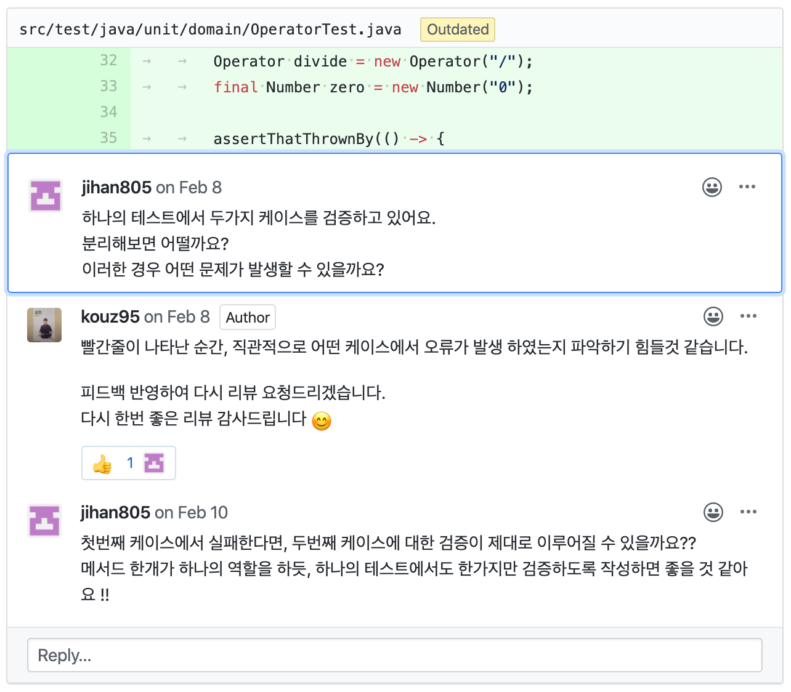

## 단위 테스트(Unit Test)란

단위 테스트란 메서드를 테스트하는 또 다른 메서드이다. 하나의 단위 테스트는 하나의 메서드의 특정 루틴을 검사한다.

```java
/* production code */
public class MyService {

    public boolean isGreaterThanFive(final int number) {
        return number > 5;
    }

}
```

`isGreaterThanFive`라는 메서드가 테스트 할 수 있는 방법은 2가지가 있다.

- `number`가 5보다 커서 `true`를 리턴하는 경우

- `number`가 5보다 작거나 같아서 `false`를 리턴하는 경우

이 두 가지 경우를 모두 테스트하기 위해서는 2개의 단위 테스트 메서드가 필요하고, 아래가 해당하는 2개의 단위 테스트 메서드들이다.

```java
/* test code */
import static org.assertj.core.api.Assertions.*;

import org.junit.Assert;
import org.junit.Test;

public class MyServiceTest {

    @Test
    public void isGreaterThanFive_GreaterThanFiveNumber_ReturnTrue() {
        // Given
        final MyService myService = new MyService();

        // When
        final boolean actual = myService.isGreaterThanFive(6);

        // Then
        assertThat(actual).isTrue();
    }

    @Test
    public void isGreaterThanFive_NotGreaterThanFiveNumber_ReturnFalse() {
        // Given
        final MyService myService = new MyService();

        // When
        final boolean actual = myService.isGreaterThanFive(5);

        // Then
        assertThat(actual).isFalse();
    }

}
```

만약 테스트를 해야 하는 경우가 5가지가 존재한다면 그 5가지 경우도 모두 작성해야 할 것이다.

<br/>

## 단위 테스트가 왜 필요한가

단위 테스트는 단순히 버그를 찾기 위한 효과적인 방법이 아니다. **정의에 따르면 단위 테스트는 시스템의 각각의 단위들을 개별적으로 조사하는 것이다.**

잘 구성된 테스트 코드는 이후 다른 변경 사항으로 인해 발생 가능한 결함을 찾아내는 역할을 한다.

<br/>

## 하나의 테스트 케이스는 단위 기능 중 하나의 시나리오만 테스트하라

```java
/* Operator Test */
@DisplayName("calculate test")
@Test
void testCalculate() {

    Operator plus = new Operator("+");
    final Number one = new Number("1");
    final Number two = new Number("2");

    final double expected = 3;
    final double actual = plus.calculate(one, two);

    assertThat(actual).isEqualTo(expected);

    Operator divide = new Operator("/");
    final Number zero = new Number("0");

    assertThatThrownBy(() -> divide.calculate(one, zero))
        .isInstanceOf(IllegalArgumentException.class)
        .hasMessage(("0 으로 나눌 수 없습니다."));

    final double expected2 = 0.5;
    final double actual2 = divide.calculate(one, two);

    assertThat(actual2).isEqualTo(expected2);
}
```

해당 테스트 코드는 [`문자열 계산기`](https://github.com/woowacourse/java-calculator)라는 미션을 진행하면서 작성된 테스트 코드이다. 아래는 이 코드에 대한 피드백으로 달린 내용이다.



피드백에서는 아래와 같이 물어본다.

> 하나의 테스트에서 두 가지 케이스를 검증하고 있어요.
>
> 분리해보면 어떨까요?
>
> 이러한 경우 어떤 문제가 발생할 수 있을까요?

그렇다면 위의 테스트 코드를 한번 살펴보고, 어떻게 수정해야 하는지 알아보자.

테스트 코드를 보면 `testCalculator`라는 메서드에서 세 가지 경우(시나리오)를 테스트한다.

- `+` 연산에 대한 테스트

- `/` 연산에서 피연산자가 0일 경우 발생하는 예외 테스트

- `/` 연산에 대한 테스트

모든 테스트가 정상적으로 통과한다면 우리는 큰 걱정을 하지 않아도 된다.
하지만, 만약 세 가지 시나리오 중 하나가 에러가 발생한다면? 해당 테스트 코드에 빨간 불이 들어오겠지만, 우리는 **어떤 시나리오에서 문제가 발생했는지** 파악하기가 쉽지 않다.

따라서 위의 세 가지 시나리오를 **각각의 테스트 메서드**로 분리해서 작성해야지 어떤 시나리오에서 에러가 발생했는지 명확하게 파악할 수 있다.

하나의 테스트가 하나의 시나리오만 테스트하도록 수정을 한다면 아래의 코드와 같아질 것이다.

```java
/* Operator Test */
@Test
void calculate_AddOperator_AddNumbers() {
    // Given
    final Operator plus = new Operator("+");
    final Number one = new Number("1");
    final Number two = new Number("2");

    // When
    final double actual = plus.calculate(one, two);

    // Then
    assertThat(actual).isEqualTo(3);
}

@Test
void calculator_DivideOperatorOperandIsZero_ExceptionThrown() {
    // Given
    final Operator divide = new Operator("/");
    final Number one = new Number("1");

    // Then
    assertThatThrownBy(() -> divide.calculate(one, new Number("0")))
        .isInstanceOf(IllegalArgumentException.class)
        .hasMessage(("0 으로 나눌 수 없습니다."));
}

@Test
void calculator_DivideOperator_DivideNumbers() {
    // Given
    final Operator divide = new Operator("/");
    final Number one = new Number("1");
    final Number two = new Number("2");

    // When
    final double actual = divide.calculate(one, two);

    // Then
    assertThat(actual).isEqualTo(0.5);
}

```

각각의 테스트 메서드가 하나의 시나리오에 대한 검증만 담당하기 때문에 에러가 발생하더라도 어떤 시나리오에 대한 문제인지 바로 파악이 가능하다.

<br/>

## 정리하면

단위 테스트 작성 시 가장 중요하게 인식할 점은 테스트 단위가 복수의 테스트 시나리오들을 가질 수 있다는 것이다. 세분화된 테스트 케이스들은 코드를 수정하거나 리팩토링시 효과적이다. 왜냐하면 단위 테스트만 수행하면 코드의 수정이 코드의 의도된 기능을 망가뜨렸는지 확인할 수 있기 때문이다.

따라서 **테스트 코드를 작성할 때 하나의 테스트 메서드는 하나의 시나리오에 대한 검증만 해서 어떠한 시나리오에서 문제가 발생했는지 명확히 알 수 있도록 하자!**

<br/>

## 참고 링크

> [단위 테스트 사용 방법 : JUnit 참조 가이드](https://brunch.co.kr/@pubjinson/16)
>
> [유닛 테스트에 대한 생각](https://blog.outsider.ne.kr/1275)
>
> [설마 아직도 테스트 코드 작성 안 하시나요?](https://medium.com/@ssowonny/%EC%84%A4%EB%A7%88-%EC%95%84%EC%A7%81%EB%8F%84-%ED%85%8C%EC%8A%A4%ED%8A%B8-%EC%BD%94%EB%93%9C%EB%A5%BC-%EC%9E%91%EC%84%B1-%EC%95%88-%ED%95%98%EC%8B%9C%EB%82%98%EC%9A%94-b54ec61ef91a)
