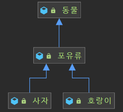

우리는 다양한 이유로 상속을 사용한다.

1.  코드를 재사용함으로써 중복을 줄일 수 있다.
2.  변화에 대한 유연성 및 확장성이 증가한다.
3.  개발 시간이 단축된다.

하지만, 상속의 장점들은 상속을 적절히 사용했을 경우에만 해당한다.  
상속을 잘못 사용하면 변화에 유연하지 않고, 오류를 내기 쉬운 소프트웨어가 된다.

---

## 상속의 단점 : 캡슐화를 깨뜨린다.

> 캡슐화: 만일의 상황(타인이 외부에서 조작)에 대비해 외부에서 특정 속성이나 메서드를 사용할 수 없도록 숨겨놓는 것.

상위 클래스의 구현이 하위 클래스에게 노출되는 상속은 캡슐화를 깨뜨린다.  
캡슐화가 깨짐으로써 하위 클래스가 상위 클래스에 강하게 결합, 의존하게 되고  
강한 결합, 의존은 변화에 유연하게 대처하기 어려워진다.

예제를 통해 살펴보자.

로또 번호를 가지는 역할인 `Lotto` 클래스가 있다.

```java
public class Lotto {
    protected List<Integer> lottoNumbers;

    public Lotto(List<Integer> lottoNumbers) {
        this.lottoNumbers = new ArrayList<>(lottoNumbers);
    }

    public  boolean contains(Integer integer) {
        return this.lottoNumbers.contains(integer);
    }
    ...
}
```

`Lotto`클래스는 로또 번호를 `List<Integer>`로 가지고있다.

다음으로 `Lotto` 클래스를 상속하는 `WinningLotto` 클래스를 보자.  
`WinningLotto` 클래스는 당첨 로또번호를 가지고 있는 클래스이다.  

```java
public class WinningLotto extends Lotto {
    private final BonusBall bonusBall;
    
    public WinningLotto(List<Integer> lottoNumbers, BonusBall bonusBall) {
        super(lottoNumbers);
        this.bonusBall = bonusBall;
    }

    public long compare(Lotto lotto) {
        return lottoNumbers.stream()
            .filter(lotto::contains)
            .count();
    }
    ...
}
```

현재까지는 별 문제가 없어보인다.

하지만 `Lotto` 클래스의 요구사항이 바뀌어서  
인스턴스 변수인 `List<Integer> lottoNumbers`가 `int[] lottoNumbers`로 바뀌었다고 가정해보자.

```java
public class Lotto {
    protected int[] lottoNumbers;

    public Lotto(int[] lottoNumbers) {
        this.lottoNumbers = lottoNumbers;
    }

    public boolean contains(Integer integer) {
        return Arrays.stream(lottoNumbers)
            .anyMatch(lottoNumber -> Objects.equals(lottoNumber, integer));
    }
    ...
}
```

부모와 강한 의존을 맺은 `WinningLotto` 클래스는 강한 영향을 받는다.

```java
public class WinningLotto extends Lotto {
    private final BonusBall bonusBall;

    // 오류가 발생한다.
    public WinningLotto(List<Integer> lottoNumbers, BonusBall bonusBall) {
        super(lottoNumbers);
        this.bonusBall = bonusBall;
    }
	
    // 오류가 발생한다.
    public long compare(Lotto lotto) {
        return lottoNumbers.stream()
            .filter(lotto::contains)
            .count();
    }
}
```

즉, `Lotto` 클래스를 상속한 하위 클래스가 몇 개가 있든 전부 깨지게 되는 것이다.  
그리고 해결법은 모든 하위 클래스에서 일일이 수정을 해주는 방법뿐이다.

또, 상위 클래스 메서드 이름과 매개변수의 변화는 하위 클래스 전체의 변경을 야기하기도한다.

이처럼 상속은 하위 클래스가 상위 클래스에 강하게 의존, 결합하기 때문에 변화에 유연하게 대처하기 어려워진다.  

상속구조가 깊으면 깊을수록 그 문제점은 더욱 심화한다.

## 조합(Composition)을 사용하자.

> 조합(Composition): 기존 클래스가 새로운 클래스의 구성요소로 쓰인다.  
> 새로운 클래스를 만들고 private 필드로 기존 클래스의 인스턴스를 참조한다.

앞서 살펴봤던 `WinningLotto` 클래스가 `Lotto`를 상속하는 것이 아닌 조합(Composition)을 사용하면 다음과 같다.

```java
public class WinningLotto {
    private Lotto lotto;
    private BonusBall bonusBall;
}
```

이처럼 `WinningLotto` 클래스에서 인스턴스 변수로 `Lotto` 클래스를 가지는 것이 조합(Composition)이다.  
`WinningLotto` 클래스는 `Lotto` 클래스의 **메서드를 호출**하는 방식으로 동작하게 된다.

**조합(Composition)을 사용하면?**

1.  메서드를 호출하는 방식으로 동작하기 때문에 캡슐화를 깨뜨리지 않는다.
2.  Lotto 클래스 같은 기존 클래스의 변화에 영향이 적어지며, 안전하다.

메서드 호출 방식이기 때문에 `Lotto` 클래스의 인스턴스 변수인 `List<Integer> lottoNumbers`가  
`int[] lottoNumbers`로 바뀌어도 영향을 받지 않게 된다.
그저 메서드 호출을 통한 값을 사용하면 될 뿐이다.

즉, 상속의 문제점들에서 벗어날 방법이다.

자기 자신에 대한 참조를 다른 객체에 넘겨, 나중에 필요할 때 역호출하도록 요청하는  
역호출(callback) 프레임워크와 사용하기에는 적합하지 않다는 점을 주의하자.

---

## 결론

캡슐화를 깨뜨리고, 상위 클래스에 의존하게 돼서 변화에 유연하지 못한 상속을 사용하기보다는 조합(Composition)을 사용하자.

하지만 조합(Composition)이 상속보다 무조건 좋다는 것은 아니다.  
상속이 적절하게 사용되면 조합보다 강력하고, 개발하기도 편리하다.

단, 상속이 적절하게 사용되려면 최소 다음과 같은 조건을 만족해야 한다.

1.  확장을 고려하고 설계한 확실한 is - a 관계일 때
2.  API에 아무런 결함이 없는 경우, 결함이 있다면 하위 클래스까지 전파돼도 괜찮은 경우



위와 같은 경우가 확실한 is - a 관계라고 생각한다.

```java
public class 포유류 extends 동물 {

    protected void 숨을쉬다() {
        ...
    }

    protected void 새끼를낳다() {
        ...
    }
}
```

포유류가 동물이라는 사실은 변할 가능성이 거의 없고,  
포유류가 숨을쉬고 새끼를 낳는다는 행동이 변할 가능성은 거의 없다.

이처럼 확실한 is - a 관계의 상위 클래스는 변할 일이 거의 없다.

확실한 is - a 관계인지 곰곰이 고민해보고  
상위 클래스가 변화에 의해서 결함이 생기는 등 어떤 결함이 생겼을 경우,  
하위 클래스까지 전파돼도 괜찮은지 철저하게 확인했다면 상속을 사용해도 좋다고 생각한다.

사실 이런 조건을 만족한 경우에도 상속은 조합과 달리 캡슐화를 깨뜨리기 때문에 100% 정답은 없다.

확실한 건 상속을 코드 재사용만을 위한 수단으로 사용하면 안 된다.  
상속은 반드시 확장이라는 관점에서 사용해야 한다.

상황에 맞는 최선의 방법을 선택하면 된다. 다만, 애매할 때는 조합(Composition)을 사용하는 것이 좋다.

---

### 참고자료

-   [Effective Java 3/e](http://www.yes24.com/Product/Goods/65551284) item 18 - 상속보다는 컴포지션을 사용하라.
