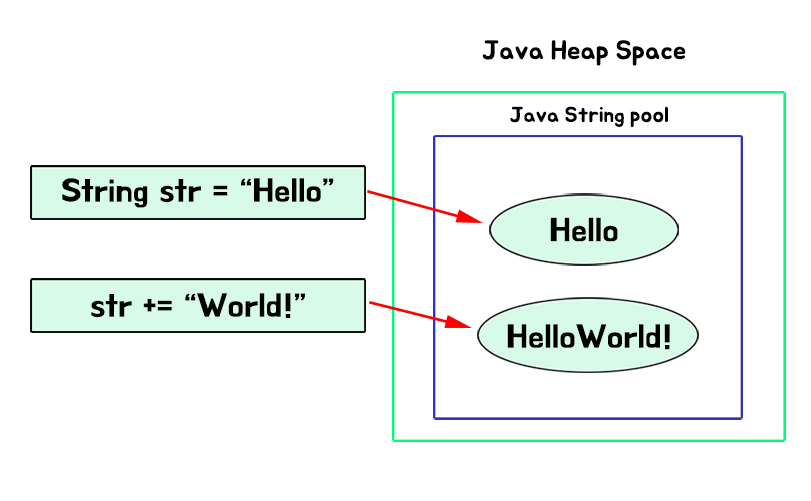

자바로 프로그래밍 할 때 java.lang.Object와 기본 자료형(Primitive Object)을 제외하고 가장 많이 사용하는 객체는 String 클래스일 것이다.

String 클래스는 잘 사용하면 상관이 없지만, 잘못 사용하면 메모리와 성능에 많은 영향을 준다.

---

## String 클래스

우선 String 클래스는 [Immutable Object(불변 객체)](https://woowacourse.github.io/javable/2020-05-18/immutable-object)이다.

```java
String str = "Hello"
str += "World!"
```

위 예제는 `str`의 값을 바꾸는 코드가 아니다.



heap 영역에서 "Hello" 객체를 참조하다가 "HelloWorld!" 객체를 참조하도록 재할당했을 뿐이다.

String 클래스는 왜 불변 객체로 설계했을까?

```java
public static void main(String[] args) {
    String s1 = "Hello World";
    String s2 = "Hello World";
    String s3 = new String("Hello World");
    System.out.println(s1 == s2);
    System.out.println(s2 == s3);
}
```

위 코드의 출력 결과를 생각해보자.

결과는 아래와 같다.

```
true
false
```

이러한 출력 결과는 String 클래스를 불변 객체로 설계한 것과 관련 있다.

궁금하다면 [Why String is Immutable in Java?](https://www.baeldung.com/java-string-immutable) 글을 통해 String 클래스를 왜 불변 객체로 설계했는지 학습해보자.

---

## String 객체 + 연산

String 객체에서 문제가 되는 부분은 우리가 흔히 사용하는 **\+ 연산**에 있다.

```java
String str = "Hello";
str += "World!";
```

앞서 말했듯이 String 클래스는 불변 객체이기 때문에 위와 같은 코드는 `str`의 값이 바뀐 것이 아니라 `str`에 "Hello"와 "World!"를 더한 새로운 String 객체가 재할당 될 뿐이다.

실제로 아래 예제와 같이 객체의 주소 값을 출력해보면 + 연산을 하기 전과 후가 다르게 출력하는 것을 볼 수 있다.

```java
public static void main(String[] args) {
    String str = "Hello,";
    System.out.println(System.identityHashCode(str));
    str += "world!";
    System.out.println(System.identityHashCode(str));
}
// 출력 결과
460141958
1163157884
```

String 객체의 + 연산이 문제가 되는 이유가 바로 여기에 있다.

`str += "world!";` 연산이 실행되면 앞서 `String str = "Hello,";`로 초기화했던 `str` 객체는 버려져 [Garbage Colletion, 이하 GC](https://d2.naver.com/helloworld/1329)의 대상이 된다.

```java
public String plusString() {
    String temp = "";
    for (int i = 1; i <= 1000; i++) {
        temp += i;
    }
    return temp;
}
```

위와 같이 반복문을 통해 String 객체에서 1000번의 + 연산을 했다면 1,000개의 객체가 버려져 GC의 대상이 되는 것이다.

GC는 하면 할수록 시스템의 CPU를 사용하고 시간도 많이 소요되기 때문에 GC의 대상이 되는 객체를 최소화해야 한다. 즉 이러한 작업은 쓸데없이 메모리를 많이 사용하고 GC에 의해 응답 속도에 많은 영향을 미치게 된다.

---

## StringBuilder, StringBuffer

[StringBuilder](https://docs.oracle.com/javase/7/docs/api/java/lang/StringBuilder.html)와 [StringBuffer](https://docs.oracle.com/javase/7/docs/api/java/lang/StringBuffer.html)는 String 데이터 변경을 위해 자바에서 제공하는 객체이다. 내부적으로 동적 배열로 구현되어있다.

위에서 살펴봤던 String 객체 + 연산의 문제점을 해결해줄 방법이 바로 StringBuilder와 StringBuffer를 사용하는 것이다. 두 객체가 제공하는 기능(메서드)은 같다.

두 객체의 append 메서드나 insert 메서드를 사용하면 버려지는 객체 없이 문자열을 더할 수 있다.

위에서 살펴봤던 반복문으로 숫자를 + 연산하는 코드는 아래와 같이 수정할 수 있다.

```java
public String plusString() {
    StringBuilder builder = new StringBuilder();
    for (int i = 1; i <= 1000; i++) {
        builder.append(i);
    }
    return builder.toString();
}
```

StringBuilder 객체를 한 번만 생성해서 문자열을 더해주므로 버려지는 객체가 없다.

사실 JDK 5.0 이상에서는 String 객체로 + 연산을 하면 컴파일 시 자동으로 StringBuilder 객체의 append 메서드를 사용하도록 변환한다.

```java
for (int i = 1; i <= 1000; i++) {
    temp += i;
}

// 컴파일 시
for (int i = 1; i <= 1000; i++) {
    temp = (new StringBuilder(temp)).append(i).toString();
}
```

하지만 반복적인 작업 전에 미리 StringBuilder 객체를 생성하지 않았다면, 컴파일시 자동으로 StringBuilder 객체로 변환 되어도  
\+ 연산을 반복한 만큼 자동으로 변환되었던 StringBuilder 객체가 버려진다.  
결론적으로 버려진 StringBuilder 객체들이 GC의 대상이 되고 메모리와 성능에 영향을 미치는 사실은 변함없다.

---

## StringBuilder vs StringBuffer

다시 한번 말하지만 StringBuilder와 StringBuffer가 제공하는 기능은 같다.  
그렇다면 두 객체의 차이는 뭘까?

바로 [synchronized](https://docs.oracle.com/javase/tutorial/essential/concurrency/sync.html) 키워드를 사용한 동기화 여부에 있다.

```java
// StringBuffer의 append 메서드 
@Override
public synchronized StringBuffer append(String str) {
    toStringCache = null;
    super.append(str);
    return this;
}

// StringBuilder의 append 메서드
@Override
public StringBuilder append(String str) {
    super.append(str);
    return this;
}
```

StringBuffer 객체는 거의 모든 메서드를 synchronized를 사용해서 동기화하기 때문에 멀티 스레드 환경에서 안전하게 사용할 수 있다. 반대로 StringBuilder는 동기화하지 않기 때문에 멀티 스레드 환경에서 안전하지 못하다.

'그럼 안전한 StringBuffer만 사용하면 되겠네?'라고 생각할 수 있다.

하지만 그렇지 않다. synchronized를 사용한 동기화는 lock을 걸고 푸는 오버헤드가 있어서 속도가 느리다. 즉 StringBuilder가 StringBuffer보다 빠르다.

[자바 성능 튜닝 이야기](https://book.naver.com/bookdb/book_detail.nhn?bid=7333658)에서 JDK 5.0 버전으로 String, StringBuilder, StringBuffer의 메모리와 속도를 실험한 좋은 예제가 있다.

> String, StringBuilder, StringBuffer 각각의 객체가 문자열 더하는 라인을 100만 번씩 실행한 결과는 다음과 같다.  
> 속도는 String을 기준으로 StringBuffer가 약 367배 빠르고, StringBuilder는 약 512배 빠르다.  
> 메모리는 StringBuffer와 StringBuilder가 똑같이 사용하고 String은 약 3,390배 더 사용한다.  
> \- 이상민, 자바 성능 튜닝 이야기, 인사이트(2013), p52

---

## 정리

String + 연산은 문자열을 반복적으로 더하지 않을 경우에만 사용하자. 컴파일 시 자동으로 StringBuilder로 변환된다.

StringBuffer는 다음과 같은 경우에 사용하자.

1.  멀티 스레드 환경에서 안전한 프로그램이 필요할 때
2.  static으로 선언된 문자열을 변경할 때
3.  singleton으로 선언된 클래스의 문자열을 변경할 때

StringBuilder는 다음과 같은 경우에 사용하자.

1.  스레드에 안전한지의 여부와 전혀 관계없는 프로그램을 개발할 때
2.  메서드 내에서 지역 변수로 StringBuilder를 사용할 때

언제나 그렇듯 정답은 존재하지 않는다. 상황에 맞는 최선의 구현을 하면 된다.

---

#### 참고 자료

-   [자바 성능 튜닝 이야기](https://book.naver.com/bookdb/book_detail.nhn?bid=7333658)
-   [Why String is Immutable in Java?](https://www.baeldung.com/java-string-immutable)
