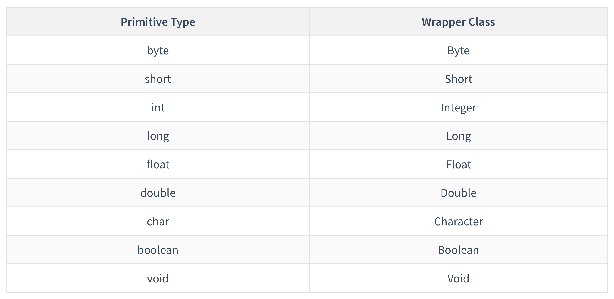
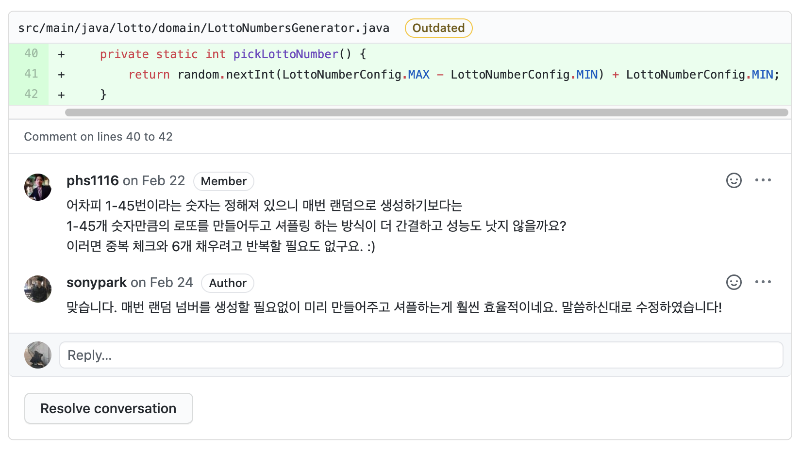

## 캐싱(*Caching*)이란

캐싱을 알아보기 전에 캐시의 사전적인 정의를 알아보자.

> **캐시**(**cache**)는 컴퓨터 과학에서 데이터나 값을 미리 복사해 놓는 임시 장소를 가리킨다. 캐시는 캐시의 접근 시간에 비해 원래 데이터를 접근하는 시간이 오래 걸리는 경우나 값을 다시 계산하는 시간을 절약하고 싶은 경우에 사용한다. 캐시에 데이터를 미리 복사해 놓으면 계산이나 접근 시간 없이 더 빠른 속도로 데이터에 접근할 수 있다 - [wikipedia](https://en.wikipedia.org/wiki/Cache_(computing))

**캐싱**은 이러한 **캐시**라는 작업을 하는 행위(행동)이다.

캐싱은 컴퓨터 분야에서 다양하게 사용된다. CPU에서도 성능 향상을 위해 사용되고 메모리, 웹 페이지를 동작시키는 분야까지 분야를 가리지 않고 사용된다.

그럼 이번에 소개할 '**반복적으로 사용되는 인스턴스 캐싱하기**'란 어떤 상황을 말하는 것일까? Java Wrapper Class의 캐싱을 예시로 살펴보도록 하자.

<br/>

## Java Wrapper Class

Java에서는 Primitive Type을 Reference Type으로 사용하기 위해 만든 **Wrapper Class**가 있다.

> java의 Wrapper Class로 Byte, Short, Integer, Long, Float, Double, Character, Boolean, Void가 있다. 



기존에 Primitive Type이 존재하는데 굳이 Wrapper Class를 만든 이유는 무엇이고, 언제 사용될까?

코드를 작성할 때 다양한 라이브러리를 활용하게 된다. Java에서는 다양한 라이브러리들을 제공하는데 이를 사용하기 위해서는 객체 타입이 필요한 경우가 발생한다. 가장 간단한 예시로 JCF(Java Collection Framework)의 List를 사용하는 코드를 확인해보자.

```java
package lotto.domain;

import java.util.ArrayList;
import java.util.List;
import java.util.Objects;

public class WrapperTest {
    public static void main(String[] args) {
        List<int> primitiveList = new ArrayList<>(); // error!
        List<Integer> wrapperList = new ArrayList<>(); // good!
    }
}

```

List를 사용할 때는 List의 타입을 명시해주기 위해 `Generic<T>`을 사용한다. 그런데 Generic 안에 들어가는 값으로는 객체만 가능하기 때문에 int와 같은 Primitive Type을 사용하면 에러가 발생하게 된다. Primitive 값인 int를 사용하기 위해서는 이를 감싼 Wrapper Class를 활용하여 List를 사용할 수 있다. int뿐 아니라 다른 Primitive Type 역시 다양한 라이브러리와 프레임워크의 활용을 위해 Wrapper Class를 제공한다.

또한 Wrapper Class는 객체이기 때문에 null값이 들어올 수 있다. Primitive type들은 기본 값을 가지고 있기 때문에 값을 할당하지 않을 경우 null이 아니라 기본값을 가지도록 한다(int의 경우 0이 기본값이다). 

만약 Java를 이용한 웹 서비스에서 Request나 Response용 객체를 다룬다면 값이 존재하지 않는 경우 null을 할당해줘야 한다. 그러나 Primitive Type을 사용하는 경우 기본 값이 할당되면서 의도하지 않은 결과를 야기할 수도 있다.

Wrapper Class는 이런 상황에서 적절하게 사용하는 것이 좋다.

### Wrapper Class에서의 값 비교

인스턴스는 각각의 주소를 가진다. 그렇다면 Wrapper Class로 생성한 값(인스턴스)들은 서로 다른 주소값을 가지기 때문에 실제 값을 비교하기 위해 오버라이딩이 된  `equals()` 를 사용하리라 생각할 수 있다.

이러한 추측이 맞는지 확인하기 위해 Test를 한 번 진행해보았다.

```java
import static org.assertj.core.api.Assertions.*;

import org.junit.jupiter.api.Test;

public class IntegerTest {
    @Test
    void test1() {
        Integer num1 = 1;
        Integer num2 = 1;

        assertThat(num1.equals(num2)).isTrue();
    }

    @Test
    void test2() {
        Integer num1 = 1;
        Integer num2 = 1;

        assertThat(num1 == num2).isTrue();
    }
}
```

첫 번째 테스트의 경우 우리가 추측한 데로 `equals()` 가 오버라이딩 되어 있다면 **true**가 나와야 한다. 그리고 두 번째 테스트의 경우 서로 다른 인스턴스이기 때문에 false가 나올 것이다.

하지만 결과는 둘 다 **true**이다.

Integer는 Wrapper Class 인스턴스이므로 서로 다른 주소를 가져야 하는데 동일한 **주소**를 가지고 있다. 이러한 일이 가능한 이유는 캐싱 덕분이다.

<br/>

## Interger의 캐싱

Integer의 소스 코드를 살펴보면 이런 Inner Class가 존재한다.

**Integer.java**

```java
/**
 * Cache to support the object identity semantics of autoboxing for values between
 * -128 and 127 (inclusive) as required by JLS.
 *
 * The cache is initialized on first usage.  The size of the cache
 * may be controlled by the {@code -XX:AutoBoxCacheMax=<size>} option.
 * During VM initialization, java.lang.Integer.IntegerCache.high property
 * may be set and saved in the private system properties in the
 * sun.misc.VM class.
 */

private static class IntegerCache {
    static final int low = -128;
    static final int high;
    static final Integer cache[];

    static {
        // high value may be configured by property
        int h = 127;
        String integerCacheHighPropValue =
            sun.misc.VM.getSavedProperty("java.lang.Integer.IntegerCache.high");
        if (integerCacheHighPropValue != null) {
            try {
                int i = parseInt(integerCacheHighPropValue);
                i = Math.max(i, 127);
                // Maximum array size is Integer.MAX_VALUE
                h = Math.min(i, Integer.MAX_VALUE - (-low) -1);
            } catch( NumberFormatException nfe) {
                // If the property cannot be parsed into an int, ignore it.
            }
        }
        high = h;

        cache = new Integer[(high - low) + 1];
        int j = low;
        for(int k = 0; k < cache.length; k++)
            cache[k] = new Integer(j++);

        // range [-128, 127] must be interned (JLS7 5.1.7)
        assert IntegerCache.high >= 127;
    }

    private IntegerCache() {}
}
```

IntegerCache 클래스의 코드를 보면 low ~ high(기본값은 -128~127) 사이의 Integer 인스턴스를 미리 생성하여 cache 배열에 저장하는 것을 볼 수 있다.

그리고 IntegerCache 클래스를 활용하는 `valueOf()` 메서드는 아래와 같다.

```java
/**
 * Returns an {@code Integer} instance representing the specified
 * {@code int} value.  If a new {@code Integer} instance is not
 * required, this method should generally be used in preference to
 * the constructor {@link #Integer(int)}, as this method is likely
 * to yield significantly better space and time performance by
 * caching frequently requested values.
 *
 * This method will always cache values in the range -128 to 127,
 * inclusive, and may cache other values outside of this range.
 *
 * @param  i an {@code int} value.
 * @return an {@code Integer} instance representing {@code i}.
 * @since  1.5
 */
public static Integer valueOf(int i) {
    if (i >= IntegerCache.low && i <= IntegerCache.high)
        return IntegerCache.cache[i + (-IntegerCache.low)];
    return new Integer(i);
}
```

IntegerCache의 low와 high 사이의 값일 경우 IntegerCache의 cache에 저장된 값을 반환하고 그 외의 경우 새로 Integer 인스턴스를 생성하여 반환한다. 즉 캐싱해둔 범위 내의 숫자일 경우 **캐싱한 인스턴스를 반환**하고 범위 밖의 수일 경우 새로 인스턴스를 생성하여 반환하는 방식이 Integer의 캐싱이다.

<br/>

## Lotto 미션에서의 캐싱

[Lotto 미션](https://github.com/woowacourse/java-lotto)을 진행하면서 이러한 피드백이 있었다.



기존의 코드에서는 Lotto를 생성할 때마다 1 ~ 45까지의 숫자 중 랜덤으로 6개의 숫자를 뽑아 새로운 Lotto를 생성하였다. 위의 상황을 코드로 구현해보면 아래와 같다.

**LottoNumber.java**

```java
package lotto.domain;

import java.util.ArrayList;
import java.util.List;
import java.util.Objects;

public class LottoNumber {
    public static final int LOTTO_NUMBER_LOWER_BOUND = 1;
    public static final int LOTTO_NUMBER_UPPER_BOUND = 45;

    private final int number;

    public LottoNumber(final int number) {
        validate(number);
        this.number = number;
    }

    private void validate(final int number) {
        if (number < LOTTO_NUMBER_LOWER_BOUND || number > LOTTO_NUMBER_UPPER_BOUND) {
            throw new IllegalArgumentException("LottoNumber가 유효하지 않습니다.");
        }
    }
}
```

**LottoGenerator.java**

```java
package lotto.domain;

import static lotto.domain.LottoNumber.*;

import java.util.List;
import java.util.Random;
import java.util.stream.Collectors;

public class LottoNumberGenerator {
    private static final int VALID_SIZE = 6;

    public static List<LottoNumber> generate() {
        return new Random().ints(LOTTO_NUMBER_LOWER_BOUND, LOTTO_NUMBER_UPPER_BOUND + 1)
                           .distinct()
                           .limit(VALID_SIZE)
                           .mapToObj(LottoNumber::new)
                           .collect(Collectors.toList());
    }
}

```

위의 코드의 경우 문제가 될 부분은 전혀 없다. Lotto 인스턴스를 생성하기 위해 새로운 6개의 LottoNumber 인스턴스를 랜덤한 숫자로 생성한다.

LottoNumber라는 원시 타입 포장 객체를 만든 이유는 원시 타입을 감싸므로서 LottoNumber에 대한 유효성 검사를 객체 내부에서 처리할 수 있기 때문이다.

> 원시 타입을 포장해서 얻는 이점은 [원시 타입을 포장해야 하는 이유](https://woowacourse.github.io/javable/2020-05-29/wrap-primitive-type) 글을 참고해보기를 추천한다. 

원시 타입의 객체를 감싸면 얻을 수 있는 장점들도 존재하지만 인스턴스가 생성되면서 관리해야하는 자원이 늘어나는 단점도 존재한다.

만약 1,000명의 사람이 각자 100장의 로또를 산다고 가정해보자. 100,000장의 로또(Lotto)가 생성돼야 하고, 각각의 로또(Lotto)는 6개의 로또 번호(LottoNumber)를 가지고 있다. 결국 600,000개의 로또 번호(LottoNumber) 인스턴스가 생성된다.

로또 번호에 해당하는 LottoNumber 인스턴스가 유효성 검증을 제외한 다른 로직이 없으면 1~45 사이의 LottoNumber는 값만 같으면 같은 역할을 하는 인스턴스(VO)가 된다. 그럴 경우 600,000개의 서로 다른 LottoNumber 인스턴스 생성은 상당한 메모리 낭비이다.

이러한 상황에 인스턴스를 미리 캐싱해두고 사용함으로써 메모리 낭비를 줄일 수 있다. 아래는 캐싱을 적용한 코드이다.

**LottoNumber.java**

```java
package lotto.domain;

import java.util.ArrayList;
import java.util.List;
import java.util.Objects;

public class LottoNumber {
    public static final int LOTTO_NUMBER_LOWER_BOUND = 1;
    public static final int LOTTO_NUMBER_UPPER_BOUND = 45;
    private static final List<LottoNumber> CACHE = new ArrayList<>();

    static {
        for (int i = LOTTO_NUMBER_LOWER_BOUND; i <= LOTTO_NUMBER_UPPER_BOUND; i++) {
            CACHE.add(new LottoNumber(i));
        }
    }

    private final int number;

    public LottoNumber(final int number) {
        validate(number);
        this.number = number;
    }

    public static LottoNumber valueOf(final int number) {
        LottoNumber lottoNumber = CACHE.get(number);

        if (Objects.isNull(lottoNumber)) {
            lottoNumber = new LottoNumber(number);
        }
        return lottoNumber;
    }

    private void validate(final int number) {
        if (number < LOTTO_NUMBER_LOWER_BOUND || number > LOTTO_NUMBER_UPPER_BOUND) {
            throw new IllegalArgumentException("LottoNumber가 유효하지 않습니다.");
        }
    }
}
```

**LottoGenerator.java**

```java
package lotto.domain;

import java.util.ArrayList;
import java.util.Collections;
import java.util.List;

public class LottoNumberGenerator {
    private static final int VALID_SIZE = 6;

    public static List<LottoNumber> generate() {
        List<LottoNumber> lottoNumbers = new ArrayList<>(LottoNumber.values());
        Collections.shuffle(lottoNumbers);

        return lottoNumbers.subList(0, VALID_SIZE);
    }
}
```

위와 같이 코드를 구현하면 우리가 지정한 LottoNumber의 범위(1~45) 내에서는 동일한 인스턴스를 반환하게 된다. 캐싱을 함으로써 이전에 수십만 개의 LottoNumber를 생성함으로 발생하는 메모리 낭비 문제를 해결할 수 있다.

<br/>

## 정리

위에서 소개한 예시를 통해 간단한 프로그램이라도 캐싱을 통해 성능적인 향상을 가져올 수 있음을 확인하였다.

앞으로 코딩을 하면서 이런 사소해 보이지만 성능 향상에 영향을 미치는 기술들을 자주 접할 것이다. 

'우리 프로그램에서 이 정도까지 필요하겠어?'라는 생각보다는 매사에 최선의 성능을 제공할 수 있도록 고민하고 노력하는 프로그래머가 돼보는 것은 어떨까?

<br/>

## 참고 링크

> [Java Wrapper Class의 캐싱 - wmJun](https://feco.tistory.com/112)
>
> [Wrapper 클래스 - TCP SCHOOL](http://tcpschool.com/java/java_api_wrapper)