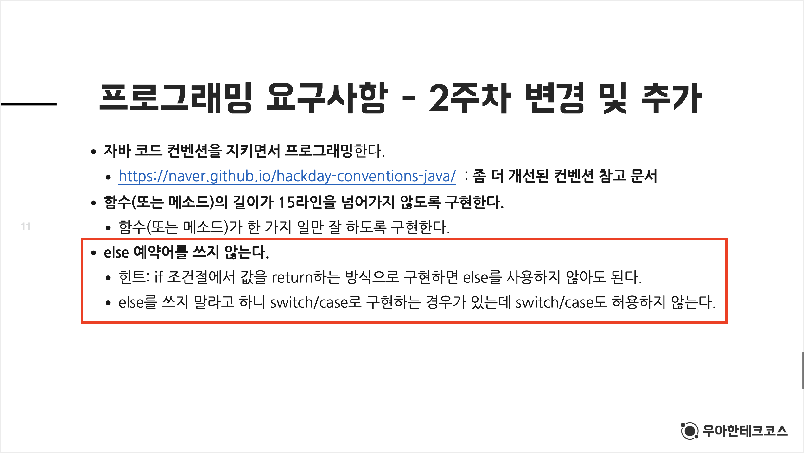

> [The ThoughtWorks Anthology](https://wikibook.co.kr/thoughtworks-anthology/)의 **더 나은 소프트웨어를 향한 9단계: 객체지향 생활 체조** 중 **규칙 2**에 대한 내용이다. 

<br/>

## 시작은 프리코스부터

필자는 현재 [우아한 테크코스(이하 우테코)](https://woowacourse.github.io/)를 진행하고 있는데 우테코를 들어오기 위한 과정 중 프리코스라는 과정이 있었다.

프리코스는 3개의 미션으로 진행되었고 각 미션마다 프로그래밍 요구사항이 주어진다. 두 번째 미션을 받았을 때 아래와 같은 요구사항을 마주하게 되었다.



> 도대체 왜? 이유가 뭐지???

이전까지 코딩하면서 너무 당연하게 써왔던 else 예약어를 쓰지 말라니. 'else를 사용하지 않고 코딩이 가능한가?'라는 생각이 들었다. 

그러나 이유 없이 이런 요구사항을 달진 않으셨을 거라 생각하고 이유를 찾아봤었다.

<br/>

## 간결해지고 명확해진다

아래의 예시 코드를 보자.

```java
public int getWootecoCrewScore(String crew) {
    int score = 0;
    
    if ("터틀".equals(crew)) {
        score = 0;
    } else {
        score = 10;
    }
    return score;
}
```

`getWootecoCrewScore()` 메서드에서 크루의 이름을 입력받아서 `score`를 초기화하고 이를 반환해준다. 위의 if-else문은 간단하고 코드를 파악하기에 어렵지 않다.

그러나 현재 우테코의 크루는 50명이나 되는데 모든 크루에 대해서 각기 다른 점수를 매긴다면 어떻게 될까?

```java
public int getWootecoCrewScore(String crew) {
    int score = 0;
    
    if ("터틀".equals(crew)) {
        score = 0;
    } else if ("또링".equals(crew)) {
        score = 1;
    } else if ("서브웨이".equals(crew)) {
        score = 2;
    } else if ("코즈".equals(crew)) {
        score = 3;
    }
    /* 
     * else if 예약어의 반복...
     */
    else if ("스티치".equals(crew)) {
        score = 10000000;
    } else { // 존재하지 않는 크루의 이름일 경우
        score = -1;
    }
    return score;
}
```

엄청나게 많은 else(여기선 else if 예약어도 else 예약어라고 지칭하겠다) 예약어가 나열된다. 물론 마지막에 `score`를 반환하기만 한다면 그나마 다행이다.

그러나 만약 else 문이 끝나고 추가로 `score` 에 대한 로직이 존재한다면? 우리는 엄청나게 긴 코드를 끝까지 따라가서 확인해야 할 것이다.

그렇다면 위의 코드에서 존재하는 else를 모두 제거해본다면 어떻게 될까?

```java
public int getWootecoCrewScore(String crew) {    
    if ("터틀".equals(crew)) {
        return 0;
    }
    if ("또링".equals(crew)) {
        return 1;
    }
    if ("서브웨이".equals(crew)) {
        return 2;
    }
    if ("코즈".equals(crew)) {
        return 3;
    }
    /*
     * if 예약어의 반복...
     */
    if ("스티치".equals(crew)) {
        return 10000000;
    }
    return -1;
}
```

if 문 내부에서 조기 반환(early return)을 해주기 때문에 더 이상 아래의 코드를 보지 않아도 되기에 코드가 더 간결해지고 명확해진다.

하지만 위의 코드도 마냥 간결하고 명확하다고 말하기 어렵다. 너무 많은 if 문을 사용하게 되면서 코드가 길어지게 되고 절차지향적인 코드와 같은 형식을 띠게 된다.

이런 단점을 해결하기 위해선 어떻게 해야 할까?

else 예약어를 쓰지 말라는 말을 조금 더 넓은 관점에서 생각해서 **분기문**을 줄여보면 어떨까?

<br/>

## 객체지향적인 구조가 된다

조금 더 객체 지향적으로 생각해보면 각각의 크루는 이름과 점수를 가지고 있다. 그리고  `getWootecoCrewScore()` 메서드에서는 매개변수로 전달받은 이름에 해당하는 크루의 점수를 반환한다.

Crew라는 클래스를 만들고 필드 변수로 name과 score를 가지도록 하면 조금 더 객체지향적인 코드가 될 수 있다. 그러나 이 방법을 사용하려면 크루 각각에 대한 Crew 객체를 생성하고, 모든 Crew 객체들을 담고 있는 자료구조를 정의해야 한다.

이를 좀 더 간단하게 해결할 방법을 고민해본다면? **Enum**을 떠올릴 수 있을 것이다!

그렇다면 Enum을 사용하여 변경된 코드를 살펴보자.

```java
public enum Crew {
    TURTLE("터틀", 0),
    TTORING("또링", 1),
    SUBWAY("서브웨이", 2),
    KOUZ("코즈", 3),
    /*
     * 다른 크루들의 정보
     */
    STITCH("스티치", 10000000),
    EMPTY("없음", -1);
    
    private final String name;
    private final int score;
    
    Crew(String name, long score) {
        this.name = name;
        this.score = score;
    }
    
    public static Crew fromName(String name) {
        return Arrays.stream(Crew.values())
                     .filter(crew -> crew.name.equals(name))
                     .findAny()
                     .orElse(EMPTY);
    }
    
    public int getScore() {
        return score;
    }
}
```

```java
public int getWootecoCrewScore(String name) {
    return Crew.fromName(name)
               .getScore();
}
```

이전의 코드에 비해서 매우 깔끔해진 코드를 볼 수 있다.

크루들의 이름과 점수는 Crew라는 열거형 객체를 통해 관리한다. 그리고 Crew의 `fromName()` 메서드를 통해 이름에 해당하는 Crew 객체를 반환받을 수 있다. 이 메서드를 통해서 앞서 존재한 무수히 많은 분기문들을 제거할 수 있다.

위의 작업을 통해 `getWootecoCrewScore()` 메서드는 단 한 줄로 간단하게 구현할 수 있다.

추가로 **객체에 메시지를 보내서** 조금 더 객체지향적인 코드로 수정할 수도 있다.

```java
public enum Crew {
    TURTLE("터틀", 0),
    TTORING("또링", 1),
    SUBWAY("서브웨이", 2),
    KOUZ("코즈", 3),
    /*
     * 다른 크루들의 정보
     */
    STITCH("스티치", 10000000),
    EMPTY("없음", -1);
    
    private final String name;
    private final int score;
    
    Crew(String name, long score) {
        this.name = name;
        this.score = score;
    }
    
    public int getCrewScore(String name) {
        return Arrays.stream(Crew.values())
                     .filter(crew -> crew.name.equals(name))
                     .map(crew -> crew.score)
                     .findAny()
                     .orElse(EMPTY.score);
    }
}
```

```java
public int getWootecoCrewScore(String name) {
    return Crew.getCrewScore(name);
}
```

분기문을 줄이고자 하는 노력은 전체적인 코드의 구조를 보다 객체지향적으로 만들도록 도와주었다.

<br/>

## 정리하며

**else 예약어를 쓰지 않는다**라는 말은 **분기문을 최소한으로 한다**로 해석하는 편이 더 좋을 것 같다.

분기문을 줄이려는 노력을 하다 보면 메서드를 더 많이 분리하게 된다. 이는 하나의 메서드가 하나의 기능만 하도록 도와주는데, 그러다 보면 코드는 점차 객차지향적으로 변하게 될 것이다.

객체지향적인 코드 작성으로 우리는 재사용성이 높고 유지 보수하기 좋은 코드를 가질 수 있다.

이 외에도 [The ThoughtWorks Anthology](https://wikibook.co.kr/thoughtworks-anthology/)의 **객체지향 생활 체조**에는 8개의 규칙이 남아있다. 이 규칙들이 왜 필요한지, 규칙을 지킴으로서 어떤 장점을 얻을 수 있는지 생각해보고 고민하자.

객체지향 생활 체조의 규칙들을 지키면서 코드를 작성한다면 우리의 코드는 객체지향적인 코드로 발전할 수 있을 것이다!

<br/>

## 참고 링크

> [자바지기의 의식적인 연습으로 TDD, 리팩토링 연습하기 - solar](https://velog.io/@solar/자바지기-의식적인-연습으로-TDD-리팩토링-연습하기))
>
> [효과적으로 TDD, 리팩토링, OOP를 연습하는 방법은? - YodaCodd](https://medium.com/@codesquad_yoda/효과적으로-tdd-리팩토링-oop를-연습하는-방법은-7ecc9ddb5d45)
>
> [더 나은 소프트웨어를 향한 9단계: 객체지향 생활 체조(3)](https://developerfarm.wordpress.com/2012/01/27/object_calisthenics_3/)
>
> 
