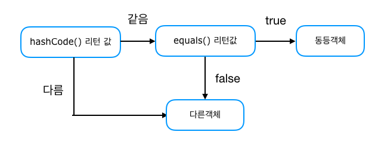

equals와 hashCode는 같이 재정의하라는 말을 다들 한 번쯤 들어봤을 것이다. 대부분의 IDE Generate 기능에서도 equals와 hashCode를 같이 재정의해주며 lombok에서도 EqualsAndHashCode 어노테이션으로 같이 재정의해준다.

그렇다면 equals와 hashCode를 **왜** 같이 재정의해야 하는 걸까? 천천히 알아보자.

---

## equals만 재정의할 경우

우선 예제로 사용될 Car 클래스를 살펴보자.

```java
public class Car {
    private final String name;

    public Car(String name) {
        this.name = name;
    }

    // intellij Generate 기능 사용
    @Override
    public boolean equals(Object o) {
        if (this == o) return true;
        if (o == null || getClass() != o.getClass()) return false;
        Car car = (Car) o;
        return Objects.equals(name, car.name);
    }
}
```

Car 클래스에는 equals만 재정의해두었다.  

```java
public static void main(String[] args){
    Car car1 = new Car("foo");
    Car car2 = new Car("foo");
    
    // true 출력
    System.out.println(car1.equals(car2));
}
```

equals를 재정의했기 때문에 Car 객체의 name이 같은 car1, car2 객체는 논리적으로 같은 객채로 판단된다.

이제 아래 main 메서드의 출력 결과를 예측해보자.

```java
public static void main(String[] args) {
    List<Car> cars = new ArrayList<>();
    cars.add(new Car("foo"));
    cars.add(new Car("foo"));

    System.out.println(cars.size());
}
```

Car 객체를 2개 `List<Car> cars`에 넣어줬으니 출력 결과는 당연히 **2** 일 것이다.

그렇다면 이번엔 Collection에 중복되지 않는 Car 객체만 넣으라는 요구사항이 추가되었다고 가정해보자.

요구사항을 반영하기 위해 List에서 중복 값을 허용하지 않는 Set으로 로직을 바꿨다. 마찬가지로 아래 main 메서드의 출력 결과를 예측해보자.

```java
public static void main(String[] args) {
    Set<Car> cars = new HashSet<>();
    cars.add(new Car("foo"));
    cars.add(new Car("foo"));

    System.out.println(cars.size());
}
```

추가된 두 Car 객체의 이름이 같아서 논리적으로 같은 객체라 판단하고 HashSet의 size가 **1**이 나올 거라 예상했지만, 예상과 다르게 **2**가 출력된다.

hashCode를 equals와 함께 재정의하지 않으면 코드가 예상과 다르게 작동하는 위와 같은 문제를 일으킨다. 정확히 말하면 **hash 값을 사용하는 Collection(HashSet, HashMap, HashTable)을 사용할 때 문제가 발생한다.**

---

## 왜 그럴까?

앞서 말한 hash 값을 사용하는 Collection(HashMap, HashSet, HashTable)은 객체가 논리적으로 같은지 비교할 때 아래 그림과 같은 과정을 거친다.



hashCode 메서드의 리턴 값이 우선 일치하고 equals 메서드의 리턴 값이 true여야 논리적으로 같은 객체라고 판단한다.

앞서 봤던 main 메서드의 HashSet에 Car 객체를 추가할 때도 위와 같은 과정으로 중복 여부를 판단하고 HashSet에 추가됐다. 다만 Car 클래스에는 hashCode 메서드가 재정의 되어있지 않아서 Object 클래스의 hashCode 메서드가 사용되었다.

Object 클래스의 hashCode 메서드는 객체의 고유한 주소 값을 int 값으로 변환하기 때문에 객체마다 다른 값을 리턴한다. 두 개의 Car 객체는 equals로 비교도 하기 전에 서로 다른 hashCode 메서드의 리턴 값으로 인해 다른 객체로 판단된 것이다.

---

## hashCode 재정의

앞서 살펴봤던 문제를 해결하기 위해 Car 클래스에 hashCode 메서드를 재정의해보겠다.

```java
public class Car {
    private final String name;

    public Car(String name) {
        this.name = name;
    }

    // intellij Generate 기능 사용
    @Override
    public boolean equals(Object o) {
        if (this == o) return true;
        if (o == null || getClass() != o.getClass()) return false;
        Car car = (Car) o;
        return Objects.equals(name, car.name);
    }

    @Override
    public int hashCode() {
        return Objects.hash(name);
    }
}
```

intellij 의 Generate 기능을 사용했더니 Objects.hash 메서드를 호출하는 로직으로 hashCode 메서드가 재정의 됐다. Objects.hash 메서드는 hashCode 메서드를 재정의하기 위해 간편히 사용할 수 있는 메서드이지만 속도가 느리다. 인자를 담기 위한 배열이 만들어지고 인자 중 기본 타입이 있다면 박싱과 언박싱도 거쳐야 하기 때문이다.

성능에 아주 민감하지 않은 대부분의 프로그램은 간편하게 Objects.hash 메서드를 사용해서 hashCode 메서드를 재정의해도 문제 없다. 민감한 경우에는 직접 재정의해주는 게 좋은데, 관련 정보는 [Guide to hashCode() in Java - Baeldung](https://www.baeldung.com/java-hashcode) 이 글을 참고하자.

---

## 무조건 같이 재정의해줘야 할까?

'hash 값을 사용하는 Collection을 사용 하지 않는다면, equals와 hashCode를 같이 재정의하지 않아도 되는건가?'라고 생각할 수 있다.

무조건 같이 재정의하라고 말할 자신은 없다.

하지만 요구사항은 항상 변한다. hash 값을 사용하는 Collection을 사용할 리 없다는 자신의 판단은 틀렸을 가능성이 높다.  
또, 협업 환경이라면 동료는 당연히 equals와 hashCode를 같이 재정의했을 거라고 생각하고 hash 값을 사용하는 Collection으로 수정할 가능성도 있다.

굳이 이런 위험한 코드를 안고 가지말고 equals와 hashCode는 항상 같이 재정의해주는 게 맞다고 생각한다.

---

### 참고자료

-   [Guide to hashCode() in Java - Baeldung](https://www.baeldung.com/java-hashcode)
-   [Effective Java 3/e](http://www.yes24.com/Product/Goods/65551284) item 11 equals를 재정의하려거든 hashCode도 재정의하라
