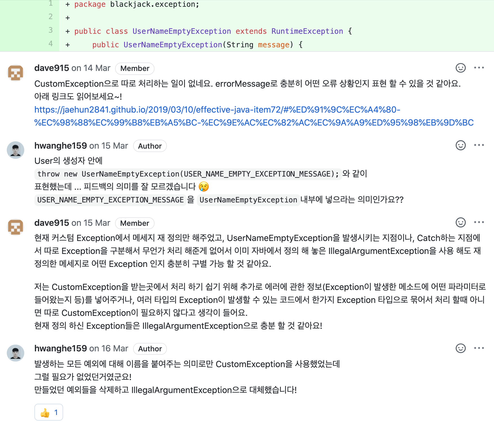

우아한테크코스의 두 크루인 오렌지와 우가 싸우고 있다.
왜 싸우고 있는지 알아보러 가볼까?

오렌지 : 아니 굳이 사용자 정의 예외 안 써도 됩니다!!

우 : 아닙니다!! 써야 합니다!!!

**사용자 정의 예외(Custom Exception)** 에 대한 둘의 의견이 좁혀지지 않는다.
각자의 주장을 더 자세히 들어보자!

## 표준 예외를 적극적으로 사용하자!

### 1. 예외 메시지로도 충분히 의미를 전달할 수 있다.

커스텀 예외의 장점으로 예외클래스의 이름만으로 어떤 예외인지 알아보기 쉽다는 점을 꼽는다.

```java
public class UserNameEmptyException extends RuntimeException {
    public UserNameEmptyException(String message) {
    ...
    }
}
```

위 커스텀 예외의 이름만 봐도 사용자 이름의 입력값이 비어있는 경우 발생하는 예외임을 알 수 있다.
그러나, 단지 그 하나의 이유를 위해서 커스텀 예외를 만드는 것은 지나친 구현이다.
유효하지 않은 입력(인자)값에 대한 예외이므로, 자바에서 정의해 놓은 `IllegalArgumentException`을 사용하고 메시지만 예외사항에 맞게 재정의해준다면 충분히 그 의미를 파악할 수 있다.

다음은 위 코드에 대한 피드백 중 일부이다. [피드백 링크](https://github.com/woowacourse/java-blackjack/pull/4#discussion_r392656069)




### 2. 표준 예외를 사용하면 가독성이 높아진다.

인수로 부적절한 값이 들어올 때 던지는 예외인 `IllegalArgumentException`, 
일을 수행하기에 적합하지 않은 상태의 객체인 경우 던지는 예외인  `IllegalStateException`, 
요청받은 작업을 지원하지 않는 경우에 던지는 예외인 `UnsupportedOperationExceptio` 등,
우리는 이미 익숙하고, 쓰임에 대해 잘 알고있는 예외들이 많다.

이런 예외들이 아닌 처음 보는 예외들은 당연히 구체적인 쓰임을 잘 모른다.
이런 이유로 낯선 예외보다는 익숙한 예외를 마주치는 것이 당연히 가독성이 높을 수 밖에 없다.

또한, 낯선 예외를 만났을 땐, 당연하게도 그 커스텀 익셉션을 파악하는 작업이 따라온다. 이 또한 비용이 될 수 있다.

표준 예외에 대한 쓰임은 [공식문서](https://docs.oracle.com/javase/8/docs/api/?java/lang/RuntimeException.html)를 참고하면 된다.


### 3. 일일히 예외 클래스를 만들다보면 지나치게 커스텀 예외가 많아질 수 있다.


위 사진처럼 domain 디렉토리 내에는 다양한 디렉토리들이 있고, 그 디렉토리 내에는 exception 디렉토리가 있다. 그리고, 수많은 custom Exception들이 있다.
예외 클래스들을 하나하나 만들다보면 지나치게 많아질 수 있다. 이 디렉토리와 클래스를 관리하는 것 역시 일이다. 지나치게 많아진다면 메모리 문제도 발생할 수 있고, 클래스 로딩에도 시간이 더 소요될 가능성이 있다. 

이미 자바에서는 충분히 많은 표준 예외를 제공하고 있으므로 표준 예외를 재사용한다면 이를 막을 수 있다. 

<p style="text-align: center;">
  <br>
  <em>(잠깐!)</em>
</p>

## 사용자 정의 예외가 필요하다!

오렌지의 말이 맞다. 자바에서는 기본적으로 충분한 예외들을 제공하고 있다.
대부분의 예외는 `IllegalArgumentException`이나 `IllegalStateException`으로 해결 가능할지도 모른다. 새로운 예외를 만드는 행위는 어쩌면 시간 낭비일 수도 있다.

이야기를 끝내기 전에 잠깐 우리가 자주 쓰는 Spring을 보자.
`@Valid` 어노테이션은 예외 상황에서 `MethodArgumentNotValidException`을 발생시킨다. 해당 예외의 패키지 구조는 `org.springframework.web.bind.MethodArgumentNotValidException`. Spring에서 만든 사용자 정의 예외다.

github에서 **38.8k**의 스타를 가진 spring이다. 그들이 옳다면 어느 정도 귀를 기울여야 하지 않을까?

그렇다고 무작정 적용할 수는 없는 법. 사용자 정의 예외를 사용할 때 얻을 수 있는 이점을 알아보자.

### 1. 이름으로도 정보 전달이 가능하다.

`NoSuchElementException`만으로는 어떤 요소가 없는지 알 수 없다. 하지만 `PostNotFoundException`이 발생했다면, Post를 찾는 요청을 보냈지만 해당 요소가 없다는 상황을 유추할 수 있을 것이다.

이처럼 Custom Exception은 이름을 통해 일차적으로 예외 발생 상황에 대해 유추할 수 있는 정보를 제공한다.

하지만 오렌지의 말처럼 메시지로도 충분한 전달이 가능하다. 이것만으로는 부족하다.

### 2. 상세한 예외 정보를 제공할 수 있다.

컬렉션의 범위를 벗어난 index 접근 요청이 생겼다고 해보자.

기존의 예외에선 `IllegalArgumentException`이나 `IndexOutOfBoundsException`을 후보로 생각해볼 수 있을 것이다. 예외 메시지로는 `"범위를 벗어났습니다."` 정도면 적당하다.

```java
if (index >= arr.length) {
  throw new IndexOutOfBoundsException("범위를 벗어났습니다.");
}
```

하지만 전체 범위가 얼마인지, 요청한 index가 몇인지 파악하기 위해서는 프로그래머가 직접 디버깅하거나 정보를 담은 메시지를 만들어줘야 한다. 
디버그를 통해 직접 정보를 찾아내는 행위는 썩 좋은 일이 아니다. 개발 과정에 피로함만 늘어간다.
메시지는? 단 한 곳에서만 발생하는 예외라면 아주 훌륭하다. 하지만 같은 예외가 발생하는 곳이 많아진다면? 나중에 리팩토링하기 힘들어질 뿐이다.

이런 상황에서 사용자 정의 예외는 좋은 해결책이 될 수 있다.

```java
public class IllegalIndexException extends IndexOutOfBoundsException {
	private static final String message = "범위를 벗어났습니다.";

	public IllegalIndexException(List<?> target, int index) {
		super(message + " size: "  + target.size() + " index: " + index);
	}
}
```

이제 우리는 요청 받은 컬렉션의 최대 범위가 어디까지인지, 요청한 index는 몇인지 바로 알 수 있다.
try/catch를 통해 발생한 예외를 붙잡아 새로 만든 예외를 던져도 되고, 기존 예외가 발생하기 전에 index를 검사해 새로 만든 예외를 직접 발생시켜도 괜찮다.

전달하는 정보의 수정이 필요할 때는 `IllegalIndexException` 클래스를 수정하면 된다. 같은 예외를 발생시키는 모든 상황에 적용될 것이다.

여기서 사용자 정의 예외의 장점이 한 가지 더 보인다.

### 3. 예외에 대한 응집도가 향상된다.

클래스를 만드는 행위는 관련 정보를 해당 클래스에서 최대한 관리하겠다는 이야기다.

표준예외와 메시지로도 충분히 정보를 전달할 수 있지만, 전달하는 정보의 양이 많아질수록 예외 발생 코드가 더러워진다. 거기에 같은 예외를 발생하는 장소가 많아지면? 코드는 더 끔찍해질 것이다. 함수로 분리한다 하더라도, 서로 다른 클래스에서 같은 예외가 발생한다면 책임 소재가 불분명해진다.

사실 정적 메소드를 담은 유틸성 클래스로도 충분히 표준 예외를 사용하면서 이 문제를 해결할 수 있다. 하지만 그 정도 노력이라면 예외 하나쯤은 만들어줄 수 있지 않을까?

사용자 정의 예외를 사용한다면 예외에 필요한 메시지, 전달할 정보의 데이터, 데이터 가공 메소드들을 한 곳에서 관리할 수 있다. 이는 우리에게 객체의 책임이 분리된 깔끔한 코드를 안겨줄 것이다.

같은 예외가 여러 곳에서 사용될수록 이 장점은 더 극대화될 것이다.

### 4. 예외 발생 후처리가 용이하다.

Spring에서는 ControllerAdvice를 통해서 전역적인 예외 처리가 가능하다. *[방법이 궁금하다면?](https://woowacourse.github.io/javable/2020-07-28/global-exception-handler)*

예외는 상속 관계에 있기 때문에, `Exception`이나 `RuntimeException`을 잡아두면 프로그램 내에서 발생하는 거의 모든 예외에 대해 처리가 가능하다.
하지만 이는 프로그래머가 의도하지 않은 예외까지 모두 잡아내 혼란을 야기할 수 있다.

재사용성이 높은 것은 표준 예외들의 장점이다. 하지만 그 장점 때문에 발생 위치를 정확하게 파악하기 힘들다는 단점도 생긴다.

```java
// in GlobalExceptionHandler.java
@RestControllerAdvice
public class GlobalExceptionHandler {
    @ExceptionHandler(IllegalArgumentException.class)
    public ResponseEntity<ErrorResponse> handleIllegalArgumentException(final IllegalArgumentException error) {
        // ...
    }
    // ...
}
```
```java
// in SomeController.java
@Controller
public class SomeController {
    // ...
    @PostMapping("/some")
    public ResponseEntity<Void> Some(@RequestBody SomeRequest request) {
        Something something = someService.someMethod(request);
        if (somevalidate(something)) {
            throw new IllegalArgumentException();
        }

        SomeExternalLibrary.doSomething(something);

        return ResponseEntity.ok().build();
    }
    // ...
}
```
이런 상황이라고 가정해보자.

`IllegalArgumentException`이 발생하고 잡아냈다면 정말 `some()`안에서 발생했다고 장담할 수 있을까?  
`SomeExternalLibrary`라는 외부 라이브러리에서 발생시켰을지도 모르고, 프레임워크 자체에서 발생시켰을지도 모른다.  
`Adivce`에서 일괄적인 처리를 하고 싶어도 발생 장소에 따라 처리 방법이 달라질 수 있다.

사용자 정의 예외를 사용하면 이런 혼란스러움을 줄일 수 있다.

`ExpectedException`을 구현한 뒤, 모든 사용자 정의 예외가 해당 예외를 상속받도록 하자. Advice에서는 `ExpectedException`을 처리하는 메소드 하나로 예외 처리 코드를 간소화할 수 있을 것이다.
API 작성 시 예측 가능한 상황에서 의도적으로 발생시킨 예외와 그렇지 않은 예외를 구분할 수도 있게 된다.

예외에 대한 후처리는 각각의 사용자 정의 예외 내부에서 처리한 뒤 일관성있게 `error.getMessage()`등으로 처리할 수도 있다.

```java
// in GlobalExceptionHandler.java
@RestControllerAdvice
public class GlobalExceptionHandler {
    @ExceptionHandler(RuntimeException.class)
    public ResponseEntity<ErrorResponse> handleUnExpectedException(final RuntimeException error) {
        // ...
    }

    @ExceptionHandler(ExpectedException.class)
    public ResponseEntity<ErrorResponse> handleExpectedException(final ExpectedException error) {
        // ...
    }
    // ...
}
```

### 5. 예외 생성 비용을 절감한다.

자바에서 예외를 생성하는 행위는 생각보다 많은 비용이 소모된다. 바로 stack trace 때문이다.

<p>
  <br>
  <em>(Stack Trace 예시, Spring boot 프로젝트에서 data.sql에 이상한 구문을 넣었다.)</em>
</p>
<br>

stack trace는 예외 발생 시 call stack에 있는 메소드 리스트를 저장한다. 이를 통해 예외가 발생한 정확한 위치를 파악할 수 있다. 하지만 `try/catch`나 `Advice`를 통해 예외를 처리한다면 해당 예외의 stack trace는 사용하지 않을 때가 많다. 비용을 들여 만들었지만 사용하지 않고 사라지는 형태. 너무나도 비효율적이다.

stack trace의 생성은 예외의 부모 클래스 중 `Throwable`의 `fillInStackTrace()`메소드를 통해 이루어진다. 사용자 정의 예외는 해당 메소드를 Override 함으로 stack trace의 생성 비용을 줄일 수 있다. 필요하다면 짧게 일부만을 생성할 수도, 아예 생성하지 않을 수도 있다.

```java
@Override
public synchronized Throwable fillInStackTrace() {
	  return this;
}
```

만일 구현해낸 Custom Exception이 stack trace도 갖지 않고, 상황에 따라 정보를 다르게 주는 예외가 아니라 단순하게 메세지만 넘겨준다면 해당 예외를 캐싱해두는 것도 비용 절감의 방법이다.

```java
public class CustomException extends RuntimeException {
	  public static final CustomException CUSTOM_EXCEPTION = new CustomException("대충 예외라는 내용");
	  //...
}
```

---

오렌지와 우의 이야기를 모두 들었다. 


어느 의견이 더 끌리나요? 
자바블 독자분들의 의견을 남겨주세요!