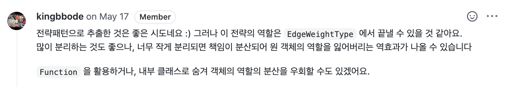

## 과도한 코드 분리에 대한 피드백

지하철 노선도를 만드는 미션을 수행하면서 다양한 리뷰를 받았다. 그 중에서 리뷰가 아니었다면 생각하지 못했을 부분을 소개해보고자 한다.

미션 요구사항 중 출발역에서 도착역으로 가는 경로를 구할 때 기준을 최단 거리, 최소 시간이라는 기준에 따라 서로 다른 경로를 제시하는 부분이 존재했다. [Jgrapht](https://jgrapht.org/) 라이브러리를 이용해 각 역 Entity의 id를 vertex로, 역간 거리, 소요시간 등 역과 역을 이어주는 정보를 edge로 나누고 edge에 경로 검색 기준에 따라 weight를 다른 방법으로 주는 방식으로 경로 탐색에 필요한 graph를 구현하고자 했다.

```java
// SubwayGraph.java
private static void setDistanceEdge(WeightedGraph<Long, RouteEdge> graph, LineStation lineStation) {
    RouteEdge routeEdge = lineStation.toEdge();
    graph.addVertex(lineStation.getStationId());
    if (lineStation.isNotStart()) {
        graph.addVertex(lineStation.getPreStationId());
        graph.addEdge(lineStation.getPreStationId(), lineStation.getStationId(), routeEdge);
        graph.setEdgeWeight(routeEdge, routeEdge.getDistance()); // 중복
    }
}

private static void setDurationEdge(WeightedGraph<Long, RouteEdge> graph, LineStation lineStation) {
    RouteEdge routeEdge = lineStation.toEdge();
    graph.addVertex(lineStation.getStationId());
    if (lineStation.isNotStart()) {
        graph.addVertex(lineStation.getPreStationId());
        graph.addEdge(lineStation.getPreStationId(), lineStation.getStationId(), routeEdge);
        graph.setEdgeWeight(routeEdge, routeEdge.getDuration()); // 중복
    }
}
```

처음 이 부분을 코딩했을 때 검색 기준에 따라 각기 다른 메소드를 통해 해결했으나, 리팩토링 과정에서 두 메소드의 중복되는 부분이 보였다.

중복 해소를 위해 중복되는 코드를 같은 메소드로 묶고 차이가 나는 코드를 전략 패턴을 통해 구현하고자 하였다. 전략 패턴을 이용해 RouteEdge 객체에서 경로 검색 기준에 필요한 정보를 각기 다른 방식으로 가지고 올 수 있도록 코드를 구현한다면 조금 더 깔끔하게 구현할 수 있을 것이라 생각했다.

```java
// SubwayGraph.java

private static void setEdge(EdgeWeightStrategy edgeWeightStrategy, WeightedGraph<Long, RouteEdge> graph,
LineStation lineStation) {
    RouteEdge routeEdge = lineStation.toEdge();
    graph.addVertex(lineStation.getStationId());

    if (lineStation.isNotStart()) {
        graph.addVertex(lineStation.getPreStationId());
        graph.addEdge(lineStation.getPreStationId(), lineStation.getStationId(), routeEdge);
        graph.setEdgeWeight(routeEdge, edgeWeightStrategy.getWeight(routeEdge));
    }
}
```

```java
// EdgeWeightStrategy.java

@FunctionalInterface
public interface EdgeWeightStrategy {
    int getWeight(RouteEdge edge);
}
```

```java
// EdgeWeightType.java
// 거리 혹은 시간, 가중치의 선정 기준으로 사용되는 Enum

public enum EdgeWeightType {
    DISTANCE(edge -> edge.getDistance())),
    DURATION(edge -> edge.getDuration()));

    private final EdgeWeightStrategy edgeWeightStrategy;

    EdgeWeightType(EdgeWeightStrategy edgeWeightStrategy) {
        this.edgeWeightStrategy = edgeWeightStrategy;
    }
		...
}
```

위와 같이 enum 클래스를 이용해 경로 검색 기준 별로 instance를 만들고, 각 instance가 전략 객체를 통해 자신에게 맞는 weight를 가져올 수 있게 리팩토링을 진행하였다.

중복되는 코드를 없애고 나름대로 객체지향적으로 역할을 나누어 설계를 했다고 판단했다. 하지만 고려하지 못한 부분이 있었다.



EdgeWeightType을 다시 한 번 확인해보자. 현재 EdgeWeightType은 EdgeWeightStrategy와 너무 책임을 많이 나눈 나머지 EdgeWeightType은 EdgeWeightStrategy를 가지고 있을 뿐, 아무런 책임을 가지지 못한 객체가 되어버렸다. 오히려 과한 객체 분리로 인해 이 코드의 사용자에게 하여금 EdgeWeightStrategy에 대해 어떤 역할을 하는 지 파악하는 데 시간을 들이게 할 뿐만 아니라 코드의 복잡도를 높이게 되었다.

```java
subwayGraph.method(EdgeWeightStrategy edgeWeightStrategy, ...)
```

위 메서드가 있다고 했을때, EdgeWeightType가 가지고 있는 EdgeWeightStrategy를 이용해야 한다면 결국 EdgeWeightType이 구현한 EdgeWeightStrategy를 외부로 공개해야 한다는 문제점이 존재한다.

만약 메서드의 매개 변수로 EdgeWeightStrategy가 아니라 EdgeWeightType을 가지고 있었다면, 그리고 메서드 내부적으로 EdgeWeightType의 EdgeWeightStrategy를 사용하게 했더라면 사용자가 조금 더 편하게 메서드의 기능을 이해할 수 있었을 것이다.

즉 위와 같은 구조는 간단하게 생각하면 디미터의 법칙을 어긴 사례이다. 인터페이스 분리에 신경쓰다가 클래스 내부의 구현이 밖으로 드러나도록 코드를 짠 것이다.

그래도 EdgeWeightStrategy라는 인터페이스를 활용하면서 클래스 분리의 이점을 살리고, 사용성을 높이는 방법은 어떤 것이 있을까?

기존에 살펴본 구현(implements)과 위임(delegate)을 힌트로 삼아 두 가지 방법을 제시해보고자 한다.

## 구현을 통한 응집력 높히기

첫 번째로 EdgeWeightType이 EdgeWeightStrategy를 구현(implement)하는 방법이 있다.

```java
// EdgeWeightType.java
public enum EdgeWeightType implements EdgeWeightStrategy {
    DISTANCE(edge -> edge.getDistance()),
    DURATION(edge -> edge.getDuration());
    private final Function<RouteEdge, Integer> edgeWeightStrategy;
    EdgeWeightType(Function<RouteEdge, Integer> edgeWeightStrategy) {
        this.edgeWeightStrategy = edgeWeightStrategy;
    }
    public int getWeight(RouteEdge edge) {
        return edgeWeightStrategy.apply(edge);
    }
}
```

위와 같이 구현할 경우, 어떤 장점이 있을까?

1.  사용자가 interface를 사용할 수 있도록 유지하면서 enum이 전략의 구현체가 된다면, 사용자 입장에서 EdgeWeightType 내부 구현은 신경쓰지 않아도 된다. 또한 기존 EdgeWeightType은 enum으로서 구현한 전략 객체의 유일성을 보장할 수 있게 된다.

2. EdgeWeightType과 함께 EdgeWeightStrategy를 구현한 새로운 class, enum을 이용할 수 있어 코드의 유연성을 확보할 수 있다. 이는 테스트 시에도 EdgeWeightType과는 무관하게 테스트를 위한 구현체를 만들어 원할히 테스트를 할 수 있다는 점과도 연결이 된다.

## 위임을 통한 응집력 높히기

EdgeWeightStrategy는 현재 EdgeWeightType에서만 사용되고 있다. 만약 해당 인터페이스를 외부에 따로 구현을 해둔다면 나중에 이 코드를 사용하는 사용자의 입장에서 혼돈이 올 수 있을 것이다.

우리는 인터페이스를 흔히 확장을 위한 용도로 사용하고 있다.

그런데 한 곳에서 사용하는 인터페이스를 외부에 노출시키는 것은 다른 사용자로부터 해당 인터페이스가 다른 곳에서도 사용되고 있다는 생각을 품어주기에 충분하다.

이를 해결할 수 있는 방법은 위임(delegate)이다. EdgeWeightType에서 사용하는 EdgeWeightStrategy를 내부 인터페이스로 선언하고 이를 EdgeWeightStrategy에 위임하는 것이다.

```java
// EdgeWeightType.java

public enum EdgeWeightType {
    DISTANCE(RouteEdge::getDistance),
    DURATION(RouteEdge::getDuration);

    private final EdgeWeightStrategy edgeWeightStrategy;

    EdgeWeightType(EdgeWeightStrategy edgeWeightStrategy) {
        this.edgeWeightStrategy = edgeWeightStrategy;
    }

    public int getWeight(RouteEdge edge) { // EdgeWeightStrategy의 메서드를 위임
        return this.edgeWeightStrategy.getWeight(edge);
    }

    @FunctionalInterface
    private interface EdgeWeightStrategy {
        int getWeight(RouteEdge edge);
    }
}
```

위의 코드를 살펴보면 이전에 분리되어 있던 EdgeWeightStrategy가 EdgeWeightType의 내부에서 선언되어 있다.

이로서 EdgeWeightType에서만 사용되던 인터페이스를 한 곳으로 응집시켜 객체를 사용하는 입장에서 응집도 있는 객체를 활용할 수 있게 되었다.

그리고 EdgeWeightStrategy에서 선언한 메서드를 EdgeWeightStrategy를 사용하는 EdgeWeightType 객체에 위임하여서 외부에서도 사용할 수 있도록 구현해두었다.

이처럼 한 곳에서만 사용하는 인터페이스를 내부 인터페이스 형식으로 선언하고 인터페이스의 메서드를 위임해서 외부에서 사용할 수 있도록 한다면 해당 객체를 사용하는 사용자에게 코드의 분산으로 인한 혼란을 감소시키고 응집도 있는 객체를 사용할 수 있게 해준다.

## 정리하며

위에서 소개한 두 가지 해결 방법을 통해 분산되어 있는 객체의 코드를 응집도 있게 사용할 수 있었다.

하지만 이런 문제는 본질적으로 책임에 따른 객체의 분리가 잘못되서 발생한 문제이다.

재사용하기 좋은 코드를 작성하는 것은 중요하다. 그러나 이는 객체지향적인 설계를 추구함으로서 얻을 수 있는 장점이지 이게 주가 되면은 안된다.

그렇기 때문에 위의 상황처럼 재사용하기 좋은 코드를 만들기 위한 코드의 과도한 분리는 객체에게 적절한 책임을 부여하지 못하고 분산이 되게 한다. 이는 객체지향적인 코드의 작성을 방해하게 된다.

객체지향을 통해 여러가지 장점을 얻을 수 있다. 그러나 그 장점에 너무 매몰되면 본질을 잊을 수도 있기 때문에 항상 이에 유의하여 코드를 작성하는 습관을 들여야 할 것이다.