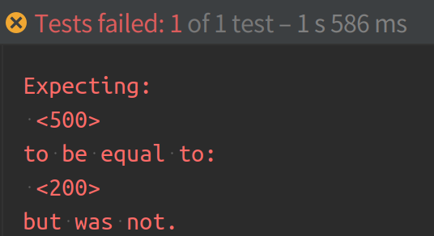
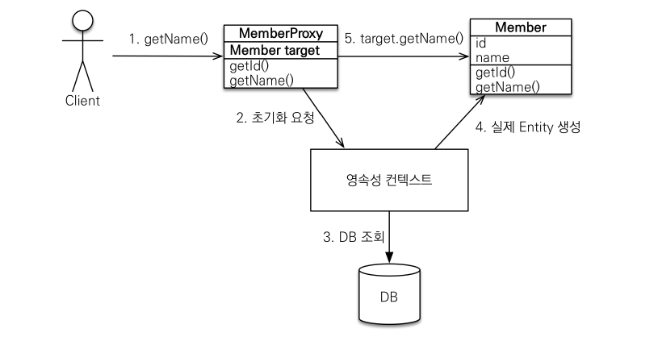

서비스를 개발하다보면 생각하지도 못한 부분에서 버그가 발생하는 때가 있다. 특히 프로젝트 막바지에 이런 경험을 한다면? 생각하기도 싫은 상황일 것이다. 레벨3 프로젝트를 진행하면서 이런 경험을 한 적이 있는데, 이 때 어려움을 겪은 부분을 공유해보고자 한다.

## 문제 상황 

현재 로그인된 사용자의 정보를 Spring Security의 @CurrentUser Annotation을 활용해 다음과 같이 받아 사용하고 있다. 
>@AuthenticationPrincipal은 Security에서 미리 구현한 Annotation이다. 사용자 인증 정보를 통해 얻어진 유저 정보(UserDetails)를 가지고 올 수 있는 Annotation이며, 현재 유저 정보는 미리 구현한 CustomUserDetailsService 통해 load 된다.
>
>@CurrentUser는 @AuthenticationPrincipal의 expression을 활용하여 유저 정보에서 실제로 구현한 User 클래스를 가지고 올 수 있는 Annotation이다.
>
>쉽게 @CurrentUser는 로그인 유저 정보를 활용해 도메인에서 실제로 쓰이는 User 객체를 가져오는 일종의 ArgumentResolver를 생각하면 편할 것이다.

```java
@RequestMapping("/user")
@RequiredArgsConstructor
@RestController
public class UserController {
    private final UserService userService;

    @GetMapping("/me")
    public ResponseEntity<UserResponse> getCurrentUser(@CurrentUser User user) {
        return ResponseEntity.ok(UserResponse.of(user));
    }
}
```

```java
@Entity
public class User {
   @Id
   @GeneratedValue(strategy = GenerationType.IDENTITY)
   private Long id;

   private String email;

   private String password;

   // Getter, Setter...  
}
```

```java
public class UserResponse {
    private Long id;

    private String name;

    private String email;

    // Getter, static constructor
}
```

```java
@Target({ElementType.PARAMETER, ElementType.TYPE})
@Retention(RetentionPolicy.RUNTIME)
// anonymousUser이면 EmptyUser를 반환하고, 아니면 구현 클래스에 있는 user 필드를 반환. EmptyUser는 비로그인 유저를 표현하기 위한 객체 
@AuthenticationPrincipal(expression = "#this == 'anonymousUser' ? new (...).EmptyUser() : user") 
public @interface CurrentUser {
}
```

```java
@Service
@RequiredArgsConstructor(access = AccessLevel.PUBLIC)
public class CustomUserDetailsService implements UserDetailsService {
    private final UserRepository userRepository;

    @Override
    @Transactional(readOnly = true)
    public UserDetails loadUserByUsername(String email) throws UsernameNotFoundException {
        User user = userRepository.findByEmail(email)
            .orElseThrow(UsernameNotFoundException::new);

        return UserPrincipal.of(user);
    }
}
```

이와 같이 현재 로그인 유저의 정보를 조회하는 로직을 구현하였다.

유저 기능과 관련된 개발을 하던 중 유저의 즐겨찾기를 구현하기 위해 User에 Favorites을 추가하고 User와 OneToMany 양방향 관계로 묶어주었다.

```java
@Entity
public class Favorite {
    @Id
    @GeneratedValue(strategy = GenerationType.IDENTITY)
    private Long id;
    @ManyToOne
    private User user;
    private ...
   // Getter, Setter...  
}
```

```java
@Entity
public class User {
    @Id
    @GeneratedValue(strategy = GenerationType.IDENTITY)
    private Long id;

    private String email;

    private String password;

    @OneToMany(cascade = CascadeType.ALL, orphanRemoval = true)
    private Set<Favorite> favorites = new HashSet<>();
   
   // Getter, Setter...  
}
```

```java
public class UserResponse {
    private Long id;

    private String name;

    private String email;

    private List<FavoriteResponse> favorites;

    // Getter, static constructor
}
```

이와 같이 새롭게 기능을 추가하고 기존에 존재하는 인수 테스트를 수행하면 어떤 결과가 나올까?

```java
UserAcceptanceTest.java
...
@DisplayName("현재 유저의 정보를 조회한다.")
@Test
void findme() {
    // given
    ... // 사용자 회원가입 로직
    LoginRequest loginRequest = new LoginRequest(TEST_EMAIL, TEST_PASSWORD);
    AuthResponse authResponse = requestTokenByLogin(loginRequest);

    // when
    ExtractableResponse<Response> response = given().log().all()
        .header(AUTHORIZATION, authResponse.getTokenType() + " " + authResponse.getAccessToken())
        .when()
        .get("/user/me")
        .then().log().all()
        .extract();

    // then
    assertThat(response.statusCode()).isEqualTo(HttpStatus.OK.value()
    ...
}
...
```



```
// log
org.hibernate.LazyInitializationException: failed to lazily initialize a collection of role: (...).domain.User.favorites, could not initialize proxy - no Session
    at org.hibernate.collection.internal.AbstractPersistentCollection.throwLazyInitializationException(AbstractPersistentCollection.java:606) ~[hibernate-core-5.4.17.Final.jar:5.4.17.Final]
    ...
    at java.base/java.util.stream.ReferencePipeline.collect(ReferencePipeline.java:578) ~[na:na]
    at (...).dto.UserResponse.of(UserResponse.java:42) ~[main/:na]
    at (...).controller.UserController.getCurrentUser(UserController.java:36) ~[main/:na]
```

LazyInitializationException라는 Exception이 발생한다. 개발할 때 Lazy라는 단어를 본 적이 없는 것 같은데, 이 Exception은 어디서 발생하는 것일까? 우선 이 예외에 대해 파악해보도록 하자.

## LazyInitializationException은 무엇인가?

JPA는 Entity에서 연관 Entity를 불러올 때(fetch) 두 가지 전략을 사용할 수 있다. Eager, Lazy가 그 것이다.

> Eager(즉시로딩) : Entity를 조회할 때 연관 Entity도 함께 조회한다.
>
> Lazy(지연로딩) : Entity를 조회할 때 연관 Entity를 같이 조회하지 않으며, 연관 Entity가 **실제로 사용**될 때 조회한다.

FetchType은 연관 Entity를 어떻게 조회할 것인지에 대한 설정값이다. 연관 Entity가 항상 같이 필요하면 즉시로딩, 필요할 때마다 쓰고 싶다면 지연로딩을 사용해야 적절할 것이다.

JPA의 구현체인 Hibernate에선 Lazy 로딩을 구현하기 위해 Proxy를 사용한다. Proxy에 대해 간단하게 살펴보면 다음과 같다.



Proxy는 실제 Entity를 상속받아 만들어진다. Proxy 객체는 실제 Entity를 참조를 가지며 실제 Entity의 참조를 통해 기능을 수행한다.

지연로딩(Lazy loading)은 연관 Entity를 프록시 형태로 조회한다. 그리고 추후 연관 Entity가 필요할 경우, Proxy를 초기화하여 실제 Entity의 참조를 얻어내고 실제 Entity의 기능을 호출해 결과를 반환하는 형태로 기능을 수행한다. 초기화 과정을 살펴보면 실제 엔티티의 참조를 얻어내기 위해서는 영속성 컨텍스트의 도움이 필요하다는 것을 알 수 있고 영속성 컨텍스트가 존재하지 않을 경우, 실제 Entity에 대한 참조를 얻을 수 없기 때문에 문제가 생길 것을 예상해볼 수 있다.

위 Exception은 영속성 컨텍스트가 종료된 상황에서 지연로딩된 Proxy 객체에게 연관 Entity(Favorite)를 조회해달라고 요청한 부분이 문제였던 것이다. 영속성 컨텍스트 종료된 상황(no Session)에서 객체는 영속성 컨텍스트의 도움을 받을 수 없는 준영속 상태가 된다. User는 영속성 컨텍스트를 통해 연관 객체의 정보를 확인할 수 없기 때문에 Exception이 발생한 것이고, 그 Exception이 LazyInitializationException이었던 것이다. 

정리하면 @CurrentUser라는 어노테이션을 통해 User를 편리하게 가지고 올 수 있었지만, Entity의 생명주기를 파악하지 못해 발생한 문제였다.

그렇다면 현재 LazyInitializationException을 방지하기 위해서 어떻게 해결해야 할까? 준영속 객체를 다시 영속화 시키던가, 아니면 필요한 Entity를 사전에 불러오면 될 것이다. 구체적인 방법에 대해 알아보자.

## 생각해볼 수 있는 해결방안

1) Entity 다시 불러오기

```java
// UserService.java
...
@Transactional
public UserResponse findMe(User user) {
    return userRepository.findById(user.getId())
        .map(UserResponse::of)
        .orElseThrow(RuntimeException::new);
}
...

// UserContoller.java
...
@GetMapping("/me")
public ResponseEntity<UserResponse> getCurrentUser(@CurrentUser User user) {
    return ResponseEntity.ok(userService.findMe(user));
}
...
```

기존에 받아온 User를 이용해 다시 한 번 정보를 조회한 후 영속성 컨텍스트 안에서 연관 Entity를 조회한다. 문제는 해결되지만 기존에 한 번 찾았던 Entity를 다시 한 번 불러오는 건 어색해보인다.

2) Entity 강제로 초기화 : 영속성 컨텍스트가 존재하는 상황에서 미리 필요한 Entity를 초기화하면 준영속 상태에서도 사용할 수 있다.

```java
// CustomUserDetailsService.java
...
@Override
@Transactional(readOnly = true)
public UserDetails loadUserByUsername(String email) throws UsernameNotFoundException {
    User user = userRepository.findByEmail(email)
        .orElseThrow(UsernameNotFoundException::new);

    user.getFavorites().size(); // 사용하는 시점에 연관 entity(Favorite) 초기화, Collection은 직접 요소를 사용해야 초기화가 수행됨

    return UserPrincipal.of(user);
}
...
```

Spring Data Jpa는 Hibernate를 사용하기 때문에 `Hibernate.initialize(user.getFavorites());`를 통해 직접 연관 Entity를 초기화를 해주는 방법도 있다. 하지만 @CurrentUser가 UserController에서 유저 정보를 조회하는 데에만 그치지 않고 유저 정보를 활용한 다른 Controller에서 사용된다면, User가 가지고 있는 Favorites는 불필요한 정보가 될 것이다.

3) FetchType.EAGER : User Entity를 가지고 올 때 항상 Favorite도 같이 조회한다. 

```java
@OneToMany(cascade = CascadeType.ALL, orphanRemoval = true, fetch = FetchType.EAGER)
private Set<Favorite> favorites = new HashSet<>();
```

사실 Fetch 전략을 Eager로 설정하면 간단하게 문제는 해결된다. 영속성 컨텍스트가 없어도 상위 Entity를 조회할 때 미리 연관 Entity도 같이 조회하기에 사용할 수 있게 되는 것이다. 하지만 다음과 같은 단점을 가진다.

1. 사용하지 않는 엔티티를 로딩한다.
    - 2)와 같은 문제로 Favorites는 불필요한 정보가 될 것이다.
2. N+1 문제가 발생한다.
    - 현재 내정보를 조회하는 로직에서는 하나의 User만 조회하지만 추후 전체 User를 조회하는 기능이 생길 경우 즉시 로딩을 통해 연관 Entity까지 모두 조회하면, [N+1](https://jojoldu.tistory.com/165) 문제가 발생한다. 자세한 내용은 너무 내용이 길어지기에 링크를 참조하길 바란다. 간단하게 요약하면 불필요하게 쿼리가 많이 발생하기에 Application 성능이 저하되는 문제가 생긴다는 것이다.

4) join fetch 사용 : UserRepository에서 @Query를 통해 JPQL fetch join을 사용하면 Fetch 전략을 Eager로 가져가지 않고도 연관 Entity를 조회할 수 있다.

```java
// UserRepository.java

@Query("SELECT u FROM User u JOIN FETCH u.favorites WHERE u.email = :email")
Optional<User> findByEmail(String email);
```

다만 Repository의 findByEmail을 사용해 조회하는 모든 User는 불필요하게 Favorites를 불러온다 문제점이 있다. 즉 @CurrentUser를 통해 불러오는 User Entity는 항상 Favorites를 불러오게 된다는 것이다. Repository에서 불러올 Entity에 따라 메소드를 분리하면 되겠지만 연관 Entity가 많아진다면 경우의 수에 따라 메소드가 늘어나는 문제가 존재한다. 또 필요한 View에서 필요한 연관 Entity에 따라 find와 관련된 기능이 Repository 메소드에까지 추가되야 한다는 문제도 존재한다.

## 그런데 말입니다.

위에서 나온 해결방법은 결국 Controller에서 준영속 상태인 Entity가 지연로딩이 불가능하기 때문에 미리 연관 Entity를 불러오는 방식을 채택하고 있다. 이는 불필요한 정보를 항상 함께 조회한다는 문제점을 가지고 있다. 그렇다면 영속성 컨텍스트를 Controller까지 살아있도록 해주면 되지 않을까? 

OSIV(Open Session In View)를 활용한다면 Controller에서도 영속성 컨텍스트가 존재해 지연 로딩이 가능해진다. 그런데 [Spring Boot에서 OSIV 설정(spring.jpa.open-in-view) Default 설정 값](https://woowacourse.github.io/javable/2020-09-11/osiv)은 **true**다! 이 말은 즉 현재 상황에서 Controller에는 여태까지의 설명과는 다르게 영속성 컨텍스트가 존재한다는 말과 같다. 

하지만 기존에 작성해놓은 테스트에서는 분명히 LazyInitializationException이 발생했고, Proxy 초기화를 통해서 연관 Entity를 가지고 오는 것이 가능해졌다. 왜 이런 일이 발생했을까?

이 부분은 Spring Security가 어떤 방식으로 사용자 정보를 가지고 오는지, 그리고 JPA에서 OSIV가 어떤 방식으로 작동하는 지 이해가 필요하다.

다만 이 부분까지 다루기에는 글이 너무 길어져 다음에 다루도록 하겠다.

## 이게 끝인가?

위에서 나온 예시처럼 여러가지 방법을 통해 해결책을 꺼내볼 수 있었다. 하지만 과연 위에서 소개한 해결책이 위 상황에서 적절했을까? 현재 User Entity의 구조를 다시 한 번 살펴보자.

현재 Entity를 조회하는 로직에는 항상 Favorite도 조회하는 부분도 같이 존재한다. 서비스를 어떻게 구현하는 지에 따라 다르긴 하겠지만, 보통 User의 즐겨찾기가 User를 조회할 때 항상 같이 존재해야 한다고 생각하는 경우는 드물 것이다.

즉, 이 경우에는 fetch 타입을 Eager 혹은 Lazy로 할지, 혹은 LazyInitializationException을 어떻게 해결해야 하는 지 고민하는 것보다, 먼저 만들어놓은 Entity 구조나 API가 우리가 의도했던 기능에 적합한지에 대해 먼저 고민할 필요가 있었을 것이다.

때로는 log 메세지의 Exception에만 빠지지 말고 전체적인 설를 살펴봐야 한다는 점을 이야기하며 글을 마치고자 한다.

### 참고자료

[김영한, 자바 ORM 표준 JPA 프로그래밍 [스프링 데이터 예제 프로젝트로 배우는 전자정부 표준 데이터베이스 프레임워크]](http://www.acornpub.co.kr/book/jpa-programmig)

[창천향로, JPA N+1 문제 및 해결방안](https://jojoldu.tistory.com/165)