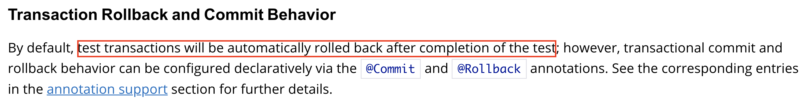
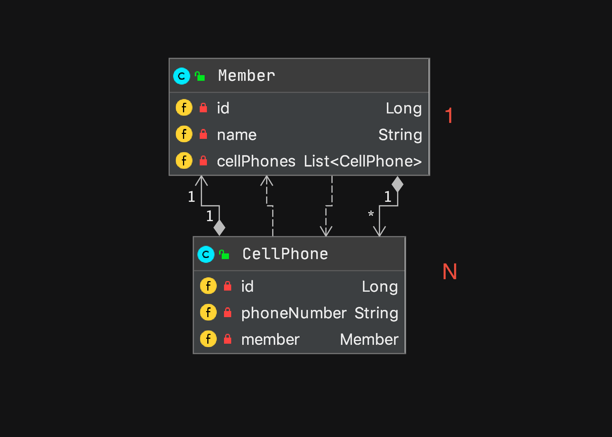
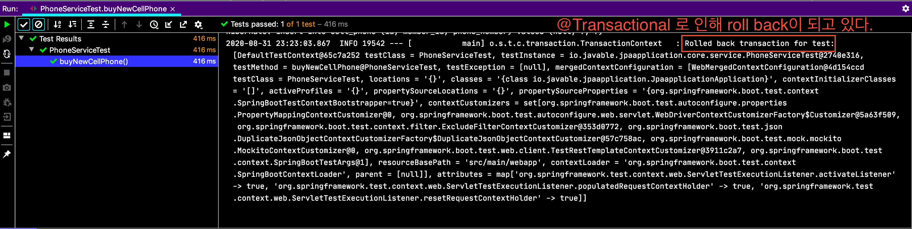
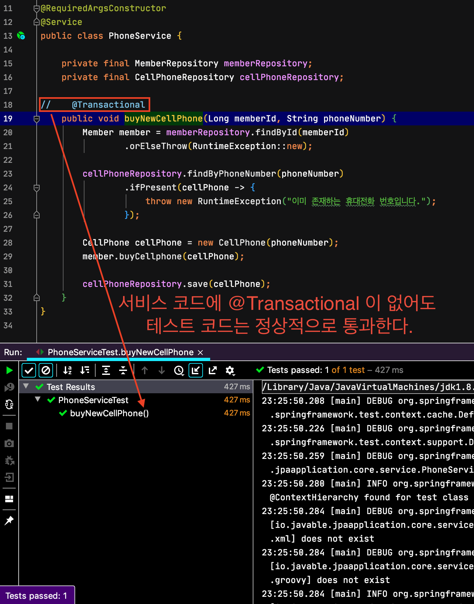
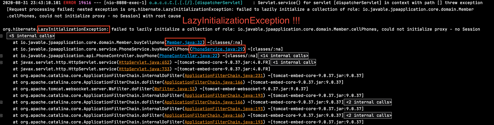
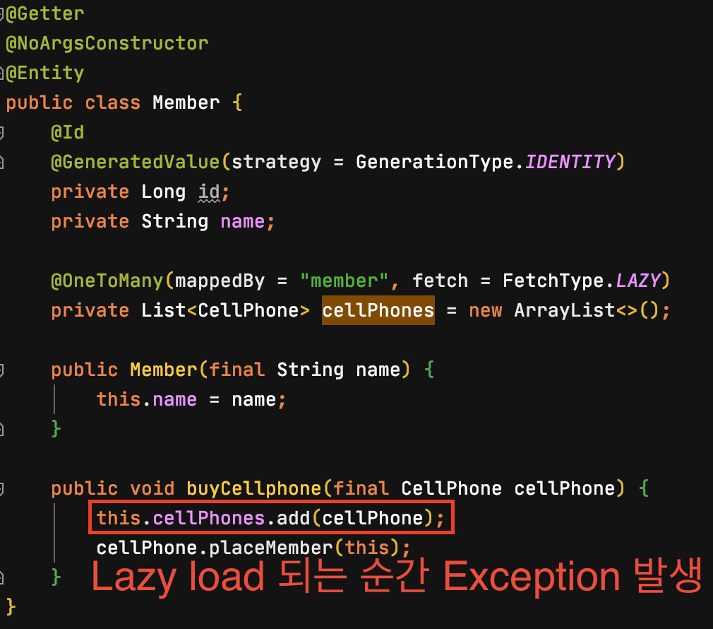
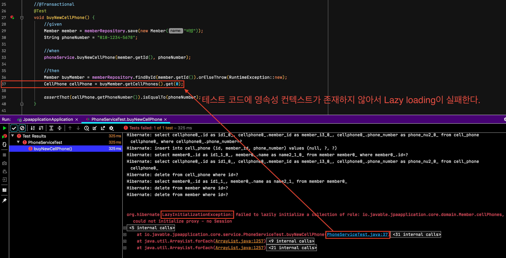

서비스 레이어(`@Service`)에 대해 테스트를 한다면 보통 DB와 관련된 테스트 코드를 작성하게 된다. 이러면 테스트 메서드 내부에서 사용했던 데이터들이 그대로 남아있게 되어서 실제 서비스에 영향을 미칠 수 있기 때문에 테스트가 끝나면 지워야 할 필요가 있다. 이러한 문제를 해결하기 위해 `@Sql` 애너테이션을 이용해서 직접 DB를 Truncate하는 Query를 직접 작성하는 방법도 있고, 테스트 메서드에 `@Transactional` 애너테이션을 이용해서 테스트 메서드가 종료될 때 테스트 메서드 내부에서 생성했던 데이터를 rollback하는 방법도 있다.

`@Sql` 작성은 관련된 DB의 Truncate Query를 직접 작성해야하고 관련된 Table이 증가할 때마다 Query도 같이 수정해야 하는 번거로움이 있다. 반면 `@Transactional` 은 클래스 혹은 메서드에 명시하는 것 만으로 손쉽게 관련된 Table의 데이터를 rollback 할 수 있기 때문에 굉장히 편리하다.



> [Transcation Rollback and Commit Behavior](https://docs.spring.io/spring/docs/current/spring-framework-reference/testing.html#testcontext-tx-rollback-and-commit-behavior)

위와 같이 테스트를 `@Transactional`을 이용한다면 쉽게 rollback이 돼서 테스트 코드에 사용한 데이터를 관리하기 쉽다.

하지만 JPA를 사용하는 환경에서 단순히 rollback을 위해서 테스트 코드를 작성한다면 주의해야 할 점이 있다.

## 예제

예시를 위한 코드를 먼저 살펴보도록 하자.  
아래는 1:N 관계를 가진 Member(사용자), CellPhone(핸드폰) Entity이다.



```java
# Member
@Getter
@NoArgsConstructor
@Entity
public class Member {
    @Id
    @GeneratedValue(strategy = GenerationType.IDENTITY)
    private Long id;
    private String name;

    @OneToMany(mappedBy = "member", fetch = FetchType.LAZY)
    private List<CellPhone> cellPhones = new ArrayList<>();

    public Member(final String name) {
        this.name = name;
    }

    public void buyCellphone(final CellPhone cellPhone) {
        this.cellPhones.add(cellPhone);
        cellPhone.placeMember(this);
    }
}

# CellPhone
@Getter
@NoArgsConstructor
@Entity
public class CellPhone {
    @Id
    @GeneratedValue(strategy = GenerationType.IDENTITY)
    private Long id;
    private String phoneNumber;

    @ManyToOne(fetch = FetchType.LAZY)
    private Member member;

    public CellPhone(final String phoneNumber) {
        this.phoneNumber = phoneNumber;
    }

    public void placeMember(final Member member) {
        this.member = member;
    }
}

```

그리고 서비스 코드이다.

```java
@RequiredArgsConstructor
@Service
public class PhoneService {

    private final MemberRepository memberRepository;
    private final CellPhoneRepository cellPhoneRepository;

    @Transactional
    public void buyNewCellPhone(Long memberId, String phoneNumber) {
        Member member = memberRepository.findById(memberId)
                .orElseThrow(RuntimeException::new);

        cellPhoneRepository.findByPhoneNumber(phoneNumber)
                .ifPresent(cellPhone -> {
                    throw new RuntimeException("이미 존재하는 휴대전화 번호입니다.");
                });

        CellPhone cellPhone = new CellPhone(phoneNumber);
        member.buyCellphone(cellPhone);

        cellPhoneRepository.save(cellPhone);
    }
}
```

마지막으로 테스트 코드이다.

```java
@SpringBootTest
class PhoneServiceTest {

    @Autowired
    private PhoneService phoneService;
    @Autowired
    private MemberRepository memberRepository;

    @Transactional
    @Test
    void buyNewCellPhone() {
        //given
        Member member = memberRepository.save(new Member("비밥"));
        String phoneNumber = "010-1234-5678";

        //when
        phoneService.buyNewCellPhone(member.getId(), phoneNumber);

        //then
        Member buyMember = memberRepository.findById(member.getId()).orElseThrow(RuntimeException::new);
        CellPhone cellPhone = buyMember.getCellPhones().get(0);

        assertThat(cellPhone.getPhoneNumber()).isEqualTo(phoneNumber);
    }
}
```

테스트 코드에는 rollback을 위해 `@Transactional` 애너테이션이 사용되고 있다.



위 테스트 코드는 정상적으로 통과한다. 또한 테스트에서 생성되었던 데이터들도 성공적으로 rollback이 되는 것을 확인할 수 있다.

하지만 개발자의 서비스 코드의 메서드에서 `@Transactional` 을 깜빡하고 사용하지 않고 테스트 코드에서만 `@Transactional`을 사용한다면 어떻게 될까?



테스트 코드는 통과하지만



실제로 프로덕션이 서비스 될 때는 **런타임에 `LazyInitializationException`이 발생**하는 것을 볼 수 있다.



`LazyInitailizationException`이 발생하는 이유는 실제 **서비스 코드에서는 `@Transactional` 이 없기 때문에 영속성 컨텍스트가 존재하지 않아서 Lazy Loading이 불가능**하지만, **테스트 코드는 `@Transactional` 이 존재하기 때문에 영속성 컨텍스트가 존재하면서 Lazy Loading이 가능**했기 때문이다.

따라서 서비스 코드에는 `@Transactional` 을 이용하지 않고 테스트 코드에만 `@Transactional` 을 이용한다면 **개발자의 실수로 런타임에서만 발생**하는 문제가 생길수 있다.

그렇다면 서비스 코드에만 `@Transactional` 을 이용하고 테스트에서는 어떻게 하는 게 좋을까?

필자는 테스트 코드에 `@AfterEach` 메서드를 만들고 직접 연관된 `JpaRepository`를 이용해서 `deleteAll()` 하는 것을 추천한다.  
이렇게 하면 테스트 코드에서는 영속성 컨텍스트를 직접 관리하지 않기 때문에 위와 같은 오류를 방지할 수 있다.

```java
    @AfterEach
    void tearDown() {
        cellPhoneRepository.deleteAll();
        memberRepository.deleteAll();
    }
```

이렇게 테스트 코드에서 `@Transactional` 을 제거하고 난 뒤 한 가지 더 주의할 점이 남아있다.

위 테스트 코드에서 `@Transactional` 을 제거하고 테스트를 돌리면 테스트가 통과하지 못한다.

이는 테스트 코드에서 Lazy loading 을 사용했기 때문이다. 이전 코드에서는 `@Transactional` 로 인해 테스트 코드 전체에 영속성 컨텍스트가 존재하면서 Lazy loading 이 가능했지만 이제 `@Transactional` 이 불가능해졌기 때문이다.



해결 방법은 간단하다.

Lazy loading 하도록 Entity를 가져오던 쿼리를 fetch join으로 바꿔주면 더 이상 Lazy loading이 필요하지 않게 되면서 정상적으로 테스트 코드가 통과할 것이다.

## 그렇다면 테스트 코드에서는 `@Transactional` 은 사용하지 말아야 하는가?

결론부터 말하자면 '**그렇지 않다.**'이다.

실제로 `@DataJpaTest` 와 같은 테스트 의존성 주입 메서드를 보면 `@Transactional` 가 이미 같이 붙어있는 것을 확인할 수 있다.


지금까지 서비스 레이어에 대한 테스트 코드에서 `@Transactional` 을 사용하지 말라는 식으로 이야기를 했는데 스프링에서 제공하는 `@DataJpaTest` 애너테이션은 `@Transactional` 을 제공하고 있는 모습을 보인다.

`@DataJpaTest` 애너테이션은 서비스 레이어를 위한 테스트 애너테이션이 아니다. 단순히 JPA 구성요소들을 위한 테스트이다.  

> [Spring @DataJpaTest docs](https://docs.spring.io/spring-boot/docs/current/api/org/springframework/boot/test/autoconfigure/orm/jpa/DataJpaTest.html)
>
> ...
>
> Annotation for a JPA test that focuses **only** on JPA components.
>
> Using this annotation will disable full auto-configuration and instead apply only configuration relevant to JPA tests.
>
> By default, tests annotated with `@DataJpaTest` are transactional and roll back at the end of each test. They also use an embedded in-memory database (replacing any explicit or usually auto-configured DataSource). The [`@AutoConfigureTestDatabase`](https://docs.spring.io/spring-boot/docs/current/api/org/springframework/boot/test/autoconfigure/jdbc/AutoConfigureTestDatabase.html) annotation can be used to override these settings.
>
> ...

단순히 `JpaRepository` 의 기능을 테스트 하기 위해서라면 `@DataJpaTest` 를 이용하여 `@Transactional` 의 rollback 기능을 사용하는 것은 큰 문제가 없다.

## 결론

테스트 코드를 작성하면서 일일이 생성되었던 데이터를 지우는 것은 여간 귀찮은 작업이 아니다. 하지만 그러한 귀찮음을 해결하기 위해 `@Transactional` 을 사용했다가 더 큰 문제를 발생하게 되는 경우가 생길 수 있으니 언제나 상황에 맞게 올바르게 사용하는 것이 중요하다.

