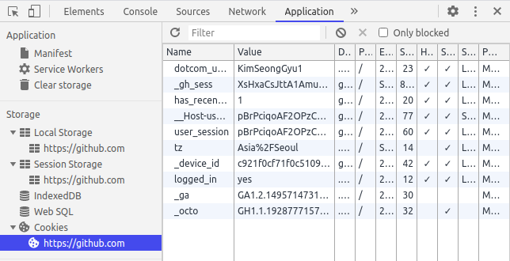
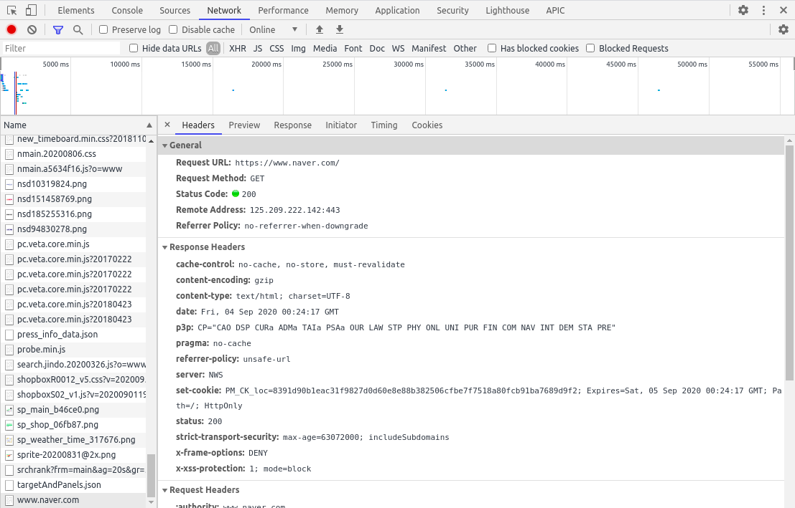
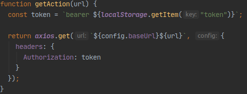

웹 서비스를 제공할 때 인증과 인가는 기본적으로 구현해야 하는 기능 중 하나입니다. 이를 구현하기 위해서 쿠키/세션을 이용할 수도 있고 토큰을 이용할 수 도 있는데, 토큰을 이용한다면 토큰을 어디에 저장해야 할지 생각해볼 필요가 있습니다.

웹 클라이언트에서 무언가를 저장하기 위해 사용하는 공간은 크게 쿠키와 웹 스토리지로 나눌 수 있습니다. 그리고 웹 스토리지는 다시 세션 스토리지와 로컬 스토리지로 나뉘어 집니다. 이는 크롬에서 개발자 도구를 통해 다음과 같이 확인할 수 있습니다.

이 중 토큰은 어디에 저장해야 적절한지 알아보기 위해 각각의 특성을 먼저 알아보겠습니다.

## 쿠키

쿠키는 HTTP 통신의 무상태성을 보완해주기 위해 나온 것으로 서버가 클라이언트에 값을 저장하고, 읽을 수 있도록 해줍니다. 이와 관련된 쿠키의 가장 중요한 특성은 서버에서 접근할 수 있으며, 자동으로 요청에 포함된다는 점입니다. HttpOnly 설정을 추가한다면 클라이언트의 접근은 완전히 차단해서 해커가 자바스크립트 코드를 통해 정보를 탈취하는 것을 방지할수도 있습니다.

다음은 네이버에 들어갔을 때 Response Header이며 set-cookie를 통해 클라이언트에 쿠키를 설정하는 것을 볼 수 있습니다. 이들은 따로 설정하지 않아도 자동으로 다음 요청에 같이 포함됩니다.

 
매우 작은 저장 공간(4KB)을 가지며 쿠키는 모두 일정 기간이 지나면 삭제됩니다. 만료 시점을 기준으로 크게 두 가지로 나뉘며, 브라우저가 종료되면 삭제되는 session cookies와 지정된 만료일에 삭제되는 persistent cookies가 있습니다. 

## 세션 스토리지

세션 스토리지는 session cookies와 비슷하다고 볼 수 있습니다. 말 그대로 세션을 위한 저장 공간이며 세션이 종료되면 모두 삭제됩니다. 쿠키와 다르게 서버에서 접근할 수 없기 때문에, 다음과 같이 클라이언트에서 스토리지의 값을 꺼내서 서버에 전달해주어야 합니다.

 
만약 여러 개의 탭을 사용하면 탭 별로 세션 스토리지를 사용합니다. 상당히 큰 저장 공간(5~10MB)을 가집니다. 

## 로컬 스토리지

로컬 스토리지는 persistent cookies와 비슷하다고 볼 수 있습니다. 다만 쿠키는 만료기간이 지나면 삭제되지만 로컬 스토리지의 데이터는 반 영구적으로 저장가능합니다. 세션 스토리지와 마찬가지로 서버에서 접근할 수 없기 때문에, 클라이언트에서 값에 접근해 서버에 전달하는 과정이 필요합니다. 로컬 스토리지도 상당히 큰 저장공간(5MB)을 가집니다.

## 그래서 어디에 저장하는 것이 좋을까?

보안이 크게 중요하지 않다면 로컬 스토리지는 나쁘지 않은 선택이 될 수 있습니다. 쿠키와 다르게 반 영구적으로 많은 저장 공간을 사용할 수 있기 때문에 처음에 한 번 인증만으로 다시는 인증을 하지 않아도 되도록 편하게 구현할 수 있습니다.

하지만 보안의 측면에서 웹 스토리지(로컬 스토리지 + 세션 스토리지)는 좋지 못하다고 할 수 있습니다. 웹 스토리지에 저장된 값은 javascript 코드를 통해 언제든지 접근할 수 있는데, 이는 웹 사이트에 악의적인 스크립트를 넣어 의도하지 않은 동작을 발생시키는 XSS(cross-site scripting)공격에 취약합니다.

반면 쿠키에 저장한 값은 HttpOnly 속성을 통해 javascript를 통한 접근을 막을 수 있습니다. 때문에 보안적인 측면을 생각한다면 웹 스토리지보다는 쿠키에 저장하는 것이 좋다고 할 수 있습니다.

### 참고자료

[Local Storage vs Session Storage vs Cookie](https://medium.com/@krishankantsinghal/local-storage-vs-session-storage-vs-cookie-22655ff75a8)

[스택 오버플로우](https://stackoverflow.com/questions/19867599/what-is-the-difference-between-localstorage-sessionstorage-session-and-cookies)

[how to securely store JWT tokens](https://dev.to/gkoniaris/how-to-securely-store-jwt-tokens-51cf)
