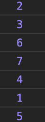
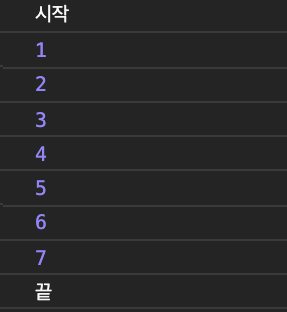

우아한테크코스 백엔드 과정을 하고 있는 필자는 프론트엔드(자바스크립트 및 기타등등) 왕초보다. 
초보가 우테코 내의 프로젝트를 하는 중, 루프를 통해서 요청에 대한 응답을 동기적으로 처리하려다가 발견한 사실이 있다.

우선 예시 코드를 살펴보자. 
api 요청과 유사하게, 실행될 때 마다 소요되는 시간이 다르도록 구현되어 있다.
```javascript
const delay = () => {
  const randomDelay = Math.floor(Math.random() * 4) * 100
  return new Promise(resolve => setTimeout(resolve, randomDelay))
}

const list = [1, 2, 3, 4, 5]
list.foreach(async data => {
  await delay()
    .then(() => console.log(data))
})
```
> 간단한 예시이므로 delay() 실행에 따른 각 결과를 출력해 보았다.
> 물론, 실 서비스 코드였다면 delay()는 api 요청에 관한 로직이었을 것이다!

`async`와 `await`을 붙였다. 그러니 당연히 처리 결과는 1, 2, 3, 4, 5 순서일 것이라고 생각했다.


어...? 생각한 대로 돌아가지 않는다. 그렇다... 날치기로 공부하다가 들켜버린것이다!

자 그럼 지금부터, 초보가 해결하지 못했던 
**반복문에서 비동기 처리를 동기적으로 처리**하는 방법에 대해 알아보자.

> 여기서, `비동기/동기`, `blocking/non-blocking` 에 대한 내용이 궁금하다면 [우아한테크코스 우의 테코톡](https://www.youtube.com/watch?v=IdpkfygWIMk) 영상을 참고하면 좋다.
> promise와 async/await에 대한 설명이 필요하다면 관련 [문서](https://developer.mozilla.org/ko/docs/Web/JavaScript/Reference/Operators/await) 등을 찾아보고 오면 좋을 것이다.
> 이 글에서는 위 개념들을 설명하지 않을 것이다.

코드를 얼핏 보면 기대했던 대로 동작할 것 같은데, 왜 요청이 처리되는 순서는 다를까?
```javascript
const list = [1, 2, 3, 4, 5]
list.foreach(async data => {
  console.log(data + " : 요청 시작")
  await delay()
    .then(() => console.log(data))
  console.log(data + " : 요청 끝")
})
```

위 코드에 대한 결과이다. 요청 자체는 리스트 요소 순서대로 이루어진다. 
익명함수 내의 실행 순서는 delay() 함수가 종료된 후 `console.log(data + " : 요청 끝")`가 실행되지만, 각 요소의 요청에 대한 처리 속도가 모두 다르기 때문에 delay()는 순서대로 끝나지 않는다. 콜백인자로 들어간 익명함수 전체를 기다려주지 않고, 익명함수 내에서만 동기처리가 된 것이다.
즉, async/await은 foreach안에서 사용할 수 없다.

그렇다면 리스트의 요소 순서대로 실행 결과를 얻으려면 어떻게 해야 할까?


### for ... of(for-loop)를 사용한다.
callback을 사용하는 foreach 대신 `for ... of` 문을 사용할 수 있다. (혹은 일반적인 for-loop)

```javascript
const result = async (list) => {
  for (const data of list) {
    await delay()
      .then(() => console.log(data))
  }
}

const list = [1, 2, 3, 4, 5, 6, 7]
result(list)
```

드디어 요청 순서대로 출력되는 것을 볼 수 있다.
for문은 각 요소(data)에 대해 delay()의 결과를 기다려 준 다음에야 그 다음 요소에 대한 delay()를 실행하기 때문이다.
그런데, 요청에 대한 응답을 받은 다음에야 다음 요청을 보내므로 리스트의 데이터가 많아질수록 더 많은 시간이 걸리게 된다. 더 빠른 방법은 없을까?


### map()과 Promise.all() 을 사용한다.
우선 이번에는 foreach가 아닌 map을 사용할것이다. 
두 함수는 callback을 사용한다는 점에선 같지만, await을 사용했을 때 foreach는 promise 배열을 반환하지 않고 undefined를 반환하는 반면, map은 promise 배열을 반환한다.
이 차이를 생각하고 아래 코드를 살펴보자.

```javascript
const loop = async (list) => {
  console.log("시작")
  const promises = list.map(async data => {
    return await delay()
      .then(() => data)
  })
  
  const results = await Promise.all(promises)
  results.forEach(data => console.log(data))
  console.log("끝")
}
  
const list = [1, 2, 3, 4, 5, 6, 7]
loop(list)
```

앞서 언급했듯이, map은 promise 배열을 반환하기 때문에 배열의 모든 promise가 통과할 때까지 기다려주는 `Promise.all()`을 사용했다.
map을 사용하게 되면, 비동기 요청의 시행 결과 순서가 아닌, 요청을 보낸 순서로 promise 배열이 반환된다. 각 요청을 기다리지도 않고, 끝나는 시간도 다르지만, 반환된 결과는 기존 리스트의 순서와 동일하다.

각각의 요청 결과를 기다리지 않고, 순차적으로 해결하지 않다는 점이 for문을 사용한 경우와 다르다. 그렇기 때문에 속도도 다를 수 밖에 없다.

왼쪽이 `for...of` 의 결과고, 오른쪽이 위의 결과이다.


### 상황에 맞게 쓰자!

배열을 순회하며 비동기 요청을 보내는 경우, 
1. 비동기적으로 처리되어도 상관 없다 : foreach 함수를 써도 된다.
2. 각각의 요청에 대해 모두 await을 해야 한다 : 기다려야 한다는 점에서 느리지만 for-loop를 사용하자
3. 요청이 끝나는 순서는 상관 없다 : map 함수를 통해 promise를 반환하자
