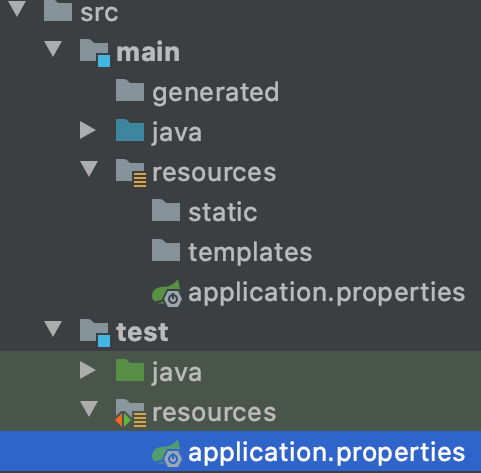

특정 데이터의 조회 기능을 구현하려는데 테스트에서 자꾸 의도와는 다른 데이터가 출력된다.
이런, `data.sql`을 통해 주입되고 있는 기본 데이터가 자꾸만 방해한다.
프로덕션 코드의 실행에는 필요하지만, 테스트에는 필요하지 않은 데이터인데...
어떻게 제거할 수 없을까?

## 테스트 환경 분리하기

`data.sql`이 적용되는 부분은 `application.properties`의 `spring.datasource.data`를 통해 제어할 수 있다.

`spring.datasource.data=`과 같이 data가 할당되는 부분을 아예 비워둔다면 더는 `data.sql`을 읽어 들이지 않을 것이다.
하지만 `data.sql`이 application에는 필요하다면?
매번 테스트마다 해당 설정을 넣었다가 테스트가 끝나고 뺄 수는 없는 노릇이다.
이제 mysql도 도입하기로 했는데...
테스트 때만 h2로 바꿨다가 다시 mysql로 돌리기도 이상하다.
무엇보다도, 매번 그러기에는 너무 귀찮다.

간단한 방법으로 귀찮음을 제거할 수 있다.

바로 테스트용 프로퍼티를 만들면 그만이다.

test 폴더 하위에 main 폴더와 같이 resources 폴더를 생성하자.
그 아래에 테스트에 필요한 설정을 담은 `application.properties`를 생성하면 끝난다.
이젠 테스트를 실행할 때 마다 매번 설정을 바꿔주지 않아도 된다.
테스트 시에는 알아서 `test/resources/application.properties`를 인식하고 실행할 것이다.
프로덕션 코드 실행 시에는 당연히 원래의 프로퍼티를 불러온다.


<p style="text-align:center;">( 테스트 환경 분리 끝! )</p>

여러 테스트를 진행 하다보니까 이번에는 특정 테스트만 조금 다른 설정이 필요해졌다.

`data.sql`의 데이터값은 잘 들어가는지도 테스트해보고 싶어졌다.
그럴 때는 별도의 설정이 들어간 프로퍼티 파일을 한가지 더 만들자.
이름은 `application-data.properties`라고 짓도록 하자.
마지막으로 별도 설정이 필요한 테스트를 위해 새로운 테스트 클래스를 만들어준다.

```java
@TestPropertySource(locations = "/application-data.properties")
@SpringBootTest
public class SpecialServiceTest {
  // ... 생략
}
```
<p style="text-align:center;">( 진짜로 테스트 환경 분리 끝! )</p>

이제 이 클래스 안에서는 우리가 `application-data.properties`안에서 설정한 것들이 적용될 것이다.

---

모든 테스트 코드가 잘 통과한다.

이제 프론트 페이지와의 연동은 잘 되었는지, 실제 작동은 잘 되는지를 확인해볼 차례다.  
프로덕션 코드를 실행시키고 테스트를 위해 nignx를 통해 8081포트에 페이지를 띄운다.

브라우저를 열어 확인하려는데 어째서인지 아무 데이터도 불러오질 못한다.
조심스레 브라우저의 콘솔 창을 열어보니 CORS 오류가 반긴다.

아차, 이번에는 Config 클래스에서 설정하는 CORS 개방 경로를 바꿔주질 않았다.

배포 서버에는 해당 서버의 8000포트에 CORS를 열어뒀는데, localhost는 적용이 안 되어있으니 바꿔줘야 한다.
하지만 매번 깜빡하니 일을 두 번씩 한다.
설정을 바꾸고, 켜져 있던 서버를 끄고, 다시 켠다.
여간 귀찮은 일이 아니다.
간단하게 스위치 켜듯 알아서 변경해주면 좋으련만...

## 배포 환경 별로 별도의 설정 적용하기

이번에는 `application-prod.properties` 파일을 생성하자.

`cors.url`을 기존의 `application.properties` 파일과 새로 만든 파일 둘 다에 필요한 값으로 작성한다.
`application.properties` 파일은 로컬 환경의 프로퍼티로, `application-prod.properties`는 배포 환경의 프로퍼티로 사용하자.
각각 `cors.url=` `*`, `https://dorandoran.io`의 값을 갖도록 한다.

```java
@Configuration
public class WebMvcConfig implements WebMvcConfigurer {

    @Value("${cors.url}")
    private String url;

    @Override
    public void addCorsMappings(CorsRegistry registry) {
        registry.addMapping("/**")
            .allowedOrigins(url)
            .allowedMethods("*");
    }
}
```

이제 아무 설정 없이 실행하면 `application.properties`의 `cors.url` 값인 `*`을 받아 모든 접근 경로에 대해 CORS 정책 해제해 줄 것이다.

배포 환경으로 실행할 때는 이제 `-Dspring.profiles.active=prod` 옵션을 붙여주도록 하자.
우리가 원한대로 특정 url에만 CORS 정책을 해제해 줄 것이다.

```
1. 유저 홈 디렉토리에 있는 spring-boot-dev-tools.properties
2. 테스트에 있는 @TestPropertySource
3. @SpringBootTest 애노테이션의 properties 애트리뷰트
4. 커맨드 라인 아규먼트
5. SPRING_APPLICATION_JSON 내부의 프로퍼티
6. ServletConfig 파라미터
7. ServletContext 파라미터
8. java:comp/env JNDI 애트리뷰트
9. System.getProperties() 자바 시스템 프로퍼티
10. OS 환경 변수
11. RandomValuePropertySource
12. JAR 밖에 있는 특정 프로파일용 application properties
13. JAR 안에 있는 특정 프로파일용 application properties
14. JAR 밖에 있는 application properties
15. JAR 안에 있는 application properties
16. @PropertySource
17. 기본 프로퍼티
```
<p style="text-align:center;">( 프로퍼티 적용 우선순위 )</p>

프로퍼티 적용 우선순위를 확인해보면, 기본 프로퍼티는 가장 하위에 있고 실행 시 적용하는 커맨드 라인 아규먼트는 보다 상위에 있다.
이 덕분에 우리는 `application.properties`를 로컬 환경으로 사용하고, 별도의 배포 환경에 `application-prod.properties`를 적용할 수 있는 것이다.

로컬 환경과 배포 환경을 분리했으니, 이젠 데이터베이스도 별도로 가질 수 있게 되었다.

더는 실행 시마다 개발 시의 설정인지 배포 시의 설정인지 확인하거나, 테스트 하는 동안 만든 데이터를 일일이 삭제할 필요가 없어졌다.

---

프로젝트가 조금씩 커가면서, 프로퍼티 안의 내용이 많아졌다.
Spring Security도 추가하면서 Github같은 외부에는 숨기고 싶은 설정들도 생겨났다.

프로퍼티를 조금 더 정갈하게 정리하고, 특정 부분은 `.gitignore`로 관리할 수는 없을까?

## 속성 별로 파일 분리하기

물론 가능하다.
`spring.profiles.include=` 속성을 사용하면, 프로퍼티 파일을 원하는 만큼 분리하고 한 번에 사용할 수 있다.

숨기고 싶은 Security 관련 설정을 위해 `application-security.properties` 파일을 만들자.
`application.properties` 안에 `spring.profiles.include=security`를 추가하면 끝!

`prod`같은 별도의 프로퍼티 파일이 있더라도, 기본 프로퍼티 파일이 적용된 후에 오버라이드 되는 형식이기 때문에 모든 실행 환경에 include가 적용될 것이다.
만약 특정 실행 환경에만 적용하고 싶다면 해당 실행 환경의 프로퍼티에만 include 속성을 적용하면 될 일이다.

---

참고 자료

[스프링 부트 개념과 활용](https://www.inflearn.com/course/%EC%8A%A4%ED%94%84%EB%A7%81%EB%B6%80%ED%8A%B8)
