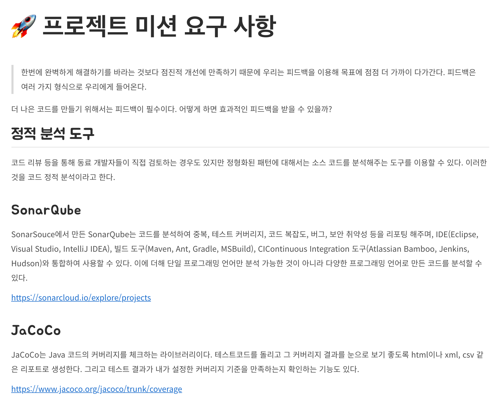

## 팀 프로젝트 요구 사항

우아한테크코스에서는 레벨 3,4 과정에서 팀 프로젝트를 진행하였습니다.

레벨 3에서 서비스를 구현했다면, 레벨 4에서는 구현한 서비스에 대한 유지보수를 진행하였습니다. 이때 유지보수와 더불어 서비스의 개선을 위한 몇 가지 요구 사항들이 주어졌습니다.



그 중에서는 위 이미지와 같이 정적 분석 도구를 도입하는 요구사항도 있었습니다. 해당 요구 사항에서는 공통적으로 '테스트 **커버리지**', '코드의 **커버리지**'가 눈에 띄었습니다.

그래서 이번 글에서는 **코드 커버리지**가 무엇인지, 그리고 왜 코드 커버리지를 체크해야 하는지에 대해 소개해보도록 하겠습니다.

<br/>

## 코드 커버리지(*Code Coverage*)란?

### 코드 커버리지(*Code Coverage*)

> In [computer science](https://en.wikipedia.org/wiki/Computer_science), **test coverage** is a measure used to describe the degree to which the [source code](https://en.wikipedia.org/wiki/Source_code) of a [program](https://en.wikipedia.org/wiki/Computer_program) is executed when a particular [test suite](https://en.wikipedia.org/wiki/Test_suite) runs. A program with high test coverage, measured as a percentage, has had more of its source code executed during testing, which suggests it has a lower chance of containing undetected [software bugs](https://en.wikipedia.org/wiki/Software_bug) compared to a program with low test coverage. - [wikipedia](https://en.wikipedia.org/wiki/Code_coverage)

코드 커버리지는 소프트웨어의 **테스트 케이스가 얼마나 충족되었는지를 나타내는 지표** 중 하나입니다. 테스트를 진행하였을 때 **'코드 자체가 얼마나 실행되었느냐'**는 것이고, 이는 **수치**를 통해 확인할 수 있습니다.

### 코드 커버리지는 어떻게 측정할까?

코드 커버리지는 소스 코드를 기반으로 수행하는 **화이트 박스 테스트**를 통해 측정합니다.

> **블랙 박스 테스트(*Black-box test*)**
>
> \- 소프트웨어의 **내부 구조나 작동 원리를 모르는 상태에서 동작을 검사**하는 방식이다.
>
> \- 올바른 입력과 올바르지 않은 입력을 입력하여 **올바른 출력이 나오는지 테스트**하는 기법이다.
>
> \- **사용자 관점**의 테스트 방법이라 볼 수 있다.
> 
> **화이트 박스 테스트(*White-box test*)**
>
> \- 응용 프로그램의 **내부 구조와 동작을 검사**하는 테스트 방식이다.
>
> \- 소프트웨어 **내부 소스 코드를 테스트**하는 기법이다.
>
> \- **개발자 관점**의 단위 테스트 방법이라 볼 수 있다.

그럼 측정하는 **기준**으로는 어떤 것들이 있을까요?

먼저 코드의 구조를 살펴보면 크게 **구문(*Statement*), 조건(*Condition*), 결정(*Decision*)**의 구조로 이루어져 있습니다. 코드 커버리지는 이러한 코드의 구조를 **얼마나 커버했느냐에 따라 측정기준이 나뉘게 됩니다.**

**구문(*Statement*)**

> **라인(*Line*) 커버리지**라고 부르기도 합니다.

**코드 한 줄이 한 번이상 실행**된다면 충족된다.

```java
void foo (int x) {
    system.out("start line"); // 1번
    if (x > 0) { // 2번
        system.out("middle line"); // 3번
    }
    system.out("last line"); // 4번
}
```

위의 코드를 테스트한다고 가정해보겠습니다. `x = -1`을 테스트 데이터로 사용할 경우, if 문의 조건을 통과하지 못하기 때문에 3번 코드는 실행되지 못합니다. 총 4개의 라인에서 1, 2, 4번의 라인만 실행되므로 **구문 커버리지**는 `3 / 4 * 100 = 75(%)`가 됩니다.

**조건(*Condition*)**

**모든 조건식의 내부 조건이 true/false**을 가지게 되면 충족된다.

```java
void foo (int x, int y) {
    system.out("start line"); // 1번
    if (x > 0 && y < 0) { // 2번
        system.out("middle line"); // 3번
    }
    system.out("last line"); // 4번
}
```

> **내부 조건**이라는 것이 헛갈릴 수 있는데 **조건식 내부의 각각의 조건**이라 생각하면 될 것 같습니다.
>
> 위 코드를 예시로 보면 모든 조건식으로는 2번 if 문이 있고, 그중 내부 조건은 조건식 내부의 `x > 0`, `y < 0`을 말합니다.

위의 코드를 테스트한다고 가정해보겠습니다. **조건 커버리지**를 만족하는 테스트 케이스로는 `x = 1, y = 1`, `x = -1, y = -1`이 있습니다. 이는 `x > 0` 내부 조건에 대해 `true/false`를 만족하고, `y < 0` 내부 조건에 대해 `false/true`를 만족합니다. 그러나 테스트 케이스는 if 문은 조건에 대해 **false만 반환**합니다. if 문의 조건을 통과하지 못하기 때문에 3번 코드는 실행되지 못합니다.

조건 커버리지를 기준으로 테스트를 진행할 경우, **구문 커버리지와 결정 커버리지를 만족하지 못하는 경우가 존재**할 수 있습니다.

**결정(*Decision*)**

> **브랜치(*Branch*) 커버리지**라고 부르기도 합니다.

**모든 조건식이 true/false**을 가지게 되면 충족된다.

```java
void foo (int x, int y) {
    system.out("start line"); // 1번
    if (x > 0 && y < 0) { // 2번
        system.out("middle line"); // 3번
    }
    system.out("last line"); // 4번
}
```

위의 코드를 테스트한다고 가정해보겠습니다. if 문의 조건에 대해 `true/false` 모두 가질 수 있는 테스트 케이스로는 `x = 1, y = -1`, `x = -1, y = 1`이 있습니다. 첫 번째 테스트 데이터는 `x > 0`과 `y < 0` 모두 `true`이기 때문에 if 문의 조건에 대해 **true를 반환**합니다. 두 번째 테스트 데이터는 `x < 0`에서 이미 `false`이기 때문에 if 문의 조건에 대해 false를 반환합니다. 모든 조건식에 대해 `true`와 `false`를 반환하므로 **결정 커버리지를 충족**합니다.

위의 세 가지 코드 커버리지 중에서 구문 커버리지가 가장 대표적으로 많이 사용되고 있습니다.

### 코드 커버리지가 왜 중요하죠?

지금까지 **코드 커버리지가 무엇인지 그리고 어떻게, 어떤 기준으로 측정하는지**에 대해 알아보았습니다.

코드 커버리지가 어떤 것인지 알게 되었다면, 이제 이런 의문이 들 수 있습니다.

> 코드 커버리지가 뭔지는 이제 알겠어요.
>
> 근데 코드 커버리지가 왜 중요하나요? 그리고 실제로 코드 커버리지를 많이 사용하는가요?

먼저 **코드 커버리지의 중요성**은 **테스트 코드의 중요성과 일맥상통**한다고 생각합니다.

> 테스트 코드의 중요성, 테스트 코드를 작성함으로써 얻을 수 있는 장점에 대해서는 [메서드 시그니처를 수정하여 테스트하기 좋은 메서드로 만들기](https://woowacourse.github.io/javable/2020-05-07/appropriate_method_for_test_by_parameter)을 참고해주시길 바랍니다. 

그렇다면 테스트 코드를 잘 작성하고 있는지는 어떻게 알 수 있을까요?

테스트 코드는 발생할 수 있는 **모든 시나리오에 대해 작성**되어야 합니다. 그런데 개발자도 사람인지라 테스트로 커버하지 못하는 부분이 발생할 수 있습니다. 비즈니스 코드는 때에 따라 매우 복잡하게 작성되기도 합니다. 단순한 분기문을 생각해보더라도 분기문의 조건에 들어갈 값이 1이 더 크고 작음에 따라 로직은 실행될 수도 있고 안될 수도 있습니다.

이렇게 테스트에서 놓칠 수 있는 부분들을 코드 커버리지를 통해 확인할 수 있습니다. 그리고 그에 따라 부족한 테스트를 추가할 수 있습니다. 코드 커버리지는 **휴먼 에러를 최대한 방지**할 수 있도록 도와주는 용도라고 생각해도 될 것 같습니다.

그럼 실제로도 코드 커버리지를 많이 사용하고 있을까요?

많은 서비스 기업에서는 테스트 코드의 중요성을 인지하고 **코드 커버리지를 최대한 유지 및 지속해서 상승**시키면서 개발을 하려고 노력합니다. 코드 커버리지 도구와 소나큐브(*SonarQube*)와 같은 **정적 코드 분석 도구**를 함께 활용하여 코드 커버리지가 기존보다 떨어지는 경우 커밋(*commit*)이 불가능하도록 제한하기도 합니다.

이처럼 코드 커버리지는 **코드의 안정성을 어느 정도 보장해 줄 수 있는 지표**이기 때문에 많은 프로젝트에서 커버리지를 확인하고 관리, 적용하려고 노력합니다.

## 정리하면

코드 커버리지의 중요성을 느끼기 위해서는 **테스트 코드의 중요성**을 먼저 느껴야 합니다. 테스트 코드의 중요성을 느끼고, 테스트 코드가 가지는 장점을 어떻게 더 잘 활용할 수 있을지에 대한 방법의 하나가 코드 커버리지라고 생각합니다.

기술(여기서는 코드 커버리지겠죠?)의 단순한 도입보다는 왜 이 기술을 도입하는지, 어떤 이유로 등장하고 필요로 하는지를 공부해보고 사용하는 습관을 기른다면 해당 기술을 더 **잘** 활용할 수 있으리라 생각합니다.

## 참고 링크

> - [코드 커버리지 - 위키백과]([https://ko.wikipedia.org/wiki/%EC%BD%94%EB%93%9C_%EC%BB%A4%EB%B2%84%EB%A6%AC%EC%A7%80](https://ko.wikipedia.org/wiki/코드_커버리지))
>
> - [화이트 박스 테스트 vs 블랙 박스 테스트 - 편하게 보는 전자공학 블로그](https://kkhipp.tistory.com/158)
>
> - [코드 커버리지(Code Coverage) - 박상수]([https://medium.com/@pakss328/%EC%BD%94%EB%93%9C%EC%BB%A4%EB%B2%84%EB%A6%AC%EC%A7%80-code-coverage-991e79da9e5f](https://medium.com/@pakss328/코드커버리지-code-coverage-991e79da9e5f))
>
> - [코드 커버리지(Code Coverage)란? - Nesoy Blog](https://nesoy.github.io/articles/2018-01/Code-Coverage)
>
> - [구조적 커버리지(Coverage)의 정의와 종류 - 슈어소프트테크](https://blog.naver.com/PostView.nhn?blogId=suresofttech&logNo=221833396343&parentCategoryNo=&categoryNo=155&viewDate=&isShowPopularPosts=false&from=postView)
