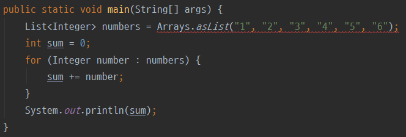

제네릭 클래스나 제네릭 메서드를 구현할 일이 거의 없어서 제네릭을 애매하게 알고 있었다. 나와 같은 상황인 초보 개발자분들도 많을 것 같아서 제네릭에 대해 정리하고자 한다. 모든 내용을 한 글에 담기는 너무 길어져서 이번 글은 기초적인 내용을 알아보고 기회가 된다면 다음 글에서는 조금 더 심화 내용을 알아보고자 한다.

---

## 제네릭 필요성

제네릭이란 JDK 1.5부터 도입한 클래스 내부에서 사용할 데이터 타입을 외부에서 지정하는 기법이다.

```java
// List interface
public interface List<E> extends Collection<E> {
    ...
}
```

```java
public static void main(String[] args) {
    List<String> words = new ArrayList<>();
}
```

우리는 이미 제네릭을 자주 사용하고 있다. 그렇다면 제네릭을 왜 사용할까? 간단한 예제를 통해 알아보자.

```java
public static void main(String[] args) {
    List numbers = Arrays.asList(1, 2, 3, 4, 5, 6);
    int sum = 0;
    for (Object number : numbers) {
        sum += (int) number;
    }
}
```

List에 있는 모든 숫자를 더하는 로직이다. List에 타입 지정을 안 했기 때문에 Object로 타입이 지정되고 더하는 부분에서 형 변환을 직접 해줘야 하는 번거로움이 있다. 위 예제에서는 형 변환을 한 번밖에 안 했지만 만약 타입 지정을 안 한 List가 사용되는 곳이 1000군데가 넘는다면 1000군데서 전부 예제처럼 직접 형변환을 해줘야 하는 번거로움이 있다.

아래와 같이 제네릭을 사용한다면

```java
public static void main(String[] args) {
    List<Integer> numbers = Arrays.asList(1, 2, 3, 4, 5, 6);
    int sum = 0;
    for (Integer number : numbers) {
        sum += number;
    }
}
```

불필요한 형 변환을 안 해도 되고 코드도 더 깔끔해진다.

또한 타입 안전성이 있다.

```java
public static void main(String[] args) {
    List numbers = Arrays.asList("1", "2", "3", "4", "5", "6");
    int sum = 0;
    for (Object number : numbers) {
        sum += (int) number;
    }
}
```

int형으로 형 변환을 해주며 더해주지만 List의 요소가 int형이라는 보장이 없다. 위 예제와 같이 List에 문자열을 넣어주어도 컴파일 에러가 발생하지 않고 런타임에 ClassCastException 이 터지게 된다. 컴파일 시 타입을 체크하고 에러를 찾아낼 수 있는 컴파일 언어의 장점을 발휘하지 못하는 셈이다.

제네릭을 사용했다면 아래와 같이 컴파일 시에 의도하지 않은 타입이 들어오는 걸 막을 수 있다.



---

## 타입 파라미터 컨벤션

제네릭에서 사용하는 타입 파라미터에 자주 봤던 T 같은 문자가 아니고 아무런 문자나 넣어도 코드가 동작하는 데는 문제가 없다.

```java
public class Car<DunDung> {
    private final DunDung name;
    ...
}
```

하지만 타입 파라미터에도 컨벤션이 존재한다. 컨벤션을 왜 지켜야 하는지는 다들 잘 아실 것이다. 기억이 안 난다면 [Code Conventions for the Java Programming Language](https://www.oracle.com/java/technologies/javase/codeconventions-introduction.html#16712) 글의 Why Have Code Conventions 부분을 보자.

그래서 타입 파라미터 컨벤션은 아래와 같다.


제네릭 클래스나 메서드를 구현할 일이 있다면 컨벤션에 맞춰서 구현하자!

---

## 제네릭 메서드

제네릭 타입을 메서드 리턴 타입 앞에 선언한 메서드를 제네릭 메서드라 한다.

```java
public class Car<T> {
    private final T name;

    private Car(T name) {
        this.name = name;
    }

    public static <M> Car<M> from(M name) {
        return new Car<>(name);
    }

    public <M> void printEqualsCar(Car<M> car) {
        System.out.println(this.equals(car));
    }
}
```

위와 같은 Car 클래스에서 from 메서드와 printEqualsCar 메서드가 제네릭 메서드이다. 이해를 돕기 위해 제네릭 메서드 타입을 컨벤션에 맞지 않게 `<M>`으로 정한 점을 이해해주시길 바란다.

제네릭 메서드 타입 `<M>`를 리턴 타입 앞에 붙여서 표시하므로 헷갈릴 수 있는데 메서드 리턴 타입과 제네릭 타입은 관계가 없다. 어떤 제네릭 타입을 사용할지를 리턴 타입 앞에 붙여서 컴파일러에게 알려줄 뿐이다.

또한 클래스에 선언한 `<T>`와 제네릭 메서드에 붙인 `<M>`과는 관련이 없다. 제네릭 메서드에 붙인 `<M>`과 같은 타입은 해당 메서드에서만 적용되는 제네릭 타입이다.

제네릭 메서드를 사용하려면 반드시 리턴 타입 앞에 해당 메서드에서 어떤 제네릭 타입을 사용할 것인지를 붙여줘야 한다는 것을 기억하자. 아래와 같은 형태는 컴파일 에러가 난다.

```java
public static Car<M> from(M name) {    // 컴파일 에러
    return new Car<>(name);
}
```

마지막으로 제네릭 클래스가 아닌 일반 클래스에서도 제네릭 메서드를 사용할 수 있다는 점을 기억하자.

---

## 제한된 제네릭

제네릭은 원하는 타입이 있을 때도 모든 타입이 들어올 수 있는 문제가 있다.

```java
public class Car<T> {
    private final T name;

    public Car(T name) {
        this.name = name;
    }
    ...
}
```

위와 같은 Car 클래스 인스턴스 변수 name은 문자 관련 타입 지정되기를 원해도 아래와 같이 아무 타입이나 들어올 수 있다.

```java
public static void main(String[] args) {
    Car<Integer> car = new Car<>(1);
}
```

이럴 때 타입 뒤에 extends 키워드를 사용해 타입을 제한시킬 수 있다.

```java
public class Car<T extends CharSequence> {
    private final T name;

    public Car(T name) {
        this.name = name;
    }
    ...
}
```

CharSequence 인터페이스 하위 객체들만 데이터 타입으로 지정할 수 있게 함으로써 인스턴스 변수 name에 문자열 관련 타입만 지정할 수 있게 되었다.

```java
public static void main(String[] args) {
    Car<String> car = new Car<>("sports");
}
```

아래와 같이 Collections.sort에서도 제한된 제네릭을 사용하고 있다.

```java
public static <T extends Comparable<? super T>> void sort(List<T> list) {
    list.sort(null);
}
```

정렬하기 위해서 List에 지정될 타입 T를 Comparable 인터페이스 하위 타입으로 제한시킨 것이다.

---

## 다음 글에서는..

이번 글에서는 제네릭을 왜 사용해야 하는지와 제네릭으로 구현된 클래스 및 메서드를 읽을 때 필요한 기초적인 내용을 알아보았다. 자바 문법을 배울 때 스쳐 지나갔던 제네릭이 공부할수록 깊은 내용이 많고 모르는 내용도 많다는 것을 느꼈다. 다음 글에서는 이 글에서 못 다룬 wild card와 Type erasuer 그리고 제네릭을 사용할 때의 주의사항 등을 살펴볼 예정이다.

---

### 참고 자료

-   [The Basics of Java Generics -Baeldung](https://www.baeldung.com/java-generics)
-   [\[10분 테코톡\] 💫두강의 Generics](https://www.youtube.com/watch?v=n28M8iryFPw)