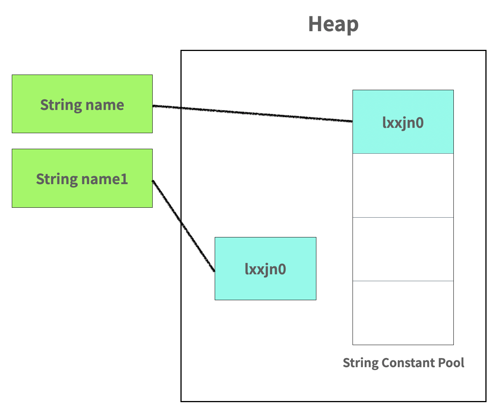
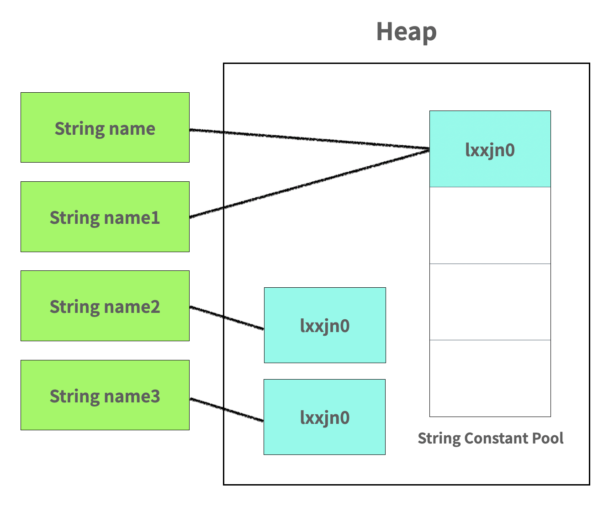
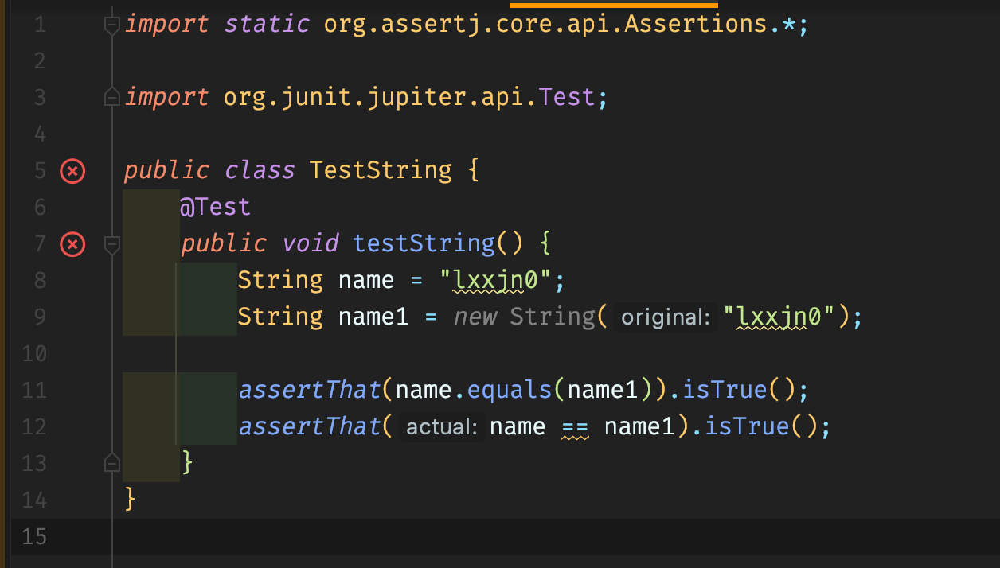
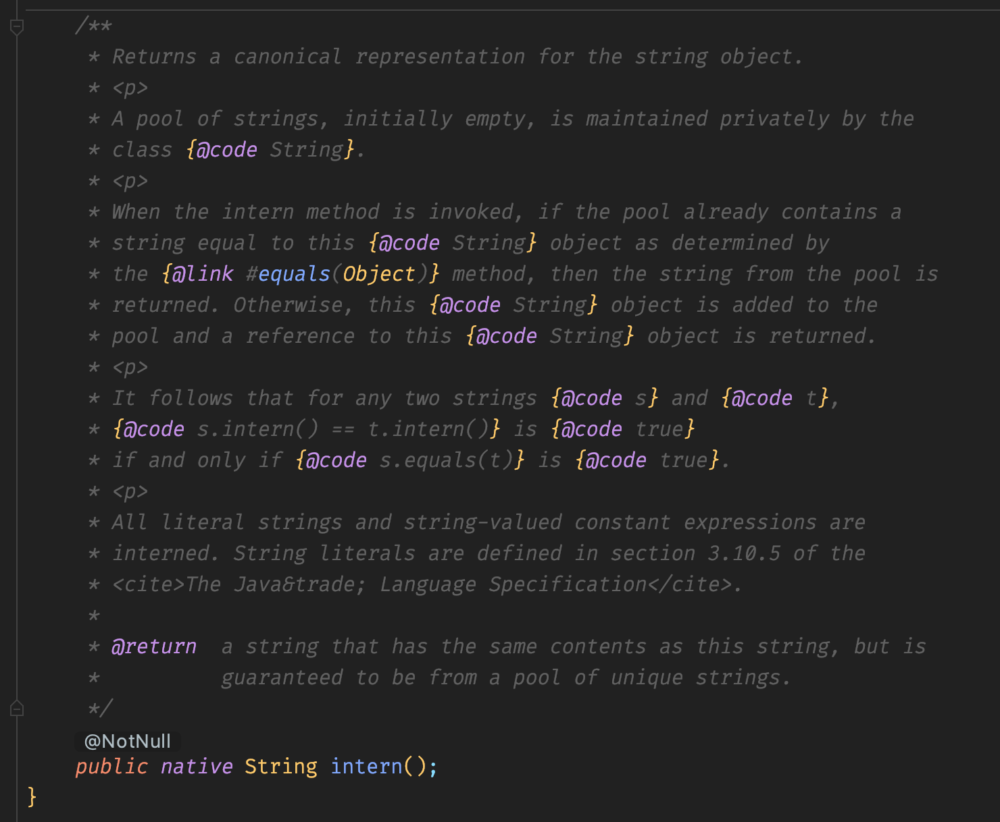

## 문자와 문자열

자바 프로그램이 실행되는 동안 가장 많이 생성되는 객체가 무엇인지 아는가? 그것은 바로 **문자열(*String*)** 객체이다.

> 문자열은 문자의 배열이다. "abc"라는 문자열은 'a','b','c'라는 문자를 나열한 배열인 것이다.

자바는 객체 지향 프로그래밍이고 기본으로 제공하는 **Primitive Type**이 아닌 나머지는 모두 **객체**로 구성되어 있다.

> Java에서 Primitive Type 값은 byte, short, int, long, float, double, char, boolean, void 가 있다.
>

그렇다면 문자열은 마냥 다른 객체들과 똑같을까?

**그렇지 않다!**

그 차이점은 `String name = "lxxjn0"`과 `String name = new String("lxxjn0")`의 차이점을 알아보면서 하나씩 확인하도록 하자.

## Java의 문자열

### 문자열의 생성 방법, new 그리고 리터럴

평소에 일반적으로 객체를 생성할 때는 new 키워드를 사용하여 객체를 생성한다.

그러나 특이하게도 문자열은 **new** 연산자가 아니라 바로 값을 할당할 수 있는데 이를 **문자열 리터럴**이라 부른다.

```java
public void string() {
    String name = "lxxjn0"; // 문자열 리터럴 생성
    String name1 = new String("lxxjn0"); // new 연산자를 이용한 문자열 생성
}
```

겉으로 보기에도 문법적인 차이가 있지만 실제 메모리에 할당되는 영역에도 차이가 있다.

첫 번째 방법인 **new 연산자**를 이용하여 문자열 객체를 생성하면 일반 객체들처럼 메모리의 **Heap 영역에 할당**되고 두 번째 방법인 **리터럴**을 이용하여 생성하면 **String Constant Pool이라는 영역에 할당**된다.

> 참고로 String Constant Pool의 위치는 Java 7부터 Heap 영역으로 옮겨졌다.
>
> Java 7 이전 버전에서는 Perm 영역에 존재했다. Perm 영역은 주로 메타 데이터를 저장하는 영역으로 사용되었는데 GC의 대상에서 제외되는 영역이었다.
> 
> 하지만 Java 8에 들어오면서 Perm 영역은 삭제되고 String Constant Pool은 Heap의 영역으로 이동되었다.
>
> Heap 영역은 GC의 대상이기 때문에 String Constant Pool에서 참조를 잃은 문자열 객체들은 다시 메모리로 반환된다.



여기서 한번 더 new 연산자와 리터럴을 사용해서 객체를 생성해보자.

> 메모리 상의 모습을 잘 확인하기 위해 리터럴 문자열과 new 연산자 문자열끼리 모아서 선언하였다.

```java
public void string() {
    String name = "lxxjn0";
    String name1 = "lxxjn0";
    String name2 = new String("lxxjn0");
    String name3 = new String("lxxjn0");
}
```

이 코드를 실행시키면 문자열이 저장되는 메모리의 모습은 아래와 같다.



문자열 리터럴을 사용하여 생성한 객체인 `name`과 `name1`은 **String Constant Pool 내의 동일한 객체**를 바라본다.

하지만 new 연산자를 사용하여 문자열을 생성한 `name2`와 `name3`는 **Heap에 서로 다른 객체**를 만들고 바라본다.

> 아래는 참고 자료로 문자열 리터럴과 new 연산자를 사용할 경우 컴파일 된 class 코드이다.
>
> ```java
> public void testString() throws Exception {
>     String abc = "abc";
> }
>
> public void testNewString() throws Exception {
>     String newAbc = new String("abc");
> }
> ```
>
> ```java
>  public void testString() throws java.lang.Exception;
>     Code:
>        0: ldc           #89                 // String abc
>        2: astore_1
>        3: return
>
>   public void testNewString() throws java.lang.Exception;
>     Code:
>        0: new           #33                 // class java/lang/String
>        3: dup
>        4: ldc           #89                 // String abc
>        6: invokespecial #93   // Method java/lang/String."<init>":(Ljava/lang/String;)V
>        9: astore_1
>       10: return
> ```

### 문자열의 비교 방법, equals 그리고 동등 비교 연산자(==)

그렇다면 우리는 문자열을 비교할 때 어떻게 비교할까?

주로 `equals()`메서드를 사용하거나 동등 비교 연산자인 `==`를 사용한다.

위 코드를 바탕으로 값을 비교하면 어떤 결과가 나올까?




코드를 직접 실행한 결과, `equals()`메서드는 true를 반환하고 `==`는 false를 반환하여 테스트에 통과하지 못하였다.

Java String의 `equals()`메서드 코드를 살펴보면 아래와 같다.


실제 **동일한 주솟값을 가지는 객체**이거나 문자열 내부의 **값(문자들)이 동일할 경우** true를 반환한다.

그래서 new 연산자로 생성한 문자열과 리터럴로 생성한 문자열은 내부의 값은 같아서 `equals()`는 true를 반환하지만 실제 주소를 비교하는 `==`는 false를 반환한 것이다.

> 동등 비교 연산자인 `==`는 실제 객체가 가지고 있는 주솟값을 비교하는 연산자이다. 물론 Primitive Type의 경우 객체가 아니기 때문에 값을 비교하는 것과 마찬가지이다.

다시 본론으로 돌아와서, 결국 new 연산자로 생성된 문자열과 리터럴로 생성된 문자열이 서로 다른 주소를 가지고 있다는 것을 테스트 코드를 통해 확인하였다.

그렇다면 리터럴 방식은 어떻게 구현되어 있는 것일까?

### 문자열 리터럴에 대하여

문자열 리터럴의 경우 내부적으로 String의 `intern()` 메서드를 호출한다고 한다.



`intern()`메서드는 String Constant Pool에 생성하려는 문자열이 **이미 존재할 경우 주솟값을 반환**하고 **없다면 새로 객체를 생성한 후 주솟값을 반환**한다.

`intern()`메서드를 사용하여 코드를 테스트를 해보면 아래와 같다.


기존에 new 연산자로 생성한 문자열 `name1`에 대해 `intern()`메서드를 실행하면 `name1`의 값과 동일한 문자열이 String Constant Pool에 있는지 확인할 것이다.

String Constant Pool에는 이미 `name`으로 인해 생성된 객체가 있을 것이기 때문에 `name`이 가리키는 주소와 동일한 주솟값이 `internName`에 할당되었을 것이다.

그래서 해당 테스트는 동일한 주솟값을 가지는 문자열이기 때문에 테스트를 통과할 수 있었다.

### 문자열은 Immutable!

문자열 리터럴은 상수로서 **불변**이다. 이러한 특성 덕분에 참조하려는 문자열이 같다면 동일한 객체를 참조할 수 있는 것이다.

자바 소스 파일(.java)이 클래스 파일(.class)로 컴파일되고 JVM(*Java Virtual Machine*)에 올라갈 때, JVM은 String Constant Pool에 동일한 문자열이 있는지 확인하고 이미 존재한다면 재사용을 하고 없는 경우 새로운 문자열을 만든다.

그렇기 때문에 여러 레퍼런스가 같은 문자열 리터럴을 참조하더라도 영향이 없어야하고 문자열 리터럴은 **불변(*immutable*)**하기 때문에 thread-safe하다.

추가적으로 String으로 연산을 할 경우 문자열이 변경되면 기존의 객체가 불변이기 때문에 새로운 객체를 만들고 해당 객체를 참조하도록 한다.

이는 기존 문자열의 참조가 사라지는 것이고 이는 **가비지 컬렉터(*Garbage Collector*)**의 수집 대상이 된다.

> Java의 String은 성능의 최적화를 위해 문자열 연산의 경우 내부적으로 **StringBuilder**를 사용한다.
>
> StringBuilder에 대해 자세히 알고 싶다면 둔덩의 [String 클래스를 조심히 사용하자](https://woowacourse.github.io/tecoble/post/2020-06-15-String-vs-StringBuilder-vs-StringBuffer)를 참고하도록 하자.

## 정리하면

Java 문자열은 생성 방법에 따라서 성능적인 차이를 만들 수도 있다는 것을 알게 되었다.

자바에서 가장 많이 사용되는 객체인 만큼 내부적으로 어떻게 동작되는지 이해하고 사용한다면 더 나은 코드를 작성하는 데 도움이 될 것이다.

> 그래서 결론은 **문자열 리터럴**을 사용하고 new 연산자를 통한 생성은 되도록 지양하도록 하자!

## 참고 링크

> [자바의 String 객체와 String 리터럴 - MadPlay's MadLife](https://madplay.github.io/post/java-string-literal-vs-string-object)
>
> [[Java] String="" vs new String("")의 차이 - Namjun Kim](https://ict-nroo.tistory.com/18)
