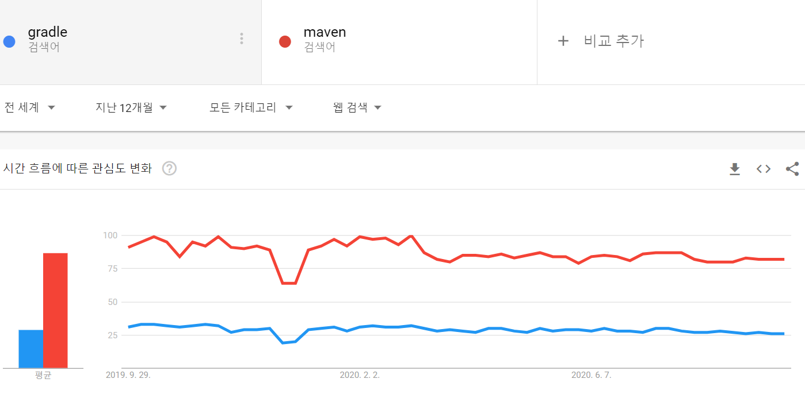

프로젝트를 진행하려고 할 때, 자바 빌드 도구를 선택해야 하는 순간은 찾아오기 마련이다. Gradle이 좋다는 말은 많이 들리는데, 전체적인 사용률은 Maven이 앞선다. Google Trands 지수로 Maven과 Gradle의 전세계 검색 통계를 보자.



위 사진처럼 Google Trands 지수도 Maven이 Gradle을 훨씬 앞서는 상황이다.

그렇다면 우리는 어떤 빌드 도구를 선택해야 할까? 이 글을 통해 간단히 알아보자..

---

## 빌드 도구란?

빌드 도구를 알기 위해선 빌드라는 용어부터 알아야 한다.

빌드란 소스 코드를 컴파일, 테스트, 정적분석 등을 실행하여 실행 가능한 애플리케이션으로 만들어주는 과정이다. 그리고 이 빌드를 도와주는 도구가 빌드 도구이다.

빌드 도구는 계속해서 늘어나는 라이브러리를 자동 추가 및 관리해준다. 시간이 흐르면 라이브러리 버전을 자동으로 동기화 해주기도 한다.

다양한 개발이 가능해지면서 필요한 라이브러리도 많아지게 되었다. 이 많은 라이브러리를 직접 다운받고 추가하는 방법도 있지만 번거로움과 개발자들 간의 버전관리, 다운받은 jar 파일의 보안 위험 등의 문제가 있었다. 그래서 탄생한 것이 빌드 도구이다.

---

## Maven, Gradle 이전의 빌드 도구

#### Make

-   자바 초기에 사용했던 빌드 도구는 Make이다. Make를 사용했던 이유는 간단하다. 사용할 수 있는 빌드 자동화 도구가 Make밖에 없었다.
-   하지만 C언어로 만들어진 Make를 자바 빌드 도구로 사용하기에는 많은 제약이 뒤따랐다. 시간이 흐르면서 자연스럽게 Apache Ant를 사용하게 되었다.

#### Apache Ant

-   Apache Ant는 많은 부분이 Make와 비슷하며 누구나 사용할 수 있을 만큼 간단하다. 가장 큰 장점은 유연성인데 프로젝트 디렉터리 구조나 기본 동작과 같은 **공식적인 규약**을 따로 가지고 있지 않기 때문이다.
-   Ant는 정해진 규약이 없는 만큼 무엇을 하고 언제 해야할 지 정확히 코딩해줘야만 했다. 이는 프로젝트 구조가 복잡해질수록 Build 과정을 이해하기 어렵게 만들었고 유지보수가 어려운 거대한 XML 빌드 파일을 가지게 만들었다. 이러한 단점을 극복하고자 Ant를 만들었던 Apache에서 Maven이 탄생하게 된 것이다.

이 글에서는 Maven과 Gradle을 중점적으로 다루고 싶었기에 Make와 Apache Ant는 아주 간단히 알아보았다. 강조하고 싶은 것은 Apache Ant는 작성 규칙이 따로 없기 때문에 유연하다는 것이다. 더 자세히 알아보고 싶다면 글의 마지막 참고 자료들을 통해 알아보는 것을 추천한다.

---

## Maven

Maven은 Ant처럼 XML 파일을 계속 사용하지만 유지 보수하기 쉬운 방식을 사용한다. Ant에 없던 **공식적인 규약**을 추가해준 것이다. Ant가 유연성을 가지고 모든 것을 처음부터 작성해야 했다면 Maven은 규칙과 사전에 정의된 명령을 토대로 빌드가 수행하는 작업에 집중할 수 있게 했다.

게다가 Ant에서는 할 수 없었던 필요한 라이브러리를 자동으로 불러오고 관리하는 기능을 Maven에서는 추가했다. 필요한 라이브러리를 pom.xml 이라는 Maven 구성 파일에 아래와 같이 작성만 해주면 끝이다.

```xml
<dependency>
    <groupId>org.springframework.boot</groupId>
    <artifactId>spring-boot-starter-web</artifactId>
</dependency>
```

Maven은 빌드 파일이 표준화됨으로써 유지 보수가 가능해지고 Ant보다 빌드 시간이 훨씬 더 적게 걸리기 때문에 매우 유명해졌다. 이때부터 지금까지 많은 프로젝트가 Maven으로 만들어지면서 현재까지 Maven이 압도적으로 많이 사용되고 있다.

하지만 Maven의 pom.xml은 Ant보다는 표준화되었지만 여전히 복잡하고 거대하다. 게다가 Ant의 장점인 유연성이 Maven의 엄격한 규칙, 정형화된 빌드 시스템으로 인해 사라졌다. 다시 말해서 유지 보수 가능한 XML 빌드 파일을 만들었지만 유연성은 사라진 것이다.

그리고 2012년 Ant의 장점, Maven의 기능을 결합한 Gradle이 출시했다.

---

## Gradle

Gradle은 기존의 빌드 도구와는 다르게 XML 파일을 사용하지 않았다. JVM 위에서 동작하는 [Groovy](https://ko.wikipedia.org/wiki/%EC%95%84%ED%8C%8C%EC%B9%98_%EA%B7%B8%EB%A3%A8%EB%B9%84)나 Kotlin을 통해 작성한다. 이로 인해 많은 차이점을 불러오게 됐다.

이 글에서는 눈에 띄는 차이점 몇 가지만을 알아보고 자세한 차이점은 [Gradle 공식문서의 Maven과의 비교 글](https://gradle.org/maven-vs-gradle/)을 통해 알아보는 것을 추천한다.

### 유연함

동적인 스크립트로 설정 파일을 작성함으로써 Ant의 유연함을 가져왔다.

Maven의 pom.xml은 선언형으로 설정하는 정적인 문서이다. 반면에 Gradle의 build.gradle은 스크립트로 작성하는 동적인 소스 파일이다. 즉 Maven은 정적인 문서와 엄격한 규칙으로 인해 어떤 설정이 필요할 때 한계가 있지만 Gradle은 로직을 넣을 수 있으니 한계가 없다. 필요하다면 로직 안에 플러그인을 호출하거나 직접 코드를 짜면 된다.

### 가독성

가장 많이 알려진 가독성을 살펴보자. 동일한 의존성을 가진 SpringBoot 프로젝트를 Maven과 Gradle로 각각 만들어봤다.

```xml
// Maven

<?xml version="1.0" encoding="UTF-8"?>
<project xmlns="http://maven.apache.org/POM/4.0.0" xmlns:xsi="http://www.w3.org/2001/XMLSchema-instance"
         xsi:schemaLocation="http://maven.apache.org/POM/4.0.0 https://maven.apache.org/xsd/maven-4.0.0.xsd">
    <modelVersion>4.0.0</modelVersion>
    <parent>
        <groupId>org.springframework.boot</groupId>
        <artifactId>spring-boot-starter-parent</artifactId>
        <version>2.3.3.RELEASE</version>
        <relativePath/> <!-- lookup parent from repository -->
    </parent>
    <groupId>com.example</groupId>
    <artifactId>demo</artifactId>
    <version>0.0.1-SNAPSHOT</version>
    <name>demo</name>
    <description>Demo project for Spring Boot</description>

    <properties>
        <java.version>1.8</java.version>
    </properties>

    <dependencies>
        <dependency>
            <groupId>org.springframework.boot</groupId>
            <artifactId>spring-boot-starter-web</artifactId>
        </dependency>

        <dependency>
            <groupId>org.springframework.boot</groupId>
            <artifactId>spring-boot-starter-test</artifactId>
            <scope>test</scope>
            <exclusions>
                <exclusion>
                    <groupId>org.junit.vintage</groupId>
                    <artifactId>junit-vintage-engine</artifactId>
                </exclusion>
            </exclusions>
        </dependency>
    </dependencies>

    <build>
        <plugins>
            <plugin>
                <groupId>org.springframework.boot</groupId>
                <artifactId>spring-boot-maven-plugin</artifactId>
            </plugin>
        </plugins>
    </build>

</project>
```

```
// Gradle

plugins {
    id 'org.springframework.boot' version '2.3.3.RELEASE'
    id 'io.spring.dependency-management' version '1.0.10.RELEASE'
    id 'java'
}

group = 'com.example'
version = '0.0.1-SNAPSHOT'
sourceCompatibility = '1.8'

repositories {
    mavenCentral()
}

dependencies {
    implementation 'org.springframework.boot:spring-boot-starter-web'
    testImplementation('org.springframework.boot:spring-boot-starter-test') {
        exclude group: 'org.junit.vintage', module: 'junit-vintage-engine'
    }
}

test {
    useJUnitPlatform()
}
```

한 눈에 봐도 길이에서부터 차이가 나지 않는가? Gradle은 Maven보다 더 간략하게 표현할 수 있다. 프로젝트에 설정이 많아지면 많아질수록 그 차이는 더 크게 체감될 것이다. 가독성과 길이는 곧 프로젝트 유지 보수와 직결된다.

### Configuration Injection

멀티 모듈 프로젝트에서 설정 정보를 변수에 값을 넣는 형태로 필요한 모듈에만 주입하는 Configuration Injection 방식을 사용해서 Maven에서 공통 모듈을 상속할 때의 단점을 커버했다.

Gradle은 루트 모듈에 아래와 같이 작성해서 해당 설정이 필요한 서브 모듈에만 설정을 주입할 수 있다.

```
def myProjects = [project(":project1"), project(":project2")]

configure(myProjects) {
    task helloTask << {
        println "Run task"
    }
}
```

만약 Configuration Injection을 사용하지 않는다면 두 가지 방법이 있을 것이다.

1.  루트 모듈에 해당 설정을 추가: 해당 설정이 필요 없는 서브 모듈에도 전부 적용, 다른 서브 모듈에서 쓸모없는 의존성을 가지게 됨
2.  해당 설정이 필요한 서브 모듈에 각각 적용: 똑같은 코드가 중복, 코드 중복으로 인한 문제점

Maven에서 위와 같은 문제를 해결하기 위해서는 부모 프로젝트를 하나 따로 생성해서 상속하는 번거로운 과정을 거쳐야 한다. 상속의 문제점은 덤이다. 반면 Gradle의 Configuration Injection은 이러한 문제점을 해결해줌으로써 더 편하게 멀티 모듈 프로젝트를 구성할 수 있게 해 준다.

### 성능

Gradle의 빌드 속도는 Maven보다 거의 모든 시나리오에서 두 배 이상 빠르다고 공식 문서에 기재되어있다. Gradle의 빠른 빌드 속도에는 크게 세 가지 이유가 있다.

1.  Incremental Builds(점진적인 빌드) : Gradle은 빌드 실행 중 마지막 빌드 호출 이후에 task의 입력, 출력 혹은 구현이 변경됐는지 확인한다. 최신 상태로 간주하지 않는다면 빌드는 실행되지 않는다.
2.  Build Cache: task가 이미 다른 컴퓨터에서 실행된 경우 Gradle은 로컬 실행을 건너뛰고 빌드 캐시로부터 작업의 결과물을 가져올 수 있다. 이전에 생성된 task의 결과물을 재사용할 수도 있다. (대규모 프로젝트에서 빌드 캐시를 사용했을 때는 Maven보다 백 배 더 빠르다고 기재돼있다.)
3.  Gradle Daemon: 빌드하는 인스턴스를 유지, 빌드가 끝난뒤에도 사라지지 않고 백그라운드에서 대기한다. 즉 Gradle을 빌드할 때마다 초기화해야 하는 시간을 단축할 수 있다.

빌드 속도는 생산성과 직결되는 중요한 요소이다.

---

## 결론

학습하고 자료를 찾아보며 확실히 요즘은 Gradle이 대세인 것을 느꼈다. Android OS의 빌드 도구로 Gradle을 채택한 것도 중요한 포인트이다.

Gradle 편향적인 글로 보일 수도 있겠지만 아직까지 Maven을 사용한 프로젝트가 압도적으로 많다. 그만큼 참고 자료도 많고 문제를 해결하기도 쉬울 것이다. 학습 곡선도 비슷비슷하다고 생각한다. 속도를 따질 거면 make를 사용하라는 글도 보았다.

항상 하는 말이지만 어떤 것을 사용해야 한다는 정답은 없는 것 같다. 프로젝트 구성원들이 전부 Maven을 사용할 줄 알고 Gradle은 소수만 사용할 줄 안다면 Gradle을 사용하는 게 무조건 옳은 방법이진 않을 것이다. 또 레퍼런스가 많이 필요한 낯선 프로젝트에서는 Maven을 사용하는 게 유리할 수도 있다. 중요한 것은 정답을 정해놓지 말고 어떤 것을 사용하는 게 더 좋을지 잠시라도 고민해보는 것이 아닐까 생각한다.

마지막으로 참고 자료를 찾아 헤매다 만난 여러 생각을 하게 해주는 글을 공유하며 글을 마친다.

> Maven is not a perfect tool (nor is Gradle for that matter), we all have heard the Maven/Gradle bashing from colleagues (or ourselves) at some point in our developer career. Instead of spending time raging about the state of the tools, what if we used that energy to create something positive?

---

#### 참고 자료

-   [ant-maven-gradle -Baeldung](https://www.baeldung.com/ant-maven-gradle)
-   [Gradle vs Maven Comparison -Gradle](https://gradle.org/maven-vs-gradle/)
-   [Maven vs Gradle -OKKY](https://okky.kr/article/757010?note=2052250)
-   [Multi-module project builds with Maven and Gradle -ANDRES ALMIRAY](http://andresalmiray.com/multi-module-project-builds-with-maven-and-gradle/)
