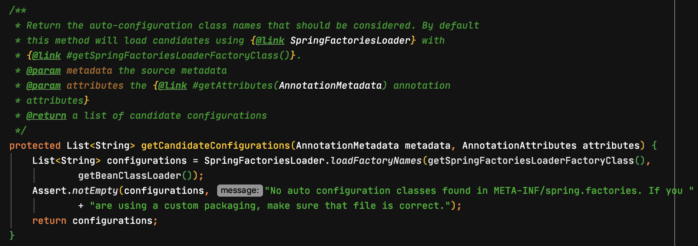

Spring Boot를 사용하면 자연스럽게 Spring Bean을 직접 생성하고 사용할 일이 많아진다. 따라서 우리는 Spring Bean을 생성하는 방법은 당연히 알고 있어야 하고 더 나아가 어떠한 방식으로 등록되는지 알고 있어야 한다. 

이 글에서 개발자가 생성하거나 Spring Boot가 제공하는 Spring Bean을 어떻게 사용할 수 있게 되는지 간략하게 알아보도록 하자.

## Spring Bean을 만드는 방법

개발자가 직접 Spring Bean을 만드는 방법은 두 가지가 있다.

`@Component` 어노테이션을 이용하는 방법과 `@Bean` 어노테이션을 이용하는 방법이다.

`@Component` 어노테이션의 경우 아래와 같이 클래스에 명시해 주면 된다. 

```java
@Component
public class MyCustomComponent {
    private final String name = "my custom component";
}
```

`@Bean` 어노테이션은 아래와 같이 `@Configuration`이 등록된 클래스 내부 메서드에 명시해 주면 된다.

```java
public class MyCustomBean {
    private final String name = "my custom bean";
}
```

```java
@Configuration
public class MyBeanConfiguration {
    @Bean
    public MyCustomBean myCustomBean() {
        return new MyCustomBean();
    }
}
```

## Spring Bean의 등록

그렇다면 개발자가 작성하거나 Spring Boot가 제공하는 Spring Bean은 어떻게 등록되는 것일까?  

Spring Bean이 등록되는 방법은 두 가지가 있다.  

Component Scan과 Auto Configuration 방식이다.

### Component Scan

component scan 방식은 이름에서 알 수 있듯 `@Component` 어노테이션이 작성된 클래스를 Spring Bean으로 등록하는 방식이다. 그리고 `@Bean` 어노테이션을 이용해서 반환하는 객체들도 Spring Bean으로 등록을 한다.

이렇게 `@Component` 어노테이션과 `@Bean` 어노테이션을 사용하기만 했는데 자동으로 Spring Bean으로 등록되고 사용할 수 있는 이유는 `@ComponentScan`이 동작하기 때문이다.

개발자가 프로젝트를 생성하고 `@Component`, `@Bean` 어노테이션을 사용은 했지만 `@ComponentScan`을 직접 작성한 적은 없다. 그럼에도 불구하고 component scan 기능이 동작하는 이유는 `@ComponentScan` 어노테이션이 main 메서드가 있는 Application 클래스에 같이 생성된 `@SpringBootApplication` 어노테이션에 포함되어 있기 때문이다.


`@ComponentScan` 어노테이션은 `value` 혹은 `basePackages`의 값으로 component scan의 시작지점(패키지 경로)을 명시할 수 있다. 시작지점으로 지정된 패키지를 포함하여 하위 패키지에 있는 `@Component` 어노테이션과 `@Bean` 어노테이션을 찾아서 Spring Bean으로 등록을 한다. 만약 `value` 혹은 `basePackages`을 명시하지 않는다면 `@ComponentScan`이 작성된 패키지 아래의 모든 `@Component`, `@Bean` 어노테이션을 찾아서 Spring Bean으로 등록한다.

>[Spring docs - @ComponentScan](https://docs.spring.io/spring/docs/current/javadoc-api/org/springframework/context/annotation/ComponentScan.html)
>
>Either `basePackageClasses()` or `basePackages()` (or its alias `value()`) may be specified to define specific packages to scan. **If specific packages are not defined, scanning will occur from the package of the class that declares this annotation.**

`@SpringBootApplication` 어노테이션에 포함되어 있는 `@ComponentScan`은 `value`도 `basePackages`도 값이 지정되어있지 않기 때문에 Application 클래스가 위치한 패키지를 포함한 하위 패키지를 component scan 대상으로 하게 된다. 따라서 개발자가 `@Component`와 `@Bean`을 이용해서 만든 객체가 Spring Bean으로 등록될 수 있는 것이다.

### Auto Configuration

auto configuration 방식은 Spring Boot가 제공하는 클래스를 Spring Bean으로 등록하는 방법이다. `@ComponentScan`과 마찬가지로 `@SpringBootApplication` 어노테이션에 포함된 `@EnableAutoConfiguration` 어노테이션 덕에 Spring Boot가 제공하는 클래스를 Spring Bean으로 사용 할 수 있다.


`@EnableAutoConfiguration`은 spring-boot-autoconfigure-[version].jar/META-INF/spring.factories 내부에 명시된 클래스들의 풀 패키지 경로를 기반으로 Bean을 초기화한다.


*만약 spring.factories 에 명시된 클래스 정보를 불러오는 부분을 직접 확인해 보고 싶다면 `AutoConfigurationImportSelector.getCandidateConfigurations(AnnotationMetadata metadata, AnnotationAttributes attributes)` 부분 부터 IDE의 debug 기능을 이용해서 천천히 살펴보면 된다.*



### Condition

모든 일에 순서가 있듯이 Spring Bean을 생성하는 것도 순서가 있다. Spring Boot는 component scan 이후 auto configuration 순으로 Spring Bean을 초기화한다.

기본적으로 Spring Bean은 Singleton scope를 가지는 단일 객체로 생성이 된다. 그런데 개발자가 `@Component`, `@Bean` 어노테이션을 이용해서 만든 Spring Bean이 auto configuration 대상이라면 어떻게 될까? 개발자가 생성한 Spring Bean이 auto configuration으로 인해 덮어써 지거나 error가 발생하면서 개발자가 원하는 Spring Bean이 생성되지 않는 문제가 발생할 것이다.

이러한 문제를 해결하기 위해서 Spring 4.0부터 `@Conditional` 계열 어노테이션(ex. `@ConditionalOnMissingBean`...)이 등장해서 Spring Bean 생성과 사용의 유연성을 제공해준다.

## 맺으며

필자는 Multi module 프로젝트를 만들면서 생성한 객체가 `@Component`과 `@Bean`으로 명시해줬음에도 Spring Bean으로 만들어지지 않아 한번 고생한 적이 있다. 그 당시 어떻게 Spring Boot가 Spring Bean을 탐색해서 만드는지에 대한 이해가 부족했다. 이 글을 읽은 독자는 필자와 같은 고생을 하지 않길 바란다.

#### 참고

>https://docs.spring.io/spring-boot/docs/current/reference/html/spring-boot-features.html#boot-features-understanding-auto-configured-beans
