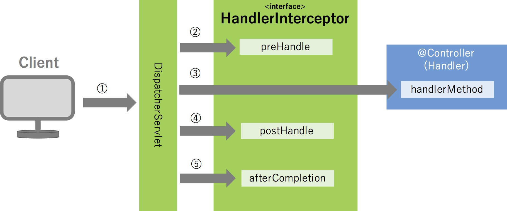

이번 편에서는 전편에서 해결하지 못한 부분이었던 "Spring Boot에서는 기본적으로 OSIV의 설정 값이 true인데도 불구하고 LazyInitializationException이 발생하는가?"에 대한 원인을 알아보고 이에 대한 해결책을 이야기해보고자 한다.

## 1편에서는...
[1편 링크](https://woowacourse.github.io/tecoble/2020-08-31-entity-lifecycle-1)
LazyInitializationException이 예기치 않게 발생하는 상황 속에서 하는 이유와 그 원인에 대한 해결책을 찾아보았다. 
요약하자면 참조하려는 Entity의 연관 Entity를 조회할 때, 영속성 컨텍스트가 존재하지 않는 상황에서 LazyInitializationException가 발생했으며, 
이를 해결하기 위해서는 영속성 컨텍스트가 존재하는 상황 속에서 미리 필요한 연관 Entity를 불러오던가, 준영속화 된 Entity를 다시 영속화시키는 방법으로 해결했다.

하지만 앞에서 살펴본 바와 같이 Spring Boot에서는 OSIV가 기본적으로 설정되었기 때문에 연관 Entity 조회는 스프링 대부분의 영역에서도 가능해야 할 것 같은데, LazyInitializationException은 계속 발생하고 있다. 
전편에서 찾은 방법으로 일단은 문제를 해결해야만 했지만 이제는 근본적인 원인을 파악해볼 차례이다.

## 원인을 찾아보자
원인을 파악하기 위해서는 User를 Controller에서 가지고 오는 로직, 그리고 OSIV가 적용되는 방식 2가지에 대한 이해가 필요하다.
정확히는 Spring Security가 어떤 방식으로 사용자 정보를 가지고 오는지, 그리고 OSIV가 정확히 언제 열리고 닫히는 지를 알아야 된다는 뜻이다.
우선 Open Session In View를 알아보도록 하자.

## Open Session In View 어디서 구현될까?
계속해서 이야기했지만 Spring Boot에서는 [OSIV](https://woowacourse.github.io/tecoble/2020-09-11-osiv)가 기본적으로 설정되어 있다.
어떤 방식으로 OSIV가 설정되어 있고 어떻게 동작하는지 자세히 살펴보도록 하자.

```java
@Configuration(proxyBeanMethods = false)
@ConditionalOnWebApplication(type = Type.SERVLET)
@ConditionalOnClass(WebMvcConfigurer.class)
@ConditionalOnMissingBean({ OpenEntityManagerInViewInterceptor.class, OpenEntityManagerInViewFilter.class })
@ConditionalOnMissingFilterBean(OpenEntityManagerInViewFilter.class)
@ConditionalOnProperty(prefix = "spring.jpa", name = "open-in-view", havingValue = "true", matchIfMissing = true)
protected static class JpaWebConfiguration {
    ...

    @Bean
    public OpenEntityManagerInViewInterceptor openEntityManagerInViewInterceptor() {
        ...
        return new OpenEntityManagerInViewInterceptor();
    }

    @Bean
    public WebMvcConfigurer openEntityManagerInViewInterceptorConfigurer(OpenEntityManagerInViewInterceptor interceptor) {
        return new WebMvcConfigurer() {
            @Override
            public void addInterceptors(InterceptorRegistry registry) {
                registry.addWebRequestInterceptor(interceptor);
            }
        };
    }
}
```
위 클래스는 Spring Boot에서 자동으로 Bean을 설정해주는 Configuration 클래스들 중 에서 Open Session In View를 설정해주는 클래스이다. 
Spring의 자동 설정 방식을 이번에 다루지 않을 예정이기에 필요한 부분만 이야기 해보자.

@ConditionalOnProperty를 보면 알 수 있겠지만 기본적으로 Spring Boot에서는 `spring.jpa.open-in-view`라는 설정을 통해 Open Session In View를 설정하고 있다.
이 값이 true이면 OpenEntityManagerInViewInterceptor를 인터셉터로 등록하여 Open Session In View를 적용하는 것을 알 수 있다. 이 구현체의 코드를 보면
```java
public class OpenEntityManagerInViewInterceptor extends ... {
    ...
    @Override
    public void preHandle(WebRequest request) throws DataAccessException {
        ...
        logger.debug("Opening JPA EntityManager in OpenEntityManagerInViewInterceptor");
        try {
            EntityManager em = createEntityManager();
            EntityManagerHolder emHolder = new EntityManagerHolder(em);
            TransactionSynchronizationManager.bindResource(emf, emHolder);
        ...
    }

	@Override
	public void afterCompletion(WebRequest request, @Nullable Exception ex) throws DataAccessException {
        ...
        logger.debug("Closing JPA EntityManager in OpenEntityManagerInViewInterceptor");
	EntityManagerFactoryUtils.closeEntityManager(emHolder.getEntityManager());
    }
    ...
}
```
Interceptor의 preHandle을 보면 언뜻 EntityManager를 Open하고 afterCompletion로 Close한다는 내용이 들어가 있다. 조금 더 자세히 코드를 보아야 정확한 동작 과정을 파악할 수 있겠지만, 
간접적으로 preHandle, afterCompletion을 통해 EntityManager를 열고 닫는다는 사실을 파악할 수 있다. Interceptor의 동작 과정을 살펴보자.

> OSIV(Open Session In View)는 하이버네이트에서 사용하는 용어다. JPA에서는 OEIV(Open EntityManager In View)라 한다. 하지만 관례상 모두 OSIV라 부른다.(출처 : 참고 자료 1)



출처 : https://justforchangesake.wordpress.com/2014/05/07/spring-mvc-request-life-cycle/

그림을 통해 preHandle은 Controller에 Request를 보내기 전, afterCompletion은 view에서 결과가 생성되고 난 후 호출되는 메서드임을 알 수 있다.


출처 : https://corp.jobins.jp/blogDetail/blog-201529492

Spring에서의 웹 요청 처리 과정을 살펴보았을 때, Filter를 제외한 대부분의 영역에서 @Transactional이 없이도 EntityManager의 도움을 받을 수 있다는 점을 파악할 수 있다. 

그렇다면 User를 가지고 오는 부분이 Filter에 있다는 것인가? 아니면 다른 Interceptor를 통해 가지고 오는 것인가? 이 부분도 파악해보자.

## Spring Security는 어떤 방식으로 유저 정보를 가지고 올까?

다음 그림은 Spring Security의 기본 구조이다.


출처 : https://docs.spring.io/spring-security/site/docs/current/reference/html5/#servlet-applications

그림에서 알 수 있듯이, Spring Security는 Filter를 기반으로 동작한다. DelegatingFilterProxy에서 사용자의 요청을 가로채 Spring Security의 기능들이 수행되며 모든 요청에 대해 보안이 적용되게끔 한다.
DelegatingFilterProxy에는 Security 기능들이 구현되어 있는 다양한 Security Filter가 존재해 일종의 FilterChain을 이루어 동작한다.


우리가 기존에 구현한 CustomUserDetailsService도 Spring Security 인증과정에 필요한 UserDetailsService를 구현한 것이다.
이 Service를 통해 DB에 존재하는 User 정보와 사용자가 입력한 로그인 정보를 대조해 인증/인가를 진행한다.

Spring Security의 자세한 동작이 궁금하다면 [위 링크](https://docs.spring.io/spring-security/site/docs/current/reference/html5/#servlet-applications)를 참고하면 된다.

## LazyInitializationException이 발생한 이유는
위에서 나온 내용을 간단하게 정리해보면 Spring Security에서 Filter를 통해 User 정보를 가지고 오며, Open Session In View는 Interceptor를 통해 적용되는 것을 확인할 수 있었다.

그림을 보면 알 수 있듯이, Filter가 Interceptor보다 먼저 실행되며, 따라서 현재 상태로는 FilterChainProxy에서 CustomUserDetailsService는 Service 내에서 @Transactional이 적용되는 부분에서만 영속성 컨텍스트가 유지된다는 뜻이다.

즉 영속성 컨텍스트가 종료된 상황에서 Controller에서 @CurrnetUser를 통해 가지고 온 User객체는 **준영속화**된 상태이다.
따라서 다시 영속성 컨텍스트가 OSIV를 통해 Controller에 주입된다 하더라도 이미 준영속화 된 User의 Favorites를 조회할 경우 예외가 발생하는 것이다.

## 해결 방법
이를 해결하기 위해서는 기존에 설정되어 있는 OpenEntityManagerInterceptor의 우선 순위를 높이는 것이다. 하지만 Spring Security가 기본적으로 Filter 기반으로 동작하고 있어, Interceptor가 아니라 Filter로 교체해야 한다.
다행히 OpenEntityManager를 Filter로 동작하게 할 수 있게끔 OpenEntityManagerInView 클래스가 존재하며, 이를 따로 Bean으로 등록하면 해결된다.
```java
@Component
@Configuration
public class OpenEntityManagerConfig {
    @Bean
    public FilterRegistrationBean<OpenEntityManagerInViewFilter> openEntityManagerInViewFilter() {
        FilterRegistrationBean<OpenEntityManagerInViewFilter> filterFilterRegistrationBean = new FilterRegistrationBean<>();
        filterFilterRegistrationBean.setFilter(new OpenEntityManagerInViewFilter());
        filterFilterRegistrationBean.setOrder(Integer.MIN_VALUE); // 예시를 위해 최우선 순위로 Filter 등록
        return filterFilterRegistrationBean;
    }
}
```
OpenEntityManagerInView가 Spring Security의 DelegatingFilterProxy보다 먼저 적용될 수 있게끔 Order를 설정하는 것을 잊지 말자.

또한 OpenEntityManagerInView가 사용자에 의해 Bean으로 등록되면 `@ConditionalOnMissingBean({ OpenEntityManagerInViewInterceptor.class, OpenEntityManagerInViewFilter.class })`, `@ConditionalOnMissingFilterBean(OpenEntityManagerInViewFilter.class)`
를 통해 자동 설정이 되는 Bean들은 무시된다.

> @ConditionalOnMissingBean : 어노테이션에 명시된 Bean이 존재 하지 않을때 Bean 등록이 실행될 수 있도록 하는 어노테이션이다.

이 설정을 추가하면 Lazy로 동작하는 연관 Entity를 조회할 때, 정상적으로 동작하는 것을 확인할 수 있다.

> **OpenEntityManagerInView vs OpenSessionInView**
> - OpenEntityManagerInView : JPA를 지원하기 위해 사용되며 EntityManager가 thread 전체에서 적용되도록 한다.
>
> - OpenSessionInView : Hibernate를 지원하기 위해 사용되며 Session이 thread 전체에서 적용되도록 한다. Spring Boot에서는 SessionFactory가 Bean으로 등록되어 있지 않으면 사용 불가 
## 결론
LazyInitializationException만 알면 쉽게 해결될 것만 같았던, 비교적 쉬워보이는 문제도 사실은 기본적인 Spring, JPA, Spring Security에 대한 이해없이는 해결할 수 없었다.
자신이 쓰고 있는 기술에 대한 완벽한 이해는 아니더라도 기술의 기본적인 동작 과정을 파악할 수 있어야 자신에게 닥친 문제 상황을 해결할 수 있다는 점을 이야기하며 글을 마치고자 한다.

### 참고 자료

[김영한, 자바 ORM 표준 JPA 프로그래밍 [스프링 데이터 예제 프로젝트로 배우는 전자정부 표준 데이터베이스 프레임워크]](http://www.acornpub.co.kr/book/jpa-programmig)

[Kingbbode, Spring - Open Session In View](https://kingbbode.tistory.com/27)
