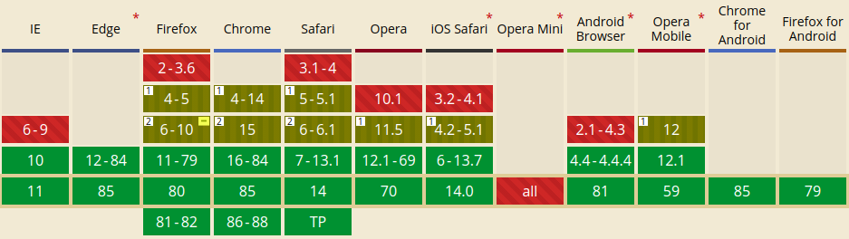
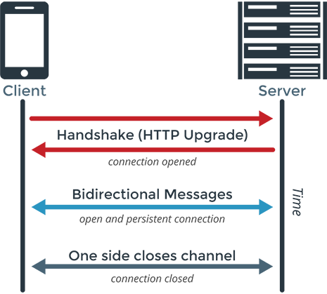

웹 개발을 처음 배우기 시작했다면 서버와 클라이언트의 통신은 모두 HTTP 프로토콜만 이용해서 이루어진다고 생각할 수 있습니다.
하지만 웹 개발을 하면서 채팅, 게임, 주식 차트 등의 **실시간 통신이 필요한 서비스**를 구현하려 하면 HTTP 프로토콜이 아닌 웹소켓 프로토콜을 사용하는 것이 좋다는 이야기를 흔히 찾아볼 수 있습니다.
저도 채팅을 구현하며 웹소켓에 대해 알게되었는데, 이번에 알게 된 웹소켓에 대한 지식을 공유하려 합니다.

## HTTP의 한계
초기 웹의 목적은 단순한 문서전달이었습니다.
HTTP는 요청한대로 응답을 보내주기만 하는 단순한 프로토콜입니다.
이는 단순 문서전달에 굉장히 효율적이었기 때문에 널리 사용되었고, 오늘 날 HTTP는 거의 모든 웹 통신에 사용되는 역사상 가장 성공적인 프로토콜이라 할 수 있습니다.  

하지만 인터넷이 발전하면서 사람들은 문서 교환 이상의 것을 원하기 시작했고 채팅, 게임등의 실시간 통신이 필요한 것들을 바라기 시작했습니다.
그런데 HTTP 프로토콜은 요청에 대해서만 응답을 보낼 수 있기 때문에 채팅에서 계속 메시지를 받기만 하는 상황을 구현하기 힘들었습니다.
또한 HTTP 프로토콜은 매 요청과 응답마다 연결을 수립하고 끊는 과정을 반복해야 했기 때문에, 유사한 통신을 계속 반복해야 한다는 비효율성에 대한 문제가 있었습니다.

## 웹소켓의 탄생
HTTP를 이용한 실시간 통신의 문제를 해결하기 위해 HTML5부터 웹소켓이 등장했습니다. 
웹소켓은 실시간 양방향 통신을 지원하며 한번 연결이 수립되면 클라이언트와 서버 모두 자유롭게 데이터를 보낼 수 있습니다.
이는 채팅과 같은 연속적인 통신에 대해 계속 유사한 통신을 반복하지 않게 해주어 통신의 효율성도 개선하였습니다.

웹소켓은 2011년 RFC 6455에 의해 표준화 되었으며, 이후 브라우저들에서 지원되기 시작하였습니다. 
Internet Explorer는 11버전이후부터 지원하며, 현재는 대부분의 브라우저에서 지원합니다.
다음은 웹소켓을 지원하는 브라우저들에 대한 정보입니다.


## 웹소켓 프로토콜
웹소켓은 HTTP와 같은 OSI 모델의 7계층에 위치하는 프로토콜이며, 4계층의 TCP에 의존합니다.

HTTP 프로토콜을 이용할 때 "http"를 이용하는 것 처럼, 웹소켓을 이용할 때 "ws"를 이용합니다.
또한 보완을 강화한 "https"를 사용하는 것 처럼, "ws"에 대해 보완을 강화한 "wss"를 사용할 수 있습니다.

HTTP를 이용해서 연결을 수립하며 연결 된 이후에도 연결을 할 때 사용했던 포트인 80과 443포트를 이용합니다.
연결 수립은 핸드쉐이크를 통해 이루어지며 핸드쉐이크시 HTTP를 이용합니다.

## 웹소켓 핸드쉐이크


위 그림은 웹소켓 핸드쉐이크와 통신을 보여주고 있습니다.
그림에서 볼 수 있듯이 핸드쉐이크는 한번의 HTTP 요청과 HTTP 응답으로 이루어집니다.
핸드쉐이크가 끝나면 HTTP 프로토콜을 웹소켓 프로토콜로 변환하여 통신을 하는 구조입니다.

핸드쉐이크는 먼저 클라이언트가 HTTP로 웹소켓 연결 요청을 하면서 시작됩니다.
웹소켓 연결 요청에는 "Connection:Upgrade"와 "Upgrade:websocket" 헤더를 통해 웹소켓 요청임을 표시합니다.
또한 "Sec-WebSocket-Key" 헤더를 통해 핸드쉐이크 응답을 검증할 키 값을 보냅니다.
그 외에도 WebSocket 연결시 보조로 이용할 프로토콜 정보등의 추가적인 정보를 헤더에 담아 보낼 수 있습니다.
다음은 웹소켓 연결 요청 예시입니다.
```HTTP
GET /chat HTTP/1.1
Host: server.example.com
Upgrade: websocket
Connection: Upgrade
Sec-WebSocket-Key: x3JJHMbDL1EzLkh9GBhXDw==
Sec-WebSocket-Protocol: chat, superchat
Sec-WebSocket-Version: 13
Origin: http://example.com
```

이에 대한 서버의 응답역시 HTTP로 옵니다.
정상적인 응답의 상태코드는 101(Switching Protocols)입니다.
"Sec-WebSocket-Key" 헤더를 통해 받은 값에 특정 값을 붙인 후, SHA-1로 해싱하고 base64로 인코딩한 값을 "Sec-WebSocket-Accept" 헤더에 보냅니다.
이 값을 통해 클라이언트는 정상적인 핸드쉐이크 과정을 검증합니다.
클라이언트가 정상적으로 응답을 받으면 핸드쉐이크는 종료되고 이후부터 웹소켓 프로토콜을 통해 데이터 통신을 합니다.
다음은 웹소켓 연결 요청에 대한 응답 예시입니다.
```HTTP
HTTP/1.1 101 Switching Protocols
Upgrade: websocket
Connection: Upgrade
Sec-WebSocket-Accept: HSmrc0sMlYUkAGmm5OPpG2HaGWk=
Sec-WebSocket-Protocol: chat
```

이와 같이 핸드쉐이크가 끝나면 웹소켓 프로토콜을 통해 텍스트를 주고 받을 수 있게 됩니다.
웹 소켓 통신의 활용에 대한 부분은 다음 글에서 작성하겠습니다.

## 참고자료

[위키피디아](https://en.wikipedia.org/wiki/WebSocket)

[MDN](https://developer.mozilla.org/en-US/docs/Web/API/WebSockets_API/Writing_WebSocket_servers)

[블로그](https://www.joinc.co.kr/w/man/12/websocket#sid_2)

[블로그2](https://bloodguy.tistory.com/entry/HTML5-WebSocket-%EC%84%9C%EB%B2%84%EC%9D%98-handshake)
