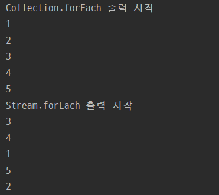
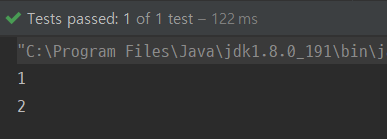
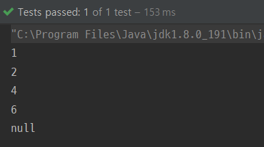

[자바 반복문 알고 쓰자!](https://woowacourse.github.io/tecoble/post/2020-08-31-java-loop) 를 작성하다가 궁금해진 내용이다. 아래처럼 Collection.forEach 메서드로 반복할 때와 Stream.forEach 메서드로 반복할 때는 무슨 차이가 있을까?

```java
public void print(List<Integer> nums) {
    nums.forEach(System.out::println);
    nums.stream().forEach(System.out::println);
}
```

결론부터 말하면 대부분의 경우에 별 차이 없다. 조금의 차이가 있긴 한데, 놀라운 내용은 없다. 단지 두 방법을 비교한 글이기에 도움 되는 정보가 없을 수도 있다. 가볍게 읽으실 분들만 읽기를 추천한다..😉

---

## Stream 객체 사용 여부

[자바 반복문 알고 쓰자!](https://woowacourse.github.io/tecoble/post/2020-08-31-java-loop) 에서도 다뤘던 내용이지만 한 번 더 앞에서 봤던 코드의 표면적인 차이를 살펴보자.

```java
public void print(List<Integer> nums) {
    nums.forEach(System.out::println);
    nums.stream().forEach(System.out::println);
}
```

Collection.forEach는 따로 객체를 생성하지 않고 forEach 메서드를 호출한다. forEach 메서드는 Iterable 인터페이스의 default 메서드인데, Collection 인터페이스에서 Iterable 인터페이스를 상속하고 있기에 바로 호출할 수 있는 것이다.

```java
public interface Iterable<T> {

    default void forEach(Consumer<? super T> action) {
        Objects.requireNonNull(action);
        for (T t : this) {
            action.accept(t);
        }
    }
    ...
}

public interface Collection<E> extends Iterable<E> {
    ...
}
```

반면에 Stream.forEach는 Collection 인터페이스의 default 메서드 stream()으로 Stream 객체를 생성해야만 forEach를 호출할 수 있다.

```java
public interface Collection<E> extends Iterable<E> {

    default Stream<E> stream() {
        return StreamSupport.stream(spliterator(), false);
    }
}
```

위의 예제처럼 단순 반복이 목적이라면 Stream.forEach는 stream()으로 생성된 Stream 객체가 버려지는 오버헤드가 있기에, filter, map 등의 Stream 기능들과 함께 사용할 때만 Stream.forEach를 사용하고 나머지의 경우엔 Collection.forEach를 쓰는 것이 좋아 보인다.

forEach 메서드를 사용할 때 주의해야 할 점은 [Stream의 foreach 와 for-loop 는 다르다.](https://woowacourse.github.io/tecoble/post/2020-05-14-foreach-vs-forloop) 이 글을 참고하자.

---

## parallelStream

stream 메서드로 생성한 Stream.forEach를 했을 땐 Collection.forEach와 별 차이가 없었지만 Collection 인터페이스의 또 다른 Stream 객체 생성 메서드 parallelStream()을 사용해서 Stream.forEach를 한다면 그 차이점이 명확하다.

```java
public void print() {
    List<Integer> nums = Arrays.asList(1, 2, 3, 4, 5);
    System.out.println("Collection.forEach 출력 시작");
    nums.forEach(System.out::println);
    System.out.println("Stream.forEach 출력 시작");
    nums.parallelStream().forEach(System.out::println);
}
```



parallelStream 메서드로 생성한 Stream 객체는 여러 스레드에서 스트림을 실행하기 때문에 forEach를 했을 때 실행 순서가 매번 달라지며 예측 불가능 하다.

반면에 Collection.forEach는 내부적으로 아래와 같이 실행되기 때문에 일정한 순서를 보장한다.

```java
default void forEach(Consumer<? super T> action) {
    Objects.requireNonNull(action);
    for (T t : this) {
        action.accept(t);
    }
}
```

---

## 동시성 문제

Collection.forEach의 경우엔 수정을 감지한 즉시 ConcurrentModificationException을 던지며 프로그램을 멈춘다. [ConcurrentModificationException](https://docs.oracle.com/javase/7/docs/api/java/util/ConcurrentModificationException.html)이란 한 오브젝트에 대해 허가되지 않은 변경이 동시적으로 이루어질 때 발생한다. 대표적으로 Collection이 반복되는 동안 Collection을 수정할 때 발생한다.아래의 코드는 List의 element가 짝수이면 remove 하는 Consumer를 forEach로 돌린 것이다. 코드와 테스트 결과를 보자.

```java
@Test
void test() {
    List<Integer> nums = new ArrayList<>(Arrays.asList(1, 2, 3, 4, 5, 6));
    Consumer<Integer> removeIfEven = num -> {
        System.out.println(num);
        if (num % 2 == 0) {
            nums.remove(num);
        }
    };
    assertThatThrownBy(() -> nums.forEach(removeIfEven))
            .isInstanceOf(ConcurrentModificationException.class);
}
```



List의 첫 번째 짝수 2가 지워지자 바로 ConcurrentModificationException이 발생하는 것을 볼 수 있다. 그렇다면 Stream.forEach의 경우엔 어떨까?

```java
@Test
void test() {
    List<Integer> nums = new ArrayList<>(Arrays.asList(1, 2, 3, 4, 5, 6));
    Consumer<Integer> removeIfEven = num -> {
        System.out.println(num);
        if (num % 2 == 0) {
            nums.remove(num);
        }
    };
    assertThatThrownBy(() -> nums.stream().forEach(removeIfEven))
            .isInstanceOf(NullPointerException.class);
}
```



Collection.forEach처럼 Collection이 수정되자마자 예외를 던지는 것이 아니라 무조건 리스트를 끝까지 돌고 예외를 던진다. 또 던지는 예외가 ConcurrentModificationException이 아니라 NullPointerException이라는 차이점이 있다.

Collection.forEach는 일반적으로 해당 컬렉션의 Iterator를 사용하고 Stream.forEach는 해당 컬렉션의 spliterator를 사용한다. [Collections.java](http://hg.openjdk.java.net/jdk8/jdk8/jdk/file/jdk8-b132/src/share/classes/java/util/Collections.java#l2121)에서 보면 아래의 코드처럼 Collection.forEach에는 synchronized 키워드가 붙어있고 Stream.forEach를 위해 필요한 spliterator 메서드는 안붙어있는 것을 확인할 수 있다.

```java
    @Override
    public void forEach(Consumer<? super E> consumer) {
        synchronized (mutex) {c.forEach(consumer);}
    }

    @Override
    public Spliterator<E> spliterator() {
        return c.spliterator(); // Must be manually synched by user!
    }
```

결론적으로 Collection.forEach는 락이 걸려있기에 멀티쓰레드에서 더 안전하다. 반면에 Stream.forEach는 반복 도중에 다른 쓰레드에 의해 수정될 수 있고, 무조건 요소의 끝까지 반복을 돌게 된다. 이 과정에서 일관성 없는 동작이 발생하고 예상치 못한 에러가 발생할 확률이 높다.

---

## 결론

결국 반복을 위해 존재하는 Collection.forEach와 Stream.forEach의 차이는 정말 미묘하다. 단지 Stream.forEach는 Stream의 컨셉에 맞게 병렬 프로그래밍에 특화된 반복을 위해 있는 것뿐이다. 일반적인 반복의 경우엔 thread-safe 한 Collection.forEach를 쓰는게 좋아보인다.

---

### 참고 자료

-   [Collection -oracle](https://docs.oracle.com/javase/8/docs/api/index.html)
-   [Stream -oracle](https://docs.oracle.com/javase/8/docs/api/java/util/stream/Stream.html)
-   [The Difference Between Collection.stream().forEach() and Collection.forEach() -Baeldung](https://www.baeldung.com/java-collection-stream-foreach)
-   [What is difference between Collection.stream().forEach() and Collection.forEach()? -stack overflow](https://stackoverflow.com/questions/23218874/what-is-difference-between-collection-stream-foreach-and-collection-foreach)
