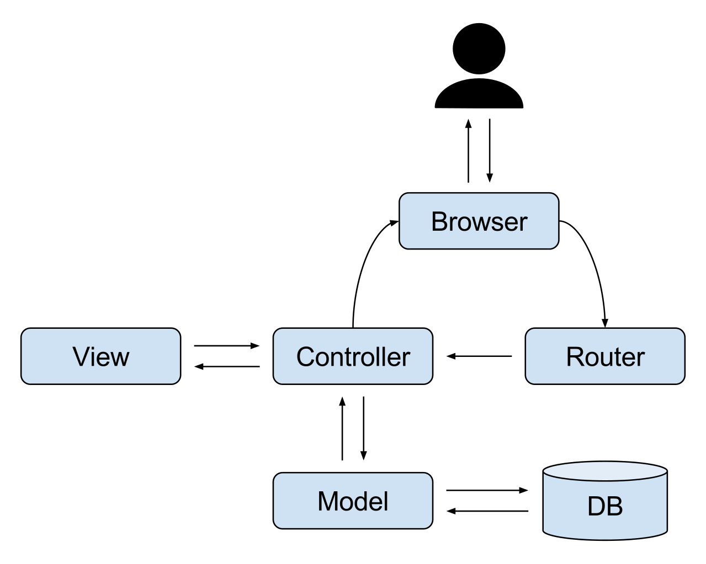
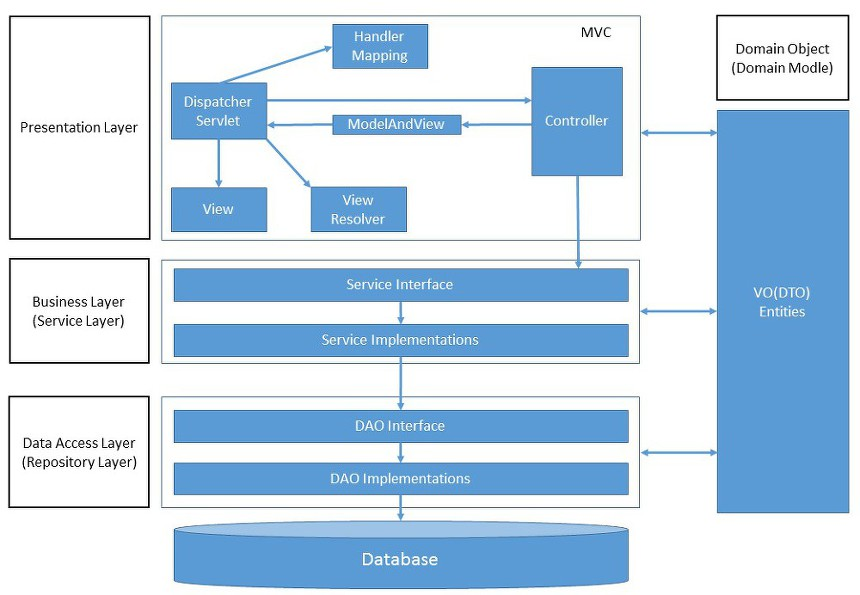
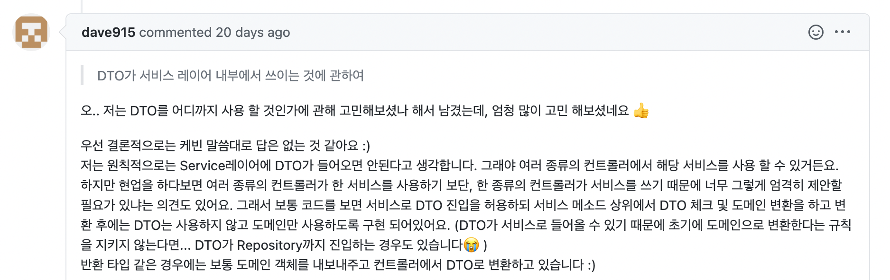

## 1. 들어가기에 앞서

우아한테크코스 레벨 2 과정은 Spring Framework를 활용하여 웹 어플리케이션을 개발하는 미션들로 구성되어 있습니다. Spring을 학습하면 빠짐없이 등장하는 개념이 ***MVC Pattern*** 과 ***Layered Architecture*** 인데요. 이번 포스팅을 이해하는데 도움이 되는 배경지식인 관계로 간략하게 짚고 넘어가보겠습니다.

### 1.1. MVC Pattern



MVC 패턴은 어플리케이션을 개발할 때 그 구성 요소를 Model과 View 및 Controller 등 세 가지 역할로 구분하는 디자인 패턴입니다. 비즈니스 처리 로직(Model)과 UI 영역(View)은 서로의 존재를 인지하지 못하고, Controller가 중간에서 Model과 View의 연결을 담당합니다.

Controller는 View로부터 들어온 사용자 요청을 해석하여 Model을 업데이트하거나 Model로부터 데이터를 받아 View로 전달하는 작업 등을 수행합니다. MVC 패턴의 장점은 Model과 View를 분리함으로써 서로의 의존성을 낮추고 독립적인 개발을 가능하게 합니다.

Controller는 View와 도메인 Model의 데이터를 주고 받을 때 별도의 **DTO**(Data Transfer Object)를 주로 사용합니다. 도메인 객체를 View에 직접 전달할 수 있지만, 민감한 도메인 비즈니스 기능이 노출될 수 있으며 Model과 View 사이에 의존성이 생기기 때문입니다.

### 1.2. Layered Architecture



MVC 패턴에서 Controller가 도메인 Model 객체들의 조합을 통해 프로그램의 작동 순서나 방식을 제어하는데, 어플리케이션의 규모가 커진다면 Controller는 중복되는 코드가 많아지고 비대해질 것입니다.

Layered Architecture는 유사한 관심사들을 레이어로 나눠서 추상화하여 수직적으로 배열하는 아키텍처입니다. 하나의 레이어는 자신에게 주어진 고유한 역할을 수행하고, 인접한 다른 레이어와 상호작용합니다. 이렇게 시스템을 레이어로 나누면 시스템 전체를 수정하지 않고도 특정 레이어를 수정 및 개선할 수 있어 재사용성과 유지보수에 유리합니다.

Spring Framework 사용자라면 Controller와 Service 및 Repository 클래스가 분리되어 있는 구조에 익숙하시리라 생각합니다. ☺️

<br>

## 2. DTO를 어디까지 사용하지?

> ArticleController.java

```java
@PostMapping
public ResponseEntity<ArtileResponseDto> createArticle(@RequestBody ArticleRequestDto articleRequestDto) {
    Article article = articleRequestDto.toEntity();
    Article savedArticle = articleService.createArticle(article);
    ArticleResponseDto articleResponseDto = ArticleResponseDto.from(savedArticle);
    return ResponseEntity.ok().body(articleResponseDto);
}
```

> ArticleService.java

```java
public Article createArticle(Article article) {
    //로직 생략
    return articleRepository.save(article);
}
```

게시판의 CRUD 기능을 제작하면서 문득 **"꼭 DTO와 Domain(Entity)간의 변환 위치가 Controller여야 하는가?"** 라는 궁금증이 들었습니다.

> ArticleService.java

```java
public ArticleDto createArticle(ArticleDto articleRequestDto) {
    Article article = articleRequestDto.toEntity();
    //로직 생략
    return ArticleDto.from(articleRepository.save(article));
}
```

이처럼 Service 레이어가 요청으로 DTO를 받고 응답으로 DTO를 보내줘도 동작에 문제가 없기 때문입니다. 또한 DTO가 계층간 데이터 전달을 위헤 사용하기 때문에, 표현 계층과 응용 계층 사이에서 Entity가 아닌 DTO를 사용하는 것이 더 자연스럽지 않을까 하는 생각이 들었습니다.

DTO를 어느 레이어까지 전달해서 사용해야 하며, DTO와 Entity(Domain) 간의 변환 작업은 어디에서 수행되어야 할까요? 즉, Entity(Domain)를 어느 계층까지 노출해도 될까요?

<br>

## 3. 정답은 없지만

이 주제에 대해 다방면으로 관련 글들을 조사해보았지만, 결과적으로 “이게 가장 적합한 DTO 사용 범위다!” 하는 정답은 없었습니다. 😂 특히 프로젝트의 규모나 특성 등에 따라 어디까지 DTO를 사용하는 것이 효율적인지 다 다른 것 같습니다. 다만 코드를 작성할 때 유용할법한 참고 사항들을 확인할 수 있었습니다.

### 3.1. Repository 레이어

> ”…a cohesive set of responsibilities for providing access to the roots of AGGREGATES from early life cycle through the end” - [Evans](https://www.oreilly.com/library/view/domain-driven-design-tackling/0321125215/ch06.html)

Repository 레이어는 Entity의 영속성을 관장하는 역할이라고 명시되어 있습니다. 이로 인해, 표현 계층에서 사용할 도메인 계층의 Aggregates를 DTO로 변환하는 작업을 Repository 단에서 책임지게 하는 것을 지양하자는 의견이 다수 존재했습니다.

이 글을 작성하면서 DTO와 Entity간의 변환과 관련된 여러 문서들을 참조했는데, 대부분이 변환 로직을 Controller 혹은 Service 레이어에 위치시켰습니다.

### 3.2. 도메인 Model의 보호 관점

> A Service Layer defines an application's boundary [Cockburn PloP] and its set of available operations from the perspective of interfacing client layers. It encapsulates the application's business logic, controlling transactions and coor-dinating responses in the implementation of its operations.

마틴 파울러는 Service 레이어란 어플리케이션의 경계를 정의하고 비즈니스 로직 등 도메인을 캡슐화하는 역할이라고 합니다. 즉, 도메인을 보호합니다. 요청에 대한 응답 역시 Service 레이어의 일부분이며, DTO를 레이어간 데이터 전달 목적으로 엄격하게 고수한다면 변환 로직이 Service 레이어에서 정의되어야 한다는 의견이 존재했습니다.

또한 도메인 Model이 표현 계층에서 사용되는 경우 결합도가 증가하여, 도메인의 변경이 Controller의 변경을 촉발하는 유지보수의 문제로 이어질 수 있습니다.

### 3.3. 비용의 관점

그렇다고 레이어간의 응답-요청에 항상 DTO를 만들어 사용하는 것이 좋은 습관일까요? DTO를 통해 도메인과 표현 계층을 분리할 수 있겠지만, 도메인 Model과 유사한 코드 복제가 빈번하게 발생합니다. 추가적인 DTO 개발 비용(시간, 디버깅 등)이라는 단점이 존재하기 때문에, 작은 규모의 프로젝트에서는 불필요할 수 있습니다.

### 3.4. 리뷰어님의 의견



이러한 궁금증에 대해 리뷰어님께서 짧은 피드백을 남겨주셨습니다.

Entity를 어느 계층까지 노출해야 하는가는 프로젝트의 상황과 아키텍쳐의 방향 등을 종합적으로 고려해서 고민할 문제라고 생각합니다. 여러분들의 생각은 어떠신가요? Javable 독자분들의 의견을 남겨주세요!

<br>

---

## Reference

* [A Better Way to Project Domain Entities into DTOs](https://buildplease.com/pages/repositories-dto/)
* [Entity To DTO Conversion for a Spring REST API](https://www.baeldung.com/entity-to-and-from-dto-for-a-java-spring-application)
* [DTO는 어느 레이어까지 사용하는 것이 맞을까?](https://www.slipp.net/questions/93)
* [Should services always return DTOs, or can they also return domain models?](https://stackoverflow.com/questions/21554977/should-services-always-return-dtos-or-can-they-also-return-domain-models)
* [Service Layer](https://martinfowler.com/eaaCatalog/serviceLayer.html)
