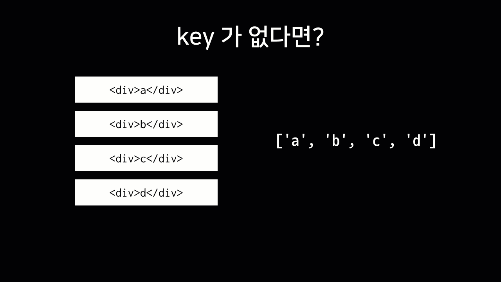
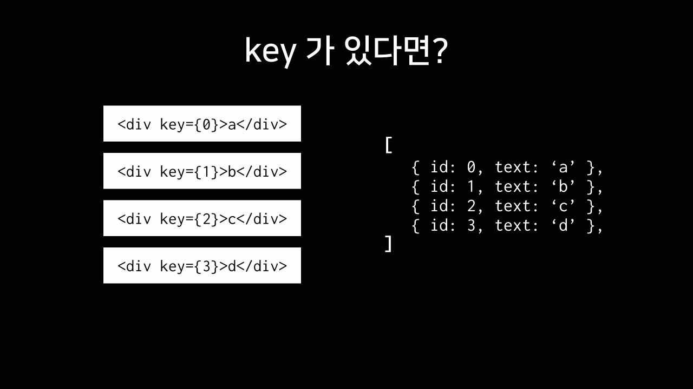

이번 글에서는 리액트에서 key를 사용하는 이유와 올바른 사용법에 대해서 알아보고자 한다.

---

## key를 사용하는 이유

간단한 이해를 위해서 다음과 같은 배열이 있다고 하자.

```javascript
const array = ['a', 'b', 'c', 'd'];
```

그리고 위 배열을 다음과 같이 렌더링 한다고 가정해보자.

```javascript
array.map(item => <div>{item}</div>);
```

<br />
위와 같은 배열의 b와 c 사이에 z를 삽입하게 된다면, 리렌더링을 하는 경우 b와 c 사이에 새로운 div 태그를 삽입하는 것이 아니라 기존의 c는 z로, d는 c로 바뀐 후 맨 마지막에 d가 새롭게 삽입된다. 즉, 새롭게 추가된 부분 이하 리스트 요소에 전부 영향을 준다.

이후 a, b, z, c, d에서 a를 제거하게 되면, 기존의 a는 b, b는 c, z는 c, c는 d로 바뀌며 맨 마지막에 있는 d는 제거된다. 리스트 요소의 삭제도 삽입과 동일하게 변경된 리스트 요소 이하 리스트 요소에 모두 영향을 끼친다.



즉 key가 없는 경우, 변경이 필요하지 않은 리스트의 요소까지 변경이 일어나게 되므로 비효율적이라고 할 수 있다.

이런 부분을 개선하기 위해서 key를 사용할 수 있다. 이번에는 객체에 key로 사용할 수 있는 고유한 값(id)을 지닌 배열이 있다고 하자.

```javascript
[
  {
    id: 0,
    text: 'a',
  },
  {
    id: 1,
    text: 'b',
  },
  {
    id: 2,
    text: 'c',
  },
  {
    id: 3,
    text: 'd',
  },
];
```

그리고 위 배열의 id를 key로 사용하여 렌더링 하면 다음과 같다.

```javascript
array.map(item => <div key={item.id}>{item.text}</div>);
```



배열이 업데이트될 때마다 변경되지 않은 값들은 그대로 두고, 원하는 내용을 삽입하거나 삭제할 수 있다.

## key의 올바른 사용법

리액트에서 key로 이용되는 값은 보통 고유한 값이다. 고유한 값은 배열이 다시 렌더링 되는 과정에서 리스트 아이템의 순서를 보장할 수 있기 때문이다. 간혹 인덱스를 key로 사용하는 경우가 있다. 하지만, 위와 같은 방식은 리스트를 변경(아이템의 추가 또는 삭제) 할 때 각 아이템의 인덱스 또한 재배치한다. 그 결과 key를 변경시켜 렌더링 성능을 저하 시킬 우려가 있다. 이런 이유로 인덱스를 key로 사용하는 경우는 신중히 고려해야 한다.

하지만 다음과 같은 경우, key로 인덱스를 사용할 수 있다.

- 리스트와 아이템이 고정되어, 다시 계산되거나 수정되지 않는다
- 리스트의 아이템에 id가 없다
- 리스트가 재배치되거나 필터되지 않는다

## 정리하면

리액트에서 배열을 렌더링하는 경우, 의도하지 않는 방식의 결과가 나타나거나 비효율적인 동작을 막기 위해서 키가 사용된다. 하지만, 리스트나 아이템이 고정되어 변경이 일어나지 않는 경우 인덱스를 사용할 수 있다. 추가로 key의 값은 서로 다른 리스트의 요소라면 같아도 상관없다.

추가적으로 키로 이용할 수 있는 고유한 값으로 id, [uuid](https://github.com/uuidjs/uuid), [nanoid](https://github.com/ai/nanoid/) 등이 있다.

---

### 참고 자료

- [React Document - 리스트와 Key](https://ko.reactjs.org/docs/lists-and-keys.html)
- [React Document - Key](https://ko.reactjs.org/docs/reconciliation.html#keys)
- [벨로퍼트와 함께하는 모던 리액트 - 배열 렌더링하기](https://react.vlpt.us/basic/11-render-array.html)
- [key로 인덱스를 사용하는 것은 anti-pattern이다](https://robinpokorny.medium.com/index-as-a-key-is-an-anti-pattern-e0349aece318)
