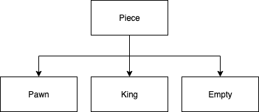
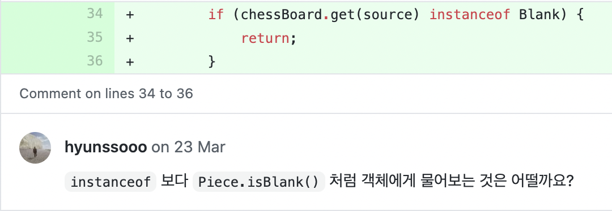
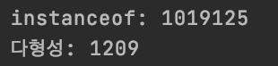

---
layout: post  
title: instanceof의 사용을 지양하자
author: [샐리]
tags: ['java', 'oop']
date: "2021-04-26T12:00:00.000Z"
draft: false
image: ../teaser/instanceof.jpeg
---  
## instanceof란?
  
우리는 종종 그림과 같이 부모를 상속해서 만들어진 자식 객체가 여러 타입인 경우에 특정 클래스가 맞는지 확인하기 위해 아래 코드와 같이 `instanceof`라는 메서드를 사용하곤 한다.
코드는 piece 객체가 Empty라는 클래스 타입인지 확인하는 메서드이다.

```java
if (piece instanceof Empty) {
    return;
}
```  

이와 유사하게 명확한 종류를 알기 어려운 때에는 `isInstance`라는 메서드를 이용해 아래와 같은 구현을 하기도 한다.
piece가 piece2와 같은 타입의 객체인지 알기 위한 메서드이다.

```java
public boolean isSamePiece(Object piece1, Object piece2) {
    return piece1.isInstance(piece2);
}
```  

<br>

## instanceof의 사용을 지양하라
`체스` 미션을 진행하면서 위와 같이 instanceof를 사용한 구현을 했을 때, 피드백으로 받은 내용은 아래와 같다.
  

이해를 돕기 위한 간단한 다형성을 이용한 예시 코드, instanceof를 이용한 예시 코드가 아래에 있다.
추상클래스를 상속받은 각 객체들이 서로 다른 점수를 더해서 반환하는 코드이다.

- 다형성 사용

```java
public abstract class Piece {
    public abstract int calculate(int point);
}

public class King extends Piece {
    public int calculate(int point) {
        return point + 10;
    }
}

public class Pawn extends Piece {
    public int calculate(int point) {
        return point + 1;
    }
}

public class Empty extends Piece {
    public int calculate(int point) {
        return point;
    }
}

public class Point {
  public int calculate(Piece p, int point) {
    return p.calculate(point);
  }
}
```  

- instanceof 사용

```java
public class Point {
    public int calculate(Piece p, int point) {
        if(p instanceof King) {
            return point + 10;
        } else if(p instanceof Pawn) {
            return point + 1;
        } else if(p instanceof Empty) {
            return point;
        }
    }
}
```  

코드를 통해 알 수 있는 것처럼 간편하게 클래스의 타입을 확인할 수 있는 `instanceof`를 사용하지 말고 다형성을 이용할 것이 권장되는 이유는 무엇일까?  
<br>

### 캡슐화 
객체지향에서 말하는 캡슐화란 객체가 가진 상태나 행위를 다른 이가 사용하거나 보지 못하도록 숨기는 것을 의미한다.  
하지만 `instanceof`를 사용하는 경우, 각 객체가 무엇인지, 어떤 점수를 돌려주어야 하는지 불필요한 외부의 객체가 그 정보를 알게 되는 것이다.
때문에 캡슐화가 깨진다는 것을 알 수 있다.  
우리는 각 객체가 가진 책임과 역할을 분리해주고, 이로 인해 유지보수, 확장에 있어 편리함을 얻기 위해 객체지향프로그래밍을 한다. 
캡슐화가 보장되지 않으면 그 의미가 없어진다. 
`instanceof`의 사용을 지양해야 하는 가장 우선적인 이유이다.

### Open Closed Principle 
만일 Piece를 상속하는 Queen이라는 객체가 추가로 생긴다고 생각해보자.  
다형성을 이용하면 새로운 객체를 만들고 그 객체에 구현하면 되는 반면에 instanceof를 사용하는 경우 새로운 메서드를 만들어주기 위해 사용되고 있는 모든 함수를 찾아가서 고쳐야한다.
객체의 확장이 어려워진다는 문제점이 있다.
*객체의 확장에는 열려있고, 변화에는 닫혀있도록 해야한다*는 **개방-폐쇄 원칙(OCP)** 에 위반됨을 알 수 있다.  
<br>

### Single Responsibility Principle  
instanceof가 사용되는 이유는 특정 타입임을 알아내고 특정 코드를 실행하기 위해서이다.
이것은 instanceof를 사용하는 `calculate` 함수가 어떤 타입의 함수이든 pawn, king, empty의 `calculate` 구현을 모두 알고 있어야 하는 책임이 부가되는 것이다.
각 타입에게 책임을 부여하면 되는 일이 하나의 메서드에게 모든 책임이 가중되는 일이 발생한 것이다.
*한 클래스는 하나의 책임만 가져야 한다*는 객체지향프로그래밍의 원칙 중 하나인 **단일책임원칙(SRP)** 이 위반된 것이라고 볼 수 있다.  

두 원칙에 대해서 추가적으로 [이 글](https://woowacourse.github.io/javable/post/2020-07-31-solid-1/)을 참고하면 더 공부할 수 있다.  
<br>

### 성능
예시 코드와 같이 pawn, king, empty이 서로 다른 구현이 필요한 경우에 다형성을 적용한 구현을 하게되면 컴파일러는 어떠한 타입의 메서드를 실행해야할지 알 수 없으므로 `invokevirtual` 바이트코드를 이용해 메서드에 대한 가상의 호출을 한다.  
이후 런타임에 특정 타입을 찾아 그에 맞는 구현을 실행한다.  
반면에 instanceof의 경우 알맞은 타입을 찾을 때까지 컴파일 시에 모든 타입을 돌며 검사해야한다.  
그로 인해 다형성을 적용한 성능이 instanceof를 검사하는 성능보다 빠르다.  
심지어 확인해야할 객체가 많으면 많을수록 불필요한 instanceof 검사가 더 필요하고 성능의 차이는 점차 커진다.  
이해를 돕기 위해 간단한 코드를 통해 성능을 테스트 해보았다.  
```java
  @Test
  void test() {
      Pawn pawn = new Pawn(BLACK);
      long start = 0;
      long end = 0;

 26     start = System.nanoTime();
      assertTrue(pawn instanceof Pawn);
      end = System.nanoTime();
      System.out.println("instanceof: " + (end-start));

      start = System.nanoTime();
      assertTrue(pawn.isPawn());
      end = System.nanoTime();
      System.out.println("다형성: " + (end-start));
  }
```
이 코드는 실제 체스를 구현한 코드에서 Pawn인지 확인하고자 하는 코드이다.  
실험 결과는 아래와 같다.  
  
작은 테스트임에도 차이가 나는 것을 쉽게 확인할 수 있다.  

<br>

### 깔끔한 구현, 쉬운 리팩토링
다형성을 이용한 구현을 하면 if 분기문이 많이 필요 없다.
각 타입에 필요한 구현을 각 객체에 하면 되기 때문이다.
따라서 instanceof를 사용했을 때 여러 if문이 발생하는 것보다 코드가 깔끔하고 간단하다.  
instanceof를 이용해 구현을 했는데 empty가 piece를 상속하지 않는 것과 같이 상속 구조가 바뀌어버리면 관련 코드는 모두 수정이 필요하다.
하지만 다형성을 적용해 구현을 하면 구조가 바뀌더라도 그 바뀐 타입의 메서드만 수정해주면 되므로 쉽고 간단한 리팩토링이 가능하다.  
<br>

## 그래서?
java는 객체지향 프로그래밍을 지향하는 언어이다.
```java
public boolean is(){
  List<Integer> numbers = new LinkedList<>();
  return isLinked(numbers);
}

public boolean isLinked(Object object) {
    return object instanceof LinkedList;
}
```  
위와 같이 특정 자료형의 타입을 판별하는 경우 instanceof 필요할 수 있다.
하지만 우리는 java가 추구하는 추상화, 캡슐화, 다형성, 일반화와 같은 특성 외에도 객체지향 프로그래밍이 추구하는 solid 원칙을 최대한 지킬 필요성이 있다.  
다양한 원칙과 특성을 해치지 않는 선에서 올바르게 메서드를 사용하도록 하자.

- [참고](https://link-intersystems.com/blog/2015/04/25/instanceof-vs-polimorphism/)  
