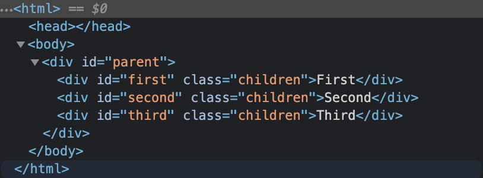
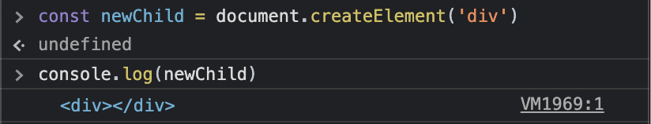
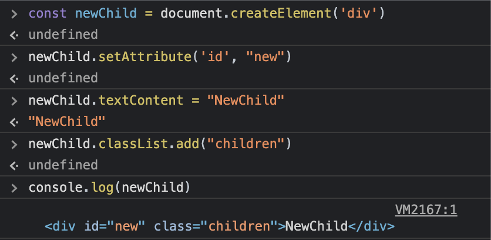
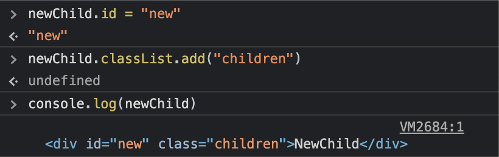
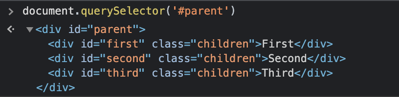
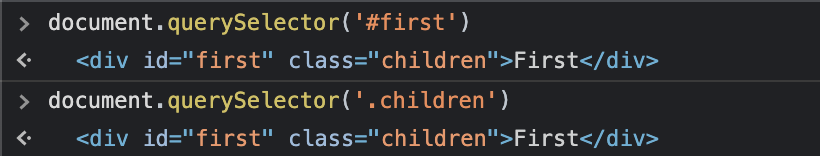
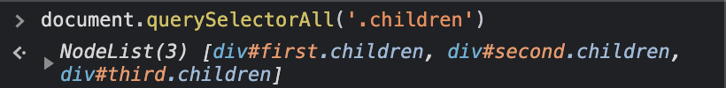
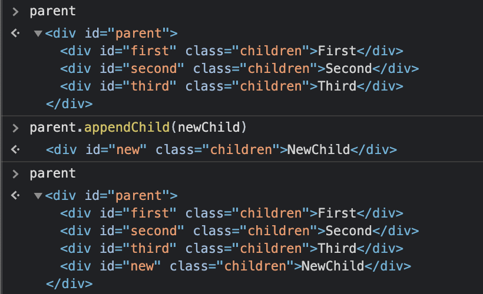
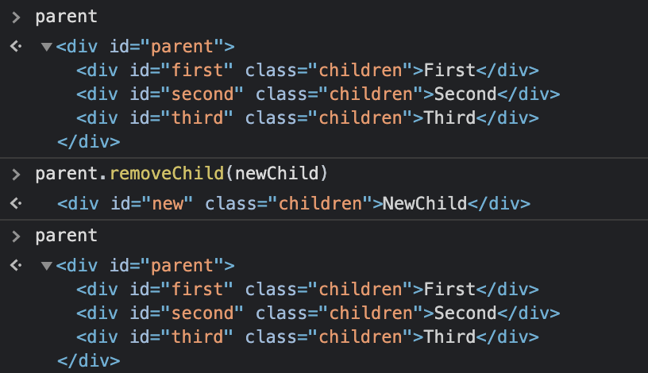
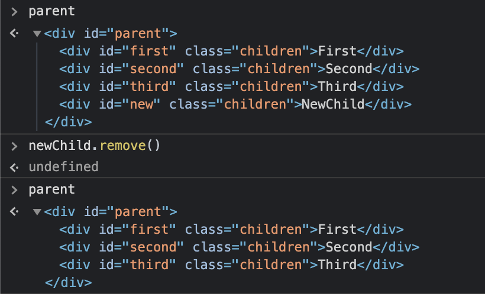

지난 글에서는 웹사이트에 악성 스크립트를 삽입할 수 있는 취약점, **XSS**에 대한 내용과 함께 innerHTML을 사용하는 것은 **XSS**에 취약하다는 이야기를 하였다. (\*[innerHTML의 위험성, XSS에 대해 알아보자](https://woowacourse.github.io/tecoble/post/2021-04-26-cross-site-scripting/))

그래서 이번 글에서는 Vanilla JavaScript에서 innerHTML을 사용하지 않고, DOM에 element 를 추가하고, 다루는 방법에 대해 예시를 통해 알아보려고 한다.

## 0. DOM element 관계

먼저 글의 이해를 돕기위해 element 사이의 부모 자식 관계와 형제 관계에 대해 설명하려고 한다.



부모 자식 관계에서 부모는 자식을 감싸고 있는 element 이고, 자식은 부모에 감싸진 element 이다.

위의 예시에서 `parent`와 `first`는 부모 자식 관계이며, `parent`가 부모이고, `first`가 자식이다. (마찬가지로 `parent`와 `second`, `parent`와 `third` 도 부모 자식 관계이다.)

형제 관계에서 형제는 같은 부모 안에 있는 element 를 의미하며, 위의 예시에서 `first`와 `second`, `third` 는 형제 관계이다.

이제 본론으로 돌아가서 element 를 생성하고, 다루는 방법에 대해 알아보자.

## 1. DOM element 생성

```javascript
const newTag = document.createElement('tagName');
```

`document.createElement` 를 사용하여 element 를 생성할 수 있다. 이때 인자로 태그를 넘겨주면 원하는 태그의 element 생성할 수 있다.



생성된 element 에는 `setAttribute` 를 사용하여 속성을 부여하거나, `textContent` 를 사용하여 태그 안에 텍스트를 넣을 수도 있다.



또한 `newTag.id` 혹은 `newTag.classList` 처럼 element 속성 값에 직접 접근할 수 도 있다.



## 2. DOM element 조회

생성된 element 을 DOM에 추가하려면 추가하려는 위치, 즉 부모 요소를 선택해야한다.

```javascript
const targetElement = document.querySelector('Target');

const targetElements = document.querySelectorAll('Target');
```

id, className 혹은 tagName 등을 이용해 원하는 element 찾는 `getElementsBy*` 도 있지만,

CSS 선택자를 활용해서 elem를 찾을 수 있는 querySelector 더 많이 사용하고 있다.

`querySelector` 는 주어진 CSS 선택자에 대응하는 element 중 첫 번째 element 를 반환한다.





`querySelectorAll` 은 CSS 선택자에 대응하는 element 모두를 반환한다.



이때 반환된 element 들은 NodeList라는 유사배열로 반환됩니다. 유사배열이란 배열은 아니지만, 마치 배열 처럼 처리할 수 있는 객체를 의미하며, 숫자로 인덱싱 된 key와 length 프로퍼티가 특징입니다.

NodeList는 `forEach`를 사용할 수 있지만, 배열이 아니기 때문에 map이나 filter, reduce 등의 다른 배열 메서드를 쓸 수 없습니다.

만약 다른 배열 메서드를 사용해야 하는 경우, 스프레드 연산자(`[...'NodeList']`)를 사용하거나 `Array.from('NodeList')` 문법을 사용하여 배열로 변환하여 사용할 수 있습니다.

## 3. DOM element 삽입

이제 새로운 element 와 element 를 추가할 부모 요소를 찾았으니, DOM에 추가해보자.

```javascript
parentElement.appendChild(newElement);
```

가장 대표적인 방법은 `appendChild` 를 사용하는 것이다. 부모 element 의 자식 element 중 마지막 자식으로 element 를 추가한다.



```javascript
parentElement.insertBefore(newElement, referenceElement);

targetElement.insertAdjacentElement('where', newElement);
```

그 외에도 `insertBefore` 를 사용하면, 부모 element 의 자식 중 기준이 되는 자식의 앞에 element 를 추가 할 수 있다.

그리고 `insertAdjacentElement`를 사용하면, 타겟이 되는 element 의 `beforebegin, afterbegin, beforeend, afterend` 중 하나의 위치에 element 를 추가 할 수 있다.

```
<!-- beforebegin -->
<p>
  <!-- afterbegin -->
  foo
  <!-- beforeend -->
</p>
<!-- afterend -->
```

## 4. DOM element 삭제

그럼 이제 DOM Method 를 사용해 element 를 삭제하는 방법을 알아보자.

```javascript
parentElement.removeChild();

targetElement.remove();
```

`removeChild` 를 사용하면 자식 element 을 지정하여 삭제 할 수 있다.



`remove` 를 사용하면 해당 element 를 직접 삭제 할 수 있다.



## 마무리

이번 글에서는 DOM element의 생성, 추가, 삽입 그리고 삭제를 다루는 메서드에 대해서 간단하게 알아 보았다.

이외에도 다양한 메서드가 많이 있기 때문에 MDN을 찾아보는 것을 추천한다.

## 참고 링크

- DOM element 생성

  - [Document.createElement()](https://developer.mozilla.org/ko/docs/Web/API/Document/createElement)

- DOM element 조회

  - [Document.querySelector()](https://developer.mozilla.org/ko/docs/Web/API/Document/querySelector)
  - [Document.querySelectorAll()](https://developer.mozilla.org/ko/docs/Web/API/Document/querySelectorAll)

- DOM element 추가

  - [Node.appendChild()](https://developer.mozilla.org/ko/docs/Web/API/Node/appendChild)
  - [Node.insertBefore()](https://developer.mozilla.org/ko/docs/Web/API/Node/insertBefore)
  - [Element.insertAdjacentElement()](https://developer.mozilla.org/en-US/docs/Web/API/Element/insertAdjacentElement)

- DOM element 삭제
  - [ChildNode.remove()](https://developer.mozilla.org/en-US/docs/Web/API/ChildNode/remove)
  - [Node.removeChild()](https://developer.mozilla.org/en-US/docs/Web/API/Node/removeChild)
