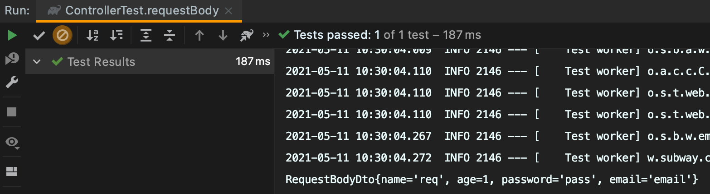
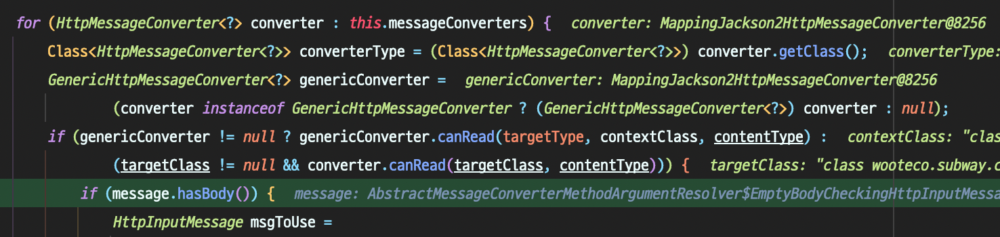
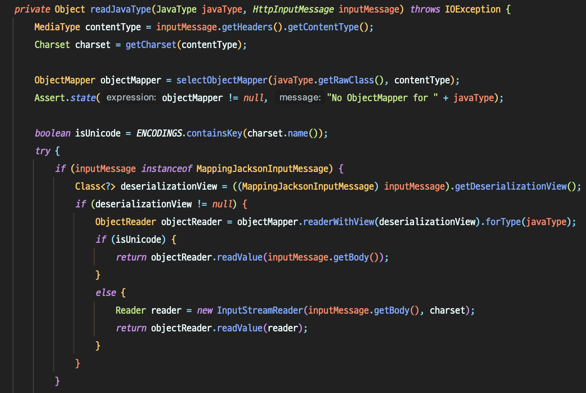
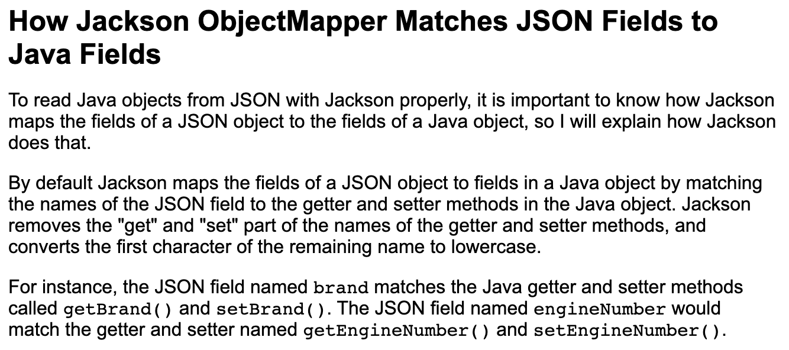

## 1. @RequestBody와 @ModelAttribute

> Controller.java

```java
@PostMapping
public ResponseEntity<String> createPost(@ModelAttribute PostDto postDto)

@PostMapping
public ResponseEntity<String> createComment(@RequestBody CommentDto commentDto)
```

@RequestBody와 @ModelAttribute는 클라이언트 측에서 보낸 데이터를 Java Object로 만들어주는 공통점이 있습니다. 하지만 이 두 애너테이션은 세부 수행 동작에서 큰 차이를 보여주는데요. 각 애너테이션의 특징 및 차이점 등을 제대로 인지하지 못하고 개발하면 예기치 못한 에러의 늪에 빠지기 쉽습니다. 이번 포스팅에서는 두 애너테이션의 특징 및 차이점에 대해 알아보겠습니다.

<br>

## 2. @RequestBody

> Annotation indicating a method parameter should be bound to the body of the web request. The body of the request is passed through an HttpMessageConverter to resolve the method argument depending on the content type of the request.

@RequestBody 애너테이션의 역할은 클라이언트가 보내는 HTTP 요청 본문(JSON 및 XML 등)을 Java Object로 **변환**하는 것입니다. HTTP 요청 본문 값은 Spring에서 제공하는 HttpMessageConverter를 통해 타입에 맞는 객체로 변환됩니다.

> Controller.java

```java
@PostMapping("/requestbody")
public ResponseEntity<RequestBodyDto> testRequestBody(@RequestBody RequestBodyDto requestBodyDto) {
    return ResponseEntity.ok(requestBodyDto);
}
```

> RequestBodyDto.java

```java
public class RequestBodyDto {

    private String name;
    private long age;
    private String password;
    private String email;

    public RequestBodyDto(String name, long age, String password, String email) {
        this.name = name;
        this.age = age;
        this.password = password;
        this.email = email;
    }

    //Getter 및 toString 메서드 추가
}
```

> ControllerTest.java

```java
@Test
void requestBody() throws Exception {
    ObjectMapper objectMapper = new ObjectMapper();
    RequestBodyDto requestBodyDto = new RequestBodyDto("req", 1L, "pass", "email");
    String requestBody = objectMapper.writeValueAsString(requestBodyDto);

    mockMvc.perform(post("/requestbody")
            .contentType(MediaType.APPLICATION_JSON_VALUE)
            .content(requestBody))
            .andExpect(status().isOk())
            .andExpect(jsonPath("name").value("req"))
            .andExpect(jsonPath("age").value("1"))
            .andExpect(jsonPath("password").value("pass"))
            .andExpect(jsonPath("email").value("email"));
}
```

RequestBodyDto 객체를 JSON 문자열 변환한 뒤, 이를 Post 요청 본문에 담아 보내고 다시 응답 본문으로 받는 테스트입니다. 해당 테스트를 실행하면 요청 본문의 JSON 값이 DTO로 잘 변환되어 성공합니다.

### 2.1. 생성자가 없는데?

> RequestBodyDto.java

```java
public class RequestBodyDto {

    private String name;
    private long age;
    private String password;
    private String email;

    //주 생성자 삭제
    //Getter 및 toString 메서드 추가
}
```

> ControllerTest.java

```java
@Test
void requestBody() throws Exception {
    String requestBody = "{\"name\":\"req\",\"age\":1,\"password\":\"pass\",\"email\":\"email\"}\n";

    mockMvc.perform(post("/requestbody")
            .contentType(MediaType.APPLICATION_JSON_VALUE)
            .content(requestBody))
            .andExpect(status().isOk())
            .andExpect(jsonPath("name").value("req"))
            .andExpect(jsonPath("age").value("1"))
            .andExpect(jsonPath("password").value("pass"))
            .andExpect(jsonPath("email").value("email"));
}
```

이번에는 RequestBodyDto에서 주 생성자를 삭제하고 테스트를 실행해보겠습니다. 놀랍게도 테스트는 성공합니다.




RequestBodyDto의 각 필드에 데이터를 바인딩할 수 있는 생성자 혹은 setter 메서드가 없음에도, 콘솔에는 ``RequestBodyDto{name='req', age=1, password='pass', email='email'}
`` 라는 로그가 정상적으로 찍힙니다.

@RequestBody는 어떻게 setter 없이 기본 생성자만을 가지고 JSON 값을 Java 객체로 재구성할 수 있었던 것일까요?

### 2.2. MappingJackson2HttpMessageConverter

``org.springframework.web.servlet.mvc.method.annotation.AbstractMessageConverterMethodArgumentResolver`` 클래스의 ``readWithMessageConverters()``라는 메서드에 브레이크 포인트를 찍고 다시 Post 요청을 보내보았습니다.



Spring에 등록된 여러 MessageConverter 중 MappingJackson2HttpMessageConverter를 사용함을 확인할 수 있었습니다.



메서드를 타고 들어가다 보면 내부적으로 ObjectMapper를 통해 JSON 값을 Java 객체로 역직렬화하는 것을 알 수 있습니다. [역직렬](https://codevang.tistory.com/164)화란 생성자를 거치지 않고 리플렉션을 통해 객체를 구성하는 메커니즘이라고 이해하면 되겠습니다.

그렇다면 ObjectMapper는 어떻게 JSON에 명시된 필드명 Key를 Java 객체의 필드명과 맵핑시켜 값을 대입할까요?



공식 문서에 따르면, Jackson ObjectMapper는 JSNO 오브젝트의 필드를 Java 오브젝트의 필드에 맵핑할 때 getter 혹은 setter 메서드를 사용한다고 합니다. getter나 setter 메서드 명의 접두사(get, set)를 지우고, 나머지 문자의 첫 문자를 소문자로 변환한 문자열을 참조합니다.

실제로 테스트를 위해 사용한 RequestBodyDto에 getter 및 setter 메서드가 모두 정의되어있지 않으면, 테스트 실행시 ``HttpMessageNotWritableException`` 예외가 발생해 실패합니다.

### 2.2. 정리

이를 통해 우리가 알 수 있는 것은 다음과 같습니다.

* @RequestBody를 사용하면 HttpMessageConverter를 통해 요청 본문의 JSON 데이터가 Java 객체로 **변환**된다.
* @RequestBody를 사용할 객체는 별도의 생성자나 setter 메서드가 필요없다.
  * 다만 getter나 setter 중 1가지는 정의되어 있어야 데이터가 바인딩된다.

<br>

## 3. @ModelAttribute

> Annotation that binds a method parameter or method return value to a named model attribute, exposed to a web view. Supported for controller classes with @RequestMapping methods.

@ModelAttribute 애너테이션의 역할은 클라이언트가 보내는 HTTP 파라미터들을 특정 Java Object에 **바인딩(맵핑)**하는 것입니다.

> Controller.java

```java
@PostMapping("/modelattribute")
public ResponseEntity<ModelAttributeDto> testModelAttribute(@ModelAttribute ModelAttributeDto modelAttributeDto) {
    return ResponseEntity.ok(modelAttributeDto);
}
```

> ModelAttributeDto.java

```java
public class ModelAttributeDto {

    private String name;
    private long age;
    private String password;
    private String email;

    public ModelAttributeDto(String name, long age, String password, String email) {
        this.name = name;
        this.age = age;
        this.password = password;
        this.email = email;
    }

    //Getter 및 toString 메서드 추가
}
```

> ControllerTest.java

```java
@Test
void modelAttribute() throws Exception {
    ObjectMapper objectMapper = new ObjectMapper();
    ModelAttributeDto modelAttributeDto = new ModelAttributeDto("req", 1L, "pass", "email");
    String requestBody = objectMapper.writeValueAsString(modelAttributeDto);

    mockMvc.perform(post("/modelattribute")
            .contentType(MediaType.APPLICATION_JSON_VALUE)
            .content(requestBody))
            .andExpect(status().isOk())
            .andExpect(jsonPath("name").value("req"))
            .andExpect(jsonPath("age").value("1"))
            .andExpect(jsonPath("password").value("pass"))
            .andExpect(jsonPath("email").value("email"));
}
```

@RequestBody 예제와 동일하게 컨트롤러 및 테스트를 작성했습니다. ModelAttributeDto는 RequestBodyDto와 동일한 필드와 생성자 및 Getter 메서드를 가지고 있습니다. 차이점이라고 한다면 @RequestBody 애너테이션대신 @ModelAttribute를 사용한 것입니다.

이 테스트를 실행하면 당연히 실패합니다. 전달하고자 하는 데이터를 HTTP 파라미터 대신 요청 본문에 담았으니, @ModelAttribute가 처리를 못하기 때문이죠.

> ControllerTest.java

```java
@Test
void modelAttribute() throws Exception {
    mockMvc.perform(post("/modelattribute")
            .param("name", "req")
            .param("age", "1")
            .param("password", "pass")
            .param("email", "naver"))
            .andExpect(status().isOk())
            .andExpect(content().string("modelattribute ok"));
}
```

이와 같이 인자를 HTTP 파라미터로 전달하면 테스트가 성공합니다. 콘솔에도 ``ModelAttributeDto{name='req', age=1, password='pass', email='naver'}`` 결과가 잘 찍히는 것을 확인할 수 있습니다.

### 3.1. 생성자가 없을 때는 setter를

@RequestBody 예제처럼 ModelAttributeDto의 생성자를 삭제하고 테스트를 실행해봅시다.

> ModelAttributeDto.java

```java
public class ModelAttributeDto {

    private String name;
    private long age;
    private String password;
    private String email;

    //주 생성자 삭제
    //Getter 및 toString 메서드 추가
}
```

테스트를 실행하면 실패합니다. 콘솔 로그에 결과로 ``ModelAttributeDto{name='null', age=0, password='null', email='null'}``가 출력됩니다. Post 요청으로 HTTP 파라미터는 정상적으로 보냈지만, Controller에서 데이터를 ModelAttribute에 바인딩하지 못하고 있습니다.

그럼 ModelAttribute에 setter 메서드를 추가하고 테스트를 실행하면 어떻게 될까요? 테스트는 생성자가 있을 때 처럼 성공하게 됩니다.

### 3.2. 정리

이를 통해 우리가 알 수 있는 것은 다음과 같습니다.

* @ModelAttribute를 사용하면 HTTP 파라미터 데이터를 Java 객체에 **맵핑**한다.
  * 따라서 명시적인 생성자 혹은 setter 메서드가 필요하다.

<br>

---

## Reference

* [@RequestBody에 왜 기본 생성자는 필요하고, Setter는 필요 없을까? #1](https://velog.io/@conatuseus/RequestBody%EC%97%90-%EA%B8%B0%EB%B3%B8-%EC%83%9D%EC%84%B1%EC%9E%90%EB%8A%94-%EC%99%9C-%ED%95%84%EC%9A%94%ED%95%9C%EA%B0%80)
* [@RequestBody에 왜 기본 생성자는 필요하고, Setter는 필요 없을까? #2](https://velog.io/@conatuseus/RequestBody%EC%97%90-%EC%99%9C-%EA%B8%B0%EB%B3%B8-%EC%83%9D%EC%A0%95%EC%9E%90%EB%8A%94-%ED%95%84%EC%9A%94%ED%95%98%EA%B3%A0-Setter%EB%8A%94-%ED%95%84%EC%9A%94-%EC%97%86%EC%9D%84%EA%B9%8C-2-ejk5siejhh)
* [@RequestBody에 왜 기본 생성자는 필요하고, Setter는 필요 없을까? #3](https://velog.io/@conatuseus/RequestBody%EC%97%90-%EC%99%9C-%EA%B8%B0%EB%B3%B8-%EC%83%9D%EC%84%B1%EC%9E%90%EB%8A%94-%ED%95%84%EC%9A%94%ED%95%98%EA%B3%A0-Setter%EB%8A%94-%ED%95%84%EC%9A%94-%EC%97%86%EC%9D%84%EA%B9%8C-3-idnrafiw)
* [Jackson ObjectMapper](http://tutorials.jenkov.com/java-json/jackson-objectmapper.html#how-jackson-objectmapper-matches-json-fields-to-java-fields)
