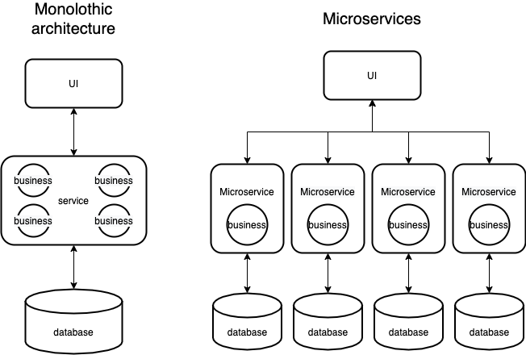
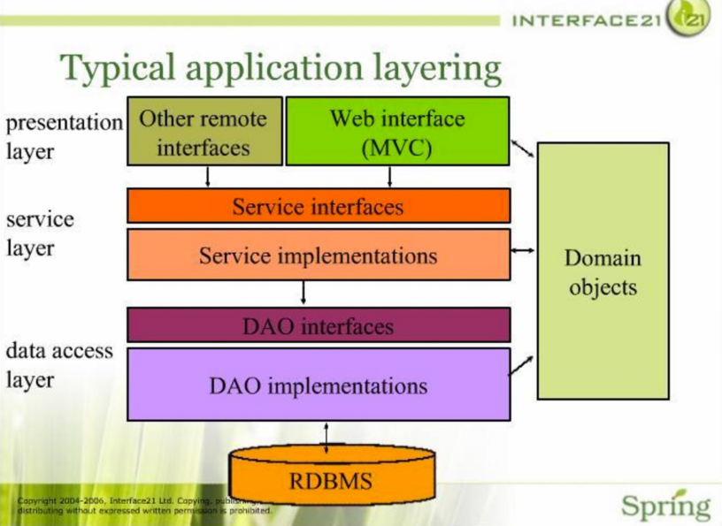

Spring에서는 @Controller, @Service, @Repository 어노테이션을 사용해 클래스를 bean으로 등록하고 사용하도록 한다.  
아래 사진은 클라이언트의 요청이 들어오고 행위가 수행되는 하나의 흐름을 간단히 도식화한 것이다.  

---

controller와 repository에 대해서 간단히 알아보자.
- `@Controller`: 클라이언트의 요청을 받아 어떠한 처리를 할지 지시하고, 처리에 의한 응답을 클라이언트에 보내는 계층이다.
- `@Repository`: 행위에 따라 데이터베이스에 생성, 조회, 수정, 삭제 등의 처리를 하기 위한 계층이다.

---
## Service Layer란?
그렇다면 service에서는 무슨 일을 수행해야 하는가? 라고 묻는다면, 많은 개발자는 `핵심 비즈니스 로직을 수행해요`라고 할 것이다.  
핵심 비즈니스 로직이라는 것은 무엇일까?

다음의 예시 코드는 값에 대한 **유효성 검증부터 중복 검사, table에 사람을 추가하는 행위까지** 모든 중심 로직을 service에서 수행하도록 한 구현이다.
```java
@Service
public class PersonService {
    private final PersonDao personDao;

    public PersonService(PersonDao personDao) { //DI
        this.personDao = personDao;
    }

    @Transactional
    public void addPerson(String name, int age) {
        if (name == null || name.isBlank()) {
            throw new IllegalArgumentException("옳지 않은 이름입니다.");
        }
        if (age < 0) {
            throw new IllegalArgumentException("옳지 않은 나이입니다.");
        }
        
        List<String> peopleNames = personDao.findAllNames();
        for (String peopleName: peopleNames) {
            if (peopleName.equals(name)) {
                throw new IllegalArgumentException("같은 이름이 존재합니다.");
            }
        }

        personDao.insert(name, age);
    }
}
```  
---
우리는 java를 이용한 객체지향 프로그래밍을 하고 있다.  
위의 구현은 객체지향 프로그래밍이라기보다는 절차지향 프로그래밍에 가깝다.  
절차지향 프로그래밍은 컴퓨터가 수행하는 로직의 순서에 맞게 프로그래밍을 하는 것이다.  
정반대 개념은 아니지만, 객체지향 프로그래밍이란 수행하고자 하는 프로그래밍 로직을 상태와 행위로 이루어진 객체들의 모임으로 수행해나가는 것이다.  
어떠한 `행위`를 맡길 많은 객체를 생성하고, 행위를 수행할 `책임`을 맡은 객체에 `상태`를 부여한다.  
그렇다면 service가 아닌 각 객체인 도메인이 그야말로 `핵심 비즈니스 로직`을 가지고 있는 것이 아닌가?
---
다음 예시는 `Person`이라는 객체에 값 검증의 책임을 넘기고, service는 검증된 person을 추가해달라고 요청하도록 구현해보았다.

```java
@Service
public class PersonService {
    private final PersonDao personDao;

    public PersonService(PersonDao personDao) { //DI
        this.personDao = personDao;
    }

    @Transactional
    public void addPerson(String name, int age) {
        Person person = new Person(name, age);
        List<Person> people = personDao.findAll();
        if (people.contains(person)) {
            throw new IllegalArgumentException("중복되는 사람이 존재합니다");
        }

        personDao.insert(person);
    }
}
```  

유효성 검증이라는 책임이 Person 객체로 넘어가면서 더욱 간단해진 service를 알 수 있다.  
`핵심 비즈니스 로직 수행`이 아니라면 service는 어떠한 역할을 맡는 것이 좋을까?
---

## Service layer의 역할
Spring framework는 @Service를 어떠한 이유로 만들었고, 어떠한 목적으로 사용할 것을 장려하고 있을까?  
다음은 Spring에서 정의하고 있는 `@Service`이다.

> Indicates that an annotated class is a "Service", originally defined by Domain-Driven Design (Evans, 2003) as "an operation offered as an interface that stands alone in the model, with no encapsulated state."
May also indicate that a class is a "Business Service Facade" (in the Core J2EE patterns sense), or something similar. This annotation is a general-purpose stereotype and individual teams may narrow their semantics and use as appropriate.

요약하자면 도메인 주도 개발에서 사용하는 `MicroService`로 사용할 수도, 어떠한 행위를 수행하기 위해 객체들의 비즈니스 로직을 연결해주는 역할을 할 수도 있다는 것이다. 이 경우는 `Monolothic`라고 볼 수 있다.  
이해를 돕기 위해 간단히 그림으로 비교해보았다.  
  
이 두 가지 방식은 설계에 따라 혹은 취향에 따라 달라질 수 있다.  
실제로 공식문서에도 `팀에서 원하는 방향으로 구현하라!`고 서술되어 있다.

---

`리팩토링`의 저자로 유명한 `마틴 파울러`는 서비스 계층을 아래와 같이 정의했다.
> It encapsulates the application's business logic, controlling transactions and coor-dinating responses in the implementation of its operations.

애플리케이션 로직을 캡슐화하며, 행위를 구현하면서, 트랜잭션을 제어하고, 응답을 조정한다고 하였다.  
여기서 오늘 우리가 집중할 것은 `애플리케이션 로직의 캡술화`와 `행위를 구현`한다는 것이다.    
도메인 객체가 가진 비즈니스 로직은 숨겨주면서, 하나의 행위를 구현해나가는 것이다.

---

> **상태를 가진 도메인 객체에 메시지를 보내며 원하는 행위를 수행해나가는 것**

Service는 결국 핵심 비즈니스 로직의 구현이라기보다는 위와 같이 정의할 수 있다.  
기본적으로 dao와 의존성을 가지며 필요한 행위를 호출하고, 설계에 따라 계층이 명확히 분리되어 있다면 다른 Service를 참조할 수도 있다.  
모든 로직이 Service에 들어가서 비즈니스를 수행하지 않도록 노력해야 한다.

그뿐만 아니라, 계층 구조로 나눠진 구현을 한다면 같은 행위 수행을 위한 client의 요청이 바뀐다면 controller에서 변화가 이루어져야 한다.  
service가 달라질 필요가 없을 뿐만 아니라, 언제든지 다른 service로 바뀌어도 controller에서 받는 값은 변함이 없어야 한다.

---

## 결론
  
사진은 전형적인 spring의 계층 구조이다.  
그림에도 잘 나와 있듯이 핵심 로직을 수행하는 도메인 객체와는 별개로 구성되어 있다.

구현하다 보면 Service가 어떠한 로직을 가지고 행위를 수행하는 경우가 더러 있다.  
그럴 때마다 우리가 객체지향 프로그래밍을 하고 있음을 명심하고 도메인 객체의 임무를 침범하고 있지는 않은지, 책임을 부여할 또 다른 객체가 필요한 것은 아닌지 고민해보도록 하자.

---

### 참고 사이트
- [martinfowler](https://martinfowler.com/eaaCatalog/serviceLayer.html)  
- [monolithic vs microservice](https://www.codebyamir.com/blog/monolithic-vs-microservices-architecture)
- [monolithic vs microservice 2](https://lion-king.tistory.com/entry/%EB%A7%88%EC%9D%B4%ED%81%AC%EB%A1%9C-%EC%84%9C%EB%B9%84%EC%8A%A4-vs-%EB%AA%A8%EB%86%80%EB%A6%AC%EC%8B%9D-%EC%95%84%ED%82%A4%ED%85%8D%EC%B2%98-MicroService-vs-Monolithic-Architecture-%EA%B0%84%EB%8B%A8-%EC%86%8C%EA%B0%9C-%EB%B0%8F-%EC%A3%BC%EA%B4%80%EC%A0%81-%EC%9D%98%EA%B2%AC)  
- [DDD](https://medium.com/modern-software-architecture/modern-software-architecture-1-domain-driven-design-f06fad8695f9)  
