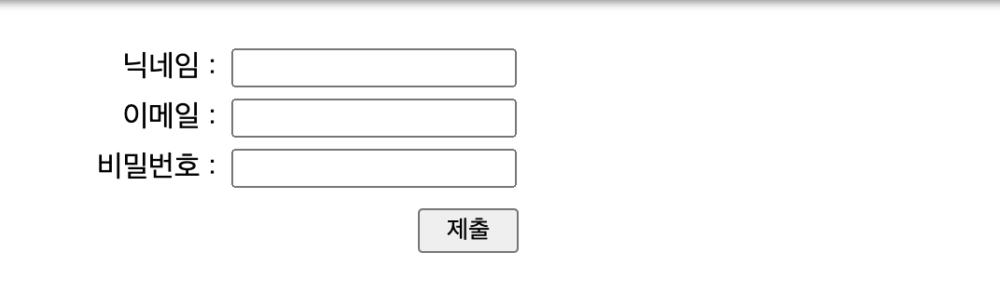
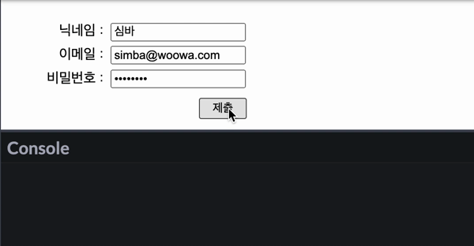
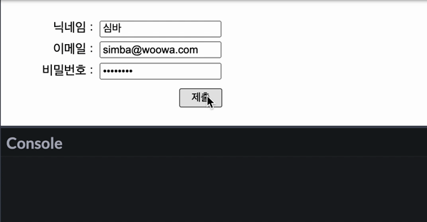
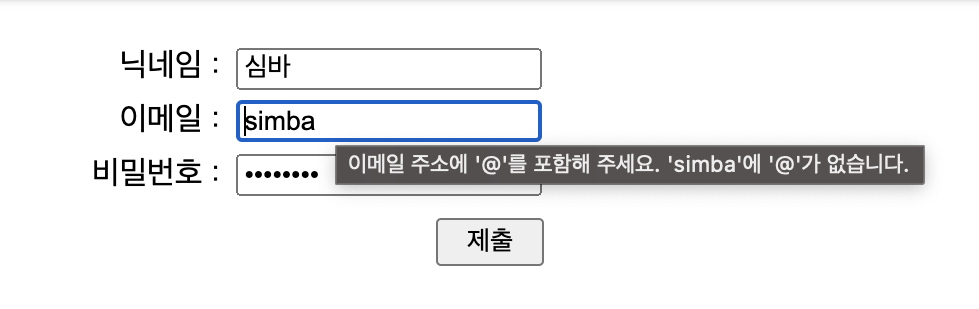
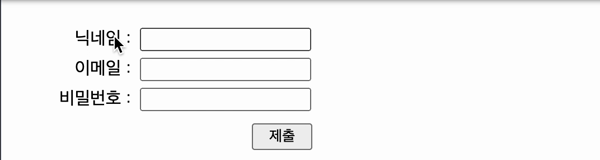

이번 글에서는 "HTML `<form>` 엘리먼트 잘 쓰는 법"에 대해 공유하려고한다.

사실 제목은 거창하게 지었지만, 개인적으로 우아한테크코스에 참여하기 전에 알았으면 좋았을 것 같은 `<form>` 엘리먼트에 대한 내용을 정리해 보았다.

누군가에게는 당연한 내용일 수 있지만, 나처럼 `<form>` 엘리먼트에 대해 잘 모르는 사람에게 도움이 되었으면 한다.

## 1. `<form>` 엘리먼트

본론에 들어가기전 `<form>` 엘리먼트에 대해 간략하게 설명하자면, `<form>` 엘리먼트는 사용자로부터 값을 입력을 받는 양식을 만들기 위해서 사용한다.

```HTML
<form>
  <label for="name">닉네임 :</label>
  <input type="text" name="name" id="name">

  <label for="email">이메일 :</label>
  <input type="email" name="email" id="email">

  <label for="password">비밀번호 :</label>
  <input type="password" name="password" id="password">

  <button>제출</button>
</form>
```



입력 양식은 위의 예시와 같이, `<form>` 엘리먼트 내부에 `<input>` 과 `<button>` 같은 11개의 하위 엘리먼트 중 필요한 엘리먼트를 조합하여 만들 수 있다.

## 2. 사용자 입력 가져오기

1. **`'submit'` 이벤트**

   앞서 말한 것처럼 `<form>` 엘리먼트는 JavaScript 코드에서 사용자 입력을 가져오기 위해 사용하는데, 이를 위해 사용자의 제출하는 동작을 먼저 감지해야한다.

   ```HTML
   <form>
    ...
    <button>제출</button>
   <form>
   ```

   ```javascript
   const signupForm = document.querySelector('form');

   signupForm.addEventListener('submit', event => {
     event.preventDefault(); // *

     console.log('제출이 완료되었습니다.');
   });
   ```

   

   `<form>` 엘리먼트에는 `'submit'` 이벤트를 바인드 해주고, `<form>` 엘리먼트 내부에는 `<button>` 엘리먼트를 추가하면, 클릭과 엔터키를 누르는 동작 대해 제출 동작을 감지할 수 있다.

   이를 몰랐을 때는 '확인' 이나 '제출' 이라는 버튼을 만들고, 클릭 이벤트와 엔터키를 누르는 동작에 대한 이벤트를 매번 모든 입력창에 바인드 했었다. 다소 번거로운 작업이었다.

   \* `'submit'`이벤트는 양식을 제출하는 고유 동작(페이지 이동 혹은 새로고침)이 함께 발생하는데, `preventDefault()` 를 사용하여 이를 막아줄 수 있다.

2. **`<input>`의 value**

   사용자의 제출 동작을 감지했다면, 이제 사용자가 입력한 정보를 가져올 수 있다.

   `'submit'`을 통해 이벤트가 발생하면, `event`의 `target`을 통해 `name` 속성을 지정한 요소의 값이 함께 전달된다. 이를 통해 `<input>`의 `value` 를 가져올 수 있다.

   ```javascript
   const signupForm = document.querySelector('form');

   signupForm.addEventListener('submit', event => {
     event.preventDefault();

     const nameInput = event.target['name'];

     console.log(nameInput);
     console.log(`제출된 닉네임은 ${nameInput.value}입니다.`);
   });
   ```

   

   이 방식 몰랐을 때는 `<input>` 엘리먼트에 `id` 를 지정해주고, `querySelector`로 하나씩 선택하여 `value` 를 가져왔었다. 이 또한 다소 번거러운 작업이었다.

3. **`<input>`의 type**

   `<input>`은 `'type'` 속성을 사용하면 데이터 형식을 지정할 수 있다.

   ```HTML
    <form>
      ...
      <input type="text" name="name" id="name">
      ...
      <input type="email" name="email" id="email">
      ...
      <input type="password" name="password" id="password">
      ...
    </form>
   ```

   

   데이터가 반드시 이메일 형식을 포함해야 하거나 자동으로 별표나 원으로 마스킹된다. 예시에서 사용한 이메일과 비밀번호 외에도 숫자, 날짜, 파일 등 22가지 `'type'`이 있다.

   **\* 그 외 속성**

   `<input>` 엘리먼트에는 `'type'` 외에도 여러가지 속성들이 있다. 자주 사용했던 몇 가지 속성만 소개하려고 한다.

   | 속성          | 설명                                                                                                                                             |
   | ------------- | ------------------------------------------------------------------------------------------------------------------------------------------------ |
   | `placeholder` | `'placeholder'`를 사용하면 입력해야할 데이터 형식의 예시나 간단한 설명을 표시할 수 있다. `<input>` 엘리먼트 내부에 쓰여있지만, `'value'`는 아니다.   |
   | `required`    | `'required'`를 사용하면 해당 `<input>` 엘리먼트를 필수로 작성해야 한다고 지정할 수 있다. 만약 입력 되지 않을 경우, 입력해 달라는 안내 문구가 나온다. |
   | `autofocus`   | `'autofocus'`를 사용하면 해당 `<input>` 엘리먼트가 페이지가 로드될 때 자동으로 포커스를 갖는다.                                                      |
   |               |                                                                                                                                                  |

4. **`<input>`과 `<label>`**

   `<label>` 엘리먼트를 사용하면 `<input>` 엘리먼트에 이름을 붙일 수 있는데, `<label>` 엘리먼트의 `'for'`의 값과 `<input>` 엘리먼트의 `'id'`의 값이 같으면 연결된다.

   ```HTML
    <form>
      <label for="name">닉네임 :</label>
      <input type="text" name="name" id="name" required>
      ...
    </form>
   ```

   

   `<label>` 엘리먼트를 클릭하면, 연결된 `<input>` 엘리먼트에 입력할 수 있도록 포커스 되거나 토글 된다. `<input>` 엘리먼트에 focus가 오면 스크린리더가 `<label>` 엘리먼트를 읽기 때문에 접근성 측면에서 중요하다.

5. **`<button>`의 type**

   `<form>` 엘리먼트의 `<button>` 엘리먼트는 `'submit'`, `'reset'`, `'button'` 세가지 타입을 지원한다.

   ```HTML
   <button type="submit"></button>

   <button type="reset"> </button>

   <button type="button"> </button>
   ```

   `'submit'` 은 사용자 입력 양식을 제출하는 역할을 하고, `'reset'` 은 사용자 입력 양식을 초기화하는 역할을 하며, `'button'` 은 그 외에 기능을 바인딩 하여 사용할 수 있다.

   `<form>` 엘리먼트의 `<button>` 엘리먼트는 기본 타입이 `'submit'`이지만, 접근성 측면에서 타입을 명시적으로 써주는 게 좋다. 또한 `'submit'` 버튼은 `<form>` 엘리먼트 내에 하나만 존재하는 것을 권장한다.

   이 세가지 타입은 `<input>` 엘리먼트에도 똑같이 존재하며 작동하는 기능도 일치한다. 차이가 있다면 `<button>` 엘리먼트는 `<input>` 엘리먼트와 달리 다른 엘리먼트들을 삽입할 수도 있으며, 더 자유롭게 스타일링이 가능하다.

## 3. 마무리

이 글은 서론에서도 말한 것처럼 실제 `<form>` 엘리먼트를 사용하면서 알게된 점을 공유하고자 작성하였다.

그래서 글을 읽으면서 `<form>` 엘리먼트에 대한 자세한 레퍼런스가 생략되어 있다는 생각이 들었을 수도 있을 것 같다.

혹시 그런 생각이 들었다면, 참고 자료에 `<form>` 엘리먼트에 대해 잘 정리되어 있는 블로그 글이 있으니 한번 읽어보는 것을 추천한다.

## 참고 자료

- [하루 기록 - `HTML <form> 엘리먼트 총정리 + <input>, <button>`](https://365kim.tistory.com/64)

- [MDN - HTML Forms](https://developer.mozilla.org/ko/docs/Web/HTML/Element/form)

- [w3schools: HTML Forms](https://www.w3schools.com/html/html_form_elements.asp)
