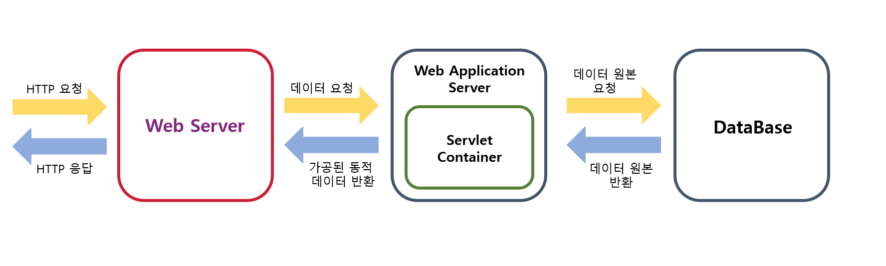

_Java Spring Boot_ 을 공부하면서 어떻게 구현해야 할지에 대한 내용뿐만이 아니라 어떻게 구성이 되어있는지에 대해서도 공부를 하게 되었습니다.
_Client_ 로부터 받은 _HTTP_ 요청을 알맞게 처리하여, _Spring_ 의 _Controller_ 로 넘겨주게 됩니다. 
이 때, _Spring_에서는 _WAS(Web Application Server)_ 의 역할을 _Apache Tomcat_ 이라는 서버가 작동하게 된다고 공부를 하였습니다.
하지만 좀 더 공부해보니, _Apache_ 라는 서버가 존재하는데, 이것은_WAS_ 와 또 다른 개념인 _Web Server_ 라는 것을 알게 되었습니다. 
두 단어가 상당히 비슷하여 헷갈리는 점이 많았습니다. 
이 때문에 _Spring Boot_ 의 구성 요소 중 _WAS_ 와 _Web Server_ 에 대해서 정리하고자 합니다.
---

## Web Server와 Apache Server
_Client_ 에서는 미리 정해진 _HTTP_ 규격에 맞게 요청을 보내게 됩니다.
이것을 해석하고 우리는 _Client_ 가 원하는 데이터를 보내주어야 합니다. 
여기서 _HTTP_ 를 해석하고, 그에 맞는 데이터 양식을 보내주는 것이 바로, _Web Server_ 가 할 일입니다. 
단순하게 요청을 데이터와 매칭을 하고, 이를 _HTTP_ 에 맞게 돌려주면 되기 때문에, 우리는 이러한 과정을 _Statc(정적)_ 인 웹서버라고도 합니다. 
정해진 데이터만 반환하면 된다는 점 때문에 별도의 프로그램 없이 _Web Server_ 만으로도 _HTML_ 을 반환하여 블로그를 만들 수도 있습니다.

이렇게 정해진 데이터만 가져와서 반환하면 된다는 점 때문에, 처리 속도가 빠르며 트래픽의 과부하를 잘 처리할 수 있다는 장점이 있습니다. 
또한, _HTTP_ 를 정해진 약속대로 빠르게 처리를 해주어 반환해야 하는 점 때문에 대부분이 _C Language_ 로 구현이 되어있습니다.
이번 글을 쓰기 전에 제가 헷갈렸었던 _Apache Server_ 가 바로 이 _Web Server_ 에 속하게 됩니다. 

_Apache HTTP Server_ 는  1995년에 _Apache_ 라는 비영리 재단에서 발표된 오픈 소스 _Web Server_ 로서 편리함 때문에 가장 높은 점유율을 가지고 있기도 합니다. 
그 이외에도 최근에 많이 쓰이고 있는 _Nginx_ 도 _Web Server_ 의 일종으로 볼 수가 있습니다.

## Web Application Server
방금 전 _Web Server_ 에서는 임의로 블로그를 만들 수가 있었습니다. 
하지만 현실에서의 _Web Program_ 들은 더욱 많은 기능을 요구할 때가 많습니다.  
예를 들면 블로그에서 블로그 주인이 로그인하면, 본인의 권한을 확인하고, 커뮤니티 사이트에서 자신이 쓴 글만 모아서 볼 수 있게 하는 기능 등이 있습니다. 
하지만 불행히도 기존의 _Web Server_ 에서는 _DB_ 와 함께 유동적으로 언급한 일들에 대해서 처리를 하지 못합니다. 
이를 해결하기 위해서,  우리는 _Web Application Server_ 라는 개념을 사용하게 됩니다.

_WAS (Web Application Server) _ 는 _Web Server_ 와 _Web Container_ 로 함께 구성이 됩니다. 
_Web Server_ 에서 _HTTP_ 요청을 받아서 _Web Container_ 로 넘겨주게 되면, 이를 내부 프로그램 로직의 처리에 따라서 데이터를 만들어서 다시 _Web Server_ 로 넘겨주게 됩니다. 
이때, 이전의 문제였던 요청에 따라서 새로 생성해야 하는 데이터에 대해서 _Web Server_ 가 처리하지 못하는 문제가 해결이 됩니다.
이렇게 로직을 더해서, 데이터를 가공한 후에 _Client_ 에게 반환해주는 작업을 _Dynamic(동적)_ 인 웹처리라고 할 수가 있습니다. 
이 때, _Java Spring_ 과 같은 어떤 언어, 프레임워크를 사용하냐를 선택할 수 있기 때문에 _Java_ ,_JavaScript_를 비롯하여 상대적으로 다양한 언어로 프로그램이 구성이 됩니다. 
다양한 언어를 기반으로 한 프로그램과 통신하기 위해서 만들어진 규약을 _CGI(Common Gateway Interface)_ 라고 합니다. 
로직에 집중 할 수 있게 만드는 부분이기에, DB와 상호 작용하여 데이터들을 가공하여 _Client_ 에게 반환할 수 있습니다. 
하지만 _Web Server_ 장점인 빠른 처리 및 트래픽 부하에 대해서는 약한 모습을 보이게 됩니다. 
_Java Spring Boot_ 도 정해진 데이터만 반환하는 것이 아닌 요청에 따라서 데이터를 처리하여 DB에 영향을 주거나 사용자마다 다른 값들을 반환할 수 있는데,  _Apache Tomcat_ 가 내장이 되어있기 때문입니다. 

_Apache Tomcat_ 은 _Apache_ 라는 _Apache HTTP Server_ 와 같은 곳에서 개발이 되었습니다. 

_Servlet Container_ 개념으로 개발이 되었으며 데이터의 동적인 처리를 할 수 있는 _WAS_ 의 역할을 수행할 수 있습니다.

하지만 사실 _Apache Tomcat Server_ 도 완벽한 _WAS_의 역할을 하고 있지 않다고 볼 수 있습니다.

## _Apache Tomcat_ 와 _Servlet_
_Spring Boot_ 에서는 _Servlet_ 을 단위로 하여 _Client_ 의 요청을 처리하게 됩니다. 
_Servlet_ 은 _Java_ 에서 _Thread_기반으로 _Client_ 요청에 대해서 _Dynamic_하게 작동하는 구성요소입니다. 
이 때, _Interface_ 인 _Servlet_을 구현한 추상 객체를 상속받아 구현되어있습니다. 
요청에 따라서 각기 다른 Servlet이 실행이 됩니다.
요청에 맞는 _Servlet_ 을 연결하여 통신하고, _Servlet_에 대한 수명 관리를 해주는 것이 바로 _Servlet Container_ 입니다. 
_Apache Tomcat_ 은 _Servlet Container_라고 볼 수가 있습니다. 
또한, _Servlet Container_ 임에도 불구하고 _JSP_ 를 처리를 해주는 기능도 함께 포함하고 있습니다.

이렇게 필요한 동적인 처리를 모두 해주는데, 완벽히 WAS로 부를 수 없는지에 대해서 의아해할 수 있습니다. 
_Java_ 진영의 역사를 보자면, _Java EE_ 라는 기업 전용 자바 플랫폼의 단점들을 해결하면서 필요한 부분만 적용한 것이 _Spring Boot_라고 볼 수 있습니다. 
하지만 이러한 과정에서 _Java EE_ 기능 중 분산 트랜잭션과 같은 다른 _Server_ 와의 상호작용도 할 수 있는 거대한 _Server_ 를 운용하기 위한 기능이 제외되게 되었습니다. 
_WAS_ 에서는 이런 기능들을 모두 포함해야 완성된 서버로 보게 되므로, 완벽한 _WAS_로 분류하지 않게 되었습니다.

## _Spring Boot_ 에서의 _Apache Tomcat_
그럼에도 불구하고, _Spring Boot_ 에서는 _Servlet_ 을 관리하여 원하는 자료를 생성하여 반환할 수 있다는 점, 그리고 _JSP_ 도 사용할 수 있다는 점 때문에 기본적으로 _Apache Tomcat_ 을 내장하여 사용하고 있습니다.

이렇게 기본적으로 내장되어 사용하고 있기 때문에 저희는 _Apache Server_ 나 _Apache Tomcat_ 에 대한 지식없이도 _Spring Boot_ 로 빠르게 서버를 구성할 수가 있습니다.
자동으로 내장 Tomcat을 사용하지만, 빠른 정적인 처리나 _proxy_ 를 사용하기 위해서 앞서 설명하였던 _Apache Server_ 와도 연동하여 사용합니다.

## Reference
- [Apache Server 공식문서](https://httpd.apache.org/)
- [Apache Server vs Apache Tomcat](https://www.geeksforgeeks.org/difference-between-apache-tomcat-server-and-apache-web-server/)
- [웹서버 vs 애플리케이션 서버 vs 서블릿 컨테이너](https://pjh3749.tistory.com/267)
- [3 Difference between Web Server vs Application vs Servlet Containers in Java JEE](https://www.java67.com/2016/06/3-difference-between-web-server-vs-application-server-vs-servlet-container.html)

