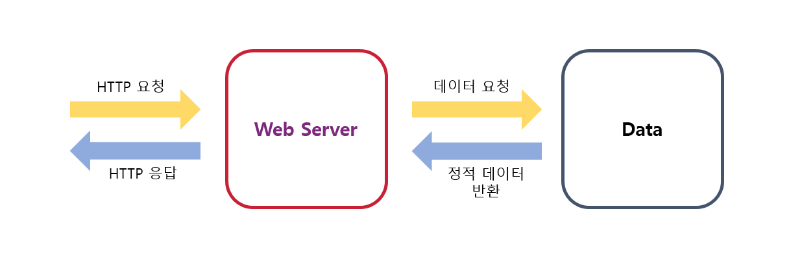
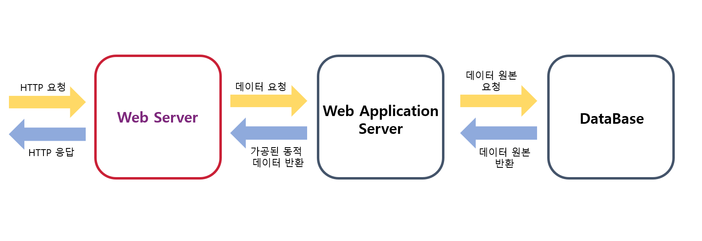
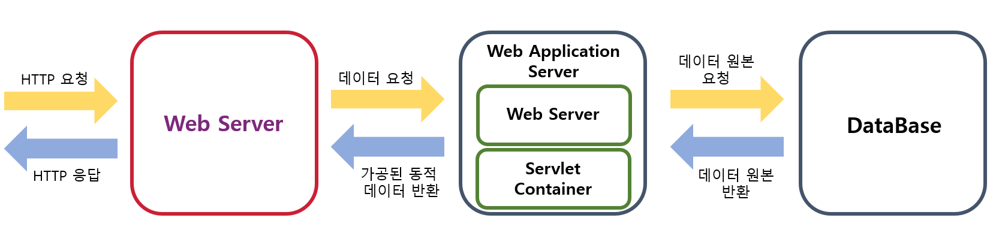
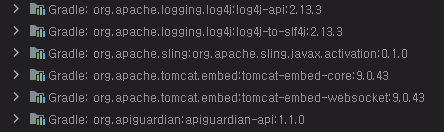
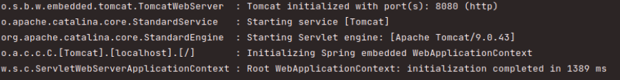
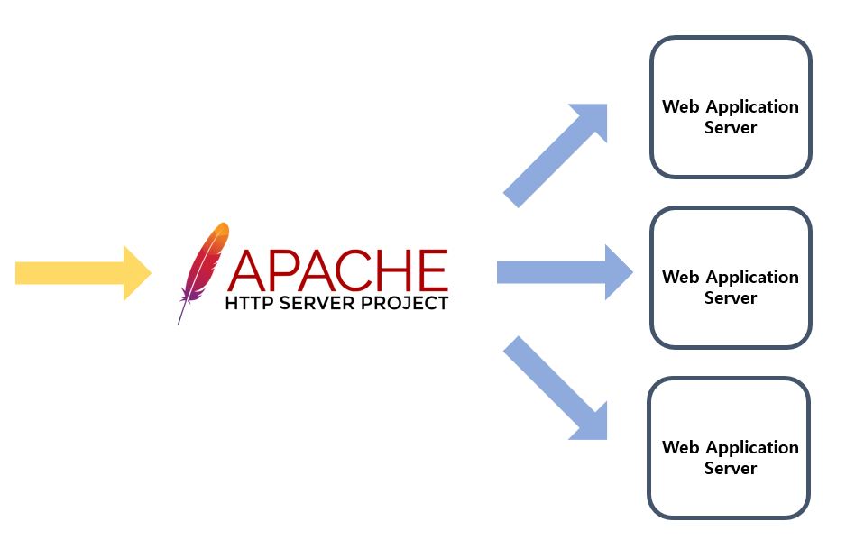

_Spring Boot_ 을 공부하면서 어떻게 구성이 되어있는지도 공부를 하게 되었습니다.
전체적인 흐름은 _Client_ 로부터 받은 _HTTP_ 요청을 알맞게 처리하여, _Controller_ 로 넘겨주게 됩니다. 
이때, 해당 기능을 실행하는 _WAS(Web Application Server)_ 의 역할을 _Apache Tomcat_ 이라는 서버가 하게 된다고 공부를 하였습니다.
하지만 비슷한 이름을 가진 _Apache HTTP Server_ 라는 서버도 존재합니다. 
이 과정에서 _WAS_ 와 또 다른 개념인 _Web Server_ 라는 것을 알게 되었습니다. 
서버에서 쓰이는 개념들 중 단어들이 상당히 비슷하여 헷갈리는 점이 많았습니다. 
_Spring Boot_ 를 동작시키는 구성 요소 중 _Apache HTTP Server_ 와 _Apache Tomcat_ 에 대해서 정리하고자 합니다.

## _Web Server_ 와 _Apache Server_
_Client_ 에서는 미리 정해진 _HTTP_ 규격에 맞게 요청을 보내게 됩니다.
이것을 해석하고 우리는 _Client_ 가 원하는 데이터를 보내주어야 합니다. 
여기서 _HTTP_ 를 해석하고, 그에 맞는 데이터 형식으로 보내주는 것이 _Web Server_ 가 할 일입니다. 
요청을 데이터와 단순하게 매칭을 하고, 이를 _HTTP_ 에 맞게 돌려주면 되기 때문에, 이러한 과정을 _Static(정적)_ 인 웹서버라고도 합니다. 
_HTML_ , _CSS_ , 그리고 사진과 같은 별도의 데이터 수정 없이 반환되는 자료 형식들이 해당됩니다.
이 때문에 별도의 프로그램 없이 _Web Server_ 만으로도 _URL_ 과 대응하여 _HTML_ 을 반환하여 블로그를 만들 수도 있습니다.

정해진 데이터만 가져와서 반환하면 된다는 점 때문에, 처리 속도가 빠르며 트래픽의 과부하를 잘 처리할 수 있다는 장점이 있습니다. 
또한, _HTTP_ 를 정해진 약속대로 빠르게 처리를 해주어 반환해야 하는 점 때문에 대부분이 _C_ 로 구현이 되어있습니다.
이번 글을 쓰기 전에 제가 헷갈렸었던 _Apache HTTP Server_ 가 바로 이 _Web Server_ 에 속하게 됩니다. 

_Apache HTTP Server_ 는  1995년에 _Apache_ 라는 비영리 재단에서 발표된 오픈 소스 _Web Server_ 입니다.
가장 높은 점유율을 가지고 있는 _Web Server_ 이기도 합니다. 
그 이외에도 최근에 많이 쓰이고 있는 _Nginx_ 도 _Web Server_ 의 일종으로 볼 수가 있습니다.

## _Web Application Server_
_Web Server_ 에서는 임의로 블로그를 만들 수가 있었습니다. 
하지만 현실에서의 _Web Application_ 들은 더욱더 많은 기능을 요구할 때가 많습니다.  
예를 들면 커뮤니티 사이트에서 자신이 쓴 글만 모아서 볼 수 있게 하는 기능 등이 있습니다. 
하지만 기존의 _Web Server_ 에서는 _DB_ 와 함께 유동적으로 로직에 따라 요청을 처리하지 못합니다. 
이를 해결하기 위해서 _Web Application Server_ 를 사용하게 됩니다.

_WAS (Web Application Server)_ 는 일부 _Web Server_ 기능과 _Web Container_ 로 함께 구성됩니다. 
앞단의 _Web Server_ 는 _HTTP_ 요청을 받아서 _Web Container_ 로 넘겨주게 됩니다.
_Web Container_ 이를 내부 프로그램 로직의 처리에 따라서 데이터를 만들어서 _Web Server_ 로 다시 전달하게 됩니다. 
_Java_ 에서는 이를 _Servlet_ 을 통해서 처리하기 때문에 _Servlet Container_ 라고도 부릅니다.
앞서 언급한 같은 _URL_ 이지만 로그인한 사용자에 따라 자신이 쓴 글이 보이게 하는 등의 로직이 필요한 기능을 추가할 수가 있습니다.
요청 조건에 따라서 _Web Server_ 가 유연하게 처리하지 못하는 문제가 해결됩니다. 
이렇게 데이터를 가공한 후에 _Client_ 에게 반환해주는 작업을 _Dynamic(동적)_ 인 웹처리라고 합니다.  
_Web Container_ 를 통해, 개발자는 로직에 집중을 할 수 있고, DB와 상호 작용을 통해 데이터들을 가공하여 _Client_ 에게 반환할 수 있습니다.
_WAS_ 는 _Java_ ,_JavaScript_ 를 비롯하여 다양한 언어로 프로그램이 구성되어, 원하는 프레임워크를 선택할 수가 있습니다.
하지만 _Web Server_ 장점인 빠른 처리 및 트래픽 부하에 대해서는 약한 모습을 보이게 됩니다.  
_Spring Boot_ 가 요청에 따라서 데이터를 처리 및 DB에 영향을 주는 것은 _Apache Tomcat_ 가 내장이 되어있기 때문입니다. 
_Apache Tomcat_ 은 _Apache HTTP Server_ 가 개발된 같은 _Apache_ 재단에서 개발이 되었습니다. 

_Servlet Container_ 개념으로 개발이 되었으며 데이터의 동적인 처리를 할 수 있습니다.
이 때, 외부 요청을 처리하는 _Web Server_ 의 기능을 일부 내장하고 있기 때문에 _WAS_ 로 간주하기도 합니다.

하지만 사실 _Apache Tomcat_ 도 완벽한 _WAS_ 의 역할을 하고 있지 않다고 볼 수 있습니다.

## _Apache Tomcat_ 은 _Servlet Container_
_Spring Boot_ 에서는 _Servlet_ 을 단위로 하여 _Client_ 의 요청을 처리하게 됩니다. 
_Servlet_ 은 _Java_ 에서 _Thread_ 기반으로 _Client_ 요청에 대해서 _Dynamic_ 하게 작동하는 구성요소입니다. 
이때, _Interface_ 인 _Servlet_ 을 구현한 추상 객체를 상속받아 구현되어있습니다. 
요청에 따라서 각기 다른 _Servlet_ 이 실행이 됩니다.
_Servlet_ 을 요청에 연결하고, 수명 관리를 해주는 것이 바로 _Servlet Container_ 입니다.  
_Apache Tomcat_ 은 기본적으로는 _Servlet Container_ 이나 자체적으로 _Web Server_ 가 내장이 되어있습니다. 
이 때문에 외부의 _HTTP_ 요청을 받을 수 있어서 _Apache Tomcat_ 은 _WAS_ 기능을 일부 가지고 있는 _Servlet Container_ 라고 볼 수가 있습니다.  
필요한 동적 처리를 모두 해주는데, 완벽히 _WAS_ 로 부를 수 없는지에 대해서 의아해할 수 있습니다. 
_Java_ 진영의 역사를 보자면, _Java EE_ 라는 기업 전용 자바 플랫폼의 단점들을 해결하면서 필요한 부분만 적용한 것이 _Spring Boot_ 라고 볼 수 있습니다. 
하지만 이 과정에서 분산 트랜잭션과 같은 기능들이 제외되게 되었습니다. 
이런 기능들을 모두 포함해야 _WAS_ 로 보게 되므로, 해당 기능이 없는 _Apache Tomcat_ 은 완벽한 _WAS_ 로 분류하지 않게 되었습니다.

## _Spring Boot_ 에서의 _Apache Tomcat_
_Spring Boot_ 에서는 _HTTP_ 요청을 받고 _Servlet_ 을 관리할 수 있기 때문에 기본적으로 _Apache Tomcat_ 을 내장하여 사용하고 있습니다.
먼저, _Gradle_ 에서 의존성을 살펴보게 되면, _Tomcat_ 이 내장되어 있음을 확인할 수가 있습니다.

실제로 _Spring Boot_ 를 실행시키게 되면, 다음과 같이 _Tomcat_ 이 실행 되었음을 알 수가 있습니다. 

기본적으로 내장되어 사용하고 있기 때문에 저희는 _Apache Server_ 나 _Apache Tomcat_ 에 대한 지식없이도 _Spring Boot_ 에서 동적인 웹처리를 할수가 있었습니다.

## _Web Server_ 와 _WAS_ 의 상호 관계
유연성이 더 좋은 _WAS_ 가 _Web Server_ 보다 더 나은 것이라고 생각할 수 도 있습니다.
하지만 실제로는 _Apache HTTP Server_ 나 _Nginx_ 와 같은 _Web Server_ 를 _WAS_ 와 함께 쓰고 있습니다.
이유는 다음과 같습니다.  
먼저 정적인 응답을 처리할 때 문제입니다. 
_WAS_ 및 _Web Server_ 둘 다 정적인 파일을 처리할 수가 있습니다.
하지만 _WAS_ 에서 응답을 처리할 때에는 외부 프로그램, _Servlet Container_ 등의 존재 때문에 부하가 많이 걸리게 됩니다.
이 때문에 상대적으로 가벼운 _Web Server_ 가 정적 요청에서는 유리합니다.  
두 번째로는 _Load Balancing_ 의 적용입니다.
하나의 _WAS_ 에 너무 많은 요청이 몰리게 되면, 데이터 처리할 것이 많아져서 CPU에 부하가 오게 됩니다.
이를 여러 _WAS_ 로 구성을 하여, 요청을 분산시킬 수가 있습니다.
요청을 분산시키는 기능이 필요하게 되는데, 이를 _Load Balancing_ 이라고 합니다.

_Apache HTTP Server_ 와 같은 _Web Server_ 는 이 기능을 가지고 있기 때문에 _WAS_ 앞단에 배치하게 됩니다.
이 같은 이유 때문에 하나의 종류만 쓰는 것이 아닌 _Web Server_ 와 _WAS_ 를 적절히 배치하여 사용하게 됩니다. 

## Reference
- [Apache Server 공식문서](https://httpd.apache.org/)
- [Apache Server vs Apache Tomcat](https://www.geeksforgeeks.org/difference-between-apache-tomcat-server-and-apache-web-server/)
- [웹서버 vs 애플리케이션 서버 vs 서블릿 컨테이너](https://pjh3749.tistory.com/267)
- [3 Difference between Web Server vs Application vs Servlet Containers in Java JEE](https://www.java67.com/2016/06/3-difference-between-web-server-vs-application-server-vs-servlet-container.html)
- [Apache Server Load Balancing 기능](https://httpd.apache.org/docs/2.4/mod/mod_proxy_balancer.html)

