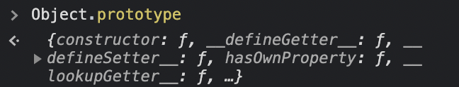

## Prototype

JS에서 프로토타입이란, [객체의 특성을 다른 객체로 상속하는 것을 가능하게 하는 메커니즘](https://developer.mozilla.org/en-US/docs/Learn/JavaScript/Objects/Object_prototypes)이다. (엄밀히 말하자면 '상속'이라는 단어는 적절치 않을 수 있다. 그 이유는 밑에서 다시 다루어 보겠지만, 일단은 일관된 이해를 돕기 위해 이 표현을 계속 사용하려고 한다.)

### `[[Prototype]]`

간단한 예시 코드를 살펴보자. 여기서 `Object.create()`는 지정된 프로토타입 객체와 연결된 빈 객체를 반환하는 메서드이지만, 여기서는 서로 다른 두 객체를 이어주는 연결 고리 정도로만 생각해도 좋다.

```js
const obj = {
  a: 2,
};

const anotherObj = Object.create(obj);

console.log(anotherObj); // {}
console.log(anotherObj.a); // 2
```

콘솔의 결과를 확인해보면, 분명 `anotherObj`는 빈 객체지만 `obj`의 `a`를 참조하여 값을 출력했다. `anotherObj`에서 `obj`의 프로퍼티를 어떻게 찾을 수 있었을까?

기본적으로 JS의 모든 객체는 `[[Prototype]]`이라고 하는 내부 프로퍼티를 가진다. 이 프로퍼티의 역할을 아주 단순하게 표현하자면 자신에게 연결된 프로토타입 객체에 대한 참조이다. 위의 예시에서 `anotherObj`는 해당 프로퍼티를 통해 연결된 객체인 `obj`로 접근한 뒤, 일치하는 키 값을 찾은 것이다.

`Object.create()`를 사용하지 않아도 대부분의 객체는 생성 시 각자의 프로토타입 객체와 연결되어 있다. 그리고 이처럼 연결된 두 객체 간의 관계를 **Prototype Link**라고 한다. (확인해보고 싶다면 브라우저 콘솔에서 아무 타입의 값을 변수에 할당한 뒤 `__proto__` 프로퍼티 접근 혹은 `getPrototypeOf()` 메서드 호출을 시도해보길 바란다.)

> `[[Prototype]]`은 내부 프로퍼티이기 때문에 특정 객체의 프로토타입 객체로 직접 접근하는 공식적인 방법은 존재하지 않는다. 하지만 대부분의 모던 브라우저에서 `__proto__`라는 비공식 프로퍼티를 지원하며, ES6부터 `getPrototypeOf()` 메서드를 통해 객체에 연결된 프로토타입 객체를 확인할 수 있다.

만약 `anotherObj`에서 다른 키 값을 탐색한다면 어떻게 될까?

```js
console.log(anotherObj.b); // undefined
```

어떠한 객체에서 프로퍼티의 존재 여부를 확인하는 과정을 간단히 요약해 보자면,

1. 탐색을 시작한 객체에서 프로퍼티가 존재하지 않으면 연결된 프로토타입 객체로 이동하여 탐색한다.
2. 해당 프로토타입 객체에도 프로퍼티가 존재하지 않으면 그 객체와 연결된 프로토타입 객체로 이동하여 탐색한다. (프로토타입 객체도 자신의 프로토타입 객체를 가질 수 있다.)
3. 프로토타입 객체의 연쇄적인 흐름 속에서 프로퍼티를 찾았다면 그 값을 반환한다. 하지만 더 이상 연결된 프로토타입 객체가 없는 데도 프로퍼티가 존재하지 않는다면 탐색을 종료하고 `undefined`를 반환한다.

3번 과정에서 언급했다시피, 객체와 객체를 이어주는 링크는 한 개가 아닐 수도 있다. 이처럼 다수의 객체가 서로 링크로 연결되어 있다면 이 링크들의 연쇄적인 흐름을 **Prototype Chain**이라고 한다.

결국, 객체는 이 체인을 통해 자신이 가지고 있지 않은 특정 프로퍼티에 대한 참조를 다른 객체에 **위임**하여 해결할 수 있다.

### `Object.prototype`

JS에서 모든 Prototype Chain의 종착점에는 `Object.prototype`이라는 객체가 자리하고 있다. 이 객체는 모든 [Built-in 객체](https://developer.mozilla.org/en-US/docs/Web/JavaScript/Reference/Global_Objects)들의 원형(原型) 객체이며, Built-in 객체들의 다양한 공통 특성들을 한 데 가진다. (원형의 의미를 가진 '프로토타입'이라는 단어가 사용된 이유를 여기서 짐작해볼 수 있겠다.)


<br />

`Object.prototype`과 연결된 객체마다 필요에 의하여 기능들을 상속받고 확장해 나간다. 그러한 과정에서 공통된 특성들은 하나의 프로토타입 객체에 모아 그것들을 참조하게 하여 메모리 자원을 보다 효율적으로 사용할 수 있다. 또한 프로토타입 객체에서 파생된 객체들의 프로퍼티를 수정하고 싶을 때, 그것들의 프로토타입 객체에만 선언함으로써 리팩토링의 강점을 취할 수도 있다.

### Prototype Object

그렇다면 아까부터 얘기한 프로토타입 객체는 도대체 뭐 하는 녀석일까? 프로토타입 객체란 공통된 특성(공통된 정도는 내장 Built-in 혹은 사용자 정의 등 쓰임새에 따라 다를 수 있다.)을 상속하기 위한 템플릿 객체이며, 생성자 역할을 할 수 있는 모든 함수에 내장된 객체다. 그렇기 때문에 함수의 `prototype` 프로퍼티를 통해 해당 객체에 접근과 객체 프로퍼티의 수정이 가능하다.

```js
function construct() {}

console.log(construct.prototype);
// {constructor: construct(), __proto__: Object}

construct.prototype.a = 2;

console.log(construct.prototype);
// {a: 2, constructor: construct(), __proto__: Object}
```

프로토타입 객체의 `constructor`라는 프로퍼티는 해당 객체의 생성자 함수를 가리킨다. 또한 이 객체 역시 `__proto__`를 가지고 있는 걸로 보아, 프로토타입 객체는 상위 프로토타입 객체의 확장이면서도 그 자체로 하위 객체의 프로토타입 객체가 될 수 있는 상대적 개념임을 짐작할 수 있다.

> 프로토타입 체인 상에서는 객체를 잇는 링크가 존재할 뿐, 이것들을 계층적으로 구분하는 건 조금 어색해 보인다. 하지만 프로토타입 객체의 상대적 관계에 대한 이해를 돕기 위해 상, 하위로 나누어 표현했다.

## Prototype Based- vs. Class Based-

### Class in ES6

JS는 객체 지향 언어지만 기존의 클래스 기반 프로그래밍 방식을 따르지 않으며 [프로토타입 기반 프로그래밍 방식](https://ko.wikipedia.org/wiki/%ED%94%84%EB%A1%9C%ED%86%A0%ED%83%80%EC%9E%85_%EA%B8%B0%EB%B0%98_%ED%94%84%EB%A1%9C%EA%B7%B8%EB%9E%98%EB%B0%8D)으로 동작한다. 하지만 ES6 이후로 JS 내에서도 클래스 문법이 출현하였는데, 잠시 두 코드가 메커니즘적으로 어떤 차이를 가질지 고민해보자.

```js
function Person(name) {
  this.name = name;
}

Person.prototype.say = function () {
  console.log(`Hi, My name is ${this.name}.`);
};

const crew = new Person('Kyle');

console.log(crew.say()); // Hi, My name is Kyle.
```

```js
class Person {
  constructor(name) {
    this.name = name;
  }

  say() {
    console.log(`Hi, My name is ${this.name}.`);
  }
}

const crew = new Person('Kyle');

console.log(crew.say()); // Hi, My name is Kyle.
```

두 코드의 결과는 동일하며, 동작 방식도 거의 차이가 없다. 즉 ES6 클래스 문법은 단지 생성자-프로토타입 패턴을 숨기기 위한 [Syntactic Sugar](https://www.techopedia.com/definition/10212/syntactic-sugar)에 불과하다. JS는 여전히 프로토타입 기반 언어이다.

그렇다면 클래스 기반 언어와 JS에서 다루는 클래스의 동작 방식은 구체적으로 어떻게 다른 걸까? (모든 프로토타입 기반 언어에서 클래스를 가지고 있는 것은 아니기에 JS로 한정하여 비교해보려 한다.)

클래스 기반 언어에서 클래스란 **'객체의 상태와 기능을 정의한 틀'**이며 생성될 객체에 대한 일종의 청사진으로 이해할 수 있다. 그리고 이것의 인스턴스 화를 통해 생성된 객체를 인스턴스라고 한다. 여기서 인스턴스는 클래스에서 정의된 모든 특성에 대한 복사본(copy)이기 때문에 두 개념은 개별적이며 서로 간의 참조는 존재하지 않는다.

반면에 프로토타입 기반 언어에서는 클래스 - 인스턴스의 개념이 아닌 오직 객체 개념만 존재한다. 다시 말하지만, ES6에 도입된 클래스 문법은 실제 클래스 패턴에 대한 모방일 뿐이다. 이것은 JS의 생성자 함수 패턴을 좀 더 클래스답게 보이기 위한 장치이며 생성된 객체는 함수의 프로토타입 객체에 연결되어 있다.

```js
class Person {}

const kyle = new Person();

console.log(kyle.__proto__);
// {constructor: class Person, __proto__: Object}
```

도입부에서 프로토타입 체계에서 '상속'이라는 표현은 적절치 않을 수 있다고 이야기했는데, 클래스 기반 언어의 관점으로 보았을 때 상속의 동작은 결국 인스턴스 화와 마찬가지로 copy에 기반한 동작이기 때문이다. JS에서 객체들이 동작하는 방식을 고려해본다면 상속보다는 오히려 링크를 통한 위임으로 바라보는 것이 더 적절하지 않을까.

### Trade-off

클래스 기반 언어와 비교해보았을 때, 프로토타입 기반 언어에 대한 우려의 시선도 적지 않다. 이는 주로 정적 vs. 동적 타입 시스템을 비교하며 우려하는 점과 대체로 비슷하다. 정확성, 안전성, 예측성의 관점에서 클래스는 대체로 타입과 비슷하므로 동적으로 프로퍼티를 변경할 수 있는 프로토타입에 비해 더 신뢰성 높은 코드를 작성할 수 있다고 하는 게 주요 의견이다.

프로토타입 방식의 장점을 설명할 때, 링크를 통해 여러 객체의 프로퍼티를 동적으로 수정할 수 있어 리팩토링의 이점을 얻을 수 있다고 이야기 한 적이 있다. 하지만 반대로 생각해보면 어느 한 군데에서 프로토타입 객체를 건드리게 되었을 때 다른 쪽에서 사이드이펙트가 나타나지 않으리라는 것을 보장할 수 없는 것도 위와 비슷한 맥락이다.

아직은 정적, 동적 타입 / 클래스, 프로토타입 기반 방식 등 여러 방법론에 대한 경험이 많지 않아 확실히 무엇이 좋고 나쁜지 얘기하기는 힘들 것 같다. 하지만 우선 JS를 사용하는 입장이라면, 언어에서 채택한 방식을 다른 방식과 비교하며 최대한 다양한 관점에서 이해하고 코드를 작성하는 것이 프로그래밍의 숙련도를 높이는 방법이라고 생각한다.

### Reference

- [프로토타입 이해하기](https://medium.com/@bluesh55/javascript-prototype-%EC%9D%B4%ED%95%B4%ED%95%98%EA%B8%B0-f8e67c286b67)
- [You Don't Know JS: this & Object Prototypes](https://github.com/getify/You-Dont-Know-JS/blob/1st-ed/this%20%26%20object%20prototypes/ch5.md)
