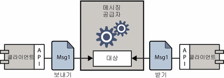
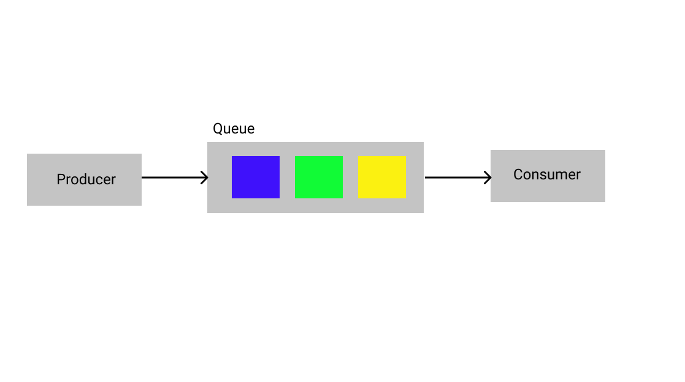
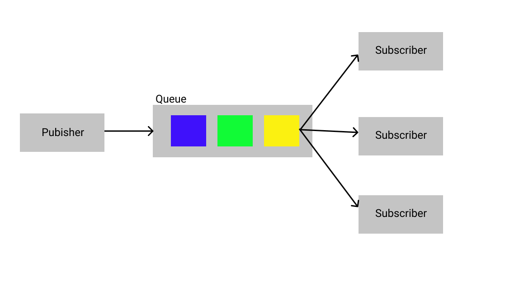

프로젝트를 진행함에 있어, 서버와 서버 사이에 메세지를 통해 비동기적으로 전달하는 방법이 필요했다. 관련된 개념인 Message Oriented Middleware(메세지 기반 미들웨어)에 대해 설명하고, 메세징의 두가지 방식인 메세징 큐와 Pub-Sub 메시지 전략을 비교한다.
<!-- end -->
 

---

## Message Oriented Middleware(MOM)

Message Oriented Middleware을 이해하기에 앞서 미들웨어의 개념을 먼저 알아보자. 미들웨어, Middle + (soft)ware , 소프트웨어 중간에 존재하여 상호작용을 하게 해주는 것이다. 대표적으로 Java서버를 DB와 연결해주는 JDBC를 들 수 있다.

`그렇다면 Message Oriented Middleware는 무엇일까?`

메세지를 기반으로한 미들웨어, 비동기 메세지를 통해 두 소프트웨어의 통신을 중개 하는 것이다.

출처: oracle docs

전달하는 데이터를 `Message`(메세지), 메세지를 보내는 클라이언트를 `Producer`(프로듀서), 메세지를 받는 클라이언틀를 `Consumer`(컨슈머), 메세징 공급자의 용어대신 `Message Broker`(메세지 중개인) 로 정의하여 이 글에서는 사용하겠다.

프로듀서는 api를 호출하여 메세지 중개인에게 메세지를 라우팅하여 전달하고, 메세지를 보낸 후에는 다른 작업을 계속해서 수행합니다. 중개인은 컨슈머가 메세지를 검색할 때까지 메세지를 보관합니다. 컨슈머는 전달된 데이터를 수신하고 처리한다.

이런 MOM 시스템은 느슨하게 결합된 시스템을 만들어내어, 각각의 주요 로직에만 집중하여 작업을 진행할 수 있다. 또한 중개자에 인터페이스를 추가하여 성능을 모니터링할 수 있으며, 분산처리와 확장성 측면에서도 이점을 가져 MSA(Micro Service Architecture)의 주요 기술로 사용된다.

MOM이 메세지를 전달하는 방식은 크게 메세지 큐 모델, Pub-Sub 모델 두가지로 분리된다.

---

## 메세지 큐(Queue) 모델

Queue는 First-In First-Out의 자료구조이다. 즉, 메시지 큐는 들어온 메세지 저장하고 들어온 순서대로  컨슈머에 전달되어 처리되는 구조이다.

이 때, 여러 컨슈머를 성정하면 높은 속도로 일을 처리할 수가 있다. 하나의 컨슈머에서만 처리를 보장하기 위해 컨슈머에 전달되어 처리되면 큐에서 삭제된다. 네트워크나 컨슈머의 문제가 생겼을 때, 나중에 메세지를 새로보내게 되는데, 이 결과로 순서를 보장하지는 못한다.

대표적인 예시가 정산 시스템이다. 정산은 속도가 빠르면 좋고, 순서는 상관없으며, 한번씩만 처리되는 것이 매우 중요하기 때문에 메세지 큐를 이용하기 매우 적합하다.

메세지 큐 모델을 기반으로 만들어진 기술은 Apache ActiveMQ, Amazon SQS, IBM Websphere MQ, RabbitMQ 등이 있다.

---

## Pub/Sub 모델

Pub/Sub 모델은 Publish/Subscribe를 축약형이다. 이 모델에서는 producer, consumer를 각각 publisher, subscriber라고 명명한다. 또한 topic을 단위로 카테고리를 구분한다.

뉴스나 블로그를 구독하여 한 곳에 받아 볼 수 있는 RSS 시스템이 가장 간단한 Pub-Sub 시스템이다. 글 작성자(publisher)가 블로그(topic)에 글을 올리게 되면, 이 블로그(topic)를 구독하고 있는 구독자(subsriber)에게 메세지를 던져준다.

즉 메세징 pub-sub 모델은 특정 토픽에 message가 오면 이 토픽을 구독하고 있는 모든 구독자에게 메세지를 전달해주고, 구독자는 이를 처리한다.

Pub/Sub 모델을 기반으로 만르어진 기술은 Apache Kafka, Google Cloud Pub/Sub 등이 있다.

---

### 정리
지금까지 Message Oriented Middleware에 대해 알아봤습니다. 다양한 메세징 기술들이 사용되고 있는데, 이 메세징 큐와 Pub/Sub 모델의 개념이 어떻게 적용되고 사용되는 지 공부하는데 도움이 되었으면 합니다.

### 참고 자료
- [What is message queuing?](https://www.cloudamqp.com/blog/what-is-message-queuing.html)
- [Comparing Publish-Subscribe Messaging and Message Queuing](https://dzone.com/articles/comparing-publish-subscribe-messaging-and-message)
- [Everything You Need to Know About Message Queues: A Complete Guide](https://medium.com/swlh/everything-you-need-to-know-about-message-queues-a-complete-guide-dbf190d001d7)
- [메시지 지향 미들웨어(Message-Oriented Middleware(MOM))](https://docs.oracle.com/cd/E19148-01/820-0532/6nc919fai/index.html)
