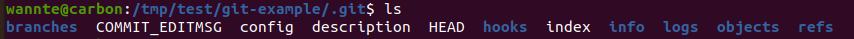
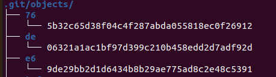
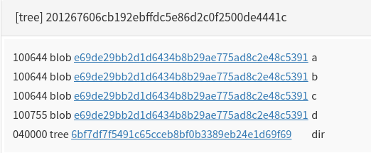
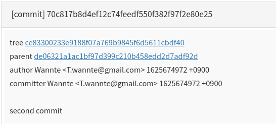
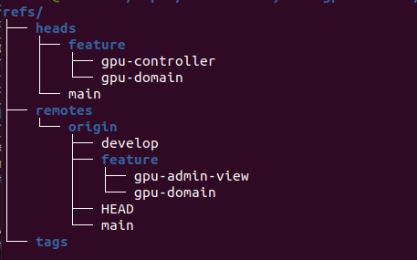
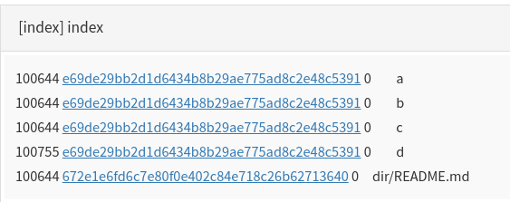

개발을 함에 있어 필수 요소가 된 git. 개발 과정에서의 수많은 커밋들과 브랜치, 파일들의 정보들이 모두 .git 안에서 관리되는데, 그 내부를 파헤쳐 본다. git을 어느 정도 사용해보고 읽는 것을 추천한다.

<!-- end -->

---

## .git 내부 구조

.git 폴더의 내부 구조는 위 캡처와 같다. git의 작동원리를 이해하는 데 도움이 되는 부분들을 위주로 설명을 진행해 나간다. 

[생활코딩 이고잉님의 gistory](https://github.com/egoing/gistory) 를 활용하면 쉽게 .git의 내부 파일들을 분석할 수 있으며, 이 글에서도 활용하고자 한다.

---

## /objects

git에서 활용하는 데이터들이 저장되는 곳이다. `tree` 명령어를 실행 시켜 보면 위와 같은 구조를 가진다. 2글자의 폴더 밑에 38글자의 파일명을 가지는 특이한 구조를 가진다.

objects의 구성은 실제 파일에 담긴 값들을 SHA1 해시한 값 40자 중 2자는 폴더명 38자는 파일명으로 두어 식별자로 활용한다. 해싱을 사용했을 때, 소스 코드의 일부만을 바꾸더라도 별개의 해시값이 되기 때문에, 파일 식별이 쉬워지게 된다. (추가로 SHA1 해시 처리 전, zlib으로 한번의 압축이 진행된다고 한다.)

저장되는 파일의 형태는 크게 3가지 blob, tree, commit으로 분리된다.

1. Blob
   
소스 코드, 이미지 등 다양한 파일의 데이터를 저장합니다. 파일의 메타 데이터를 저장하지 않고 데이터 자체만을 저장합니다. (파일명과 같은 메타데이터는 저장되지 않음) 그렇기 때문에, 동일한 소스 코드를 가진 파일이 여러 개 있더라도 하나의 blob 파일만 생성됩니다.

2. Tree 

 폴더 구조를 git에서도 관리해주는 것이 tree 파일이다. Blob에는 실제 파일의 데이터들이 저장되는 것과는 다르게, tree에는 파일 식별자, 파일 데이터의 해시값, 파일의 이름이 저장된다. 폴더가 파일과 폴더로 구성되는 것처럼, tree는 blob 과 또 다른 tree로 구성이된다.
 파일 식별자는 100644(읽기 파일(blob)), 100755(실행 파일(blob)), 040000(디렉터리(tree)) 세 가지로만 구성된다.
 
 커밋을 진행했을 때, 자동으로 `chmod 644` 또는 `chmod 755`가 진행되는 경험이 있을 건데, 이는 git에서 지원하는 파일 시스템 모드가 100644, 100755 두 가지 뿐이기 때문이다.

>  Tree 파일 분석
> 
  
> 위 파일을 보면, git으로 관리되고 있는 폴더는 읽기 파일 a,b,c, 실행 파일 d, 그리고 dir 폴더를 가지고 있다. a,b,c,d의 해시값이 같은 것으로 보아 파일의 내용은 모두 동일하다. (실제 네 개 모두 아무 값도 없는 empty 파일이다)

3. Commit

 각각의 커밋별로 하나의 커밋 파일로 저장된다. git으로 관리되는 가장 바깥 tree의 해시값, author, commiter, 커밋 메시지의 정보가 저장이 된다.

 parent에는 직전 커밋의 해시값이 저장되어, Linked List의 형태로 커밋들이 구성된다.

---

## /refs

refs의 폴더 구조는 위와 같이 구성되며, git에서 관리하는 branch들의 정보가 들어 있다. 로컬에서 작업하는 부분은 heads, 원격 저장소는 remotes 안에 관리 된다. 각 브랜치별 마지막 커밋의 해시값을 저장하고 있다.

---

## /logs

HEAD, 각각의 브랜치 별로 작업 목록이 로그로 기록된다. gistory로 확인해보길 바란다.

---

## /hooks

git에서 지원하는 기본적인 hook들이 정의되어 있다. `.sample`을 지우면 샘플이 적용되는데, 이 글에서는 각 hook에 대해서는 설명하지 않는다.

---

## HEAD

HEAD는 현재 로컬 저장소가 가르키고 있는 브랜치를 참조한다.

특정 브랜치가 아닌 특정 커밋으로 checkout하면 detach가 됐다는 메시지가 뜬 기억이 있을 것이다. 이 때는 그 브랜치를 참조하는 것이 아니라, 커밋의 해시값이 HEAD에 들어가게 된다.

---

## index

index파일은 stage에 있는 파일들이다. 즉, `git add`를 진행하면 index의 파일이 수정된다. git은 index와 마지막 커밋을 비교하여 커밋할 파일이 있는지 판단한다. 또한 index와 현재 파일을 비교하여 수정된 파일이 있는지 여부도 확인한다.

---

## git의 명령어의 작동 이해하기

1. `git fetch`

`git fetch`란 명령어는 원격저장소의 데이터를 가져온다. 이 때 objects와 refs의 변화를 생각해 보면 다음과 같다.

objects: 파일의 데이터가 같은 경우를 제외한 다른 blob/tree/commit 정보들이 추가된다.

refs: 새로 생긴 remotes의 branch들을 추가하고, commit이 된 경우에는 각 브랜치 별로 최신 커밋으로 참조값을 수정해줘야 한다.

2. `git reset`

강력하면서도 자주 사용하는 명령어가 reset이다. `git reset`이 실행되면, 현재 HEAD가 가르키고 있는 브랜치의 커밋 해시값이 reset 위치의 커밋의 해시값으로 수정된다.

**그렇다면 reset을 한 경우 복원이 가능할까?** 정답은 "가능하다"이다. git은 reset을 하는 그 시점에 objects의 파일을 삭제하지 않는다.(가비지 컬렉션의 방식으로 데이터가 많아졌을 때, 참조값이 없는 것의 삭제를 진행한다)

친절하게도 `git reset`을 진행했을 때 `ORIG_HEAD`라는 파일이 생성되어, reset 하기 전 커밋의 해시값을 따로 저장해둔다. 그렇기 때문에 `git reset --hard ORIG_HEAD`를 통해서 reset을 복구할 수 있다. 물론 직접 기존 커밋의 해시값으로 reset을 해도 마찬가지로 동작한다.

---

### 정리
git이 작동하는 원리를 직접 .git 내부를 보며 확인해봤다. 직접 git 프로젝트를 만들어 도전해보기를 바란다. 상당히 재미있다.

---

### 참고 자료
-   [지옥에서 온 Git](https://opentutorials.org/module/2676)
-   [Git 내부 구조를 알아보자 (1) — 기본 오브젝트](https://medium.com/happyprogrammer-in-jeju/git-%EB%82%B4%EB%B6%80-%EA%B5%AC%EC%A1%B0%EB%A5%BC-%EC%95%8C%EC%95%84%EB%B3%B4%EC%9E%90-1-%EA%B8%B0%EB%B3%B8-%EC%98%A4%EB%B8%8C%EC%A0%9D%ED%8A%B8-81b34f85fe53)
-   [Git Manual](https://git.kernel.org/pub/scm/git/git.git/tree/README?id=e83c5163316f89bfbde7d9ab23ca2e25604af290)
