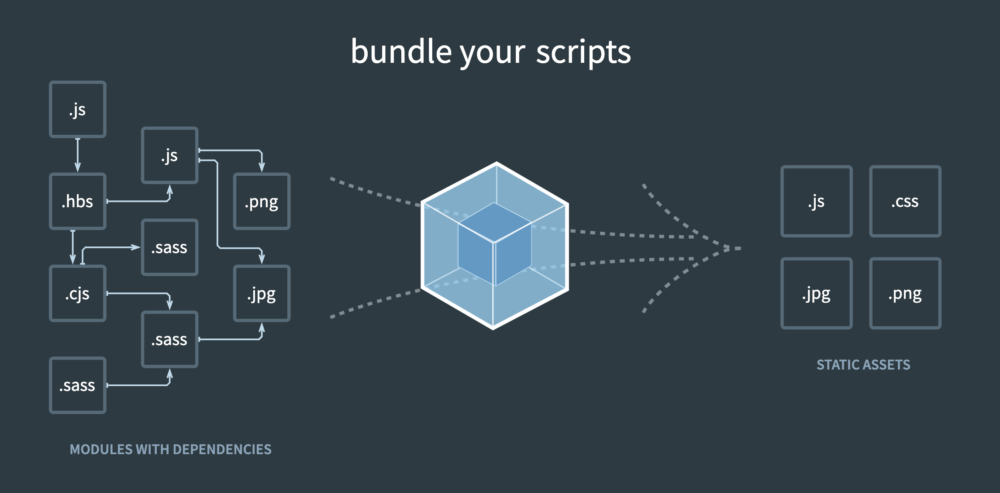

지난 글에서는 프론트엔드 개발 환경 설정을 위해 가장 많이 사용되는 웹팩의 정의와 필요성에 대해 알아보았다.

내용을 간략하게 정리하자면 웹팩은 애플리케이션에 필요한 모든 파일(모듈)을 병합하고 압축해서 하나의 결과물(번들)을 생성해주는 도구로써, 애플리케이션의 성능 및 로드 시간을 줄여주는 역할을 한다고 하였다.

이번 글에서는 웹팩의 핵심 요소인 Entry, Output, Loaders, Plugins 에 대한 개념을 알아보고, 간단하게 웹팩을 설정 해보려고 한다.

## 웹팩 설치

먼저 webpack과 webpack-cli를 설치해준다. webpack-cli는 webpack과 관련된 명령어를 사용할 수 있게 해주는 패키지이다.

```
$ npm i webpack webpack-cli -D
```

webpack을 설정하기 위해 root 폴더에 webpack.config.js 파일을 만든다.

```javascript
module.exports = () => {
    entry: {
      ...
    },
    output: {
      ...
    },
    module: {
      rules: [...]
    }
    plugins: {
      ...
    }
}
```

이제 webpack.config.js 파일을 설정하면서 Entry, Output, Loaders, Plugins에 대해 알아보자.

## 웹팩의 핵심 요소

웹팩 공식문서에서 웹팩의 파일 변환 과정을 이해하기 위해서는 Entry, Output, Loaders, Plugins 4가지 개념에 대해서 이해해야 한다고 말하고 있다.

**엔트리 (Entry)**

이제 웹팩이 모듈 번들러라는 건 알았다. 그렇다면 웹팩은 어떻게 애플리케이션에 필요한 모든 모듈을 찾는 것일까? 바로 엔트리를 통해서다.

엔트리는 번들링을 시작하기 위한 최초 진입점이다. 웹팩은 이 진입점으로부터 의존적인 모듈을 전부 찾아낸다. 이때 모듈 간의 의존 관계로 생기는 구조를 디펜던시 그래프(Dependency Graph)\*라고 한다.

\* 웹팩은 특정 지점에서 출발해서, 애플리케이션에 필요한 모든 모듈을 포함하는 그래프를 재귀적으로 완성해 나간다. 한 파일이 다른 파일을 필요로 하면 이를 '디펜던시(dependency)'가 있다고 해석하는데, 이 방식으로 웹팩은 이미지 또는 웹 글꼴과 같이 코드가 아닌 리소스도 디펜던시로 관리할 수 있게 된다.

```javascript
module.exports = () => {
    entry: "./src/index.js",

    or

    entry: ['./src/index.js'],

    or

    entry: {
      bundle: './src/index.js'
    },
}
```

html에서 사용할 자바스크립트의 진입점을 `entry` 에 넣어준다. `entry` 가 여러개일 경우 배열로 적어도 된다. `entry` 의 이름을 따로 지정해주고 싶다면 object 로 작성 할 수 도 있다.

**아웃풋 (Output)**

엔트리를 시작으로 의존되어 있는 모든 모듈을 하나로 묶어 하나의 결과물로 만들었다. 이 결과물이 위치하는 경로를 아웃풋이라고 한다.

```javascript
const path = require('path');

module.exports = () => {
  output: {
    path: "./dist",
    filename: "bundle.js",

    or

    path: path.join(__dirname, 'dist'),
    filename: '[name].js'
  },
}
```

`path` 는 번들링된 파일을 저장할 경로이고, `filename` 은 번들링된 파일의 이름이다.

`path` 에는 경로를 직접 입력할 수 있지만, 아래와 같이 많이 사용하는 것 같다. `__dirname` 은 노드에서 제공하는 현재 디렉토리의 경로에 대한 변수이다.

`filename` 도 직접 입력 할 수 있지만, 아래와 같이 입력하면 `entry` 에서 따로 이름을 정해주었다면 그 이름으로 생성된다.

**로더 (Loader)**

웹팩은 모든 파일을 모듈로 본다. 하지만 웹팩은 자바스크립트 밖에 읽지 못한다. 그래서 HTML, CSS, Images, 폰트 등을 웹팩이 읽을 수 있게 변환해줘야 하는데, 이 역할을 하는 게 바로 로더이다.

예시로 CSS를 자바스크립트에서 불러와 사용할 수 있도록 로더를 설정해보자.

CSS를 번들링하기 위해서는 css-loader 와 style-loader 를 함께 사용한다. css-loader 는 CSS를 자바스크립트 코드로만 변경해주기만 한다. 자바스크립트로 변경된 CSS를 돔에 추가하기 위해서 style-loader 가 필요하다.

먼저 css-loader와 style-loader 를 설치해준다.

```
$ npm install css-loader style-loader -D
```

그 다음 css-loader 와 style-loader 에 관련된 설정을 추가해준다.

```javascript
module.exports = {
  module: {
    rules: [
      {
        test: /\.css$/,
        use: ['style-loader', 'css-loader'],
      },
    ],
  },
};
```

`test`는 로더를 적용할 파일 형식으로 일반적으로 정규 표현식 사용한다. `use`는 해당 파일을 처리할 로더의 이름이다.

배열로 설정하면 뒤에서부터 앞으로 순서대로 로더가 동작한다. 이제 웹팩은 .css 확장자로 끝나는 모듈을 읽어 들여 css-loader를 적용하고 그 다음 style-loader를 적용한다.

**플러그인 (Plugin)**

마지막으로 알아야 하는 개념은 플러그인이다. 플러그인은 한마디로 정의하기가 어렵지만, 공식 문서에서는 로더가 할 수 없는 다른 작업을 수행한다고 설명하고 있다.

로더가 파일(모듈)을 해석하고 변환하는 과정에 필요한다면, 플러그인은 결과물(번들)에 추가적인 처리를 하고싶을 때 필요하다.

예시로 HtmlWebpackPlugin을 하나 추가해보자. HtmlWebpackPlugin는 template html을 바탕으로 빌드 후에 html파일을 만들어주는 역할을 한다.

먼저 HtmlWebpackPlugin 을 설치해준다.

```
$ npm install html-webpack-plugin -D
```

그 다음 HtmlWebpackPlugin 에 관련된 설정을 추가해준다.

```javascript
const HtmlWebpackPlugin = require('html-webpack-plugin');

module.exports = {
  plugins: [new HtmlWebpackPlugin()],
};
```

로더에 비해서 플러그인은 설정이 간단하다. 플러그인의 배열에는 생성자 함수로 생성한 객체 인스턴스만 추가하면 된다.

## 마무리

지금까지 웹팩에 대해 공부한 내용을 정리해보자

1. 먼저 엔트리로부터 의존성이 있는 모든 모듈을 찾는다.

2. 로더를 통해 각 모듈을 읽을 수 있게 해석한다.

3. 이 모듈들을 병합하고 압축하여 아웃풋에 번들된 결과물을 생성하는 역할을 한다.

4. 생성된 결과물에 추가적인 작업이 필요하다면 플러그인을 통해 처리한다.



위의 사진은 웹팩 공식 홈페이지에 들어가면 가장 먼저 나오는 이미지이다. 이 이미지를 다시 보자 웹팩을 가장 직관적을 설명하고 있다는 생각이 들었다.

이 글을 읽은 다른 분들에게도 웹팩을 이해하는데 조금이나마 도움이 되었으면 한다.

## 참고 자료

- [웹팩 공식문서](https://webpack.js.org/)

- [웹팩 핸디북](https://joshua1988.github.io/webpack-guide/)

- [김정환블로그 - 프론트엔드 개발환경의 이해: 웹팩(기본)](https://jeonghwan-kim.github.io/series/2019/12/10/frontend-dev-env-webpack-basic.html)
