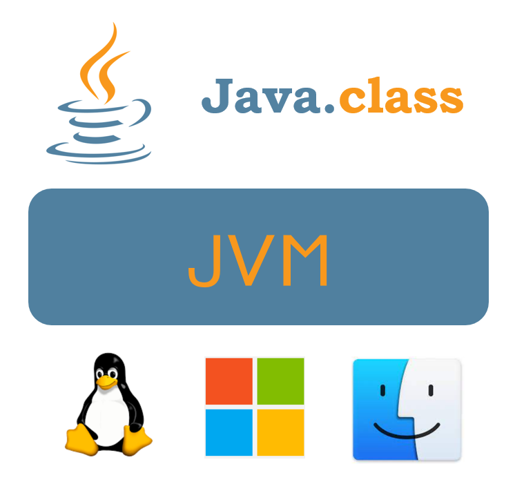
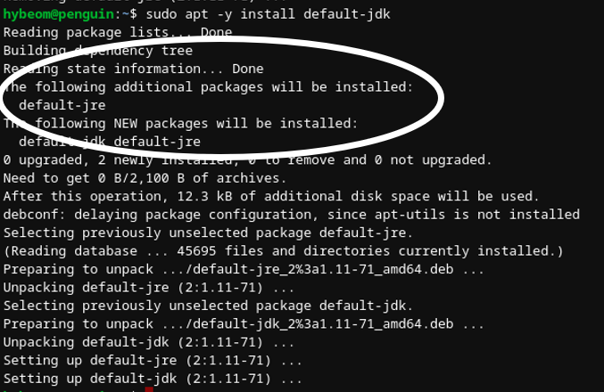
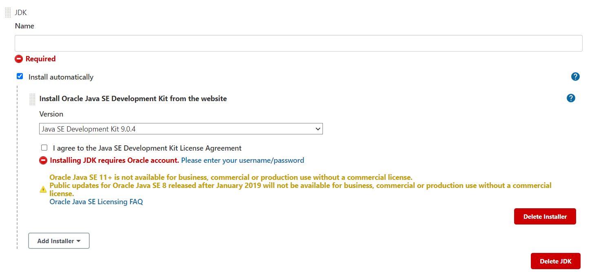

자바로 작성된 코드는 어떻게 돌아가는 걸까?
해당 물음에 답을 찾기 위한 JVM 시리즈 1편, JVM, JRE, JDK에 관한 글입니다.
이번 글에서는 배포 환경 혹은 개발 환경을 세팅하면서 설치를 하였던 JRE와 JDK가 무엇인지에 대해서 다루게 되었습니다.

<br/>

## _Java_ 프로그램 배포 및 개발 환경 세팅
우아한 테크코스 Level3 부터는 서비스를 직접 만들고, 이를 배포하게 됩니다.
이전까지 미션처럼 주어진 환경에서 진행하는 것이 아닌 스스로 개발, 배포 그리고 운영 환경을 구축합니다.
저희 팀도 AWS의 EC2를 사용하여 _Linux_ 중 _Ubuntu_ 배포판 위에서 _Java_ 프로그램의 개발 및 배포 환경을 설정하였습니다.
이때 습관처럼 다음과 같은 명령어를 입력하게 되었습니다.

``` bash
sudo apt -y install default-jre default-jdk
```

항상 잘 사용하던 명령이지만 다른 프로그래밍 언어인 _Python_ 이나 _Run Time_ 환경인 _Nodejs_ 와 비교했을 때 낯섦이 느껴졌습니다.
난 _Java_ 를 직접적으로 설치하지 않고, _default jdk_ 와 _default jre_ 라는 관계없어 보이는 것을 설치하는 걸까?
이번 포스팅에서는 위의 질문에 대한 답을 찾아갑니다.

## _JVM_ 이란
설치한 수수께끼의 두 프로그램을 알기 위해서는 이번 시리즈의 주인공인 _JVM_ 에 대해서 이해를 해야 합니다.
_JVM_ 은 _Java Virtual Machine_ 의 약자로 _Java_ 로 작성된 프로그램이 돌아가도록 만들어주는 프로그램입니다.
_Java_ 로 작성된 프로그램은 운영체제에 맞는 실행 파일로 컴파일되는 것이 아닌 _.class_ 라는 확장자를 가진 파일로 변환이 됩니다.
변환된 _.class_ 파일은 _JVM_ 위에서 작동이 됩니다.
이때, 미리 설치된 _JVM_ 은 운영체제 별로 동일하게 작동하도록 _.class_ 파일에게 환경을 제공합니다.



이 과정을 통하여 _Java_ 는 큰 장점을 얻을 수가 있었습니다.
그것은 바로 높은 이식성입니다. 
어느 기기나 운영체제에 상관없이 _JVM_ 이 설치 및 구동될 수 있는 환경이라면 _Java_ 로 작성한 프로그램은 실행이 가능합니다.
그 때문에 다른 운영체제에 맞춰서 컴파일을 해줘야 하는 다른 언어보다 높은 이식성을 가질 수 있게 되었습니다.

## _JRE_ 이란
_JVM_ 은 우리가 작성한 코드를 기반으로 한 _.class_ 확장자를 가진 클래스 파일이 작동할 수 있도록 환경을 제공해줍니다.
하지만 원활하게 작동하기 위해서는 코드에 작성된 내용만으로 가능하지는 않습니다.
_JVM_ 위에서 프로그램이 원활하게 실행을 하기 위해서는 몇 가지 필수적인 요소들이 필요합니다.  
이를 제공해주는 것이 _JRE_, _Java Runtime Environment_ 입니다.
_JRE_ 는 크게 _JVM_ , _Java Class Libraries_ 그리고 _Class Loader_ 라는 요소로 구성이 됩니다.
_Java Class Libraries_ 는 _Java_ 를 실행시키는데 필수적인 라이브러리입니다. 
_java.io_ , _java.util_ , _java.thread_ 등 작동에 필수적인 요소들을 가지고 있습니다.

예시 코드와 바이트 코드를 살펴보도록 하겠습니다.

```java
//Java 코드
public class Main {
  public static void main(String[] args) {
    int a = 1;
    System.out.println(a);
  }
}
```

```java

//바이트코드
... 중략 ...
  L0
    LINENUMBER 3 L0
    ICONST_1
    ISTORE 1
   L1
    LINENUMBER 4 L1
    GETSTATIC java/lang/System.out : Ljava/io/PrintStream;
    ILOAD 1
    INVOKEVIRTUAL java/io/PrintStream.println (I)V
   L2
    LINENUMBER 5 L2
    RETURN
   L3
    LOCALVARIABLE args [Ljava/lang/String; L0 L3 0
    LOCALVARIABLE a I L1 L3 1
    MAXSTACK = 2
    MAXLOCALS = 2
...
```

위에서 보는 것처럼 _JVM_ 에 올라가는 클래스 파일의 바이트 코드에서도 필수 라이브러리를 참고하고 있습니다.
이 때문에 간단한 코드라도 필수 라이브러리가 필요하다는 것을 알 수가 있습니다.
_Class Loader_ 는 필요한 클래스들을 _JVM_ 위로 올려주는 역할을 합니다.
자세한 연결 및 작동 과정은 다음 포스팅에서 다루도록 하겠습니다. 
_JRE_ 의 구성요소들을 통해서, _JVM_ 은 원활히 작동할 수가 있습니다.  
하지만 _JRE_ 는 개발에 사용되는 것이 아닌 실제 프로그램을 구동시키는 데 집중을 하고 있습니다.
실제 _Java_ 코드가 주어져도 이를 분석하거나 클래스 파일로 변환하는 일은 할 수 없습니다.
_Java Compiler_ 를 비롯한 개발에 필요한 요소들은 없기 때문에 개발을 하기 위해서는 다른 요소들이 더 필요합니다.

## JDK이란
_JDK_, _Java Development Kit_ 의 약자로 _Java_ 를 활용하여 프로그램을 개발할 때 필요한 도구 모음입니다.
이때, 실제로 프로그램을 실행시켜보아야 하기 때문에 _JRE_ 가 포함이 되어 있습니다.
이를 확인하기 위해 _JRE_ 와 _JDK_ , 그리고 관련된 의존성을 삭제한 후에 다시 _JDK_ 만 설치를 해보았습니다.



위에서 보이는 것처럼 _JDK_ 만 설치를 하였을 뿐인데, _JRE_ 도 자동으로 설치되는 것을 알 수가 있습니다.
그렇다면 _JDK_ 는 _JRE_ 이외의 어떤 구성 요소들이 추가된 것일까요? 
대표적으로는 _Java_ 로 이루어진 코드를 클래스 파일로 컴파일하는 _javac_ 의 기능, 작성된 코드를 디버깅 하는 _jdb_ 기능 등을 가집니다.  
_JDK_ 에서도 개발과 실행에 필요한 환경 및 기능 제공의 폭에 따라 표준형인 _SE(Standard Edition)_ 과 여러 기능이 추가된 _EE(Enterprise Edition)_ 으로 나뉩니다.
하지만 이런 버전 구분 이외에도 출시된 순서에 따라서 숫자로 버전을 구분하는 방법도 있습니다.

## 가장 널리 쓰이는 버전 JDK 버전 8
최근까지도 다양한 버전이 출시되고 있는 _Java_ 이지만 유독 8 버전이 널리 쓰이는 것을 볼 수가 있습니다.
8 버전 이외에도 _Ubuntu_ 및 _Debian_ 배포판의 _Repository_ 에서는 11 버전이 기본으로 제공되고 있습니다.
개발뿐만이 아니라 코딩테스트에서도 이 두 버전만 널리 쓰이게 됩니다.
왜 8 버전과 11 버전이 자주 쓰이게 되는 것일까요?  
_Java_ 는 유명한 _Linux_ 배포판이나 개발 관련 _Runtime Environment_, _Library_ 와 마찬가지로 여러 버전으로 배포됩니다.
그중 하나가 바로 _LTS_, _Long Term Support_ 개념입니다.
_LTS_ 의 경우에는 다른 버전보다 안정적이며, 제작한 기업이나 오픈 소스 관리 측에서 긴 기간을 관리해주겠다라는 것을 명시합니다.
일반적으로 각 배포판들은 약 6개월 정도의 지원 기간을 가집니다.
하지만 _LTS_ 의 경우에는 짧게는 5년 길게는 그 이상을 지원합니다.
때문에 많은 개발자들은 새로운 기능 빨리 적용하기 보단 상대적으로 안심하고 오랜 기간 사용할 수 있는 _LTS_ 버전을 선호하게 되었습니다.  
가장 많이 쓰이는 8 버전은 _Java_ 의 최초 _LTS_ 버전이며, _Java_ 개발사 _Sun Microsystems_ 가 _Oracle_ 에 인수되고 나서 출시되었습니다.
그 다음으로 많이 쓰이는 11 버전도 _LTS_ 버전이며, 8 버전 출시 4년 후에 나오게 되었습니다.
현재 나온 최신 버전인 16 버전은 _LTS_ 버전이 아니며, 다음 17 버전이 _LTS_ 로 예정이 되어 있습니다.

## open JDK와 Oracle JDK, 다양한 JDK 버전들
이번 미션에서는 EC2에 기본적인 개발환경을 모두 세팅하고 난 다음에, _CI & CD_ 를 위하여 _Jenkins_ 를 사용하게 되었습니다.
이 때, _Jenkins_ 는 배포하는 서버와 다른 _CI & CD_ 전용 서버에서 운영되기 때문에 또 다시 _JDK_ 를 설치를 해주어야했습니다.
하지만 _Jenkins_ 에서는 항상 보던 _open JDK_ 및 _default JDK_ 가 아닌 _Oracle JDK_ 를 권장하고 있었습니다.



_Java_ 를 소유하고 있는 회사는 _Oracle_ 인건 인지하였지만, 기존의 사용하던 _open JDK_ 와는 다른 것을 알게 되었습니다.
_Oracle JDK_ 는 _Oracle_ 에서 관리하는 _JDK_ 입니다.
상업적으로 사용하려면 비용을 지불해야하지만, 상대적으로 지원 정도가 높습니다.
또한, _open JDK_ 에서 지원하지 않는 라이브러리를 가지고 있습니다.
_open JDK_ 는 오픈소스로 운영이 되며, 상업적으로 사용해도 무료입니다.
많은 _Linux_ 배포판에서 저장소에 기본으로 등록이 되어 있습니다.
_open JDK_ 는 상대적으로 지원 정도가 약하지만, 웹 개발에서는 큰 차이가 나지 않는다고 합니다.
이 때문에 많은 사용자들이 _open JDK_ 를 현재 사용하고 있습니다.

## 마치며
이번 포스팅에서는 _JAVA_ 를 구동시키는데 필수적인 _JVM_ , _JRE_ , _JDK_ 를 알아보았습니다.
그 중 _JVM_ 은 _JAVA_ 에서 _GC_ , 메모리 관리 등이 이뤄지는 핵심적인 요소입니다.
_JVM_ 의 구성 요소 및 작동 방식은 다음 포스팅에서 다루도록 하겠습니다.


## References
- [Red Hat : What is a Java runtime environment(JRE)?](https://www.redhat.com/en/topics/cloud-native-apps/what-is-a-Java-runtime-environment)
- [Core Libraries Group](http://openjdk.java.net/groups/core-libs/)
- [Oracle Chapter 2. The Structure of the Java Virtual Machine](https://docs.oracle.com/javase/specs/jvms/se8/html/jvms-2.html#jvms-2.12)
