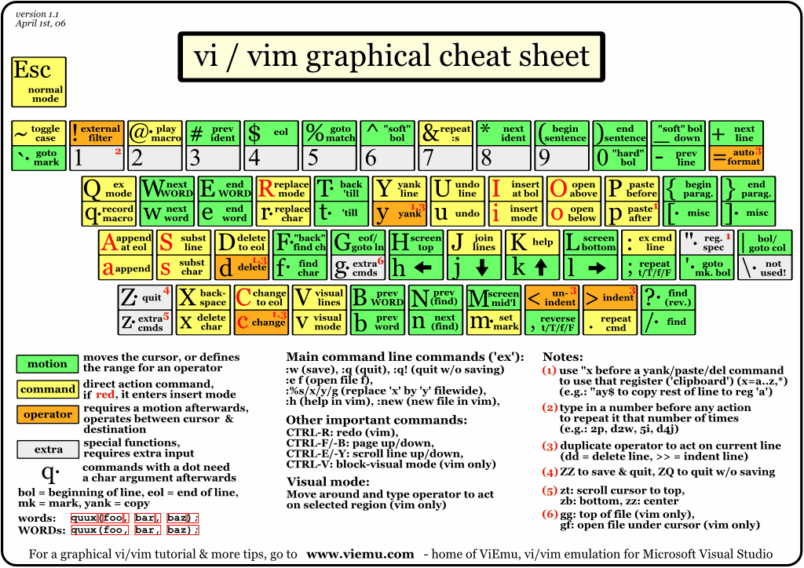
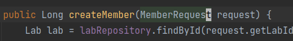

리눅스 텍스트 편집기 중 하나인 vim. 많이들 vim을 어렵고 외워야만 하는 것으로 생각한다. 이를 보다 쉽게 사용할 수 있게 해주는 vim을 대하는 자세, '대화'의 방법을 소개하고자 한다.

<!-- end -->

---

## Intro

글의 시작에 앞서, 글쓴이는 vim을 자유자재로 다룰 수 있는 실력자는 아니며, IDE로 개발을 진행한다. 단지 vim의 몇 가지 기능들을 큰 불편함 없이 사용하는 정도다. vim을 사용하는데 어려움을 겪는 분들에게, 내가 vim을 효율적으로 학습한 방법을 소개하고자 한다. 그것은 vim 텍스트 에디터와 '대화'를 하듯 하는 것이다. 

*이 글에서 설명하는 모든 기능은 Normal 모드(ESC를 입력한 상태)에서의 커맨드만을 다룬다.*

vim 에디터는 ESC를 누른 시점부터 입력한 키들을 기억하고, 모든 명령어는 커서가 가르키고 있는 곳을 기준으로 한다. 키를 기억하기 때문에 우리는 다음과 같은 '대화'를 몇 가지 키의 조합으로 만들어낼 수 있다.
- 소괄호 안에 있는 값을 지워주세요.
- 파일 끝까지 복사하고 붙여넣기 해주세요.
이러한 대화를 몇 개의 명령어의 조합으로 쉽게 실행할 수 있다.

---

## vim 명령어들

출처 www.viemu.com

vim을 공부해보겠다고 검색했을 때, 가장 먼저 보이는 이미지다. 시작하기 두렵게 만드는 차트다. 우선, 이 차트 외우기를 미뤄두고 포스팅을 따라 오길 바란다. 이동부터 시작한다.

vim을 열어두고 명령어를 쳐가면서 진행하는 것을 추천한다.

---

## 이동 관련 명령어

vim에서는 방향키와 h,j,k,l이 대부분의 기능에서 동일하게 작동한다. 그럼에도 h,j,k,l을 사용하기를 추천한다. 오른손의 움직임을 최소화와 geek함을 얻어갈 수 있다.

다음의 이동 관련 명령어들을 숙지하면 좋다.

### 단어 기준
1. **w** : word의 약자로, 다음 단어의 앞글자로 이동
2. **e** : end의 약자로, 다음 단어의 마지막 글자로 이동 
3. **b** : back의 약자로, 이전 단어의 앞글자로 이동
단어의 앞글자로 이해하면 쉽다.

### Line(한 줄) 기준
1. **0** : Line의 시작으로 이동
2. **^** : 공백을 제외한 Line의 시작으로 이동
3. **$** : Line의 끝으로 이동
regex(정규 표현식)의 익숙하면, ^,$의 개념을 그와 비슷하게 생각하면 된다.
   
### 파일 기준
1. **gg** : 파일의 시작
2. **G** : 파일의 끝
워낙 자주 쓰여서 쓰다 보면 익숙해진다. `숫자 + G` 명령어를 사용하면 원하는 줄의 위치로 바로 이동 가능하다.

숫자와 함께 사용되었을 때, 이동 관련 명령어는 더 강력해진다.

`2개의 단어 앞으로 이동`이란 대화를 하기 위해선 어떻게 해야 할까?
-> 간단하다. 2w를 입력하면 된다.

`4줄 아래로 이동` 의 대화도 간단하게 4j의 입력으로 가능하다.

이러한 이동 관련 명령어들은 다른 명령어들과 결합하여 더 강력해진다.

---

## f = find, t = till(until)

하나의 Line에서 특정 문자를 찾을 때 사용되는 명령어들이 f(find), t(till)이다. 이 명령어들은 찾고자 하는 문자가 뒤에 따라붙는다. 영어의 의미처럼 f는 입력된 문자를 찾고 그 위치로 이동하고, t는 찾은 문자 전의 위치로 이동한다. (전체 문서에서의 검색은 `/검색어`의 방법을 사용한다.)

대화상황에 따른 명령어 예시는 다음과 같다.
- `'a'를 찾아라` => `find 'a'` => `fa`의 명령어
- `3번째 등장하는 'a'를 찾아라` => `find 3rd 'a'` = `f3a`의 명령어
- `'('전으로 이동하라` =>  `till '('` => `t(` 의 명령어

---

## d = delete, c = change
코드를 수정하는 일이 많기 때문에, 가장 많이 사용되는 명령어 중 하나다. change 명령어는 delete 명령어와 똑같이 작동하나, 삭제 후 insert 모드로 변경된다. 그렇기에 이 글에서는 delete모드 만으로 설명을 진행한다.

delete 명령어는 뒤에 이동 위치가 오고 그 사이의 값들을 지운다. 이동 위치의 경우 앞서 설명했던 이동 명령어가 사용된다.

- `단어를 지워라` = `delete word` = `da` 의 명령어 (커서가 기준이기 때문에 커서부터 시작하는 단어가 삭제된다.)
- `파일 끝까지 지워라` = `delete End-Of-File` = `dG` 의 명령어 (커서 이후로 파일 끝까지 삭제)
- `'(' 이전까지 지워라` = `delete till '('` = `dt(` 의 명령어
  
### delete, change 명령어 사용 꿀팁

코드를 작성하면서 (),{},"",'' 내부에 코드를 수정하는 경우가 많다.

위 사진처럼 커서의 위치가 있을 때, 이 내부를 지우고자 한다. 어떻게 해야 할까?

지금까지 설명한 방식으로 예시를 들자면,
1. 이전 단어로 이동(커서 기준 이전 단어 시작 위치는 MemberRequest의 M) : `b`
2. ')' 이전까지 지우고 insert 모드로 전환 (change) = `ct)` 
의 방식으로 진행할 수 있다. (다양한 방식으로 가능하다)
   
이러한 경우를 더 편하게 하기 위해 vim에서는 inside의 i, all의 a 를 제공한다. 다음의 예시를 보면 쉽게 이해할 수 있다.
- `() 괄호 안에 값을 지우기` => `delete inside ()` = `di(` or `di)` 명령어로 사용이 가능하다.
- `() 괄호도 포함해서 지우기` => `delete all ()` = `da(` or `da)`

이러한 방식으로 (),{},"",'' 등에 모두 적용할 수 있다.

---

### 정리
거창하게 vim을 대하는 자세로 '대화'를 제시했다. 무조건적인 암기보다도 각각의 명령어가 어떤 의미를 지니는지 이해하자는 의미이다. vim의 다른 많은 기능들도 이와 비슷한 방식으로 도전해보기를 바란다.

---

### 참고 자료
- [Vim 도대체 왜 쓰는가](https://bengi.kr/1349)
