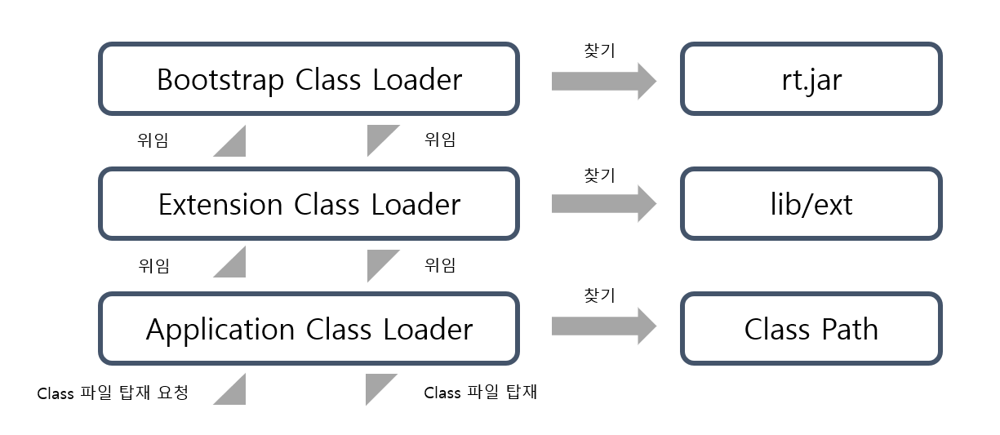

_Java_ 로 작성한 코드는 어떻게 돌아가는 걸까? 해당 물음에 답을 찾기 위한 _JVM_ 시리즈 2편, _JVM_ 의 구성 요소 중 _Class Loader_ 에 관한 글입니다. 
이번 글에서는 _Class Loader_ 가 어떤 역할을 하는지에 대해서 알아봅니다.

## 클래스 파일은 _JVM_ 에 어떻게 탑재가 될까?
지난 글에서는 _JVM_ 이 원활하게 구동되기 위해서 어떤 환경들이 뒷받침 되는 지를 알아보게 되었습니다. 
_JDK_ 에서 개발하고, _JRE_ 를 통해서 환경을 제공받은 _JVM_ 은 _compile_ 된 바이트 코드를 탑재하여 로직을 실행하게 됩니다. 그렇다면 _JVM_ 에 _Class_ 는 어떻게 탑재가 되는 걸까요?

## _Class Loader_
_Java Compiler_ 를 통해서 _.class_ 확장자를 가진 클래스 파일은 각 디렉터리에 흩어져있습니다. 
또한, 기본적인 라이브러리의 클래스 파일들은 _$JAVA_HOME_ 내부 경로에 존재합니다. 각각의 클래스 파일들을 찾아서 _JVM_ 의 메모리에 탑재해주는 역할을 하는 것이 바로 _Class Loader_ 의 역할입니다.

## _Class Loader_ 의 전체적인 역할
앞서 보았듯이 _Class Loader_ 는 클래스 파일을 찾아서 탑재하는 것뿐만이 아니라 다른 일들도 같이하게 됩니다. _Class Loader_ 는 크게 _Loading_, _Linking_, 그리고 _Initialization_ 3가지 역할을 맡게 됩니다.
_Loading_ 은 클래스 파일을 탑재하는 과정, _Linking_ 은 클래스 파일을 사용하기 위해 검증하고, 기본 값으로 초기화하는 과정입니다.
_Initialization_ 은 _static field_ 의 값들을 정의한 값으로 초기화를 하는 과정입니다.  
각각의 과정을 순서대로 살펴보도록 하겠습니다. 

### _Loading_

_Class Loader_ 필요한 클래스 파일들을 찾아 탑재하게 됩니다.
각각의 클래스 파일들이 기본으로 제공받는 클래스 파일인지 혹은 개발자가 정의한 클래스 파일인지와 같은 기준에 의해서 _Class Loader_ 의 수준도 세 가지로 나뉘게 됩니다. 



탑재 과정을 추적하기 위해서 다음과 같은 코드를 작성하게 되었습니다.
``` java
import java.util.LinkedList;
import java.util.List;

public class Main {

   public static void main(String[] args) {
       UserClass userClass = new UserClass(2);
       int number = 1;
       List<Integer> numbers = new LinkedList<>();
   }
}

public class UserClass {
   private int num;

   public UserClass(int num) {
       this.num = num;
   }

   public int getNum() {
       return num;
   }
}
```

탑재 과정 추적은 다음과 같은 명령어로 알 수가 있습니다.
``` bash
java -verbose:class Main
```

#### _Bootstrap Class Loader_
_Bootstrap Class Loader_ 는 다른 모든 _Class Loader_ 의 부모가 되는 _Class Loader_ 입니다. _rt.jar_ 를 포함하여, _JVM_ 을 구동시키기 위한 가장 필수적인 라이브러리의 클래스들을 _JVM_ 에 탑재하게 됩니다.
가장 상위의 _Class Loader_ 이므로 다른 _Class Loader_ 와는 다르게 탑재되는 운영체제에 맞게 네이티브 코드로 쓰여있습니다.  
다음은 담당 클래스 파일들을 탑재하는 내용입니다. _Java_ 실행 초기에 작동이 됩니다.
```bash
[Opened /usr/lib/jvm/java-8-openjdk-amd64/jre/lib/rt.jar]
[Loaded java.lang.Object from /usr/lib/jvm/java-8-openjdk-amd64/jre/lib/rt.jar]
[Loaded java.io.Serializable from /usr/lib/jvm/java-8-openjdk-amd64/jre/lib/rt.jar]
...중략...
```

#### _Extensions Class Loader_
_BootStrap Class Loader_ 다음으로 우선순위를 가지는 _Class Loader_ 입니다. _localedata_, _zipfs_ 등 다른 표준 핵심 _Java Class_ 의 라이브러리들을 _JVM_ 에 탑재하는 역할을 하고 있습니다. 
이들은 _$JAVA_HOME/jre/lib/ext_ 에 있습니다.

#### _Application Class Loader_
_System Class Loader_ 라고도 합니다. _Classpath_ 에 있는 클래스들을 탑재합니다. 개발자들이 자바 코드로 짠 클래스 파일들을 _JVM_ 에 탑재하는 역할을 하고 있습니다.
만약 개발자가 _Class Loader_ 를 구현하여 사용하게 되면, 기본적으로 위의 _Application Class Loader_ 의 자식 형태로 사용자 정의된 _Class Loader_ 를 구성하게 됩니다.
다음은 담당 클래스 파일들을 탑재하는 내용입니다.
```bash
...중략...
[Loaded UserClass from file:/home/hybeom/OTC/java8/src/]
...중략...
```

위의 각각의 _Class Loader_ 들을 모두 거쳤는데도, 클래스 파일을 찾지 못하게 되면, _ClassNotFoundException_ 이라는 예외를 던지게 됩니다.
해당 상황 묘사를 위하여 _UserClass_ 클래스 파일을 삭제한 이후에 해당 명령어를 다시 작동시켰습니다.
```bash
...중략....
java.lang.NoClassDefFoundError: UserClass
    	at Main.main(Main.java:7)
Caused by: java.lang.ClassNotFoundException: UserClass
    	at java.net.URLClassLoader.findClass(URLClassLoader.java:382)
...중략...
```

이렇게 _Loading_ 과정에서 하위 _Class Loader_ 가 로딩한 클래스 파일은 상위 _Class Loader_ 가 로딩한 클래스 파일을 볼 수가 있습니다. 하지만 반대는 불가능합니다. 
이를 _Visibility_ 라고 하며, 각각의 클래스 파일을 계층으로 관리해줄 수 있게 합니다.
또한, 한번 _JVM_ 에 탑재된 클래스 파일은 종료될 때까지 _JVM_ 에서 제거되지 않습니다.

#### 각각 _Class Loader_ 의 구현 구조
_Class Loader_ 는 앞서 말한 순서대로 클래스 파일들을 찾게 됩니다. 실제로 코드를 통해 부모 역할을 하는 _Class Loader_ 를 찾으면 다음과 같이 나오게 됩니다.
```java
public class Main {

   public static void main(String[] args) {
       UserClass userClass = new UserClass(2);
       System.out.println(UserClass.class.getClassLoader());
       System.out.println(UserClass.class.getClassLoader().getParent());
       System.out.println(UserClass.class.getClassLoader().getParent().getParent());
   }
}
```
이 때, _getParent()_ 메소드는 부모 클래스를 찾는 메소드가 아닌 상위 파일을 찾는 메소드입니다.

```bash
sun.misc.Launcher$AppClassLoader@75b84c92
sun.misc.Launcher$ExtClassLoader@4aa298b7
null
```

하지만 구현은 다음과 같이 이루어지게 됩니다.

``` java

static class ExtClassLoader extends URLClassLoader {
}

static class AppClassLoader extends URLClassLoader {
}

public class URLClassLoader extends SecureClassLoader implements Closeable{
}

public class SecureClassLoader extends ClassLoader {
}

public abstract class ClassLoader{
}
```
  


_Bootstrap Class Loader_ 는 네이티브하게 짜져있기 때문에 null 값을 반환하게 됩니다.
나머지 _Class Loader_ 는 _URLClassLoader_, _Secure Class Loader_ 라는 객체를 상속받아서 구현이 됩니다.

### _Linking_
_Linking_ 은 로드된 클래스 파일들을 검증하고, 사용할 수 있게 준비하는 과정을 의미합니다.

#### _Verification_
클래스 파일이 유효한지를 확인하는 과정입니다. 클래스 파일이 _JVM_ 의 구동 조건 대로 구현되지 않았을 경우에는 _VerifyError_ 를 던지게 됩니다.

#### _Preparation_
클래스 및 인터페이스에 필요한 _static field_ 메모리를 할당하고, 이를 기본값으로 초기화를 합니다. 기본값으로 초기화된 _static field_ 값들은 뒤의 _Initialization_ 과정에서 코드에 작성한 초기값으로 변경이 됩니다. 
이 때문에 _JVM_ 에 탑재된 클래스 파일의 코드를 작동시키지는 않습니다.

#### _Resolution_
_Symbolic Reference_ 값을 _JVM_ 의 메모리 구성 요소인 _Method Area_ 의 런타임 환경 풀을 통하여 _Direct Refernece_ 라는 메모리 주소 값으로 바꾸어줍니다. 
해당 단계의 영향을 받는 _JVM Instruction_ 요소는 _new_ 및 _instanceof_ 가 있습니다.

### _Initialization_
_Linking_ 과정을 거치면 클래스 파일의 코드를 읽으면서 _Java_ 코드에서의 _class_ 와 _interface_ 의 값들을 지정한 값들로 초기화 및 초기화 메서드를 실행시켜줍니다. 
이때, _JVM_ 은 멀티 쓰레딩으로 작동을 하며, 같은 시간에 한 번에 초기화를 하는 경우가 있기 때문에 초기화 단계에서도 동시성을 고려해주어야 합니다. 
_Class Loader_ 를 통한 클래스 탑재 과정이 끝나면 본격적으로 _JVM_ 에서 클래스 파일을 구동시킬 준비가 끝나게 됩니다.


## _Java 8_ 과 _Java 11_ 의 차이
앞서 _Java_ 를 옵션과 함께 실행하면서, _rt.jar_ 의 위치를 확인할 수가 있었습니다.
하지만 다른 _LTS_ 버전인 11을 똑같은 명령어로 실행하면 다음과 같이 나오게 됩니다.

```bash
[0.001s][info][class,load] opened: /usr/lib/jvm/java-11-openjdk-amd64/lib/modules
[0.001s][info][class,load] opened: /usr/share/java/java-atk-wrapper.jar
[0.007s][info][class,load] java.lang.Object source: shared objects file
```

실제 _jvm/lib_ 경로에서도 해당 _rt.jar_ 를 찾을 수가 없습니다. 그 이유는 _Java 9_ 버전부터 _rt.jar_ 및 _ext_ 경로가 삭제되고, 효율성을 위해서 클래스들은 다른 경로로 이동이 되었습니다.

## Reference

[GeekforGeek ClassLoader in Java](https://www.geeksforgeeks.org/classloader-in-java/)  
[baeldung Java Class Loader](https://www.baeldung.com/java-classloaders)  
[Oracle Java docs URLClassLoader](https://docs.oracle.com/javase/8/docs/api/java/net/URLClassLoader.html)  
[Java Community Process JVM ClassLoader](https://jcp.org)  
[sun/misc/Launcher source code](http://hg.openjdk.java.net/jdk8/jdk8/jdk/file/687fd7c7986d/src/share/classes/sun/misc/Launcher.java)
