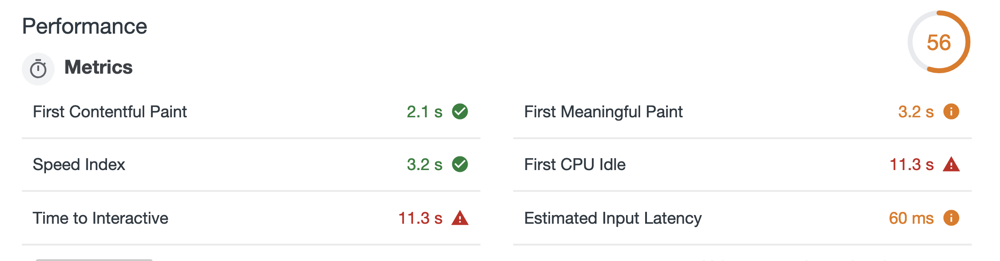

## 웹 애플리케이션의 성능 고려하기

### 성능이 좋다는 건

웹 애플리케이션(이하 웹 앱) 구현에 어느 정도 익숙해지는 단계가 되면, 언젠가는 맞닥뜨려야 할 산이 있다. 바로 성능이다. 개발자의 관점에서 성능이 당최 무엇을 의미하는지는 몰라도, 누구든 성능이 좋은 앱을 그렇지 않은 앱보다 선호할 것이다. 그렇다면 여기서 말하는 성능이란 과연 무엇일까?

사전적으로 성능은 `기계 따위가 지닌 성질이나 기능`을 뜻한다. 언뜻 봐도 포괄적이다. 이해를 돕기 위해 웹 앱의 맥락에서 성능이라 칭할 만한 요소 몇 가지를 추려 보자.

1. 콘텐츠를 받아오는 이벤트 혹은 그에 따른 서버의 응답이 안정적으로 실행되는가?
2. 사용자의 이목을 끌 수 있는 콘텐츠가 충분히 렌더링 되는가?
3. 콘텐츠를 받아오는 중이거나 받아온 후에도 여전히 사용자와 상호 작용이 가능한가?
4. 앱 조작이 부드럽고 자연스러운가?

위를 보면 단순히 처리 속도가 빠른지에 대한 여부만 판가름하지 않는다. 따라서 웹 앱의 성능을 논할 때는 **속도, 안정성, 반응성, 심미성** 등 사용자에게 영향을 끼칠 수 있는 모든 요소를 종합해서 파악해야 한다.

### 성능 지표

성능은 다양한 이유로 상대적일 수밖에 없다. 사용자의 네트워크 환경이나 기기 종류에 따라 영향을 받거나 이벤트 처리는 빨랐지만, UX 등의 변수로 그 속도를 체감할 수 없는 경우가 종종 있기 때문이다. 많은 곳에서 성능에 관한 정량, 객관적인 기준을 가질 것을 권하며 여기서 제안하는 개념이 바로 **성능 지표**다.

<figure>
  
  <figcaption align = "center">성능 지표를 이용한 측정 예시</figcaption>
</figure>

 

성능은 주로 사용자를 위해 측정하기에 대부분의 기준은 사용자의 관점으로 맞추어져 있다. 사용자 기반 성능 지표의 대표적인 측정 사항은 다음과 같다.

1. 초기 페이지 렌더링 속도
2. 페이지 이동 시 해당 페이지가 JS 코드를 받아와 실행하는 속도
3. 페이지 렌더링 후 사용자와의 상호작용에 반응하는 속도
4. 시각적 안정성 (사용자의 예측대로 움직이고 간섭이 없는지)
5. 부드러운 조작

> 단순한 예시일 뿐이며 이 밖에 HTTP 요청 횟수, 에러 발생 비율, [커스텀 지표](https://web.dev/custom-metrics/) 등 앱의 성격을 따져보았을 때 성능 지표의 수는 무궁무진하다.

웹 앱의 전체 성능을 한 번에 알 수 있는 유일 지표는 존재하지 않는다. 또한 여러 가지 지표를 비교하여 무엇이 더 좋다, 우위를 가릴 수도 없다. 현재 만들고 있는 웹 앱의 특성에 가장 적합한 지표가 가장 좋은 지표다.

### 성능 예산

앞서 설명한 성능 지표가 측정을 위한 도구였다면, 성능 예산은 이 도구를 활용한 본격적인 측정의 시발점이라 할 수 있다. 예산을 세우는 이유는 현실과 크게 다르지 않다. 가용 자원의 한도를 정해놓고, 초과하여 쓰지 않기 위함이다. 웹 앱에서 예산을 세울 때는 자원의 크기나 네트워크 요청 횟수, 특정 이벤트 처리 시간 등을 예로 들 수 있겠다.

초기에 예산이 설립되면 예상할 수 있는 이점은 무엇이 있을까?

- 웹 디자이너에게 이미지 해상도, 웹 폰트 용량 등의 기준 제시
- 개발자에게 프레임워크, 라이브러리를 포함한 스크립트 사이즈 기준 제시
- 문제 해결을 위해 방법론을 주장할 때 뒷받침할 근거 제시

쉽게 생각하면 성능 예산은 개발을 시작하기 전에 코드 컨벤션을 맞추듯이 최소한의 성능 마지노선에 대한 컨벤션을 맞추는 작업이다. 이 작업에서 성능 지표를 사용하는데, 이때 반드시 지표가 한 개일 필요는 없다. 상황에 맞게 여러 지표를 혼합하여 측정하면 된다.

1. 정량 기반 지표: 이미지의 최대 사이즈, 외부 자원의 총 개수 등
2. 시간 기반 지표: [유저가 렌더링을 인지하는 데 드는 시간을 세분화](https://dev.to/codesensei/user-centric-performance-metrics-what-are-they-55dm)하여 비교
3. 규칙 기반 지표: [PageSpeed](https://developers.google.com/speed/pagespeed/insights/), [Lighthouse](https://developers.google.com/web/tools/lighthouse) 등 신뢰성 높은 도구의 측정 시간

자, 이제 도구를 어느 정도 살펴보았으니 각 요소의 한계값을 설정해보자. 한계값은 할 수만 있다면 테스트 후에 자체적인 기준을 세우는 게 좋지만, 여건상 쉽지 않을 때가 더러 있다. 그럴 경우를 대비해 우리는 다음과 같은 비교 대상을 빠르게 설정할 수 있다.

- 비슷한 서비스를 운영 중인 타 사이트의 성능
- [실제 조사를 바탕으로 보편화한 기준](https://web.dev/your-first-performance-budget/#budget-for-quantity-based-metrics)

성능 예산을 세우고 난 뒤에는 꾸준히 해당 성능을 트래킹하는 것이 바람직하다. 이렇게 하면 차후 성능 변경이 비즈니스 흐름에 어떤 식으로 영향을 끼치는지 가늠할 수 있다.

### 성능 측정

지금까지의 과정을 통해 줄곧 '무엇을' 측정할지 결정했다면 이제는 '어떻게' 측정을 할 것인지 고민해볼 차례다. 아무리 좋은 지표라 할지라도, 실제 측정이 이루어지지 않는다면 무의미하다. 측정 방식은 크게 **통제된 환경 vs. 실제 환경** 이 두 가지로 나눌 수 있다.

한 측정은 일정하고 통제된 환경에서, 또 다른 측정은 사용자와 함께하는 실제 환경에서 진행되었다고 가정해보자. 그렇다면 여기서 어떤 측정 방식이 더욱 가치 있다고 판단할 수 있을까?

두 방식 모두 나름의 가치가 있다. 전자의 환경에서는 주로 정확하고 신뢰성 높은 정보를 추출할 수 있지만, 통제된 환경에서 얻을 수 있는 정보가 한정적이다. 반면, 후자의 환경에서는 통제된 환경에서 알 수 없었던 다양한 사이드이펙트를 경험할 수 있고 사용자의 빠른 피드백을 얻을 수 있다는 장점이 있다.

즉, 이전 단계에서 그래왔듯 이 과정에서도 특별히 정해진 답은 없다. 측정을 해야 하는 시점에서 현실적으로 투자할 수 있는 비용 등 여러 요건을 비교하여 진행하는 것이 좋다.

### 요약

앱 성능이 좋고 나쁨은 한마디로 표현할 수 없는 영역이다. 게다가 방대한 지식들 속에서 측정이란 더욱 막연하게만 느껴지는 개념이다. 하지만 성능 측정의 본질을 생각해보면 결국 '사용자'를 향하고 있다. 이 사실을 인지하고 개발 중인 앱이 사용자에게 제공할 수 있는, 제공해야만 하는 최우선의 핵심 기능을 정리하자. 그 후에 전략을 수립한다면 성능 측정이 한층 더 수월해질 것이다.

### References

- [대표 이미지 출처](https://www.cloudsigma.com/how-cost-optimization-with-the-cloud-impacts-services-and-application-architecture/)
- [성능 지표 이미지 출처](https://codeburst.io/web-performance-metrics-everyone-should-care-about-63e395c50778)
- [Metrics](https://web.dev/metrics/)
- [Performance Budget](https://web.dev/performance-budgets-101/)
