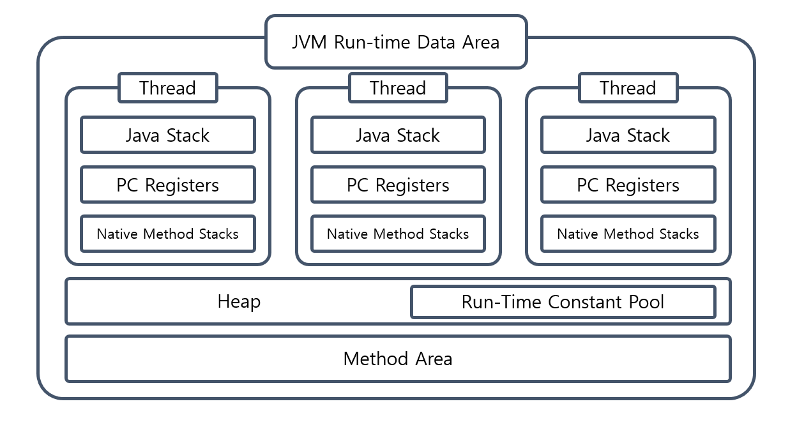
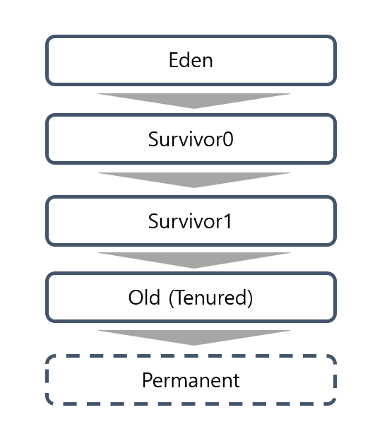
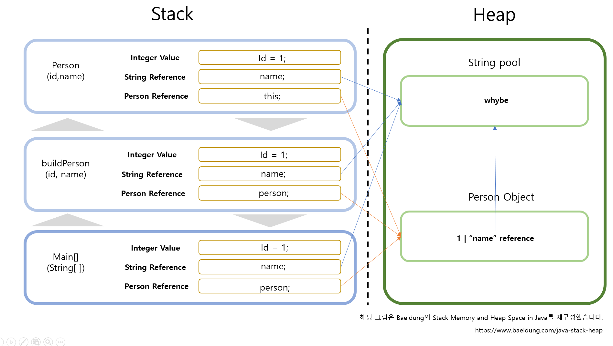

_Java_ 로 작성된 코드는 어떻게 돌아가는 걸까? 해당 물음에 답을 찾기 위한 _JVM_ 시리즈 3편, _JVM_ 의 구성요소 중 _Run-Time Data Area_ 에 관한 글입니다.
이번 글에서는 _JVM_ 의 메모리 영역에서는 어떤 일이 일어나는지에 대해서 알아봅시다.

## 클래스 파일이 _JVM_ 에 탑재된 이후
지난 글에서는 클래스 파일들을 어떻게 _JVM_ 에 탑재하고 초기화가 되는지에 대해서 알아보았습니다. 
이렇게 탑재된 클래스 파일들은 _JVM_ 에서는 어떤 영역을 차지하고 있는 것일까요? 
_JVM_ 의 _Run-Time Data Area_ 에는 크게 _Method Area_ , _Heap_ , _Java Stacks_ , _PC registers_ 그리고 _Native Method Stacks_ 가 존재합니다. 
각각의 영역이 어떤 역할을 하는지에 대해서 알아봅시다.



## _Method Area_
_Method Area_ 에서는 인스턴스 생성을 위한 객체 구조, 생성자, 필드 등이 저장됩니다.
_Runtime Constant Pool_ 과 _static_ 변수, 그리고 메소드 데이터와 같은 _Class_ 데이터들도 이곳에서 관리가 됩니다.
_JVM_ 당 하나만 생성이 되어 관리가 됩니다.
인스턴스 생성에 필요한 정보도 존재하기 때문에 _JVM_ 의 모든 _Thread_ 들이 영역을 공유하게 됩니다.
_JVM_ 의 메모리 다른 영역에서 해당 정보에 대한 요청이 오면, 실제 물리 메모리 주소로 변환해서 전달해줍니다.
기초가 되는 역할을 하므로 _JVM_ 구동 시작 시에 생성이 되며, 종료 시까지 유지되는 공통 영역입니다.

## _Heap_
_Heap_ 영역은 코드 실행을 위한 _Java_ 로 구성된 객체 및 _JRE_ 클래스들이 탑재됩니다.
이곳에서는 문자열에 대한 정보를 가진 _String Pool_ 뿐만이 아니라 실제 데이터를 가진 인스턴스, 배열 등이 저장이 됩니다.
_JVM_ 당 역시 하나만 생성이 되고, 해당 영역이 가진 데이터는 모든 _Java Stack_ 영역에서 참조되어, _Thread_ 간 공유가 됩니다.
_Heap_ 영역이 가득 차게 되면 _OutOfMemoryError_ 를 발생시키게 됩니다.
다음은 인스턴스의 영역을 가득 차게 만들어서 해당 _Heap_ 영역에서의 _Error_ 발생시키는 코드입니다.

```java
public class Heap {
    public static void main(String[] args) {
        System.out.println("Heap 메모리 오류");
        int num = 1;
        List<Integer> nums = new LinkedList<>();
        try{
            while(true) {
                nums.add(num);
                num = num + 1;
                if (num <1) {
                    break;
                }
            }
        } catch (Exception e) {
            System.out.println(e);
        }
    }
}
```

```bash
Heap 메모리 오류
Exception in thread "main" java.lang.OutOfMemoryError: Java heap space
        at Heap.main(Heap.java:16)
```

_Heap_ 에서는 참조되지 않는 인스턴스와 배열에 대한 정보 또한 얻을 수 있기 때문에 _GC_ 의 주 대상이기도 합니다.
이때, 인스턴스의 생성된 후 시간에 따라서 다음과 같이 5가지 부분으로 나눌 수가 있습니다. 



_Eden_, _Survivor1_, _Survivor2_, _Old_ , _Perm_ 으로 나누어지게 됩니다.
_Young Gen_ 이라고 불리는 비교적 신생 데이터 부분은 _Eden_ , _Survivor0_ , _Survivor1_ 입니다.
_Eden_ 에는 _new_ 를 통해 새롭게 생성된 인스턴스, 이후에는 _Survivor_ 로 이동하게 됩니다. 
이곳에서도 참조되지 않는 인스턴스와 배열 대상으로 _Minor GC_ 가 일어나긴 하지만 가장 주요하게 _GC_ 가 일어나는 부분은 그 이후의 부분인 _Old_ 부분입니다.
_Perm_ 의 경우에는 클래스의 메타 정보 및 _static_ 변수를 저장하고 있었습니다.
_Java 8_ 버전 이후로 _Native_ 영역에 존재하는 _Metaspace_ 라는 영역으로 대체되었습니다.
정확한 내용은 후에 _GC_ 파트에서 다루도록 하겠습니다.

또한, 각 _Thread_ 별로 메모리를 할당받는 _JVM Stack_ 영역과 달리 조금은 속도가 느린 점이 있습니다.
그리고 앞서 언급했듯이 모든 _Thread_ 들이 해당 영역을 공유하여 _Java_ 의 동시성 문제가 발생하게 됩니다.
각각의 _Thread_ 메모리가 따로 관리되는 것과 달리 이 부분은 _Thread_ 에 의해서 공유가 되기 때문에 _Thread Safe_ 하지 않습니다. 
이 때문에 해당 영역에 있는 객체나 인스턴스를 사용하게 되면, _synchronized_ 블록을 사용하는 방법 등을 비롯하여 동시성을 지켜주는 방법을 사용해야 합니다.

## _JVM Stacks_
각 _Thread_ 별로 따로 할당되는 영역입니다. _Heap_ 메모리 영역보다 비교적 빠르다는 장점이 있습니다. 
또한, 각각의 _Thread_ 별로 메모리를 따로 할당하기 때문에 동시성 문제에서 자유롭다는 점도 있습니다. 
각 _Thread_ 들은 메소드를 호출할 때마다 _Frame_ 이라는 단위를 추가(_push_)하게 됩니다.
메소드가 마무리되며 결과를 반환하면 해당 _Frame_ 은 _Stack_ 으로부터 제거(_pop_)이 됩니다.
_Frame_ 은 메소드에 대한 정보를 가지고 있는 _Local Variable_, _Operand Stack_ 그리고 _Constant Pool Reference_ 로 구성이 되어 있습니다.
_Local Variable_ 은 메소드 안의 지역 변수들을 가지고 있습니다.
_Operand Stack_ 은 메소드 내 연산을 위해서, 바이트 코드 명령문들이 들어있는 공간입니다.
_Constant Pool Reference_ 는 _Constant Pool_ 참조를 위한 공간입니다.

이렇게 구성된 _Java Stack_ 은 메소드가 호출될 때마다 _Frame_ 이 쌓이게 됩니다.

다음은 _Frame_ 가 쌓인 구조 및 _Heap_ 영역과의 참조를 보여주는 코드 및 그림입니다.

```java
class Person {
    private int id;
    private String name;

    public Person(int id, String name) {
        this.id = id;
        this.name = name;
    }
}

public class Main {
    public static void main(String[] args) {
        int id = 1;
        String name = "whybe";
        Person person = null;
        person = buildPerson(id, name);
    }

    private static Person buildPerson(int id, String name) {
        return new Person(id, name);
    }
}
```



위 그림에서 알 수 있듯이, 지역 변수에서 값으로 가지는 부분, 그리고 참조로 가지는 부분이 나누어져 있습니다.
이 후 각 _Frame_ 의 연산이 끝나게 되면, 결과 값을 호출한 상위 _Frame_ 에 반환해주게 됩니다.  

_Java Stack_ 영역이 가득 차게 되면 _StackOverflowError_ 를 발생시키게 됩니다.
다만 _JVM_의 전체적인 메모리가 부족하면 _OutOfMemoryError_ 가 발생하기도 합니다.
다음은 재귀 함수를 무한으로 호출 시켜 _Stack_ 영역에서의 _Error_ 를 일으키겠습니다.

```java
public class Stack {
    
    public static void main(String[] args) {
        System.out.println("Stack 메모리 오류");
        try{
            int num = func(0);
        } catch (Error e) {
            System.out.println(e);
        }
    }

    private static int func(int num) {
        num = num+1;
        return func(num);
    }
}
```

```bash
Stack 메모리 오류
java.lang.StackOverflowError
```

## _Native Method Stacks_
_Java_ 로 작성된 프로그램을 실행하면서, 순수하게 _Java_ 구성 및 코드로만은 사용할 수 없는 시스템의 자원이나 _API_ 가 존재합니다.
다른 프로그래밍 언어로 작성된 메소드들을 _Native Method_ 라고 합니다.
_Native Method Stacks_ 는 _Java_ 로 작성되지 않은 메소드를 다루는 영역입니다. _C Stacks_ 라고 불리기도 합니다.
앞의 _Java Stacks_ 영역과 비슷하게 _Native Method_ 가 실행될 경우 _Stack_ 에 해당 메서드가 쌓이게 됩니다.
각각의 _Thread_ 들이 생성되면 _Native Method Stacks_ 도 동일하게 생성이 됩니다.

## _PC(Program Counter) Registers_
_Java_ 에서 _Thread_ 는 각자의 메소드를 실행하게 됩니다. 
이때, _Thread_ 별로 동시에 실행하는 환경이 보장되어야 하므로 최근에 실행 중인 _JVM_ 에서의 명령어 주소값을 저장할 공간이 필요합니다.
이 부분을 _PC Registers_ 영역이 관리하여 추적해주게 됩니다.  _Thread_ 들은 각각 자신만의 _PC Registers_ 를 가지고 있습니다. 
만약 실행했던 메소드가 네이티브하다면 _undefined_ 가 기록이 됩니다. 
실행했던 메소드가 네이티브하지 않다면, _PC Registers_ 는 _JVM_ 에서 사용된 명령의 주소 값을 저장하게 됩니다.

## Reference

- [java-stack-heap Baeldung](https://www.baeldung.com/java-stack-heap)
- [Java Memory Management](https://www.geeksforgeeks.org/java-memory-management/)
- [Native Methods and the Java Native Interface, IBM](https://www.ibm.com/docs/en/i/7.2?topic=languages-native-methods-java-native-interface)
- [Getting started with Java native methods](https://www.ibm.com/docs/en/i/7.2?topic=interface-getting-started-java-native-methods)  
- [Java SE 8 document, Oracle](https://docs.oracle.com/javase/specs/jvms/se8/html/jvms-2.html)
