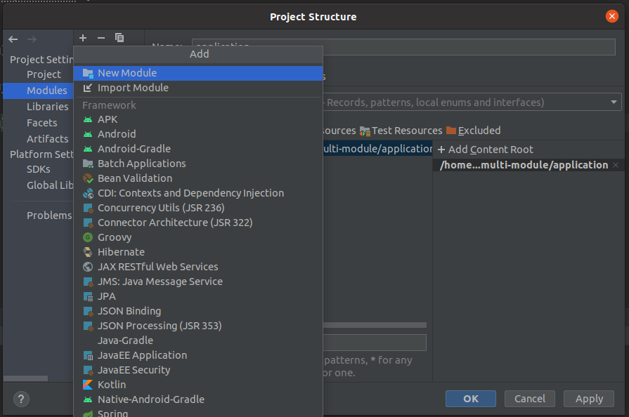
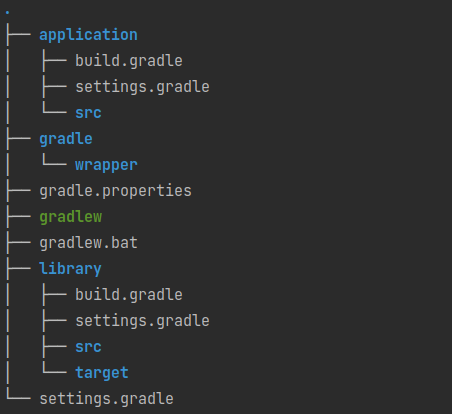

이번 글에서는 프로젝트를 구성하는 데 있어 멀티 모듈 활용했을 때의 장점과 간단한 설정 방법을 알아본다. 멀티 모듈의 개념을 처음 접하는 사람들이 읽어보기를 추천한다.

<!-- end -->

## 멀티 모듈이란?

오라클 자바 문서에서는, 모듈을 패키지의 한 단계 위의 집합체이며, 관련된 패키지와 리소스들의 재사용할 수 있는 그룹이라고 정의한다.

운영하던 서비스를 관리자 서버(admin)와, 사용자 서버(web)를 분리하여 운영할 필요성이 있다고 해보자. 하나의 모듈로 구현을 진행한다면, 각각 별도의 프로젝트를 만들고 많은 부분의 코드를 `복사+붙여넣기`를 통해 구현할 것이다. Java 빌드 도구의 멀티 모듈을 사용하면, 공통된 구현(common)을 공유하는 방식으로 코드를 작성할 수 있다.

---

## 왜 멀티 모듈을 사용하는가?

1. 코드의 중복을 줄일 수 있다.

공통된 로직이 있는 여러 서비스를 운영하게 되었을 때, 공통된 부분을 모듈화하고, 이 의존성을 추가하여 공유할 수 있다. 물론, executions 플러그인을 사용하여, 하나의 프로젝트 안에서 여러 개의 실행 jar 파일을 만들어낼 수도 있지만, [Maven 공식 문서](https://maven.apache.org/guides/mini/guide-using-one-source-directory.html#producing-multiple-unique-jars-from-a-single-source-directory) 에서는 하나의 Source 디렉토리로부터 여러 jar 파일을 생성하는 것을 지양한다고 말하고 그 해결방식으로 Module의 사용을 제시한다.

2. 각 모듈의 기능을 파악하기 쉬워진다.

공통의 기능은 의존성 주입으로, 모듈별로 기능을 분리하여 작성하기 때문에, 코드의 이해가 쉬워진다.

3. 빌드를 쉽게 진행할 수 있다.

`./gradlew :moduleName:build`의 명령어를 통해 빌드를 쉽게 진행할 수 있다. 멀티프로젝트의 경우에는 별도로 빌드를 진행하는 반면에 루트 프로젝트에서 각각의 모듈을 빌드할 수 있다.

---


## 멀티 모듈 간단 설정 방법

[Spring 공식문서](https://spring.io/guides/gs/multi-module/) 에서 작성된 예시를 활용하여 설명을 이어나간다. 공통된 부분을 `library` 모듈, 이를 활용하는 부분 `application` 모듈로 구성된 간단한 프로젝트의 설정은 다음의 방식으로 이루어진다.

### 프로젝트 내부에 여러 프로젝트 생성하기
IntelliJ에서 여러 프로젝트를 생성하는 방법은 간단하다.

1. Gradle 프로젝트를 생성한다.
2. File > Project Structure 탭에서 모듈을 쉽게 추가할 수가 있다.





프로젝트를 생성하면 위와 같은 구조를 가진다.

### Root Project (setting.gradle)

하위 프로젝트(library, application)를 setting.gradle에서 설정을 진행해준다.

```groovy
rootProject.name = 'multi-module'

include 'library'
include 'application'
```

### Library 모듈 (build.gradle)

기본적으로 gradle build시 실행 가능한 jar 파일을 만드는데, Library는 이를 자체적으로 실행을 시키지 않기 때문에 아래의 설정을 추가해준다.

```groovy
plugins {
	id 'org.springframework.boot' version '2.5.2'
	id 'io.spring.dependency-management' version '1.0.11.RELEASE'
	id 'java'
}

group = 'com.example'
version = '0.0.1-SNAPSHOT'
sourceCompatibility = '1.8'

repositories {
	mavenCentral()
}

// 설정 부분
bootJar {
	enabled = false
}

jar {
	enabled = true
}
//

dependencies {
	implementation 'org.springframework.boot:spring-boot-starter'
	testImplementation 'org.springframework.boot:spring-boot-starter-test'
}
```

### Application 모듈 (build.gradle)

`project(:projectPath)` 의 방식으로 정의한 모듈의 의존성을 추가하여 사용할 수 있다.

gradle의 ProjectApi의 정의된 project() 메소드로 특정 경로의 있는 프로젝트의 의존성을 추가할 수 있다.

```groovy
plugins {
	id 'org.springframework.boot' version '2.5.2'
	id 'io.spring.dependency-management' version '1.0.11.RELEASE'
	id 'java'
}

group = 'com.example'
version = '0.0.1-SNAPSHOT'
sourceCompatibility = '1.8'

repositories {
	mavenCentral()
}

dependencies {
	implementation 'org.springframework.boot:spring-boot-starter-actuator'
	implementation 'org.springframework.boot:spring-boot-starter-web'
  
  // 설정 부분
	implementation project(':library')

	testImplementation 'org.springframework.boot:spring-boot-starter-test'
}
```

---

## 정리

간단하게 멀티 모듈이 어떤 것인지와 그 장점, 아주 쉬운 설정 방법을 알아보았다. 공통으로 정의한 기능이라는 것은 수정이 발생했을 때, 의존성을 가지고 있는 모든 서비스에 영향을 주기 때문에, 발생할 수 있는 위험도 많다. 프로젝트의 상황을 고려하여, 멀티 모듈의 도입을 시도해 보기 바란다.

## 참고 자료

- [ORACLE - understanding-java-9-modules](https://www.oracle.com/kr/corporate/features/understanding-java-9-modules.html)
- [Spring Docs - multi-module]([https://spring.io/guides/gs/multi-module/](https://spring.io/guides/gs/multi-module/))
