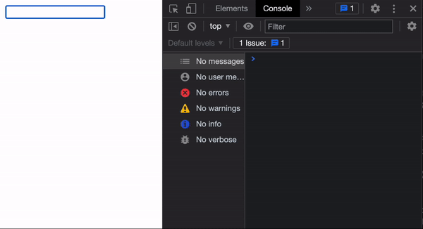

## 비동기 처리 시 race condition 고려하기

프로그래밍을 할 때 비동기 처리는 여간 까다로운 게 아닙니다. 저마다의 어려움이 있겠지만, 대표적으로 그 이유를 '낮은 예측성'에 들 수 있는데요. 아무리 잘 작성된 비동기 코드라 할 지라도, 동기 코드에 비해 추론이 힘들 뿐더러 일관된 응답 처리 또한 쉽지 않기 때문입니다.

이번 글에서는 비동기 처리를 어렵게 하는 요소 중 하나인 **race condition**과 이에 대한 대안책을 함께 알아보겠습니다.

### Race condition

경합 조건이라고도 하며 이것은 꽤 여러 군데에서 통용되는 개념입니다.

> 경합 조건은 시스템의 실질적인 동작이 다른 통제 불가능한 이벤트의 순서나 타이밍에 따라 달라지는 전자 장치, 소프트웨어 또는 기타 시스템의 조건이다. - [Wikipedia](https://en.wikipedia.org/wiki/Race_condition)

조금 더 쉽게 풀어보자면, 하나의 처리를 위해 다수의 작업이 (거의) 동시에 발생하는 경우 처리를 제어하는 입장에서 무엇이 먼저 완료될 지 예측하기 힘들다는 이야기입니다. 비동기 맥락에서 경합 조건은 주로 **요청 순서와 응답 순서가 반드시 같지는 않음**을 의미하는 용어로 사용됩니다.

```js
function fetchA() {
  fetch(url) //
    .then(response => console.log(`A: ${response}`));
}

function fetchB() {
  fetch(url) //
    .then(response => console.log(`B: ${response}`));
}

fetchA();
fetchB();
```

위와 같이 `fetchA()`, `fetchB()`를 호출해도 콘솔에 A 응답, B 응답이 순서대로 출력된다는 것을 보장할 수는 없습니다. 때문에 이와 같은 특성이 비동기 상황을 보다 세심하게 처리해야 하는 이유입니다.

구체적인 이해를 돕기 위해 UX 시나리오를 가정해보겠습니다.

1. 인풋에 값을 입력하면
2. 입력된 값에 따라 실시간으로 데이터를 가져온다.
3. 가져온 데이터를 화면에 보여준다.

혹은

1. 화면에 여러 버튼이 있고
2. 버튼을 클릭할 때마다 데이터를 가져온다.
3. 가져온 데이터를 화면에 보여준다.

프로젝트에서 검색이나 필터를 도입한다면 흔히 마주칠 수 있는 UX입니다. 하지만 만약 이러한 UX 상에서 경합 조건이 발생한다면, 어떤 문제가 생길 수 있을까요? 첫 번째 예시를 코드로 옮겨 확인해보겠습니다.

```js
// 1 ~ 2초 사이의 통신이 발생하는 네트워크 상황을 가정
function delayRandomly() {
  const timer = Math.ceil(Math.random() * 2) * 1000;

  return new Promise(resolve => setTimeout(resolve, timer));
}

const $input = document.getElementById('input');
let requestIndex = 0;

// input이 바뀔 때마다 데이터를 가져와 콘솔에 출력
$input.addEventListener('input', () => {
  const index = ++requestIndex;

  fetch(url)
    .then(async response => {
      await delayRandomly();

      return response.json();
    })
    .then(data => console.log(`요청 ${index}: `, data))
    .catch(error => console.error(error));
});
```

<br />


마지막 응답의 결과는 매번 바뀔 수 있기에 그대로 화면에 띄워주게 되면 결국 사용자는 기대와 다른 결과를 얻게 됩니다.

대개 반복되는 이벤트의 최적화를 위해 [Debounce, Throttle](https://webclub.tistory.com/607)을 활용하지만 이는 앞서 설명한 문제의 실질적인 대안이라고 할 수는 없습니다. 이 기술은 빈번하게 발생되는 동일 이벤트의 출력량을 조절할 뿐, 비동기적으로 가져올 데이터 간의 경합 조건을 해결해주지는 않기 때문입니다.

근본적인 문제를 해결하는 데 초점을 맞춰본다면 아마 다음과 같은 방법을 고민해보지 않을까 싶습니다.

- 이전 요청은 모두 무시하고 마지막 요청에 대한 응답만 처리해준다.

이와 같은 처리가 가능하도록 특정 시점의 요청 자체를 끊어버릴 수 있는 방법이 있다면 어떨까요? 그것을 가능하게 하는 API가 바로 `AbortController`입니다.

### AbortController

`AbortController`는 `fetch` 등의 웹 요청을 취소할 수 있도록 고안된 인터페이스이며 두 개의 주요 프로퍼티를 가집니다.

- `AbortController.signal`: 읽기 전용 프로퍼티이며 요청을 취소할 수 있도록 사용되는 인스턴스 객체입니다. 컨트롤러와 웹 요청을 이어주는 매개체라고 생각하면 됩니다.
- `AbortController.abort()`: `signal`로 연결된 요청이 완료되기 전에 취소할 수 있는 메서드입니다.

사용법은 꽤 간단합니다. 우선 다음과 같이 컨트롤러를 생성해줍니다.

```js
var controller = new AbortController();
```

그 다음 취소될 수 있는 요청을 보낼 때 `signal` 옵션을 지정해줄 수 있습니다.

```js
fetch(url, {
  signal: controller.signal,
});
```

이제 원하는 시점에 해당 요청을 취소해야할 때 컨트롤러의 `abort()`를 호출해주면 됩니다.

```js
controller.abort();
```

아까의 예시 코드에 `AbortController`를 적용해보겠습니다.

```js
let currentRequest = null;
let requestIndex = 0;

$input.addEventListener('input', () => {
  if (currentRequest) {
    currentRequest.abort();
  }

  currentRequest = new AbortController();
  const index = ++requestIndex;

  fetch(url, {
    signal: currentRequest.signal,
  })
    .then(async response => {
      await delayRandomly();

      return response.json();
    })
    .then(data => console.log(`요청 ${index}: `, data))
    .catch(error => {
      if (error.name === 'AbortError') return;

      console.error(error);
    });
});
```

<br />



코드를 다시 정리해보면,

1. 이벤트 호출 시 `AbortController` 생성 후 저장
2. `fetch` 요청을 보낼 때 저장된 컨트롤러의 `signal`을 옵션에 기입
3. input이 바뀔 때마다 이전에 저장된 컨트롤러가 있다면 연결된 요청은 취소

이전 요청이 다음 요청 전까지 응답에 대한 처리를 모두 마쳤다면 `abort()`가 호출되어도 별다른 동작을 하지 않습니다. 반면 요청 사이에 간격이 좁아 이전 요청이 여전히 수행 중이라면 바로 취소되고 다음 요청의 수행만 유지합니다. 이로써 다수의 요청 간에 경합 조건을 발생시킬 여지를 없앨 수 있게 되는 것입니다.

하나의 요청이 취소되면 `AbortError`를 던집니다. 이것은 `error.name`에 맞게 적절한 예외처리를 해주면 됩니다.

### Summary

사용자를 위한 UX를 고려하며 비동기 처리를 할 때, 단지 `AbortController`를 사용하는 것만으로는 완벽한 대안이 될 수 없습니다. Debounce, Throttle을 활용해 불필요한 이벤트의 반복을 줄이고, `AbortController`를 통해 응답 간의 경합 조건을 줄여준다면 관련된 비동기 처리의 안정성을 더욱 높일 수 있을 것입니다.

### References

- [대표 이미지 출처](https://blog.theodo.com/2019/09/handle-race-conditions-in-nodejs-using-mutex/)
- [Fetch: Abort - Modern Javascript Tutorial](https://javascript.info/fetch-abort#:~:text=AbortController%20is%20a%20simple%20object,possible%20to%20abort%20the%20fetch%20.)
- [Handling API request race conditions in React](https://dev.to/sebastienlorber/handling-api-request-race-conditions-in-react-4j5b)
