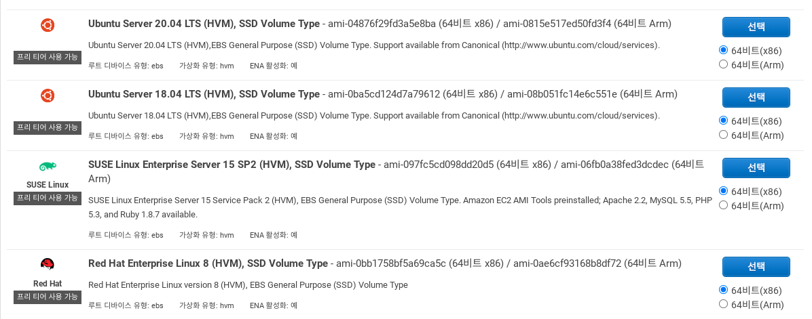
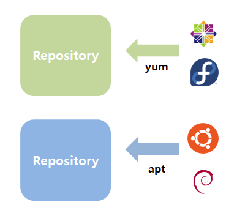

_Ubuntu_ , _Fedora_ , _Manjaro_ , _Centos_ … _AWS_ 인스턴스 설정에서 만나는, 운영체제에 대한 것들은 도대체 무엇일까? 
이번 글은 배포 시에 마주치는 리눅스 배포판들과 리눅스의 특징들에 대해 다룬 글, “리눅스 배포판이란?” 입니다.

<!-- end -->

## 배포 미션 중 마주친 다양한 배포판
우아한테크코스에서는 단순하게 프로그램을 만드는 것뿐 만이 아니라 실제로 서비스를 배포하고 이를 운영 및 유지 보수를 하면서 미션을 진행하고 있습니다. 
이 때문에 클라우드를 활용하여 프로그램을 배포하는 과정은 필수적입니다. 
필자가 속한 팀도 서비스 완성 이후에 배포를 위해 AWS의 EC2를 활용하기로 하였습니다. 
EC2를 위한 사양을 고르고 다음 페이지에서는 처음 보는 로고들이 보게 되었습니다.



익숙한 _Windows_ 로고뿐만이 아니라 처음 보게 되는 로고가 많아서 당황스러웠습니다. 
서버에서는 리눅스라는 특수한 운영체제가 쓰이는 것은 알고 있었는데, 정작 운영체제 선택창에서는 펭귄 로고를 가진 리눅스가 아닌 다양한 로고들이 보였습니다. 
이것들은 무엇일까요? 
저와 함께 리눅스 및 리눅스 배포판에 대해서 배워가보도록 하겠습니다.

## 리눅스(_Linux_) 란
리눅스는 사실 커널이라는 운영체제의 일종입니다. 
운영체제란 컴퓨터 시스템 중앙에서 시스템을 구성하는 자원들을 관리하며 사용자와 소통하며 시스템을 작동시키는 구성 요소입니다. 
일반적으로 운영체제는 _Windows_ 나 _MacOS_ 처럼 프로그램을 실행시켜주는 틀이라고 알려져있습니다.
하지만 운영체제는 하드웨어와 소통하며 CPU와 같은 자원 사용을 효율적으로 사용할 수 있게 도와주는 역할도 하고 있습니다.
후자의 역할을 수행하기 위해서 메모리 위에 항상 상주하며 작동해야 하는 운영체제의 구성요소가 있습니다. 
그것을 바로 커널이라고 부릅니다. <br>
커널은 운영체제의 역할 중에서 프로그램들과 하드웨어 사이를 소통시키고 제어해주는 역할을 하고 있습니다. 
또한, 메모리 관리, 저장 공간 관리, 업무 관리 등도 하고 있습니다. 
운영체제를 위한 커널에도 여러 종류가 있는데, 이 중 리눅스(_Linux_) 라는 커널을 선택하는 운영체제들이 있습니다.
이를 통상적으로 저희는 운영체제로서의 리눅스라고 부릅니다. <br>
하지만 리눅스 커널 혼자서만은 운영체제의 역할을 모두 해낼 수가 없습니다.
이를 해결하기 위해서 자유 소프트웨어 재단에서 만든 _GNU_ 와 함께 사용하며, _GNU/Linux_ 라는 형태로 사용하게 됩니다. 
실제로 운영체제로서 리눅스 라고 부르는 것은 단순한 커널뿐만이 아니라 여러 프로그램을 묶어서 배포하는 _GNU/Linux_ 에서 기능이 추가된 것이라고 볼 수가 있습니다.
이렇듯 리눅스 커널은 서버에서 많이 선택되는 _Ubuntu_ , _Centos_ , _RHEL_ 뿐만이 아니라 가까운 곳에서 찾아볼 수 있는 핸드폰의 운영체제인 _Android_ 도 리눅스 커널을 채택하여 사용하고 있습니다.

## 배포판이란
위의 파트에서는 리눅스가 정확히 어떤 부분을 지칭하는지를 배웠습니다. 
하지만 운영체제에서는 커널 이외의 다른 부분도 존재합니다. 
일반 사용자가 많이 사용하는 _Windows_ , _MacOS_ 정도의 편의성에서는 못 미쳐도, 서버에서 사용하는 _Ubuntu Server_ 나 _RHEL_ 정도의 기능들조차 메꾸어지지 않았습니다. 
순수하게 리눅스 커널 자체만을 사용하는 것이 아닌 커널과 함께 해당 운영체제 목적에 맞는 여러 프로그램을 패키징하여 제공하게 됩니다. <br> 
이를 바로 _Distribution_ , 배포판이라고 합니다. 
앞서 첫 부분에서 _AWS_ 의 운영체제 선택 창에서 보았던 _Window Server_ 를 제외한 많은 운영체제가 바로 리눅스 커널을 사용하되, 목적에 따라서 다양한 프로그램들을 함께 제공하는 배포판의 종류들입니다. 
배포판에 따라서 서버 운영에 특화된 것, 일반 사용자에게 특화된 것, IoT와 같은 소형 장치들에 특화된 것들이 나뉘어서 제공되며, 같은 서버 특화라도 같이 제공되는 프로그램이 다른 것을 알 수가 있습니다.

## 저장소에서 프로그램을 가져오는 방법
저희 팀은 _Ubuntu_ 를 선택하여 미션을 진행하게 되었습니다. 
_Ubuntu_ 에서 서버 운영에 필요한 _Java_ 를 설치하기 위해서는 다음과 같은 명령어를 입력해주어만 했습니다.

```bash
sudo apt -y update && sudo apt -y upgrade
sudo apt -y install default-jdk
```

하지만 만약 다른 배포판인 _Centos_ 에서 _Java_ 를 설치하기 위해서는 다음과 같은 명령어를 입력해주어야만 합니다.
```bash
sudo yum install java-1.8.0-openjdk
```

“sudo” 는 최상위 사용자의 권한으로 실행한다는 것을 표현하는 명령어입니다.
하지만 왜 같은 리눅스인데 하나는 _apt_ 라는 명령어를 쓰고, 하나는 _yum_ 이라는 명령어를 쓰게 될까요?
또한 뒤의 _apt_ 는 무엇이고, 업데이트 및 업그레이드는 무엇을 의미하는 것일까요?
그것은 리눅스 배포판의 특성과 관련이 있습니다. <br> 
각각의 배포판에서는 운영체제 및 프로그램을 쉽게 관리할 수 있도록 저장소(_repository_)를 운영하고 있습니다.
저장소 및 저장소를 통해서 설치된 프로그램의 버전 및 의존성을 관리해주는 패키지 매니저에 접근하는 명령어들은 배포판마다 각각 다릅니다.
_Ubuntu_ 를 비롯한 배포판들은 _Debian_ 계열에 기반을 두고 있으므로 _apt_ 명령어를 통해서, _Centos_ 를 비롯한 배포판들은 _Fedora_ 계열에 기반을 두고 있으므로 _yum_ 명령어를 통해서 각각의 리눅스 배포판의 저장소에 접근하여 해당 저장소 정보를 받아오게 됩니다. 
이렇게 저장소와 패키지 관리자 명령어로 리눅스 배포판의 종류를 나누기도 합니다.


배포판들은 운영체제의 역사와 마찬가지로 필요에 따라서 분리되면서 특화되어왔습니다.
그 중 가장 유명한 것으로는 서버 시장에서 널리 쓰이고 있는 _fedora_ 계열 및 _Ubuntu_ 와 _Mint_ 와 같은 데스크톱 유저들을 많이 확보한 _debian_ 계열이 있습니다.



_Ubuntu_ 기준으로 apt update는 저장소에서 어떤 패키지들이 업데이트되어있는지에 대해서 정보를 받아오고, apt upgrade를 통해서 이전의 패키지 버전을 삭제하고 새 패키지를 다운받아 오게 됩니다.
명령어 한 번으로 패키지 간들의 의존성을 정리해주고, 버전을 최신 상태로 업그레이드할 수 있습니다.
각각의 저장소들은 기본으로 선택된 안정 버전뿐만이 아니라 베타 버전 등에 대한 옵션을 제공함으로써 조금 더 최신 버전의 패키지들을 선택해서 사용할 수 있습니다. 
만약 원하는 프로그램이 공식 저장소에 등록이 되어 있지 않으면 ppa와 같은 개인이 운영하는 저장소를 컴퓨터에 등록하여 프로그램들을 받아서 사용할 수 있습니다.
저장소에 등록된 버전들을 확인 및 업데이트하고 난 다음에 원하는 프로그램을 저장소에서 다운을 받을 수가 있습니다. 
마지막 명령어인 sudo apt -y install default-jdk 는 _debian_ 의 공식 저장소에서 기본적인 자바 개발 환경을 다운받는 명령어입니다.

## 부록 리눅스, 유닉스, MacOs, And Window
많은 서버 개발자들은 _Windows_ 에서 개발하는 것보다는 _MacOS_ 에서 개발하는 것을 선호해왔습니다. 
리눅스는 마이너하기 때문에 사용하지 않지만 왜 _MacOS_ 가 조금 더 선호되는 것일까요? 
많은 이유가 있겠습니다만 그 이유 중 하나는 운영체제의 역사와 관련되어 있습니다


운영체제는 발전을 거듭하며 목적 및 필요에 따라서 갈라져서 발전해왔습니다.
유닉스 (_UNIX_)는 그 중 리눅스와 _MacOS_ 에 많은 영향을 준 운영체제입니다. 
이 둘은 같은 운영체제에서 파생 및 영향을 받게 됨으로써 시스템 구조나 명령어 상에서 많은 유사점을 가지게 되었습니다.
하지만, _Windows_ 는 _MS-DOS_ 부터 유닉스와는 다른 방향으로 발전을 해왔기 때문에 상대적으로 리눅스와 _MacOS_ 와는 비슷한 점이 상대적으로 줄어들게 되었습니다.
이 때문에 서버의 대부분은 리눅스 환경에서 운영이 되며 개발자들도 유사한 환경에서 개발을 진행하는 것이 유리했습니다.
그렇기에 조금 더 유사한 점이 많은 _MacOS_ 의 특징이 개발자들에게 조금 더 매력적으로 다가오게 되었습니다.
하지만 최근에는 _Windows_ 에서도 하위 시스템으로 리눅스를 둠으로써 (_WSL_) , _Windows_ 에서의 서버 개발자들의 접근성이 개선되고 있습니다.

## Reference
- [Kernel in Opearting System](https://www.geeksforgeeks.org/kernel-in-operating-system/)
- [Introduction to Linux Operating System : What is the Linux](https://www.geeksforgeeks.org/kernel-in-operating-system/)
- [What is GNU/Linux](https://www.debian.org/releases/buster/amd64/ch01s02.en.html)
- [How to list repositories on linux](https://www.networkworld.com/article/3305810/how-to-list-repositories-on-linux.html#:~:text=A%20Linux%20repository%20is%20a,software%20packages%20on%20Linux%20systems.)
