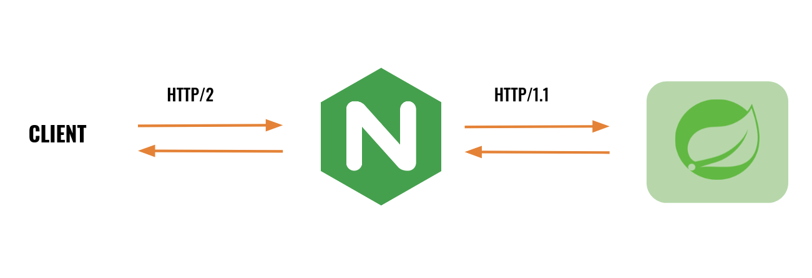

HTTP/2 프로토콜의 특징과 NGINX에서의 간단한 설정 방법에 대해 알아본다.

<!-- end -->

HTTP/2를 알아보기 전에, 그 이전 프로토콜인 HTTP/1.x를 먼저 알아보자. 대부분의 서버(NGINX, apache, SpringBoot ...등)는 기본설정으로 HTTP/1.1 이 적용되어 있다.

## HTTP/1.x

### HTTP/1.0

`HTTP/1.0`에서는 기본적으로 단기 커넥션(Short-lived connections)을 제공한다. 요청마다 커넥션을 매번 새롭게 생성하고 응답이 도착하고 연결을 닫는다. 매번 TCP 핸드 셰이크의 오버헤드가 발생한다. 하나의 커넥션 안에서, 요청에 대한 응답이 오고 난 다음에야 새로운 요청을 보낼 수 있는 구조이다.

### HTTP/1.1

HTTP/1.0의 다음 버전인 `HTTP/1.1` 에서는 영속적인 커넥션과 HTTP 파이프라이닝 기능이 추가되었다.

- 영속적인 커넥션(Persistent Connection)
  매번 연결을 성립하는 대신, 연결을 유지한 채 요청을 주고받는 방식이다. `keep-alive` header를 사용해서 연결이 얼마나 오랫동안 유지하는지 설정할 수 있다.


- HTTP 파이프라이닝(HTTP Pipelining)
  요청-응답이 한 호흡으로 데이터를 주고받는 것이 아닌, 여러 요청을 보내고, 각각의 응답을 기다리는 형태이다. 오류가 많아 현재 대부분의 브라우저에서는 활성화되지 않은 기능이다.

가장 대표적인 HTTP/1.1의 문제점은 HTTP HOL 블로킹(Head Of Line Blocking) 문제다. 간단하게 설명하면, 요청(Line)의 앞부분(head)에서 지연이 발생하게 되었을 때, 전체적인 성능 저하 현상이 발생하는 것이다.


> HTTP/1.x에서 성능 개선을 위해 클라이언트가 여러 병렬 요청을 수행하려는 경우, 여러 TCP 연결이 사용되어야 하며, 브라우저는 각각 최대 연결 개수를 정하고 있다. 크롬의 경우 최대 6개의 연결을 제공하기 때문에, 병렬적으로 요청을 받아올 수 있다.


도메인 별로 커넥션 수의 제약이 있기 때문에, 도메인을 샤딩하여 더 많은 커넥션을 활용하여 성능을 향상할 수도 있다.

---

## HTTP/2

기존 HTTP 표준을 대체하는 것이 아니라 확장한 것으로, API의 작동 방식은 동일하게 유지한 채, 밑단의 전달 방식을 수정함으로써 성능 개선을 진행하였다. HTTP/2가 제공하는 특징 몇 가지를 차례대로 살펴보겠다. 더욱 자세한 설명은 [구글 HTTP/2 문서](https://developers.google.com/web/fundamentals/performance/http2?hl=ko) 를 참고하기 바란다.


- 바이너리 프레이밍 계층(Binary Framing)

  기존의 텍스트로 구성되었던 부분(줄 바꿈으로 RequestLine, Header, Body를 구분)을 HEADERS, DATA 프레임 둘로 구분하고 바이너리 형식으로 인코딩된다.


- 요청 및 응답 다중화

HTTP/1.x에서는 다중 커넥션을 활용하여 병렬 요청을 진행했지만, HTTP/2는 하나의 커넥션에서 위에서 정의한 프레임을 스트리밍해 줌으로써 요청과 응답의 다중화를 진행한다. 이를 통해 기존의 HTTP/1.1에서 응답이 오지 않았을 때, 요청을 보내지 못하는 HOL 블로킹 문제를 해결할 수 있다.


- 서버 푸시

기존의 1대1 요청 응답 방식과는 다르게, 하나의 요청에 대해 여러 응답을 보내줄 수 있다. 클라이언트가 html 요청을 보냈을 때, 이를 구성하는 css, js, image 파일들도 함께 보내줄 수도 있다.

- 헤더 압축

HTTP/2 에서는 헤더 전송의 오버헤드를 줄이기 위해, 요청과 응답 헤더 데이터를 압축한다. 압축하는 방식으로 HPACK을 사용하는데, 자세한 설명은 [여기](https://datatracker.ietf.org/doc/html/draft-ietf-httpbis-header-compression) 를 참고하기 바란다.

## NGINX 에서 HTTP/2 설정하기

HTTP/2 같은 경우, SSL/TLS 설정이 필수라고 명시하고 있지는 않지만, 대부분의 브라우저에서 SSL/TLS 설정이 되어있는 경우만 제공한다고 한다. NGINX에서도 SSL/TLS 설정을 해주어야 한다. 실제 nginx.conf을 다음과 같이 구성하면 된다. 서버 푸시에 자세한 설명은 [공식문서](https://www.nginx.com/blog/nginx-1-13-9-http2-server-push/) 참고하기 바란다.

```
server {
    # ssl설정을 해주고, http2를 적어주면 쉽게 설정할 수 있다.
    listen 443 ssl http2;

    ssl_certificate ssl/certificate.pem;
    ssl_certificate_key ssl/key.pem;

    root /var/www/html;

    # index.html에 요청이 왔을 때, style.css, main.js, image.jpg 파일도 함께 서버 푸시된다.
    location = /index.html {
        http2_push /style.css;
        http2_push /main.js;
        http2_push /image.jpg;
    }
}
```

## NGINX에서는 upstream HTTP/2를 제공하지 않는다

HTTP/2가 HTTP/1.x의 단점을 보완하여 만들었기 때문에, 항상 HTTP/2 프로토콜을 사용하는 것이 좋아 보인다. 하지만, NGINX 에서는 클라이언트 사이드에서의 HTTP/2 통신만을 제공하고 있다.

NGINX를 로드밸런서, Spring서버를 백엔드 서버로 두는 다음의 상황을 생각해 보자. 기존에는 모두 HTTP/1.1 프로토콜 방식으로 클라이언트-프록시, 프록시-백엔드 사이의 통신을 하고 있는 상태이다.


### 클라이언트-로드밸런서를 HTTP/2



앞서 설명한 설정 방식을 통해 쉽게 구조를 수정할 수 있다.

많은 경우 로드밸런서와 백엔드 서버를 같은 프라이빗 네트워크에 두고 서비스를 구성한다. 프라이빗 네트워크는 지연 시간이 짧기 때문에, 성능의 주요 결정 요인은 클라이언트와 로드밸런서 사이의 지연 시간이다.

위의 측면에서 볼 때, 지연 시간이 오래 걸리는 클라이언트와 로드밸런서 사이에 HTTP/2 통신을 하게 되었을 때, 기대되는 성능 향상은 클 것이다.

### HTTP/2 → HTTP/2으로 연결해야 최고의 성능이지 않을까?

HTTP/2는 하나의 커넥션에서 요청과 응답을 스트리밍의 방식으로 연결한다. 이 연결은 End-to-End 가 아닌 각각의 연결에 대해서 적용된다. 모든 연결에 대해서 HTTP/2 프로토콜을 이용하는 것이 응답을 기다리지 않고 요청을 보내기 때문에 가장 최적의 성능일 것이다. 하지만, 로드밸런서와 백엔드 서버 사이에서의 아래의 이유로 HTTP/1.1로 연결해도 충분히 빠를 수 있기에 NGINX 에서는 upstream HTTP/2 통신 방식은 제공하고 있지 않는다고 한다. 

1. 프라이빗 네트워크인 경우 지연시간이 짧다.
2. NGINX는 기본적으로 512개의 커넥션을 제공하고 있다. 브라우저의 6개의 커넥션 제한과는 다르게 더 많은 커넥션을 연결할 수 있다.
3. `keep-alive` 의 장점을 이용할 수 있다. 로드밸런서의 경우 통신하는 서버의 수가 제한되기 때문에, keep-alive 상태의 커넥션을 재사용하는 경우 많다.


## 정리

HTTP/2 프로토콜의 특징과 NGINX 에서 설정하는 방법에 대해서 알아보았다. 설정은 매우 간편하지만, HTTP/2의 특징을 안 상태로 프로토콜의 개선이 각자의 상황에 효과적일지는 고민해 봤으면 좋겠다.

## 참고 자료

- [Google Developer HTTP/2](https://developers.google.com/web/fundamentals/performance/http2?hl=ko)
- [Mozila Developer Connection_management_in_HTTP_1.x](https://developer.mozilla.org/ko/docs/Web/HTTP/Connection_management_in_HTTP_1.x)
- [StackOverflow http2-with-node-js-behind-nginx-proxy](https://stackoverflow.com/questions/41637076/http2-with-node-js-behind-nginx-proxy)
- [Why does your browser limit the number of concurrent network calls?](https://www.linkedin.com/pulse/why-does-your-browser-limit-number-concurrent-ishwar-rimal/)
