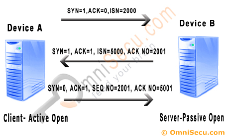
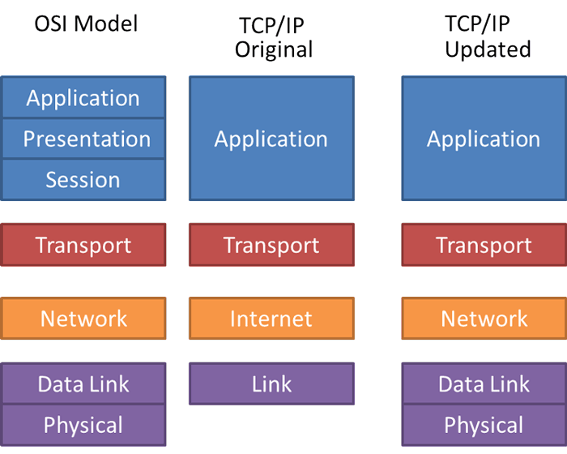

## TCP/IP

### TCP

TCP는 Transmission Control Protocol의 약어로서 인터넷상의 데이터를 주고받는 과정을 제어하는 통신 표준을 의미합니다. 이 프로토콜은 데이터를 교환하는 기기 간 데이터의 무결성(정확성)과 전달의 신뢰성을 보장하기 때문에 거의 모든 애플리케이션 수준의 프로토콜(FTP, SSH, HTTP 등)에서 사용하고 있습니다.

### IP

Internet Protocol이라고 하며 인터넷을 통해 데이터를 전송하기 위해 지켜야 하는 규칙입니다. 이 프로토콜은 `183.101.195.193`과 같은 IP 주소를 통해 데이터를 전달할 위치를 파악합니다. 쉽게 생각해 우리가 편지를 부칠 때 주소를 적어야 하는 것처럼, 컴퓨터에서 데이터를 전송할 때 전송할 목적지가 필요한데 그 역할을 해주는 매개체가 바로 IP 주소인 셈입니다.

데이터를 전송할 때는 하나의 완전한 데이터를 바로 보내지 않고 분할 작업을 거치게 되는데, 이때 분할되어 작아진 데이터 단위를 패킷(Packet)이라고 합니다. 여기서 데이터를 왜 패킷 단위로 나누어야 할까요? 그것은 전송 과정이 실패했을 때 처음부터 다시 데이터를 보내는 건 소모적이고 데이터가 완전히 전송될 때까지 다른 데이터가 대기해야 할 수도 있기 때문입니다. 이러한 이유로 패킷은 송신 측에서 분할 전송 후에 수신 측에서 완전한 데이터로 재결합하여 사용합니다.

참고 - [What is a packet?](https://www.cloudflare.com/learning/network-layer/what-is-a-packet/)

### TCP vs IP

TCP와 IP는 각기 다른 목적을 가진 프로토콜이지만 인터넷 통신을 위해서는 대부분 두 프로토콜을 함께 사용하기 때문에 흔히 TCP/IP라고 부릅니다. 즉, TCP는 IP에 대한 대체가 아니라 보완을 목적으로 두는 프로토콜입니다. 만약 IP를 통해서만 데이터를 주고받는다면 원치 않는 이슈를 맞닥뜨릴 수 있습니다.

- 비연결성 - 패킷을 받을 대상을 확인하지 않고 패킷을 전달
- 비신뢰성 - 패킷이 유실되거나 잘못된 순서로 전달
- IP 주소의 한계 - 동일 IP 내에서 구동 중인 프로그램이 두 개 이상일 때 패킷의 목적지 구분 불가

TCP는 위와 같은 문제를 사전에 방지하고자 3 Way-Handshake나 PORT와 같은 메커니즘을 주요한 특징으로 삼고 있습니다. 그리고 우리는 이러한 메커니즘을 잘 알아야 TCP가 어떻게 IP를 보완하는지 알 수 있으므로 두 메커니즘의 특징을 좀 더 살펴보도록 하겠습니다.

### 3 Way-Handshake

데이터를 보내는 기기와 데이터를 받는 기기 간에 데이터 교환이 이루어지기 전에, 기본적으로 두 기기는 서로 동기화되어야 합니다. 따라서 TCP는 송, 수신 측에서 데이터를 주고받기 전에 논리적인 접속을 확립합니다. 이러한 접속을 커넥션이라고 하며, 이는 양측 모두 데이터를 전송할 준비가 되었다는 것을 보장합니다.

커넥션을 확립하기 위해서는 우선 동기화 목적의 패킷을 교환해야 하는데, 해당 패킷이 담고 있는 정보 중에 비교적 중요한 정보는 다음과 같습니다.

- SYN(synchronize sequence numbers; 일련번호를 일치시키다)
- ACK(acknowledgement; 응답을 확인하다)

두 개의 정보는 비트로 이루어져 있으며 [TCP 세그먼트 헤더](https://www.omnisecu.com/tcpip/tcp-header.php)에서 관리 됩니다. 이 정보들은 패킷을 전달하는 과정에서 flag 역할을 하고 TCP는 이러한 정보들을 바탕으로 '3 Way'라는 이름 그대로 3번의 통신을 거쳐 데이터 전송을 위한 사전 작업을 진행합니다.

 

> ISN(Initial Sequence Number), ACK NO(Acknowledgement Number), SEQ NO(Sequence Number)는 TCP를 통해 전송되는 다른 데이터와의 충돌을 방지하기 위한 일종의 구분자로 생각하시면 됩니다.

1. Client → Server: `SYN = 1, ACK = 0`과 함께 `ISN`을 무작위로 설정하여 Server로 전달
2. Server → Client: `ACK NO`에 클라이언트 `ISN + 1`을 할당하고 `SYN = 1, ACK = 1`과 함께 새로운 `ISN`을 무작위로 설정하여 Client로 전달
3. Client → Server: `SEQ NO`에 서버 `ACK NO` 할당, `ACK NO`에 서버 `ISN + 1`을 할당 후 `SYN = 0, ACK = 1`과 함께 Server로 전달

이러한 과정을 모두 마치게 되면 커넥션이 확립되고 두 컴퓨터는 인증된 `SEQ NO`와 `ACK NO`를 통해 데이터를 전송할 수 있습니다. 이제 TCP의 커넥션을 통해 패킷이 유실되거나 잘못된 순서로 전달되어도 패킷 재전송, 재구성이 가능하기에 컴퓨터 간 더욱 안정적으로 데이터를 교환하게 되는 것입니다.

### PORT

Port라는 단어를 직역하자면 '항구'라고 합니다. 말 그대로 데이터가 실제로 도달해야 하는 어느 지점을 의미하는 것인데요, IP 주소를 통해 컴퓨터의 위치를 파악했다면 그 컴퓨터에서 구동되고 있는 애플리케이션의 주소를 파악하는 것은 포트의 역할이라고 할 수 있습니다. 예컨대 HTTP는 80번, HTTPS는 443번, SMTP는 25번으로 송신 측에서 전달된 데이터의 최종 행방은 이러한 포트 번호와 일치하는 애플리케이션이 됩니다. 그리고 Port 또한 위에서 언급한 TCP 세그먼트 헤더에서 관리됩니다.

### TCP/IP Model

TCP/IP Model은 OSI 7 Layers Model을 참고하여 구축된 모델입니다. 이 글에서는 OSI 7 Layers Model은 깊게 다루진 않을 것입니다. 다만 이해를 돕기 위해 Layer Model에 대해 간략히 설명하자면, '네트워크상에서 정보 교환을 위한 여러 과정을 모듈화하여 계층으로 나눈 구조'라고 얘기할 수 있겠습니다. 그렇기에 각 계층은 서로 독립적인 동시에 상호 유기적인 성격을 띱니다. (OSI 7 Layers Model에 대해 좀 더 자세히 알고 싶다면 이 [영상](https://www.youtube.com/watch?v=1pfTxp25MA8)을 보시는 것을 추천드립니다. 😊)

> 현재 사용되고있는 TCP/IP Model은 기존 TCP/IP Model과 약간은 다릅니다. 기존 모델은 계층을 4개로 나누는 반면, 현재의 모델은 계층을 5개로 분리하기 때문입니다.

 

각 계층에 대한 설명 (Updated TCP/IP Model 기준)

- Application Layer
  - high-level 프로토콜 담당
  - 애플리케이션의 데이터 전송
  - HTTP, SMTP, FTP
- Transport Layer
  - 신뢰성, 흐름 제어, 데이터 수정 담당
  - TCP, UDP
- Network Layer
  - 네트워크를 통해 패킷 전송
  - Internet Protocol - IP 주소 정의, 라우팅
  - IP, ARP, ICMP
- Data Link Layer
  - 네트워크 계층으로부터 받은 패킷 헤더에 MAC 주소 추가 (프레임 생성)
- Physical Layer
  - 모델의 최하단 계층으로써 비트 단위의 실질적인 데이터 전송 담당

### 참고

- [대표 이미지 출처](https://www.net-usb.com/usb-over-ip/what-is-tcp-ip/)
- [What is a Transmission Control Protocol TCP/IP Model?](https://www.fortinet.com/resources/cyberglossary/tcp-ip)
- [3 Way-Handshake](https://www.omnisecu.com/tcpip/tcp-three-way-handshake.php)
- [TCP/IP vs OSI Model: What’s the Difference?](https://www.computernetworkingnotes.com/ccna-study-guide/similarities-and-differences-between-osi-and-tcp-ip-model.html)
- [TCP/IP Five-Layer Software Model Overview](https://microchipdeveloper.com/tcpip:tcp-ip-five-layer-model)
