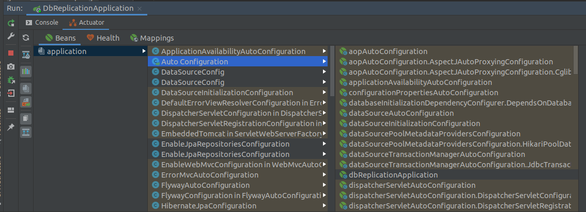
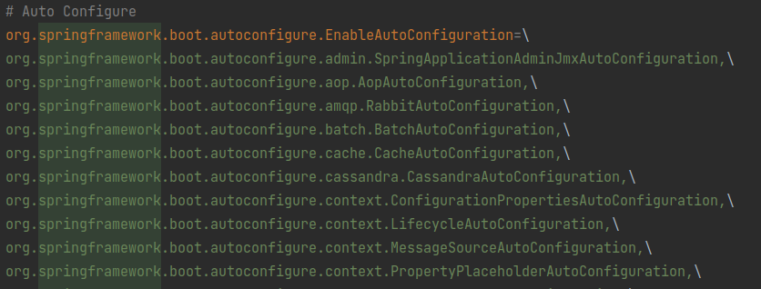
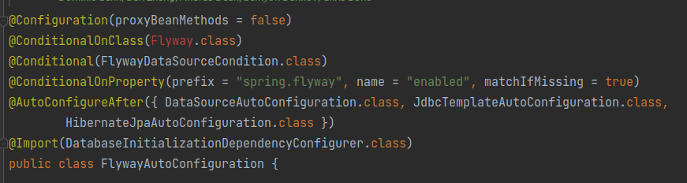

SpringBoot의 AutoConfiguration은 정말 편리하게 의존성만 추가해주면 관련된 기능들이 모두 설정된다. 편리한 만큼 이를 커스터마이징하는 데는 주의가 필요하다. 이
글에서는 Spring AutoConfiguration의 간단한 원리를 알아보고 어떤 관점으로 바라봐야 하는지 제시한다.

<!-- end -->

## @SpringBootApplication

```java

@SpringBootConfiguration
@EnableAutoConfiguration
@ComponentScan(excludeFilters = {
  @Filter(type = FilterType.CUSTOM, classes = TypeExcludeFilter.class),
  @Filter(type = FilterType.CUSTOM, classes = AutoConfigurationExcludeFilter.class)})
public @interface SpringBootApplication {
}
```

`@SpringBootApplication` 은 위의 3가지 어노테이션을 합친 것이다.

- @SpringBootConfiguration : @Configuration과 같은 기능을 한다.
- @EnableAutoConfiguration : classpath에 있는 `/resource/META-INF/spring.factories` 내부에 정의된
  EnableAutoConfiguration에 정의된 Configuration들을 자동으로 등록한다. 이때, Auto Configuration의 등록 조건을 만족하는 경우에만
  등록된다. `--debug` 옵션을 가지고 jar파일을 실행시키면 조건 만족 여부와 함께, 어떤 Bean들이 등록되는지 확인해 볼 수 있다.
- @ComponentScan : base-package가 정의되지 않으면 해당 어노테이션이 붙은 classpath 하위의 `@Component` 어노테이션을 스캔해서,
  Bean으로 등록한다.

이때, 개발자가 정의한 Component들이 먼저 스캔 돼서 Bean으로 등록된 후에 AutoConfiguration의 Bean들이 등록된다. 해당 등록 부분을 확인하고
싶으면 `ConfigurationClassParser` 클래스의 `doProcessConfigurationClass` 메소드를 디버깅을 해보면 확인해 볼 수 있다.

추가로 IntelliJ에서는 별도의 설정 없이 Actuator의 기능을 제공해서, 어떤 Bean들이 등록됐는지 다음과 같이 쉽게 확인할 수 있다.



---

## Springboot AutoConfiguration



Springboot의 아무 의존성이나 추가하면, spring-boot-autoconfigure가 설정이 되고, 그
내부에 `/resource/META-INF/spring.factories` 를 확인하면 위와 같이 설정이 되어있다. 이 중 FlywayAutoConfiguration을 보며 어떤
방식으로 AutoConfiguration이 진행되는지 알아보자.



1. `Configuration(proxyBeanMethods = false)`

대부분의 AutoConfiguration 설정의 경우 `proxyBeanMethods = false`로 설정되어 있다. 기본 설정은 `proxyBeanMethods = true`
인데, CGLIB을 통해 런타임에 동적으로 Configuration 객체의 프록시를 생성해준다. 필자가 이해한 바로는 아래의 설정을 진행하는 데 필요하다.

```java

@Configuration
public class Config {

  @Bean
  SomeBean someBean() {
    return new SomeBean();
  }

  @Bean
  NothingBean nothingBean() {
    return new NothingBean(someBean());
  }
}
```

`@Configuration`에서는 메소드 호출로 내부에서 정의한 Bean을 바로 사용할 수 있다. 기본 설정을 사용하면 SomeBean은 한 번만
생성되지만, `proxyBeanMethod = false`를 사용하면, NothingBean을 생성하는 시점에서 또 다른 SomeBean이 생성되어 총 두 번 생성이 된다. 하지만,
이런 방식은 모든 Configuration에서는 필수적이지 않으며, proxy를 생성하는 부분에서 성능적인 이슈가 있다고 한다. 자세한 부분은 다음
SpringBoot의 [이슈](https://github.com/spring-projects/spring-boot/issues/9068) 를 참고하길 바란다.

2. `@Conditional-#`

Conditional로 시작하는 어노테이션들은 직관적이다. @ConditionalOnClass의 경우 해당 Class가 classpath에 존재할 때만 동작하게 되어 있다.
여러 Conditional의 설정들이 있지만 직관적이기에 설명은 생략한다. 위의 경우 Flyway에 대한 dependency를 추가해주지 않았기 때문에, 빨간색으로 표시가 되었고,
FlywayAutoConfiguration이 동작하지 않게 된다.

3. `@AutoConfigurationBefore` / `@AutoConfigurationAfter`

AutoConfiguration의 등록 순서를 결정한다. FlywayAutoConfiguration 같은 경우에는 DatasourceAutoConfiguration,
JdbcTemplateAutoConfiguraion, HibernateJpaAutoConfiguration 이후에 설정이 진행된다.

실제로 직접 AutoConfiguration을 만들어서 라이브러리도 배포할 수도 있다. 해당 부분은 잘
정리한 [이 블로그](https://donghyeon.dev/spring/2020/08/01/%EC%8A%A4%ED%94%84%EB%A7%81%EB%B6%80%ED%8A%B8%EC%9D%98-AutoConfiguration%EC%9D%98-%EC%9B%90%EB%A6%AC-%EB%B0%8F-%EB%A7%8C%EB%93%A4%EC%96%B4-%EB%B3%B4%EA%B8%B0/)
를 참고하길 바란다.

---

## AutoConfiguration을 대하는 자세 (feat.DB Replication)

SpringBoot에서 DB Replication 설정을 위해 구글링을 해보면 다음과 비슷한 형태의 코드들을 많이 발견할 수 있다.

```java
@Configuration
@EnableAutoConfiguration(exclude = {DataSourceAutoConfiguration.class})
@EnableTransactionManagement
@EnableJpaRepositories(basePackages = {"com.example"})
class DataBaseConfig {

  @Bean
  @ConfigurationProperties(prefix = "spring.datasource.master")
  public DataSource masterDataSource() {
    return DataSourceBuilder.create().type(HikariDataSource.class).build();
  }

  @Bean
  @ConfigurationProperties(prefix = "spring.datasource.slave")
  public DataSource slaveDataSource() {
    return DataSourceBuilder.create().type(HikariDataSource.class).build();
  }

  @Bean
  public DataSource routingDataSource(@Qualifier("masterDataSource") DataSource master,
                                      @Qualifier("slaveDataSource") DataSource slave) {
    ReplicationRoutingDataSource routingDataSource = new ReplicationRoutingDataSource();

    HashMap<Object, Object> sources = new HashMap<>();
    sources.put(DATASOURCE_KEY_MASTER, master);
    sources.put(DATASOURCE_KEY_SLAVE, slave);

    routingDataSource.setTargetDataSources(sources);
    routingDataSource.setDefaultTargetDataSource(master);

    return routingDataSource;
  }

  @Primary
  @Bean
  public DataSource dataSource(@Qualifier("routingDataSource") DataSource routingDataSource) {
    return new LazyConnectionDataSourceProxy(routingDataSource);
  }
}

public class ReplicationRoutingDataSource extends AbstractRoutingDataSource {
  public static final String DATASOURCE_KEY_MASTER = "master";
  public static final String DATASOURCE_KEY_SLAVE = "slave";
  private static final Logger logger = LoggerFactory.getLogger(ReplicationRoutingDataSource.class);

  @Override
  protected Object determineCurrentLookupKey() {
    return TransactionSynchronizationManager.isCurrentTransactionReadOnly() ? DATASOURCE_KEY_SLAVE
      : DATASOURCE_KEY_MASTER;
  }
}
```

위 코드의 간단히 설명하면 다음과 같다.

- DB Replication는 Read를 Slave DB로, CUD(Create, Update, Delete)의 작업은 Master DB에 접근해야 한다. DB
  Replication의 개념이 궁금한
  분은 [MariaDB Replication Overview](https://mariadb.com/kb/en/replication-overview/) 를 참고하길 바란다.
- master/slave DataSource를 설정한다.
- ReplicationRoutingDataSource에서 `@Transactional`의 readOnly 여부에 따라 연결하는 DataSource를 결정한다.
- 기존의 DataSource는 Transaction이 시작되는 시점에서 DataSource를 결정하지만 `LazyConnectionDataSourceProxy`를 사용하여 그
  DataSource 결정을 뒤로 늦춘다.

---

### 위의 구현에서 의문이 드는 점

1. @EnableAutoConfiguration(exclude = {DataSourceAutoConfiguration.class})

DataSource를 커스터마이징한다고 하면, 무조건 DataSourceAutoConfigration을 exclude 해야 하나? 필자의 견해는 `No`
이다.

> Auto-configuration is non-invasive

SpringBoot 공식문서에서는 위와 같이 설명한다. AutoConfiguration은 침투적이지 않다, 즉 `@ConditionalOnMissingBean`의 어노테이션을
사용해서 충분히 AutoConfiguration을 exclude하지 않아도 된다.

```java
// DataSourceAutoConfiguration 클래스
@Configuration(proxyBeanMethods = false)
@Conditional(EmbeddedDatabaseCondition.class)
@ConditionalOnMissingBean({DataSource.class, XADataSource.class})
@Import(EmbeddedDataSourceConfiguration.class)
protected static class EmbeddedDatabaseConfiguration {
}
```

DataSourceAutoConfiguration 에서는 @ConditionalOnMissingBean({ DataSource.class, XADataSource.class })
설정을 통해, DataSource클래스의 Bean이 이미 존재한다면, 새로운 DataSource Bean을 생성하지 않는다.

추가적으로 DataSourceAutoConfiguration의 코드를 보게 되면, `DataSourceInitializationConfiguration` 이
deprecated(`SqlInitializationAutoConfiguration` 로 이전한 것으로 보임)되서 별도의 설정이 진행되지 않지만, 다른
AutoConfiguration에서는 별도의 설정이 진행될 가능성이 있다. AutoConfigration은 직접 들어가서 확인해보기 전까지에는 그 작업을 예단하면 안 된다.

2. @EnableTransactionalManager, @EnableJpaRepositories

해당 설정은 `TransactionAutoConfiguration`에서 자동으로 설정이 된다. 그렇기에 불필요한
설정이다. `JpaRepositoriesAutoConfiguration` 와 `@EnableJpaRepositories` 효과적으로 동일하여서 삭제해도 된다.

3. 실제로 잘 동작하는가?

해당하는 설정을 진행했을 때, 특이한 상황을 발견했다. 여러 개의 트랜잭션으로 구성된 api콜의 경우 맨 처음 트랜잭션의 readOnly 여부에 따라
master/slave DB가 결정된다. 예를 들어 `@Transactional(readOnly=true)`의 트랜잭션을 DB에 쓰이는 것을 확인할 수 있었다. 각각의
트랜잭션별로 readOnly 검증하고 있다고 생각했는데, 실제로는 그렇게 동작하지 않았다. 그 이유는 `HibernateJpaAutoConfiguration` 설정에서
자체적으로 OSIV(Open Session In View)설정이 true로 설정되어 있기 때문이다. OSIV의 자세한 내용이 궁금한
분은 [조영호님 OSIV 정리 글](http://pds19.egloos.com/pds/201106/28/18/Open_Session_In_View_Pattern.pdf) 을
참고하기를 바란다. 트랜잭션별로 DataSource를 설정해주기 위해서는 `jpa.open-in-view=false`설정을 application.properties에 추가해줘야 한다.

> 주의 사항
> 
> Spring의 많은 AutoConfiguration Setting들은 한 개의 DataSource의 사용을 가정하는 것으로 보인다. `HibernateJpaAutoConfiguration`, `JdbcTemplateAutoConfiguration` , `SqlInitializationAutoConfiguration` 에서 모두 `@ConditionalOnSingleCandidate(DataSource.class)` 의 설정이 요구된다. 여러 개의 DataSource를 사용하게 되었을 때에는 `@Primary` 어노테이션을 붙여주어야 한다. 그렇지 않게 되면, 실행된 것으로 예상된 동작들이 작동하지 않는 것을 확인할 수 있다.

4. Flyway의 의존성을 추가해줬을 때 FlywayAutoConfigration으로 인한 순환 참조의 문제 발생

어찌 보면 당연한 문제다. 지금의 DataSource는 `@Transactional` 의 readOnly 여부에 따라 dataSource가 결정되는 부분인데, DB
Migration을 담당하는 Flyway는 여러 DB 중 어떤 DB를 스스로 선택해서 Migration해줘야 할까? FlywayAutoConfiguration의 설정을
보면 `@FlywayDataSource`라는 어노테이션을 활용해서 Flyway가 관리하는 DataSource를 지정해줄 수 있다. 설정하지 않으면 여러 DataSource일
때는 `@Primary` 가 붙은 DataSource를, 하나일 때는 해당 DataSource가 관리된다.

현재 시점에서는 [Spring Boot 이슈](https://github.com/spring-projects/spring-boot/issues/15732) 에서 확인 할 수 있듯이 여러
DataSource에 대한 별도의 Solution이 없는 것으로 보인다.

---

### 수정후 코드

위의 고려 사항을 반영한 코드는 다음과 같다. `jpa.open-in-view=false` 옵션도 추가해야 한다.

```java
@Configuration(proxyBeanMethods = false)
public class DataSourceConfig {

  @Bean
  @FlywayDataSource
  @ConfigurationProperties(prefix = "spring.datasource.master")
  public DataSource masterDataSource() {
    return DataSourceBuilder.create().type(HikariDataSource.class).build();
  }

  @Bean
  @ConfigurationProperties(prefix = "spring.datasource.slave")
  public DataSource slaveDataSource() {
    return DataSourceBuilder.create().type(HikariDataSource.class).build();
  }

  @Bean
  public DataSource routingDataSource(@Qualifier("masterDataSource") DataSource masterDataSource,
                                      @Qualifier("slaveDataSource") DataSource slaveDataSource) {
    ReplicationRoutingDataSource routingDataSource = new ReplicationRoutingDataSource();

    HashMap<Object, Object> sources = new HashMap<>();
    sources.put(DATASOURCE_KEY_MASTER, masterDataSource);
    sources.put(DATASOURCE_KEY_SLAVE, slaveDataSource);

    routingDataSource.setTargetDataSources(sources);
    routingDataSource.setDefaultTargetDataSource(masterDataSource);

    return routingDataSource;
  }

  @Bean
  @Primary
  public DataSource dataSource(@Qualifier("routingDataSource") DataSource routingDataSource) {
    return new LazyConnectionDataSourceProxy(routingDataSource);
  }
}
```

해당 부분을 이슈로 작업했던
흐름은 [GPU-IS-MINE DB Replication 이슈](https://github.com/woowacourse-teams/2021-gpu-is-mine/issues/399)
에서 확인해 볼 수 있다.

## 정리

SpringBoot의 AutoConfiguration은 편리하지만, 예측하지 못하는 경우가 발생하기도 하고, 이는 바로 확인하기가 쉽지 않다. AutoConfiguration의
작동방식을 잘 이해했을 때, 코드는 더 간결해지고 SpringBoot를 SpringBoot답게 쓸 수 있다고 생각한다.
