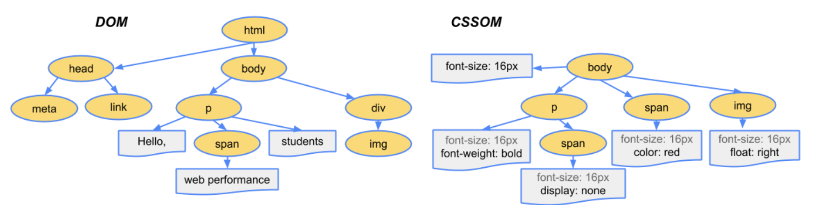
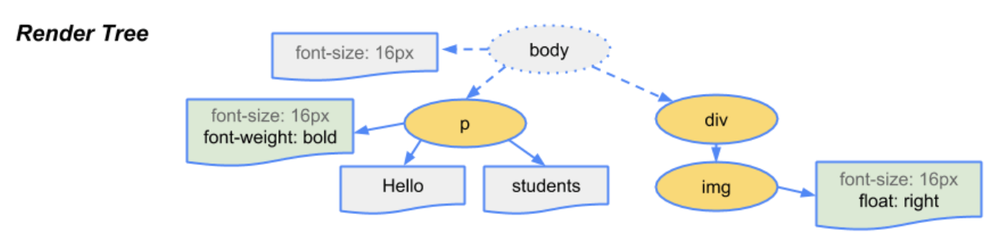

최근에 백엔드 팀원들과 CS공부를 하면서, 주소창에 `google.com`을 입력했을 때 일어나는 일에 대해 공부하였다.

이때 백엔드 팀원이 받아온 HTML 파일은 어떻게 브라우저에 그려지는지 물어보았는데, 명확하게 답을 하지못해서 내가 아직 브라우저 렌더링 과정을 정확하게 이해하지 못하고 있다는 걸 알게 되었다.

그래서 이번 시간에는 브라우저 렌더링 과정에 대해서 공부하고 정리해보려고 한다.

### 목차

- 브라우저
- 브라우저 렌더링 동작 과정
  - Parsing
  - Style
  - Layout/Reflow
  - Painting
  - Composite
- 마무리

## 브라우저

브라우저 렌더링 과정을 알아보기전에 브라우저가 무엇인지 먼저 알아보자. 우선 브라우저는 우리가 흔히 인터넷에 접속할 때 사용하는 Chrome, Safari, Firefox, Internet Explorer 등을 말한다.

MDN에서는 브라우저에 대해 웹에서 페이지를 찾아서 보여주고, 사용자가 하이퍼링크를 통해 다른 페이지로 이동할 수 있도록 하는 프로그램이라고 설명하고 있다. 여기서 중요하다고 생각하는 부분은 찾아서 보여준다는 것이다.

브라우저는 유저가 선택한 자원을 서버로 부터 받아와서 유저에게 보여준다. 이 자원은 페이지 외에도 이미지, 비디오 등의 컨텐츠들도 포함된다. 받아온 자원들을 렌더링 과정을 통해 유저에게 보여주게 된다.

## 브라우저 렌더링 동작 과정

렌더링의 기본적인 동작 과정은 다음과 같다.

1. HTML 파일과 CSS 파일을 파싱해서 각각 Tree를 만든다.
2. 두 Tree를 결합하여 Rendering Tree를 만든다.
3. Rendering Tree에서 각 노드의 위치와 크기를 계산한다.
4. 노드를 화면에 렌더링한다.

각 단계를 좀 더 자세하게 알아보자.

### Parsing

브라우저가 페이지를 렌더링하려면 가장 먼저 받아온 HTML 파일을 해석해야한다. Parsing 단계는 HTML 파일을 해석하여 DOM(Document Object Model) Tree를 구성하는 단계이다.

파싱 중 HTML에 CSS가 포함되어 있다면 CSSOM(CSS Object Model) Tree 구성 작업도 함께 진행한다.

### Style

Style 단계에서는 Parsing 단계에서 생성된 DOM Tree와 CSSOM Tree를 매칭시켜서 Render Tree를 구성한다. Render Tree는 실제로 화면에 그려질 Tree이다.

예를 들면 Render Tree를 구성할때 `visibility: hidden`은 요소가 공간을 차지하고, 보이지만 않기 때문에 Render Tree에 포함이 되지만, `display: none` 의 경우 Render Tree에서 제외된다.

### Layout

Layout 단계에서는 Render Tree를 화면에 어떻게 배치해야 할 것인지 노드의 정확한 위치와 크기를 계산한다.

루트부터 노드를 순회하면서 노드의 정확한 크기와 위치를 계산하고 Render Tree에 반영한다. 만약 크기 값을 %로 지정하였다면, Layout 단계에서 % 값을 계산해서 픽셀 단위로 변환한다.

### Paint

Paint 단계에서는 Layout 단계에서 계산된 값을 이용해 Render Tree의 각 노드를 화면상의 실제 픽셀로 변환한다. 이때 픽셀로 변환된 결과는 하나의 레이어가 아니라 여러 개의 레이어로 관리된다.

당연한 말이지만 스타일이 복잡할수록 Paint 시간도 늘어난다. 예를 들어, 단색 배경의 경우 시간과 작업이 적게 필요하지만, 그림자 효과는 시간과 작업이 더 많이 필요하다.

### Composite

Composite 단계에서는 Paint 단계에서 생성된 레이어를 합성하여 실제 화면에 나타낸다. 우리는 화면에서 웹 페이지를 볼 수 있다.

## 마무리

오늘은 브라우저 렌더링 동작 과정에 대해 정리하는 시간을 가져봤다.

깊게 들여다보면 더 복잡한 과정들이 숨어있지만, 누군가 다시 나에게 브라우저 렌더링 동작 과정에 대해 물어본다면 어떻게 설명 할 수 있을지 생각하며 글을 작성해보았다.

혹시 더 많은 내용이 궁금하면 `naver d2 - 브라우저는 어떻게 동작하는가?` 포스팅을 읽어보는 걸 추천한다.

## 참고 자료

- [MDN - 브라우저](https://developer.mozilla.org/ko/docs/Glossary/Browser)

- [wikipedia - 웹 브라우저](https://ko.wikipedia.org/wiki/%EC%9B%B9_%EB%B8%8C%EB%9D%BC%EC%9A%B0%EC%A0%80)

- [naver d2 - 브라우저는 어떻게 동작하는가?](https://d2.naver.com/helloworld/59361)

- [toast - 성능 최적화](https://ui.toast.com/fe-guide/ko_PERFORMANCE)

## 이미지 출처

- https://developers.google.com/web/fundamentals/performance/critical-rendering-path/render-tree-construction?hl=ko
