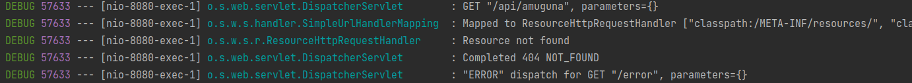

SpringBoot 에서 존재하지 않는 api 요청에 대한 에러메시지를 커스터마이징한 과정을 소개한다.

<!-- end -->

## 배경
프로젝트를 진행하면서 api의 url을 실수로 잘못 입력했을 때, 에러의 원인을 확인하지 못해 디버깅 과정에 많은 시간을 사용했다.

이런 상황에 해당하는 적절한 에러 메시지를 응답해야 한다 생각했고, 코드를 하나씩 분석하기 시작했다.

---

## DispatcherServlet 들여다보기

DispatcherServlet의 doDispatch 메소드를 확인해보면, mappedHandler가 존재하지 않은 때, noHandlerFound 메소드가 실행된다.
메소드 내부를 보면 `throwExceptionIfNoHandlerFound`에 값에 따라, Exception을 throw하는 지의 여부가 결정된다. 기본 설정은 `false` 이기 때문에 프론트 404의 응답만을 보냈다.

```java
public class DispatcherServlet {
  protected void doDispatch(...) throws Exception {
      // Determine handler for the current request.
      mappedHandler = getHandler(processedRequest);
      if (mappedHandler == null) {
          noHandlerFound(processedRequest, response);
          return;
      }
  }
  
  protected void noHandlerFound(HttpServletRequest request, HttpServletResponse response) throws Exception {
    if (this.throwExceptionIfNoHandlerFound) {
      throw new NoHandlerFoundException(request.getMethod(), getRequestUri(request),
        new ServletServerHttpRequest(request).getHeaders());
    }
    else {
      response.sendError(HttpServletResponse.SC_NOT_FOUND);
    }
  }
}
```

> 그렇다면 해당 설정을 true로 바꿔주면 간단하게 해결할 수 있을 것으로 보인다. 이 설정은 어디서 진행될까?

---

## DispatcherServletAutoConfiguration 설정 확인하기

Springboot에서는 이런 상황을 미리 예견했다는 듯이, 이와 관련한 설정을 모두 진행할 수 있도록 작성되어있다.
`setThrowExceptionIfNoHandle`메소드가 사용되는 곳을 확인하면 `DispatcherServletAutoConfig`에서 `DispatcherServlet` Bean을 생성할 때 적용한다.
또 이는 `WebMvcProperties`의 properties에 따라 설정되는 것을 확인할 수 있다.

```java
// DispatcherServletAutoConfiguration
@Bean(name = DEFAULT_DISPATCHER_SERVLET_BEAN_NAME)
public DispatcherServlet dispatcherServlet(WebMvcProperties webMvcProperties) {
  DispatcherServlet dispatcherServlet = new DispatcherServlet();
  dispatcherServlet.setDispatchOptionsRequest(webMvcProperties.isDispatchOptionsRequest());
  dispatcherServlet.setDispatchTraceRequest(webMvcProperties.isDispatchTraceRequest());
  dispatcherServlet.setThrowExceptionIfNoHandlerFound(webMvcProperties.isThrowExceptionIfNoHandlerFound());
  dispatcherServlet.setPublishEvents(webMvcProperties.isPublishRequestHandledEvents());
  dispatcherServlet.setEnableLoggingRequestDetails(webMvcProperties.isLogRequestDetails());
  return dispatcherServlet;
}
```

---

### WebMvcProperties 설정하기
```java
@ConfigurationProperties(prefix = "spring.mvc")
public class WebMvcProperties {
  private boolean throwExceptionIfNoHandlerFound = false;
  // 생략
}
```
`@ConfigurationProperties`의 설정은 외부 properties에 prefix에 해당하는 값들을 읽어드려 사용할 수 있다.
즉, application.properties에 `spring.mvc.throw-exception-if-no-handler-found=true`의 설정을 진행하면 된다.

> 하지만, 이 경우에도 기존의 404의 에러메시지를 응답한다. 문제는 아직 해결되지 않았다.

---

### ResourceHttpRequestHandler 가 매핑되고 있었다.

매핑된 핸들러가 없다고 생각하고, 코드만을 기반으로 지금까지의 작업을 진행했다. 실제로는 핸들러가 매핑되고 있었다.


DEBUG로그를 확인해본 결과, 존재하지 않는 api에 `ResourceHttpRequestHandler` 가 매핑되고 있었다.
즉, 기본적으로 해당하는 URL이 없으면 resource를 조회하도록 설계되어 있고, 존재하지 않았을 때 404의 에러 메시지를 응답하는 것이다.

---

### 모든 경우에서의 ResourceHandler 매핑 끄기
`WebMvcAutoConfiguration`의 `addResourceHandler` 메소드를 살펴보면 된다. ResourceProperties의 addMapping을 `false`로 설정하면 간단하게 해당 설정을 진행할 수 있다.
SpringBoot의 버전에 따라, properties를 관리하는 방식이 다르므로 확인해보고 버전에 맞게 설정을 진행하면 된다.
- 2.3.3 버전: `spring.resources.add-mappings=false` 
- 2.4.5 버전: `spring.web.resources.add-mappings=false`

> 만약, Resource에 접근하는 방식이 기존에 있었다면 별도로 이 설정을 진행해주어야 한다. 우리 팀 같은 경우, swagger를 사용했기 때문에 아래의 설정을 추가해주었다.

```java
public class SwaggerConfig implements WebMvcConfigurer {
    @Override
    public void addResourceHandlers(ResourceHandlerRegistry registry) {
        registry.addResourceHandler("swagger-ui.html")
                .addResourceLocations("classpath:/META-INF/resources/");
        registry.addResourceHandler("/webjars/**")
                .addResourceLocations("classpath:/META-INF/resources/webjars/");
    }
}
```

---

### NoHandlerFoundException 처리하기
지금까지 과정을 진행함으로써, 잘못된 url의 요청이 왔을 때 `NoHandlerFoundException`을 throw하도록 수정했다.

이를 아래처럼 ControllerAdvice의 `@ExceptionHandler`에서 처리하도록 로직을 구현하면 된다.

예외 처리가 어떤 방식으로 동작하는지 궁금한 분은 [SpringBoot 예외 처리에 관한 고찰](https://tecoble.techcourse.co.kr/post/2021-10-25-spring-exceptioin-handle/) 을 확인해보기 추천한다.

```java
@RestControllerAdvice
public class ControllerAdvice {
    @ExceptionHandler(NoHandlerFoundException.class)
    public ResponseEntity<ExceptionResponse> noHandlerFoundHandle(NoHandlerFoundException exception) {
        ExceptionResponse response = ExceptionResponse.of(exception.getMessage());
        return ResponseEntity.status(HttpStatus.NOT_FOUND).body(response);
    }
}
```

---

# 정리

존재하지 않는 url의 api의 응답을 커스터마이징 해보았다.
DispatcherServlet에서의 코드를 분석해 가며 어떤 방식으로 상황을 해결해나갔는지의 과정을 보여주고 싶었다.
코드를 분석해 가며 문제 해결의 단계를 나눠가며 진행해보기를 추천한다.
