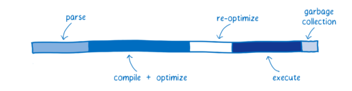
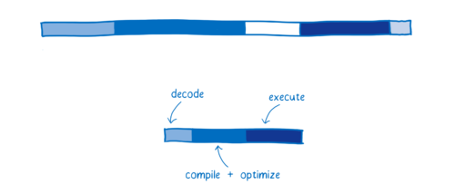

최근에 [Developer-Roadmap](https://github.com/kamranahmedse/developer-roadmap)을 둘러보다 `웹어셈블리(WebAssembly)`라는 개념에 대해 접하게 되었다.

웹 개발을 공부하는 입장에서 처음 접하는 용어에 대한 호기심이 생겼고, 이번 시간을 통해 `웹어셈블리`에 대해 함께 알아보려고 한다.

## 웹어셈블리

`웹어셈블리`는 2017년에 처음 발표되었고, 현재는 최신 브라우저에서 대부분 사용 가능하며 웹 표준으로 개발되고 있다. 일반적으로 웹 어플리케이션을 개발할 때에는 HTML, CSS, 자바스크립트를 사용하지만, 이들과 함께 `웹어셈블리`도 사용 가능하다.

`웹어셈블리`는 어떠한 '새로운 언어'가 아니다. `MDN` 문서을 보면 `웹어셈블리`에 대해 '최신 웹 브라우저에서 실행할 수 있는 새로운 유형의 코드'라고 설명하고 있다. `웹어셈블리` 파일인 `wasm`은 직접 코드를 작성하는 것이 아니라 C, C ++, RUST 등의 언어를 컴파일하여 만들게 된다.

이를 통해 기존에 C, C ++, RUST 언어로 작성된 코드를 웹에서도 네이티브에 가까운 속도로 실행 가능하게 되었고, 자바스크립트만으로는 어려웠던 고성능의 애플리케이션도 구현할 수 있게 되었다.

## 웹어셈블리와 자바스크립트

`웹어셈블리`를 사용하면 기존에 자바스크립트만으로 개발하는 것보다 고성능의 애플리케이션을 구현할 수 있다고 한다. 이게 가능한 이유는 `웹어셈블리`와 자바스크립트가 브라우저에서 처리되는 과정이 다르기 때문이라고 한다.

자바스크립트 처리 과정

웹어셈블리 처리 과정

위의 그림은 `웹어셈블리`와 자바스크립트 처리 과정을 비교하기 위한 그림이다. 각 과정을 살펴보면서 어떤 차이가 있는지 살펴보자.

1. 구문해석 (Parsing)

   자바스크립트 파일이 브라우저에 전달되면, \*추상 구문 트리(AST: Abstract Syntax Tree)로 변환이 된다. 그리고 이로 부터 바이트 코드를 생성한다. 반면, `웹어셈블리` 파일은 이미 바이트 코드 형태이기 때문에, 변환 과정이 필요 없이 해석(decode)만 하여 검증 과정만 거치면 됩니다.

   \*추상 구문 트리(AST: Abstract Syntax Tree)는 컴파일러에 널리 사용되는 자료 구조이다. 컴파일러가 요구하는 여러 단계를 통해 프로그램의 중간 표현의 역할을 한다.

2. 컴파일 및 최적화 (Compile + Optimize)

   자바스크립트와 `웹어셈블리` 모두 컴파일 과정을 거친다. 차이가 있다면 `웹어셈블리`는 이미 많은 최적화가 진행된 상태이기 때문에 기계 코드와 훨씬 가까운 상태에서 시작한다. 그렇기 때문에 자바스크립트에 비해 최적화 과정이 적다.

3. 재-최적화 (Reoptimizing)

   재-최적화는 `웹어셈블리`에서는 일어나지 않고, 자바스크립트에서만 일어나는 과정이다. 자바스크립트는 컴파일 과정에서 간혹 여러 이유로 인해 기존 최적화를 버리고 다시 최적화를 하는데 이를 재-최적화라고 한다. `웹어셈블리`에서는 타입과 같은 것들이 명시적이기 때문에 재-최적화 단계가 필요없다고 한다.

4. 실행 (execute)

   자바스크립트의 경우에도 컴파일러의 최적화 방식을 알고 있다면 그에 친화적인 형태의 코드 패턴으로 작성해 성능을 향상시킬 수도 있다. 그러나 대다수 개발자들은 컴파일러의 내부 동작을 알지 못하며, 브라우저에 따라 최적화 방식은 다르게 접근해야 하기 때문에 실제로는 어려운 일이다. 반면 `웹어셈블리`은 컴파일러를 위해 최적화 되어있기 때문에 자바스크립트에 비해 일번적으로 빠르다.

5. 가비지 컬렉션 (Garbage Collection)

   자바스크립트에서는 가비지 컬렉터가 더이상 필요없는 오래된 변수들을 메모리에서 제거하는 작업을 자동으로 해준다. 하지만 가비지 컬렉터를 직접 제어할 수 없기 때문에, 코드 실행을 방해하는 요인이 될 수도 있다. 웹어셈블리는 메모리를 수동으로 관리하기 때문에 성능에 있어서 더 안정적이다.

이러한 차이들에 의해서 일반적으로 `웹어셈블리`가 자바스크립트보다 더 좋은 성능을 나타낸다고 한다.

## 마무리

이번 시간에는 `웹어셈블리`에 대한 개념과 `웹어셈블리`가 자바스크립트에 비해 더 높은 성능을 낼 수 있는 이유에 대해서 살펴보았다. `웹어셈블리`에 대해 더 자세한 내용들이 궁금하다면 [카툰으로 소개하는 웹어셈블리](https://dongwoo.blog/2017/06/06/%eb%b2%88%ec%97%ad-%ec%b9%b4%ed%88%b0%ec%9c%bc%eb%a1%9c-%ec%86%8c%ea%b0%9c%ed%95%98%eb%8a%94-%ec%9b%b9%ec%96%b4%ec%85%88%eb%b8%94%eb%a6%ac/)을 정주행 해보는 것을 추천한다.

## 참고 링크

### MDN

- [WebAssembly](https://developer.mozilla.org/ko/docs/WebAssembly)

### 기타 사이트

- [[번역] 카툰으로 소개하는 웹어셈블리](https://dongwoo.blog/2017/06/06/%eb%b2%88%ec%97%ad-%ec%b9%b4%ed%88%b0%ec%9c%bc%eb%a1%9c-%ec%86%8c%ea%b0%9c%ed%95%98%eb%8a%94-%ec%9b%b9%ec%96%b4%ec%85%88%eb%b8%94%eb%a6%ac/)

- [kakao tech - FE개발자의 성장 스토리 08 : WebAssembly 개발기](https://tech.kakao.com/2021/05/17/frontend-growth-08/)

- [NAVER D2 - 2020년과 이후 JavaScript의 동향 - WebAssembly](https://d2.naver.com/helloworld/8257914)
