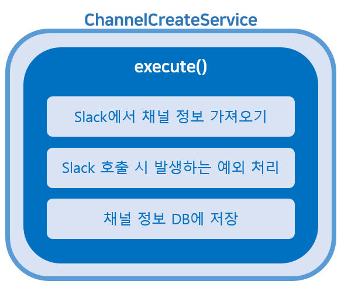
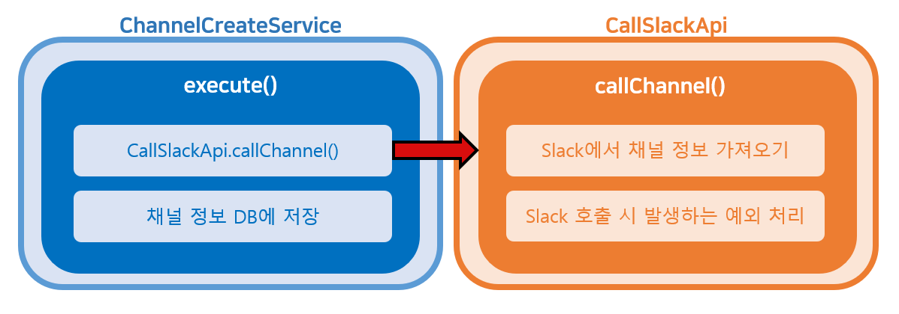
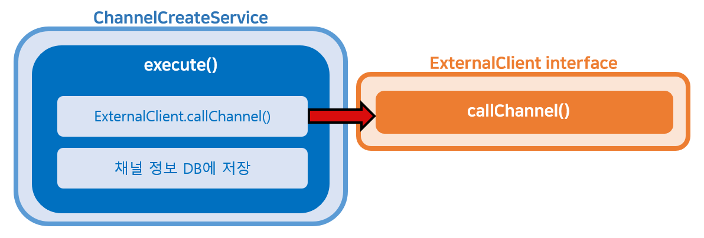

# 😘 서론

우아한테크코스에서 사용하는 협업 도구 중 하나인 `Slack`은 무료 프리티어 사용 시 3개월이 지난 메시지들을 보여주지 않습니다.
레벨 3 팀 프로젝트인 [줍줍](https://github.com/woowacourse-teams/2022-pickpick)에서는 이 사라지는 메시지들을 백업해주는 서비스를 제공합니다.
`Slack`의 메시지에 대한 정보를 주로 다루다 보니 `Slack 라이브러리`에 의존적인 로직이 많습니다.
이 포스팅에서는 외부 라이브러리(`Slack 라이브러리`)를 사용하는 **로직을 어떻게, 왜 추상화했는지**에 관해 이야기하려고 합니다.

<br/><br/>

# 🤔 왜 서비스를 추상화해야 하는가?


기존의 테스트에서는 `Slack 라이브러리`를 호출하는 부분은 모킹 처리해두었습니다.
테스트 코드를 리팩토링하다 보니 모킹 작업이 계속 **반복**되는 **지루**한 작업으로 느껴졌습니다.
반복되는 모킹 작업을 제거하기 위해 테스트 방식을 `목`에서 `스텁`으로 변경해야겠다는 결심을 하게 되었습니다.
(테스트에 대한 이야기는 `2기_스티치`의 [Test Double을 알아보자](https://tecoble.techcourse.co.kr/post/2020-09-19-what-is-test-double/)를 참고
바랍니다.)

`Slack 라이브러리`의 스텁용 객체를 만들기 위해서는 `MethodsClient`라는 인터페이스를 구현해야 합니다.
해당 인터페이스는 약 250개의 메서드를 갖고 있으며 그중 저희 서비스에서 실제로 사용하는 메서드는 약 10개 정도에 불과합니다.
이를 모두 구현하는 것은 불필요하고 번거로운 작업이기에 더 간편한 방법을 고민하게 되었습니다.
이때 떠오른 방법이 **서비스를 추상화해 필요한 부분만** 사용하도록 만드는 것이었습니다.
자세한 설명은 아래 예제 코드를 보며 살펴보겠습니다.

<br/><br/>

# 😆 예제 코드

## 0. 기존 코드

예제로 채널을 생성하는 `ChannelCreateService`의 기존 로직을 가져와 보았습니다.
로직 대부분이 `Slack 라이브러리`에 의존하고 있습니다.

```java

@Transactional
@Service
public class ChannelCreatedService {

  private MethodsClient slackClient;
  private ChannelRepository channels;

  public ChannelCreatedService(final MethodsClient slackClient, final ChannelRepository channels) {
    this.slackClient = slackClient;
    this.channels = channels;
  }

  public Channel execute(final String channelSlackId) {
    try {
      // slack api를 호출하는 부분
      Conversation conversation = slackClient
        .conversationsInfo(request -> request.channel(channelSlackId))
        .getChannel();

      // slack의 response를 우리 도메인인 channel 형태로 변환
      Channel channel = toChannel(conversation);

      // channel을 저장하고 return
      return channels.save(channel);

    } catch (IOException | SlackApiException e) { // slack api 호출로 인해 발생할 수 있는 exception
      throw new SlackApiCallException();
    }
  }
}
```



<br/>

## 1. 외부 라이브러리를 쓰는 로직 추상화

위 로직을 아래처럼 두 개의 클래스로 분리하여 역할을 나눠주었습니다.

#### ChannelCreateService
- 채널 저장 로직을 가진 클래스

```java

@Transactional
@Service
public class ChannelCreatedService {

  private CallSlackApi slackClient;
  private ChannelRepository channels;

  public ChannelCreatedService(final CallSlackApi slackClient, final ChannelRepository channels) {
    this.slackClient = slackClient;
    this.channels = channels;
  }

  public Channel execute(final String channelSlackId) {
    Channel channel = slackClient.callChannel(channelSlackId);
    return channels.save(channel);
  }
}
```

#### CallSlackApi
- `Slack 라이브러리`를 호출하고 결괏값을 반환하는 클래스

```java

@Component
public class CallSlackApi {

  private final MethodsClient methodsClient;

  public CallSlackApi(final MethodsClient methodsClient) {
    this.methodsClient = methodsClient;
  }

  public Channel callChannel(final String channelSlackId) {
    try {
      // `Slack 라이브러리`를 호출
      Conversation conversation = methodsClient.conversationsInfo(
          request -> request.channel(channelSlackId))
        .getChannel();

      // 결과값을 우리가 사용하는 객체 형태로 변경
      return new Channel(conversation.getId(), conversation.getName());

    } catch (IOException | SlackApiException e) {
      throw new SlackApiCallException();
    }
  }
}
```



<br/>

## 2. 추상화한 로직 인터페이스로 분리

좀 더 편리한 스텁 객체를 만들기 위해 `ExternalClient`라는 인터페이스를 만들었습니다.
기존의 `CallSlackApi`에 존재하던 로직은 `ExternalClient` 인터페이스의 구현체인 `SlackClient`로 옮겼습니다.

#### ExternalClient
- 외부 라이브러리의 로직을 추상화한 인터페이스

```java
public interface ExternalClient {
  Channel callChannel(String channelSlackId);
}
```

#### SlackClient
- `Slack 라이브러리`를 호출하는 `ExternalClient`의 구현체

```java

@Component
public class SlackClient implements ExternalClient {

  private MethodsClient methodsClient;

  public SlackClient(final MethodsClient methodsClient) {
    this.methodsClient = slackClient;
  }

  public Channel callChannel(final String channelSlackId) {
    try {
      Conversation conversation = methodsClient.conversationsInfo(
          request -> request.channel(channelSlackId))
        .getChannel();

      return new Channel(conversation.getId(), conversation.getName());

    } catch (IOException | SlackApiException e) {
      throw new SlackApiCallException();
    }
  }
}
```



<br/>

## 3. 스텁용 객체 생성 및 적용

스텁용 객체를 생성한 뒤 `@Component`를 이용해 bean으로 등록하였습니다.

```java

@Primary // SlackClient 보다 우선 순위가 높은 bean으로 등록하기 위해 붙였다.
@Component
public class FakeClient implements ExternalClient {

  private List<Channel> channels = List.of( ...); // 채널 데이터 초기화

  @Override
  public Channel callChannel(final String channelSlackId) {
    return channels.stream()
      .filter(it -> it.isSameSlackId(channelSlackId))
      .findAny()
      .orElseThrow(() -> new SlackApiCallException());
  }
}
```

<br/>

## 4. 테스트 코드에서 모킹 제거

스텁을 적용하였으니 이제 모킹한 코드들을 제거해주는 일만 남았습니다.
전후 코드를 비교하여 코드가 얼마나 깔끔해졌는지 확인해보겠습니다.

#### AS-IS (목 적용)

```java

@Test
void execute() {
  // given
  Workspace workspace = workspaces.save(WorkspaceFixture.JUPJUP.create());
  Channel channel = ChannelFixture.QNA.create(workspace);
  String request = createRequest(channel);

  given(slackClient.conversationsInfo((RequestConfigurator<ConversationsInfoRequestBuilder>) any()))
    .willReturn(setUpChannelMockData(channel));

  // when
  channelCreatedService.execute(request);

  // then
  Optional<Channel> actual = channels.findBySlackId(channel.getSlackId());
  assertThat(actual).isNotEmpty();
}

private ConversationsInfoResponse setUpChannelMockData(final Channel channel) {
  Conversation conversation = new Conversation();
  conversation.setId(channel.getSlackId());
  conversation.setName(channel.getName());

  ConversationsInfoResponse conversationsInfoResponse = new ConversationsInfoResponse();
  conversationsInfoResponse.setChannel(conversation);
  conversationsInfoResponse.setOk(true);

  return conversationsInfoResponse;
}
```

#### TO-BE (스텁 적용)

```java

@Test
void execute() {
  // given
  Workspace workspace = workspaces.save(WorkspaceFixture.JUPJUP.create());
  Channel channel = ChannelFixture.QNA.create(workspace);
  String request = createRequest(channel);

  // when
  channelCreatedService.execute(request);

  // then
  Optional<Channel> actual = channels.findBySlackId(channel.getSlackId());
  assertThat(actual).isNotEmpty();
}
```

<br/><br/>

# 😉 마무리

해당 글에서는 테스트를 간편화하기 위해 서비스 추상화를 진행해보았습니다.
서비스 추상화는 이 외에도 다양한 목적으로 진행할 수 있습니다.

객체 지향적인 코드는 `단일 책임 원칙`을 준수합니다.
기존의 `ChannelCreateService`에서는 'Slack 라이브러리 호출', '예외 처리', '채널 저장' 3가지 역할을 하고 있었습니다.
개선된 `ChannelCreateService`에서는 `SlackClient`를 통해 채널 정보를 가져오고 이를 DB에 '저장'하는 역할을 합니다.
'Slack 라이브러리 호출'과 이로 인한 '예외 처리'의 책임은 `SlackClient`으로 옮겨갔습니다.
이렇듯 서비스를 추상화하면 이전보다 **코드가 간결**해지고 작업의 **목적이 분명**하게 드러납니다.

각 오브젝트의 책임과 역할이 더 분명하게 분리되면 변경 사항이 생기는 경우 **변경 포인트**를 쉽게 찾아낼 수 있습니다.
이제 `Slack 라이브러리`와 관련된 오류가 발생하면 `ChannelCreateService`가 아닌 `SlackClient`를 살피면 됩니다.
의존되는 외부 라이브러리가 `Slack`이 아닌 `카카오톡`, `라인` 등으로 바뀔 수도 있습니다.
이 경우에도 `ExternalClient`의 구현체를 생성하면 쉽게 대체할 수 있습니다.

<br/><br/>

***

### Reference & Source

- 토비의 스프링 3.1 / 이일민
- 대표 이미지: 피에트 몬드리안의 추상화 작 `브로드웨이 부기우기`
