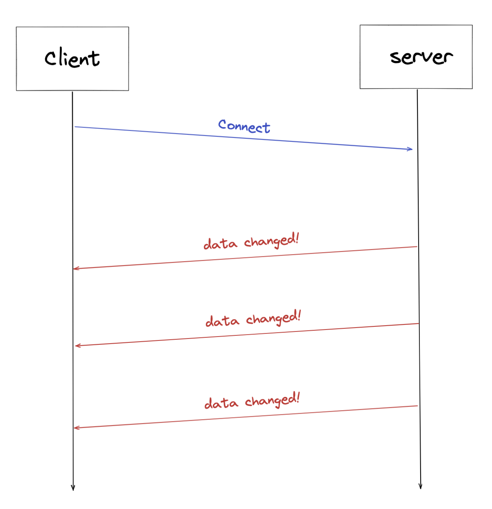

웹 애플리케이션을 개발하다보면 클라이언트의 요청이 없어도 서버에서 데이터를 전달해줘야 하는 경우가 있습니다.

대표적으로 뉴스피드나 댓글 알림처럼 실시간으로 서버의 변경사항을 웹 브라우저에 갱신해줘야 하는 경우를 예로 들 수 있을 것 같습니다.  

제가 참여한 [프로젝트](https://github.com/woowacourse-teams/2022-gong-check)에서도 이와 비슷한 요구사항이 있었습니다.

아래처럼 다른 클라이언트의 요청(체크리스트 버튼 클릭)으로 발생한 변경 사항을 해당 화면을 보고 있는 모든 클라이언트에게 전달해주어야 했는데요.


전통적인 Client-Server 모델의 HTTP 통신에서는 이런 기능을 구현하기가 조금 난감합니다. 클라이언트의 요청이 있어야만 서버가 응답을 할 수 있기 때문이죠.

HTTP를 기반으로 이 문제를 해결하려면 세 가지 방법을 고려해볼 수 있습니다.

### Short Polling

클라이언트가 주기적으로 서버로 요청을 보내는 방법입니다. 일정 시간마다 서버에 요청을 보내 데이터가 갱신되었는지 확인하고 만약 갱신되었다면 데이터를 응답 받습니다.


클라이언트와 서버 모두 구현이 단순하다는 것이 특징입니다. 서버가 요청에 대한 부담이 크지 않고 요청 주기를 넉넉하게 잡아도 될 정도로 실시간성이 중요하지 않다면 고려해 볼 만한 방법입니다.

### Long Polling

요청을 보내고 서버에서 변경이 일어날 때까지 대기하는 방법입니다.


실시간 메시지 전달이 중요하지만 서버의 상태가 빈번하게 변하지 않는 경우에 적합합니다. 서버로부터 응답을 받고 나면 다시 연결 요청을 하기 때문에, 상태가 빈번하게 바뀐다면 연결 요청도 늘어나게 됩니다.

### Server-Sent Events(SSE)

서버와 한번 연결을 맺고나면 일정 시간동안 서버에서 변경이 발생할 때마다 데이터를 전송받는 방법입니다.



응답마다 다시 요청을 해야하는 Long polling 방식보다 효율적입니다(상황에 따라 달라질 수 있습니다). SSE는 서버에서 클라이언트로 text message를 보내는 브라우저 기반 웹 애플리케이션 기술이며 HTTP의 persistent connections을 기반으로하는 HTML5 표준 기술입니다.

이 외에도 웹소켓을 이용해 서버와 양방향 통신을 하는 방법이 있습니다. 서비스 상황에 맞게 적절한 방법을 선택하면 됩니다.

저희 팀은 구현이 간단한 short polling으로 해당 기능을 구현했었습니다. 하지만 사용자에게 높은 실시간성을 제공하기 위해 0.1초마다 서버에 요청을 보내다보니 서버에도 부담이 크고, 변경 사항이 없는데도 DOM을 계속 교체해야 하는 문제가 있었습니다. 이를 해결하기 위해 SSE로 구현을 변경하기로 결정했습니다.

서비스 특성 상 SSE보다는 WebSocket이 더 적절하다는 의견도 있었으나, 지금 당장은 새로운 라이브러리 추가나 프로토콜 학습 없이 바로 적용할 수 있는 SSE를 적용하기로 했습니다.

## SSE 통신 개요

SSE를 이용하는 통신의 개요는 다음과 같습니다.


### Client: SSE Subscribe 요청

우선 클라이언트에서 서버의 이벤트를 구독하기 위한 요청을 보내야합니다.

```HTTP
GET /connect HTTP/1.1
Accept: text/event-stream
Cache-Control: no-cache
```

이벤트의 미디어 타입은 `text/event-stream`이 표준으로 정해져있습니다. 이벤트는 캐싱하지 않으며 지속적 연결을 사용해야합니다(HTTP 1.1에서는 기본적으로 지속 연결을 사용합니다).


### Server: Subscription에 대한 응답
```HTTP
HTTP/1.1 200
Content-Type: text/event-stream;charset=UTF-8
Transfer-Encoding: chunked
```

응답의 미디어 타입은 `text/event-stream` 입니다. 이때 `Transfer-Encoding` 헤더의 값을 `chuncked`로 설정합니다. 서버는 동적으로 생성된 컨텐츠를 스트리밍하기 때문에 본문의 크기를 미리 알 수 없기 때문입니다.

### Server: 이벤트 전달

클라이언트에서 subscribe를 하고나면 서버는 해당 클라이언트에게 비동기적으로 데이터를 전송할 수 있습니다. 이때 데이터는 `UTF-8`로 인코딩된 텍스트 데이터만 가능합니다(바이너리 데이터는 전송 불가능).

서로 다른 이벤트는 줄바꿈 문자 두개(\\n\\n)로 구분되며 각각의 이벤트는 한 개 이상의 `name: value` 필드로 구성되며 이들은 줄바꿈 문자 하나로 구분됩니다.
```HTTP
event: type1
data: An event of type1.

event: type2
data: An event of type2.
```

## 코드로 살펴봅시다

사용된 예시 코드는 [여기](https://github.com/awesomeo184/sse-sample)서 확인하실 수 있습니다.

기본적인 흐름을 먼저 설명하면 다음과 같습니다.
1. 클라이언트에서 SSE 연결 요청을 보낸다.
2. 서버에서는 클라이언트와 매핑되는 SSE 통신 객체를 만든다.
3. 서버에서 이벤트가 발생하면 해당 객체를 통해 클라이언트로 데이터를 전달한다.

그림으로 보면 다음과 같습니다.


우선 클라이언트에서는 `EventSource`라는 인터페이스로 SSE 연결 요청을 할 수 있습니다.

```javascript
const sse = new EventSource("http://localhost:8080/connect");
```

spring framework 4.2부터 SSE 통신을 지원하는 `SseEmitter` API를 제공합니다. 이를 이용해 SSE 구독 요청에 대한 응답을 할 수 있습니다.

```java
import java.io.IOException;  
import lombok.extern.slf4j.Slf4j;  
import org.springframework.http.MediaType;  
import org.springframework.http.ResponseEntity;  
import org.springframework.web.bind.annotation.GetMapping;  
import org.springframework.web.bind.annotation.RestController;  
import org.springframework.web.servlet.mvc.method.annotation.SseEmitter;  
  
@RestController  
@Slf4j  
public class SseController {  
  
    private final SseEmitters sseEmitters;  
  
    public SseController(SseEmitters sseEmitters) {  
        this.sseEmitters = sseEmitters;  
    }  
  
    @GetMapping(value = "/connect", produces = MediaType.TEXT_EVENT_STREAM_VALUE)  
    public ResponseEntity<SseEmitter> connect() {  
        SseEmitter emitter = new SseEmitter();  
        sseEmitters.add(emitter);
        try {  
            emitter.send(SseEmitter.event()  
                    .name("connect")  
                    .data("connected!"));  
        } catch (IOException e) {  
            throw new RuntimeException(e);  
        }  
        return ResponseEntity.ok(emitter);  
    }  
}

```

<br>

생성자를 통해 만료시간을 설정할 수 있습니다. 디폴트 값은 서버에 따라 다릅니다. 스프링 부트의 내장 톰캣을 사용하면 30초로 설정됩니다. 만료시간이 되면 **브라우저에서 자동으로 서버에 재연결 요청**을 보냅니다.

```java
SseEmitter emitter = new SseEmitter(60 * 1000L);
```
<br>

이때 생성된 `SseEmitter` 객체는 향후 이벤트가 발생했을 때, 해당 클라이언트로 이벤트를 전송하기 위해 사용되므로 서버에서 저장하고 있어야 합니다.

```java
sseEmitters.add(emitter);
```
<br>

주의해야할 점은 Emitter를 생성하고 나서 만료 시간까지 아무런 데이터도 보내지 않으면 재연결 요청시 503 Service Unavailable 에러가 발생할 수 있습니다. 따라서 처음 SSE 연결 시 더미 데이터를 전달해주는 것이 안전합니다.

```java
emitter.send(SseEmitter.event()  
        .name("connect")         // 해당 이벤트의 이름 지정
        .data("connected!"));    // 503 에러 방지를 위한 더미 데이터
```

<br>

이벤트 이름을 설정해주면 클라이언트에서 해당 이름으로 이벤트를 받을 수 있습니다.

```javascript

const sse = new EventSource("http://localhost:8080/connect");

sse.addEventListener('connect', (e) => {
	const { data: receivedConnectData } = e;
	console.log('connect event data: ',receivedConnectData);  // "connected!"
});

```
<br>

`SseEmitter`를 생성할 때는 비동기 요청이 완료되거나 타임아웃 발생 시 실행할 콜백을 등록할 수 있습니다. 타임아웃이 발생하면 브라우저에서 재연결 요청을 보내는데, 이때 새로운 Emitter 객체를 다시 생성하기 때문에(`SseController`의 `connect()`메서드 참조) 기존의 Emitter를 제거해주어야 합니다. 따라서 `onCompletion` 콜백에서 자기 자신을 지우도록 등록합니다.

```java
@Component  
@Slf4j  
public class SseEmitters {  
  
    private final List<SseEmitter> emitters = new CopyOnWriteArrayList<>();  
  
    SseEmitter add(SseEmitter emitter) {  
        this.emitters.add(emitter);  
        log.info("new emitter added: {}", emitter);  
        log.info("emitter list size: {}", emitters.size());  
        emitter.onCompletion(() -> {  
            log.info("onCompletion callback");  
            this.emitters.remove(emitter);    // 만료되면 리스트에서 삭제
        });  
        emitter.onTimeout(() -> {  
            log.info("onTimeout callback");  
            emitter.complete();  
        });  
  
        return emitter;  
    }  
}

```

주의할 점은 이 콜백이 **SseEmitter를 관리하는 다른 스레드에서 실행**된다는 것입니다. 따라서 `thread-safe`한 자료구조를 사용하지 않으면 `ConcurrnetModificationException`이 발생할 수 있습니다. 여기서는 thread-safe한 자료구조인 `CopyOnWriteArrayList`를 사용하였습니다.

이제 서버에서 무언가 변경 사항이 생겼을 때, 클라이언트의 요청이 없어도 데이터를 전송할 수 있습니다. 본 예시에서는 누군가 `/count`를 호출하면 서버에 저장된 숫자를 1 증가시키고 이를 SSE 커넥션이 열려있는 모든 클라이언트에게 전달하도록 해보겠습니다.

```java
@RestController  
@Slf4j  
public class SseController {  
  
    private final SseEmitters sseEmitters;  
  
    public SseController(SseEmitters sseEmitters) {  
        this.sseEmitters = sseEmitters;  
    }  

	// ...
  
    @PostMapping("/count")  
    public ResponseEntity<Void> count() {  
        sseEmitters.count();  
        return ResponseEntity.ok().build();  
    }  
}

```

```java
@Component  
@Slf4j  
public class SseEmitters {  
  
    private static final AtomicLong counter = new AtomicLong();  
  
    private final List<SseEmitter> emitters = new CopyOnWriteArrayList<>();  
  
	// ...
	
    public void count() {  
        long count = counter.incrementAndGet();  
        emitters.forEach(emitter -> {  
            try {  
                emitter.send(SseEmitter.event()  
                        .name("count")  
                        .data(count));  
            } catch (IOException e) {  
                throw new RuntimeException(e);  
            }  
        });  
    }  
}

```

<br>
클라이언트에서는 `count`라는 이름의 이벤트가 발생할 때 콘솔에 변경된 데이터를 출력하도록 이벤트 리스너를 등록해둡니다.

```java
sse.addEventListener('count', e => {  
    const { data: receivedCount } = e;  
    console.log("count event data",receivedCount);  
    setCount(receivedCount);  
});

```

이제 만약 다른 브라우저에서 count를 호출한다면 내 브라우저에 서버에서 변경된 값이 찍히게 됩니다.

## 주의점

스프링에서도 API를 지원해주고 있기 때문에 SSE 통신을 구현하는 것 자체는 굉장히 쉽습니다. 하지만 기능을 구현하고 서비스에 배포하기까지 여러 어려움들을 겪었는데요, SSE 통신을 구현하면서 진행한 트러블슈팅을 공유하면서 글을 마치도록 하겠습니다.

### 503 Service Unavailable

위에서 언급했듯이 처음에 SSE 응답을 할 때 아무런 이벤트도 보내지 않으면 재연결 요청을 보낼때나, 아니면 연결 요청 자체에서 오류가 발생합니다.

따라서 첫 SSE 응답을 보낼 시에는 반드시 더미 데이터라도 넣어서 데이터를 전달해야합니다.

### 헤더에 토큰 전달

SSE 연결 요청을 할 때 헤더에 JWT를 담아서 보내줘야했는데, `EventSource` 인터페이스는 기본적으로 헤더 전달을 지원하지 않는 문제가 있었습니다. [event-source-polyfill](https://www.npmjs.com/package/event-source-polyfill) 을 사용하면 헤더를 함께 보낼 수 있습니다.


### JPA 사용시 Connection 고갈 문제

**SSE 통신을 하는 동안은 HTTP Connection이 계속 열려있습니다.** 만약 SSE 연결 응답 API에서 JPA를 사용하고 `open-in-view` 속성을 true로 설정했다면, **HTTP Connection이 열려있는 동안 DB Connection도 같이 열려있게 됩니다.**

즉 DB Connection Pool에서 최대 10개의 Connection을 사용할 수 있다면, **10명의 클라이언트가 SSE 연결 요청을 하는 순간 DB 커넥션도 고갈되게 됩니다.** 따라서 이 경우 `open-in-view` 설정을 반드시 false로 설정해야 합니다.

### ConcurrentModificationException

마찬가지로 위에서 언급했듯이, `onCompletion`, `onTimeout` 콜백은 별도의 스레드에서 호출됩니다. 만약 이 콜백을 통해 `SseEmitter` 객체가 담긴 컬렉션에 연산을 한다면 해당 컬렉션은 thread-safe한 자료구조를 사용해야합니다. 처음에 그냥 `ArrayList`를 사용했다가 SseEmitter가 만료될 때마다 ConcurrentModificationException이 발생하는 문제를 겪었었습니다.

### Nginx 사용시 주의할 점

로컬에서 잘 동작하는 것을 확인하고 배포를 했더니 SSE 통신이 동작하지 않는 문제가 발생했었습니다.

저희 팀은 리버스 프록시로 Nginx를 사용하고 있었는데요


원인을 찾아보던 중 Nginx는 기본적으로 Upstream으로 요청을 보낼때 HTTP/1.0 버전을 사용한다는 것을 확인했습니다.

HTTP/1.1은 지속 연결이 기본이기 때문에 헤더를 따로 설정해줄 필요가 없지만, **Nginx에서 백엔드 WAS로 요청을 보낼 때는 HTTP/1.0을 사용하고 `Connection: close` 헤더를 사용**하게 됩니다.

SSE는 지속 연결이 되어 있어야 동작하는데 Nginx에서 지속 연결을 닫아버려 제대로 동작하지 않았습니다.

따라서 아래와 같이 nginx 설정을 추가해야 제대로 동작합니다.

```nginx
proxy_set_header Connection '';
proxy_http_version 1.1;
```

또 Nginx의 proxy buffering 기능도 조심해야 하는데요, SSE 통신에서 서버는 기본적으로 응답에 `Transfer-Encoding: chunked`를 사용합니다. SSE는 서버에서 동적으로 생성된 컨텐츠를 스트리밍하기 때문에 본문의 크기를 미리 알 수 없기 때문입니다.

Nginx는 서버의 응답을 버퍼에 저장해두었다가 버퍼가 차거나 서버가 응답 데이터를 모두 보내면 클라이언트로 전송하게 됩니다.

> 참고: https://docs.nginx.com/nginx/admin-guide/web-server/reverse-proxy/

문제는 버퍼링 기능을 활성화하면 **SSE 통신 시 원하는대로 동작하지 않거나 실시간성이 떨어지게 된다는 것**입니다. 따라서 SSE 응답에 대해서는 proxy buffering 설정을 비활성화 해주는 것이 좋습니다.

하지만 Nginx의 설정 파일에서 버퍼링을 비활성화하면 다른 모든 API 응답에 대해서도 버퍼링을 하지 않기 때문에 비효율적일 수 있습니다. 이때 nginx의 [X-accel](https://www.nginx.com/resources/wiki/start/topics/examples/x-accel/) 기능을 활용하면 좋습니다.

백엔드의 응답 헤더에 X-accel로 시작하는 헤더가 있으면 Nginx가 이 정보를 이용해 내부적인 처리를 따로 하도록 만들 수 있습니다. 따라서 SSE 응답을 반환하는 API의 헤더에 `X-Accel-Buffering: no`를 붙여주면 SSE 응답만 버퍼링을 하지 않도록 설정할 수 있습니다.

### 스케일 아웃 시 문제

`SseEmitter` 객체는 서버의 메모리에 저장되어 있습니다. 따라서 서버 인스턴스를 늘리는 경우 기능이 제대로 동작하지 않습니다. 

이런 경우 [Redis Pub/Sub](https://redis.io/docs/manual/pubsub/)같은 메시지 브로커나 분산 캐시를 통해 문제를 해결할 수 있습니다.

## 마무리

Server-Sent Events는 HTTP를 기반으로 동작하기 때문에 특별한 라이브러리나 프로토콜 추가 없이 빠르게 도입할 수 있다는 장점이 있습니다. 또한 서버에서 클라이언트로의 단방향 통신만 가능하기 때문에 클라이언트의 상호작용 없이 서버로부터 데이터가 전달되어야 하는 상황에 적합합니다. 대표적으로 스포츠 중계 서비스나 SNS 피드 같은 성격의 서비스에서 사용을 고려해볼 수 있습니다.


### 참고자료

* https://github.com/aliakh/demo-spring-sse
* [MDN EventSource](https://developer.mozilla.org/en-US/docs/Web/API/EventSource)
* [SseEmitter API](https://docs.spring.io/spring-framework/docs/4.2.0.RC2_to_4.2.0.RC3/Spring%20Framework%204.2.0.RC3/org/springframework/web/servlet/mvc/method/annotation/SseEmitter.html)
* [Nginx X-accel](https://www.nginx.com/resources/wiki/start/topics/examples/x-accel/)
* [Nginx reverse proxy guide](https://docs.nginx.com/nginx/admin-guide/web-server/reverse-proxy/)
